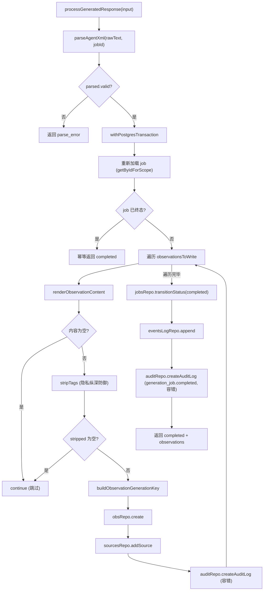
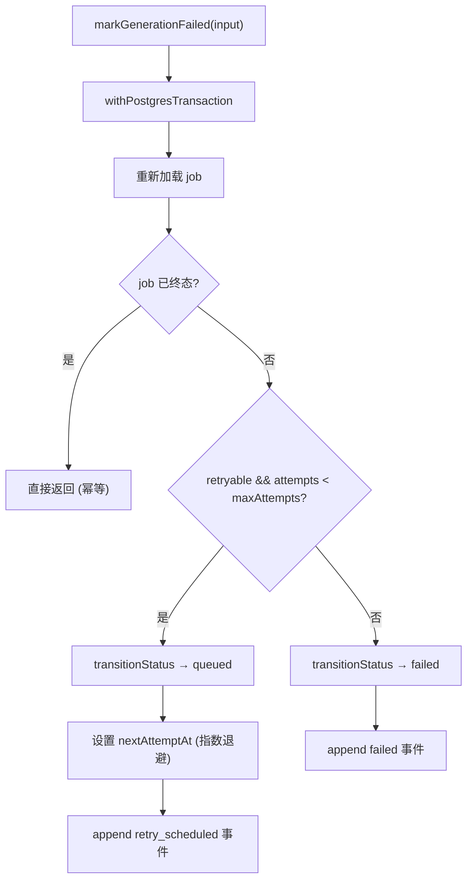

# processGeneratedResponse.ts 需求说明

> 源文件：src/server/generation/processGeneratedResponse.ts ｜ 类型：源码 ｜ 行数：540 ｜ 所属模块：server/generation ｜ 分析日期：2026-07-23

## 1. 文件定位总述

本文件承载 Server Beta 运行时中"从 AI Provider 返回的原始文本到持久化 Observation + 审计链"的完整后处理管线。它接收 Provider 生成的 XML 原始文本，解析为结构化观察/摘要，然后在单个 Postgres 事务中完成写入 observations 表、建立 source 链接、推进 outbox 状态、记录审计日志等一系列副作用。文件还包含 `markGenerationFailed`（失败状态转换）和 `processSessionSummaryResponse`（摘要专用处理管线）两个辅助导出函数。整个文件遵循"Postgres outbox 行为权威、BullMQ payload 仅为参考"的原则，所有状态判断均在事务内重新加载最新数据。

## 2. 功能需求

| 编号 | 需求描述（系统应当…） | 触发条件 / 输入 | 处理规则与输出 | 证据 |
|------|----------------------|----------------|---------------|------|
| FR-PGR-01 | 系统应当解析 Provider 返回的原始 XML 文本，验证其合法性后批量持久化为 Observation 记录 | 调用 `processGeneratedResponse(input)`，input 包含 pool、job、rawText 等 | 调用 `parseAgentXml` 解析 XML，若无效则返回 `parse_error`。在 Postgres 事务内：重新加载 job（防止并发重复处理），对每条解析出的 observation 渲染内容 → stripTags 隐私标签 → 生成 generationKey（幂等键） → 写入 observations 表 → 建立 observation_sources 链接 → 写入审计日志。最后将 job 状态推进到 completed 并追加事件日志。返回 `completed` 结果含持久化的 observations 列表。 | `src/server/generation/processGeneratedResponse.ts:62-264` |
| FR-PRV-01 | 系统应当检测并标记隐私内容，跳过标记为 private 或空内容的 observation | 解析到 `skipped === true` 的 summary 或渲染后内容为空的 observation | 若 summary 被标记为 skipped 或 observationsToWrite 为空，设置 `privateContentDetected = true`。对每条 observation 渲染后若内容为空或 stripTags 后为空则 continue 跳过。 | `src/server/generation/processGeneratedResponse.ts:76-77, 113-115, 120-122` |
| FR-IDM-01 | 系统应当通过 generation_key 的 UNIQUE 约束保证幂等性——同一 job + 同一解析索引 + 同一内容的重复写入会被数据库折叠为单行 | 写入 observation 时 | 调用 `buildObservationGenerationKey({ generationJobId, parsedObservationIndex, content })` 生成唯一键，该键在 observations 表上有 UNIQUE 约束。推断：(注释第 28 行说明"collapses retry duplicates to a single row") | `src/server/generation/processGeneratedResponse.ts:124-128` |
| FR-SRC-01 | 系统应当为每条持久化的 observation 建立 source 链接，记录来源类型、来源 ID、Agent 事件 ID、generation job ID 以及身份上下文（api_key_id、actor_id、source_adapter） | observation 写入成功后 | 调用 `sourcesRepo.addSource`，同时将 provider、parsedObservationIndex、source_adapter、actor_id、api_key_id 写入 metadata 字段用于溯源审计。 | `src/server/generation/processGeneratedResponse.ts:152-170` |
| FR-AUD-01 | 系统应当为每条生成的 observation 写入审计日志（action='observation.created'），记录关联的 generationJobId、sourceType、provider、model 等信息 | observation 创建成功后 | 调用 `auditRepo.createAuditLog`，审计失败仅记警告不中断主流程。 | `src/server/generation/processGeneratedResponse.ts:176-201` |
| FR-JCF-01 | 系统应当将 generation job 状态推进到 'completed' 并追加完成事件日志 | 所有 observation 处理完毕后 | 调用 `jobsRepo.transitionStatus` 和 `eventsLogRepo.append`，事件详情包含 provider、model、observationCount、privateContentDetected、workerId。 | `src/server/generation/processGeneratedResponse.ts:205-225` |
| FR-JCA-01 | 系统应当为 job 完成写入审计日志（action='generation_job.completed'），包含所有生成的 observation ID 列表 | job 状态推进后 | 调用 `auditRepo.createAuditLog`，失败仅记警告。注释说明审计表可能缺少 metadata 列（旧 schema 兼容），因此容错处理。 | `src/server/generation/processGeneratedResponse.ts:230-255` |
| FR-TSC-01 | 系统应当在事务内重新加载 job 行，若已是终态（completed/cancelled/failed）则跳过处理并幂等返回成功 | 进入事务后 | 通过 `jobsRepo.getByIdForScope` 重新加载，检查 fresh.status 是否为终态。 | `src/server/generation/processGeneratedResponse.ts:88-107` |
| FR-MGF-01 | 系统应当将失败的 generation job 标记为 'queued'（可重试）或 'failed'（不可重试），并记录重试延迟 | 调用 `markGenerationFailed(input)` | 在 Postgres 事务内重新加载 job，判断 `retryable && attempts < maxAttempts`：可重试则转换到 queued 并设置 nextAttemptAt（指数退避），不可重试则转换到 failed。同时追加 retry_scheduled 或 failed 事件日志。 | `src/server/generation/processGeneratedResponse.ts:281-321` |
| FR-SSM-01 | 系统应当将 Provider 返回的会话摘要解析为 kind='summary' 的单条 observation 并持久化 | 调用 `processSessionSummaryResponse(input)`，且 job.sourceType === 'session_summary' | 校验 sourceType 必须为 session_summary，解析 XML 后提取 summary 字段，渲染为文本（Request/Investigated/Learned/Completed/Next steps/Notes），stripTags 后写入 observations 表。其余逻辑（source 链接、审计、job 状态推进）与 processGeneratedResponse 一致。 | `src/server/generation/processGeneratedResponse.ts:332-511` |
| FR-RND-01 | 系统应当使用指数退避策略计算重试延迟：基础 5 秒，每次重试乘以 5，上限 10 分钟 | `markGenerationFailed` 中计算可重试延迟 | 公式：`min(5000 * 5^attempts, 600000)`，即 5s, 25s, 125s, ... 封顶 10min。 | `src/server/generation/processGeneratedResponse.ts:535-539` |

## 3. 业务规则与约束

| 编号 | 规则描述 | 证据 |
|------|---------|------|
| BR-01 | **事务原子性**：所有副作用（observation 写入、source 链接、job 状态推进、审计日志）必须在同一个 Postgres 事务中完成，确保重试时幂等且数据一致。 | `src/server/generation/processGeneratedResponse.ts:79` |
| BR-02 | **outbox 行为权威**：BullMQ payload 数据仅为参考（advisory），所有状态判断基于事务内重新加载的 Postgres outbox 行。 | `src/server/generation/processGeneratedResponse.ts:33-35` |
| BR-03 | **不触碰 worker SessionStore 表**：本文件明确声明 NEVER 操作 worker SessionStore 表，不假设 Claude Code transcript 形状。 | `src/server/generation/processGeneratedResponse.ts:33-34` |
| BR-04 | **隐私标签纵深防御**：即使 parser 疏漏了 private 标签，在持久化前仍执行 `stripTags` 作为最后防线。 | `src/server/generation/processGeneratedResponse.ts:117-122` |
| BR-05 | **审计日志容错**：审计日志写入失败不会导致 generation 流程回滚，仅记录 warning 日志。推断原因：(1) 审计表可能缺少 metadata 列（旧 schema），(2) 审计为辅助功能不应阻塞主流程。 | `src/server/generation/processGeneratedResponse.ts:195-200, 248-254` |
| BR-06 | **observation 元数据**：每条 observation 的 metadata 携带 title、subtitle、facts、narrative、concepts、files_read、files_modified、provider、model 等结构化字段。 | `src/server/generation/processGeneratedResponse.ts:137-147` |
| BR-07 | **summary observation 的元数据字段**：request、investigated、learned、completed、next_steps、notes。 | `src/server/generation/processGeneratedResponse.ts:396-401` |
| BR-08 | **身份上下文传播**：apiKeyId、actorId、sourceAdapter 从 BullMQ payload 传播到 observation_sources.metadata 和审计日志中，用于回答"哪个 API key 产生了这条 observation"。 | `src/server/generation/processGeneratedResponse.ts:57-59, 163-169` |
| BR-09 | **可重试条件**：必须同时满足 `retryable === true` 且 `attempts < maxAttempts` 才会进入重试队列。 | `src/server/generation/processGeneratedResponse.ts:295` |

## 4. 对外暴露

| 类型 | 名称 | 说明 |
|------|------|------|
| 函数 | `processGeneratedResponse(input)` | 主函数：解析 XML → 持久化 observation → 推进 job 状态 |
| 函数 | `markGenerationFailed(input)` | 辅助函数：将 job 标记为失败或排入重试队列 |
| 函数 | `processSessionSummaryResponse(input)` | 辅助函数：处理摘要类型的 job |
| 类型 | `ProcessGeneratedResponseOutcome` | 返回值联合类型：completed 或 parse_error |
| 类型 | `ProcessGeneratedResponseInput` | processGeneratedResponse 的输入类型 |
| 类型 | `MarkGenerationFailedInput` | markGenerationFailed 的输入类型 |

## 5. 依赖关系

| 方向 | 依赖项 | 说明 |
|------|--------|------|
| 上游（调用方） | `ProviderObservationGenerator.ts` | 调用本文件三个导出函数 |
| 内部 | `sdk/parser.ts` | `parseAgentXml` 解析 Provider 返回的 XML |
| 内部 | `storage/postgres/observations.ts` | Observation 及 Source 的 Postgres 仓库 |
| 内部 | `storage/postgres/generation-jobs.ts` | Generation Job 及 Event Log 的 Postgres 仓库 |
| 内部 | `storage/postgres/auth.ts` | 审计日志 Postgres 仓库 |
| 内部 | `storage/postgres/pool.ts` | `withPostgresTransaction` 事务管理 |
| 内部 | `utils/tag-stripping.ts` | `stripTags` 隐私标签剥离 |

## 6. 数据结构

### ProcessGeneratedResponseOutcome（联合类型）

| 变体 | 字段 | 说明 |
|------|------|------|
| completed | jobId, observations: PostgresObservation[], privateContentDetected: boolean | 处理成功 |
| parse_error | jobId, reason: string | XML 解析失败 |

### ProcessGeneratedResponseInput

| 字段 | 类型 | 说明 |
|------|------|------|
| pool | PostgresPool | 数据库连接池 |
| job | PostgresObservationGenerationJob | outbox job 行 |
| rawText | string | Provider 返回的原始 XML 文本 |
| modelId | string? | 使用的模型 ID |
| providerLabel | string | Provider 标签 |
| workerId | string? | Worker 标识 |
| apiKeyId | string \| null | 发起该 job 的 API key ID |
| actorId | string \| null | 关联的 actor ID |
| sourceAdapter | string \| null | 来源适配器标识 |

### MarkGenerationFailedInput

| 字段 | 类型 | 说明 |
|------|------|------|
| pool | PostgresPool | 数据库连接池 |
| job | PostgresObservationGenerationJob | outbox job 行 |
| reason | string | 失败原因 |
| classification | string? | 错误分类 |
| retryable | boolean | 是否可重试 |
| workerId | string? | Worker 标识 |

## 7. 复杂逻辑图示

上图展示了 `processGeneratedResponse` 在单个 Postgres 事务内的完整执行路径。每条 observation 依次经过内容渲染、隐私剥离、幂等键生成、持久化、source 链接、审计等步骤，最后统一推进 job 状态。

上图展示了失败处理流程，可重试的 job 通过指数退避策略回到 queued 状态等待下次处理。

## 8. 逆向备注

1. 注释第 23-35 行明确声明了设计原则：本文件"NEVER touches worker SessionStore tables, NEVER assumes a Claude Code transcript shape, and ALWAYS reloads the job before mutating"。这表明 Server Beta 架构刻意与本地 worker-service 的 SessionStore 模型解耦。
2. `processSessionSummaryResponse` 与 `processGeneratedResponse` 存在大量代码重复（事务内重新加载 job、source 链接、审计日志、job 状态推进）。推断这是有意为之——两个函数各自独立维护以便未来独立演进，但当前阶段复用度较低。
3. 注释第 249 行提到 "The audit log table may not have a metadata column on older schemas"，说明系统存在 schema 迁移兼容性问题，旧版本部署的审计表可能缺少 metadata 列，因此所有审计写入都采用 try-catch 容错策略。
4. `retryDelayMs` 函数的指数退避基数是 5（第 537 行），而非更常见的 2，导致延迟增长非常激进（5s → 25s → 125s），但上限为 10 分钟。
