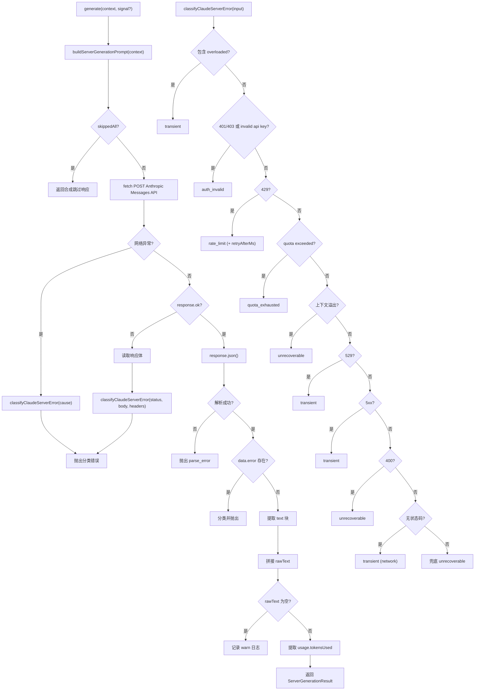

# ClaudeObservationProvider.ts 需求说明

> 源文件：src/server/generation/providers/ClaudeObservationProvider.ts ｜ 类型：源码 ｜ 行数：248 ｜ 所属模块：generation/providers ｜ 分析日期：2026-07-23

## 1. 文件定位总述

ClaudeObservationProvider 是 `ServerGenerationProvider` 接口的 Anthropic Claude 实现层，直接通过 HTTP REST API 调用 Anthropic Messages 端点，将 `prompt-builder` 构建的 XML 提示词发送给 Claude 模型并返回原始文本结果。它独立于 Anthropic SDK，使用原生 fetch 实现，包含完整的错误分类逻辑，将各种 HTTP 状态码和错误消息映射为可重试或不可恢复的语义化错误类型。该 Provider 是 server-beta 支持的三个 AI 提供者（Claude/Gemini/OpenRouter）之一。

## 2. 功能需求

| 编号 | 需求描述（系统应当…） | 触发条件 / 输入 | 处理规则与输出 | 证据 |
|------|----------------------|----------------|---------------|------|
| FR-claude-01 | 系统应当在收到生成请求时，先调用 prompt-builder 构建提示词，若全部事件因隐私剥离为空则直接返回合成跳过响应 | 调用 `generate(context, signal?)` 且 `skippedAll` 为 true | 返回 `rawText: '<skip_summary reason="all_events_private" />'`，不向 Anthropic API 发送请求，避免无效计费 | `ClaudeObservationProvider.ts:56-65` |
| FR-claude-02 | 系统应当向 Anthropic Messages API 发送单轮用户消息请求 | 构建的提示词非空 | POST 到 `https://api.anthropic.com/v1/messages`，携带 `x-api-key`、`anthropic-version` 请求头，body 包含 model、max_tokens（默认 4096）、temperature（0.3）和 messages 数组 | `ClaudeObservationProvider.ts:69-83` |
| FR-claude-03 | 系统应当支持通过 AbortSignal 取消正在进行的 API 请求 | 调用 `generate()` 时传入 `signal` 参数 | 将 signal 传入 fetch 调用，使请求可被外部中止 | `ClaudeObservationProvider.ts:83` |
| FR-claude-04 | 系统应当解析 Anthropic 响应中的文本块，拼接为单一原始文本返回 | API 返回 200 且 `content` 数组中含 `type: 'text'` 的块 | 过滤 content 数组中 type 为 text 的块，提取 text 字段用换行拼接并 trim，返回 `ServerGenerationResult` | `ClaudeObservationProvider.ts:119-131` |
| FR-claude-05 | 系统应当在 API 返回空 content 数组时记录警告日志 | 响应 content 为空数组或所有块 type 非 text | 以 warn 级别记录 provider 和 model 信息 | `ClaudeObservationProvider.ts:126-131` |
| FR-claude-06 | 系统应当从响应的 usage 字段提取 token 使用量并返回 | 响应中包含 `usage.input_tokens` 或 `usage.output_tokens` | 计算 input_tokens + output_tokens 总和，仅当两个字段至少一个为数字时才设置 `tokensUsed` | `ClaudeObservationProvider.ts:133-137` |
| FR-claude-07 | 系统应当将 HTTP 错误和网络错误分类为语义化错误类型 | API 返回非 200 状态码、或网络请求抛出异常 | 通过 `classifyClaudeServerError()` 分类为：auth_invalid（401/403）、rate_limit（429）、transient（5xx/529/overloaded）、quota_exhausted、unrecoverable（400/上下文溢出）、network error（无状态码） | `ClaudeObservationProvider.ts:160-238` |
| FR-claude-08 | 系统应当在 429 响应中解析 Retry-After 头并传递给重试调度器 | 429 响应包含 `Retry-After` 头 | 调用 `parseRetryAfterMs()` 提取重试等待时间，注入到 `ServerClassifiedProviderError.retryAfterMs` 字段 | `ClaudeObservationProvider.ts:180-186` |
| FR-claude-09 | 系统应当构造时验证 API Key 必须非空 | 构造 `ClaudeObservationProvider` 时 `apiKey` 为空字符串 | 抛出 `ServerClassifiedProviderError`，kind 为 `auth_invalid` | `ClaudeObservationProvider.ts:40-44` |
| FR-claude-10 | 系统应当支持通过 `fetchImpl` 注入替代的 fetch 实现（用于测试） | 构造时传入 `fetchImpl` 选项 | 使用注入的实现替代全局 fetch | `ClaudeObservationProvider.ts:49` |
| FR-claude-11 | 系统应当在 API 返回非 JSON 响应时抛出解析错误 | `response.json()` 抛出异常 | 抛出 `ServerClassifiedProviderError`，kind 为 `parse_error` | `ClaudeObservationProvider.ts:100-108` |
| FR-claude-12 | 系统应当处理 Anthropic 响应体内嵌的 error 对象 | 响应 JSON 包含 `error` 字段 | 提取 error.type 和 error.message 进行错误分类 | `ClaudeObservationProvider.ts:110-117` |

## 3. 业务规则与约束

- **默认模型**：`claude-3-5-sonnet-latest`，可通过构造参数 `model` 覆盖。`ClaudeObservationProvider.ts:17`
- **默认最大输出 token**：4096，可通过 `maxOutputTokens` 覆盖。`ClaudeObservationProvider.ts:48`
- **固定 temperature**：0.3，硬编码不可配置，推断：观测生成任务需要较高的确定性输出。`ClaudeObservationProvider.ts:79`
- **Anthropic API 版本**：`2023-06-01`，硬编码为请求头。`ClaudeObservationProvider.ts:16`
- **错误分类优先级**：overloaded 文本 > 401/403 > 429 > quota exceeded > context overflow > 529 > 5xx > 400 > 无状态码 > 兜底 unrecoverable。`ClaudeObservationProvider.ts:160-238`

## 4. 对外暴露

| 导出项 | 类型 | 说明 |
|--------|------|------|
| `ClaudeObservationProvider` | 类 | 实现 `ServerGenerationProvider` 接口 |
| `ClaudeObservationProviderOptions` | 接口 | 构造选项：apiKey(必需)、model、maxOutputTokens、fetchImpl |
| `classifyClaudeServerError(input)` | 函数（导出） | Anthropic HTTP 错误分类器，将状态码和响应体映射为语义化错误 |
| `providerLabel` | 只读属性 | 固定值 `'claude'` |

## 5. 依赖关系

- **上游**：`buildServerGenerationPrompt`（提示词构建）、`ServerClassifiedProviderError`（错误类型）、`parseRetryAfterMs`（重试头解析）、`ServerGenerationContext/Result/Provider` 类型
- **下游**：被 `ActiveServerBetaGenerationWorkerManager` 通过 `ProviderObservationGenerator` 间接调用；被 `create-server-beta-service` 工厂函数在 `buildServerGenerationProviderFromEnv` 中实例化
- **环境变量**：`CLAUDE_MEM_SERVER_PROVIDER=claude/anthropic` 时选择此 Provider；API Key 来自 `ANTHROPIC_API_KEY` 或 `CLAUDE_MEM_ANTHROPIC_API_KEY`；模型来自 `CLAUDE_MEM_SERVER_MODEL`

## 6. 数据结构

### ClaudeObservationProviderOptions
```typescript
interface ClaudeObservationProviderOptions {
  apiKey: string;           // 必需，Anthropic API 密钥
  model?: string;            // 可选，模型 ID，默认 claude-3-5-sonnet-latest
  maxOutputTokens?: number;  // 可选，最大输出 token 数，默认 4096
  fetchImpl?: typeof fetch;  // 可选，测试用 fetch 替代
}
```

### AnthropicMessagesResponse（内部）
```typescript
interface AnthropicMessagesResponse {
  content?: Array<{ type?: string; text?: string }>;
  usage?: { input_tokens?: number; output_tokens?: number };
  error?: { type?: string; message?: string };
}
```

### ClassifyInput（内部）
```typescript
interface ClassifyInput {
  status?: number;
  bodyText?: string;
  headers?: Headers | { get(name: string): string | null };
  cause: unknown;
}
```

## 7. 复杂逻辑图示



上图分为两部分：上半部展示 `generate()` 的主处理流程，下半部展示错误分类器的优先级决策链。错误分类从最具体的匹配条件向通用兜底逐级降级。

## 8. 逆向备注

- `safeReadBody` 函数对读取响应体异常静默返回空字符串，推断：在错误处理路径中响应体读取失败不应掩盖原始 HTTP 错误。`ClaudeObservationProvider.ts:241-247`
- `classifyClaudeServerError` 被导出为公共函数，推断可能被其他模块（如测试或日志分析）复用。
- 注释中提到此分类逻辑"mirrors worker `classifyClaudeError`"，推断 worker 模块中存在类似的错误分类实现，但使用 SDK 错误类而非 REST 语义。
