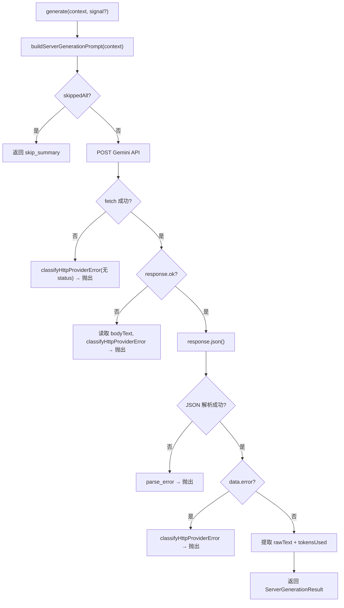

# GeminiObservationProvider.ts 需求说明

> 源文件：src/server/generation/providers/GeminiObservationProvider.ts ｜ 类型：源码 ｜ 行数：149 ｜ 所属模块：server/generation/providers ｜ 分析日期：2026-07-23

## 1. 文件定位总述

GeminiObservationProvider.ts 是 Google Gemini AI 模型的生成提供商适配器，实现了 `ServerGenerationProvider` 接口。它负责将 Server Beta 的生成任务（观察生成或摘要）转换为 Gemini API 请求，发送 prompt 并返回原始 XML 文本结果。该适配器处理网络错误分类、HTTP 错误分类、JSON 解析错误和空内容警告，并在所有事件均为私有时自动返回 skip 标记。支持 AbortSignal 取消和自定义 fetch 实现（便于测试）。

## 2. 功能需求

| 编号 | 需求描述（系统应当…） | 触发条件 / 输入 | 处理规则与输出 | 证据 |
|------|----------------------|----------------|---------------|------|
| FR-GEMINI-01 | 系统应当能通过 Gemini API 生成观察/摘要文本 | 调用 `generate(context, signal?)` | 构建 prompt，POST 到 Gemini API，返回 `ServerGenerationResult` | `GeminiObservationProvider.ts:54-137` |
| FR-GEMINI-02 | 系统应当在使用 Gemini API Key 构造器时校验 apiKey 非空 | 构造函数传入空 apiKey | 抛出 `ServerClassifiedProviderError`，kind='auth_invalid' | `GeminiObservationProvider.ts:42-47` |
| FR-GEMINI-03 | 系统应当当所有事件均为私有时自动返回 skip 标记，不调用 API | `buildServerGenerationPrompt` 返回 `skippedAll=true` | 返回 `<skip_summary reason="all_events_private" />` | `GeminiObservationProvider.ts:59-65` |
| FR-GEMINI-04 | 系统应当使用 temperature=0.3 和可配置的 maxOutputTokens（默认 4096）调用 Gemini API | 生成请求时 | generationConfig 中设置 temperature: 0.3, maxOutputTokens | `GeminiObservationProvider.ts:76-79` |
| FR-GEMINI-05 | 系统应当将网络错误、HTTP 错误和 JSON 解析错误分类为标准化的 ServerClassifiedProviderError | API 调用过程中发生错误时 | 网络错误 → classifyHttpProviderError(无 status)；HTTP 错误 → classifyHttpProviderError(有 status)；JSON 解析失败 → parse_error | `GeminiObservationProvider.ts:83-109` |
| FR-GEMINI-06 | 系统应当在 Gemini 返回空内容时记录 WARN 日志 | `data.candidates[0].content.parts[0].text` 为空 | 记录 `{provider:'gemini', model}` 的 WARN 日志，返回空 rawText | `GeminiObservationProvider.ts:122-124` |
| FR-GEMINI-07 | 系统应当支持 AbortSignal 取消正在进行的 API 请求 | 传入 signal 参数时 | 将 signal 传递给 fetch 调用 | `GeminiObservationProvider.ts:82` |

## 3. 业务规则与约束

1. **默认模型**：`gemini-2.5-flash`（`GeminiObservationProvider.ts:17`）
2. **默认 maxOutputTokens**：4096（`GeminiObservationProvider.ts:50`）
3. **API URL 格式**：`https://generativelanguage.googleapis.com/v1/models/{model}:generateContent?key={apiKey}`（`GeminiObservationProvider.ts:67`）
4. **API Key 传递方式**：URL query parameter（`key=...`），非 Authorization 头
5. **请求体结构**：`contents: [{role: 'user', parts: [{text: prompt}]}]`（`GeminiObservationProvider.ts:74-75`）
6. **响应解析路径**：`data.candidates?.[0]?.content?.parts?.[0]?.text`（`GeminiObservationProvider.ts:121`）
7. **Token 用量来源**：`data.usageMetadata.totalTokenCount`（`GeminiObservationProvider.ts:126-128`）
8. **自定义 fetch**：支持通过 `fetchImpl` 注入，便于测试时 mock HTTP 调用（`GeminiObservationProvider.ts:51`）

## 4. 对外暴露

| 导出项 | 类型 | 说明 |
|--------|------|------|
| `GeminiObservationProviderOptions` | interface | 构造选项（apiKey, model?, maxOutputTokens?, fetchImpl?） |
| `GeminiObservationProvider` | class | 实现 ServerGenerationProvider 接口的 Gemini 适配器 |
| `parseRetryAfterMs` | function | 从 error-classification 重新导出 |

## 5. 依赖关系

- **上游**：`./shared/error-classification.js`、`./shared/prompt-builder.js`（buildServerGenerationPrompt）、`./shared/types.js`（ServerGenerationProvider 接口）、`../../../utils/logger.js`
- **下游**：被 provider 注册表注册，由生成工作器调用

## 6. 数据结构

```typescript
interface GeminiResponse {
  candidates?: Array<{ content?: { parts?: Array<{ text?: string }> } }>;
  usageMetadata?: { totalTokenCount?: number };
  error?: { code?: number; status?: string; message?: string };
}
```

## 7. 复杂逻辑图示



## 8. 逆向备注

1. `safeReadBody` 辅助函数在读取响应体失败时返回空字符串而非抛出异常，避免掩盖原始 HTTP 错误（`GeminiObservationProvider.ts:142-148`）
