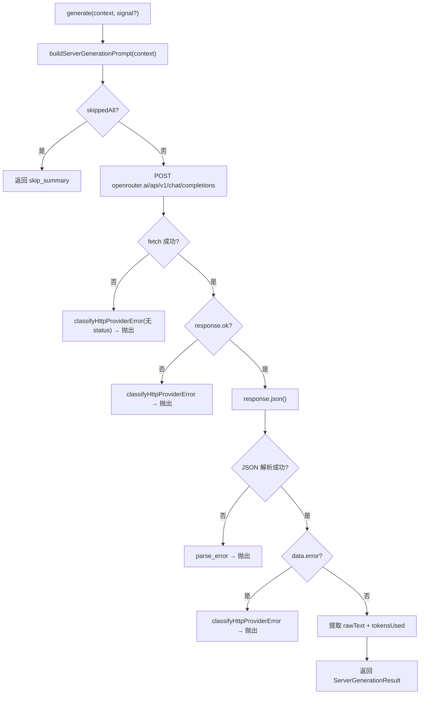

# OpenRouterObservationProvider.ts 需求说明

> 源文件：src/server/generation/providers/OpenRouterObservationProvider.ts ｜ 类型：源码 ｜ 行数：152 ｜ 所属模块：server/generation/providers ｜ 分析日期：2026-07-23

## 1. 文件定位总述

OpenRouterObservationProvider.ts 是 OpenRouter 代理平台的 AI 模型生成提供商适配器，实现了 `ServerGenerationProvider` 接口。它通过 OpenRouter 的 OpenAI 兼容 API（`/api/v1/chat/completions`）发送 prompt 并获取结果。与 Gemini 适配器的结构高度对称，支持网络错误分类、HTTP 错误分类、JSON 解析错误、AbortSignal 取消和自定义 fetch 实现。默认使用 Anthropic Claude 3.5 Sonnet 模型。

## 2. 功能需求

| 编号 | 需求描述（系统应当…） | 触发条件 / 输入 | 处理规则与输出 | 证据 |
|------|----------------------|----------------|---------------|------|
| FR-OR-01 | 系统应当能通过 OpenRouter API 生成观察/摘要文本 | 调用 `generate(context, signal?)` | 构建 prompt，POST 到 OpenRouter API，返回 `ServerGenerationResult` | `OpenRouterObservationProvider.ts:57-142` |
| FR-OR-02 | 系统应当在使用 OpenRouter API Key 构造器时校验 apiKey 非空 | 构造函数传入空 apiKey | 抛出 `ServerClassifiedProviderError`，kind='auth_invalid' | `OpenRouterObservationProvider.ts:43-48` |
| FR-OR-03 | 系统应当当所有事件均为私有时自动返回 skip 标记 | `buildServerGenerationPrompt` 返回 `skippedAll=true` | 返回 `<skip_summary reason="all_events_private" />` | `OpenRouterObservationProvider.ts:62-68` |
| FR-OR-04 | 系统应当使用 temperature=0.3、可配置的 maxOutputTokens（默认 4096）和指定的 siteUrl/appName 调用 OpenRouter API | 生成请求时 | 请求体设置 model、messages、temperature、max_tokens；请求头设置 Authorization、HTTP-Referer、X-Title | `OpenRouterObservationProvider.ts:72-86` |
| FR-OR-05 | 系统应当将网络错误、HTTP 错误和 JSON 解析错误分类为标准化的 ServerClassifiedProviderError | API 调用过程中发生错误时 | 与 Gemini 适配器相同的分类策略 | `OpenRouterObservationProvider.ts:88-114` |
| FR-OR-06 | 系统应当在 OpenRouter 返回空内容时记录 WARN 日志 | `data.choices[0].message.content` 为空 | 记录 `{provider:'openrouter', model}` 的 WARN 日志 | `OpenRouterObservationProvider.ts:127-132` |

## 3. 业务规则与约束

1. **默认模型**：`anthropic/claude-3.5-sonnet`（`OpenRouterObservationProvider.ts:16`）
2. **默认 maxOutputTokens**：4096（`OpenRouterObservationProvider.ts:51`）
3. **默认 siteUrl**：`https://github.com/thedotmack/claude-mem`（`OpenRouterObservationProvider.ts:52`）
4. **默认 appName**：`claude-mem`（`OpenRouterObservationProvider.ts:53`）
5. **API URL**：`https://openrouter.ai/api/v1/chat/completions`（`OpenRouterObservationProvider.ts:15`）
6. **认证方式**：Bearer Token 通过 Authorization 头传递（`OpenRouterObservationProvider.ts:75`）
7. **请求体结构**：OpenAI 兼容格式，`model` + `messages` + `temperature` + `max_tokens`（`OpenRouterObservationProvider.ts:80-85`）
8. **响应解析路径**：`data.choices?.[0]?.message?.content`（`OpenRouterObservationProvider.ts:126`）
9. **Token 用量来源**：`data.usage.total_tokens`（`OpenRouterObservationProvider.ts:134`）

## 4. 对外暴露

| 导出项 | 类型 | 说明 |
|--------|------|------|
| `OpenRouterObservationProviderOptions` | interface | 构造选项（apiKey, model?, maxOutputTokens?, siteUrl?, appName?, fetchImpl?） |
| `OpenRouterObservationProvider` | class | 实现 ServerGenerationProvider 接口的 OpenRouter 适配器 |

## 5. 依赖关系

- **上游**：`./shared/error-classification.js`、`./shared/prompt-builder.js`（buildServerGenerationPrompt）、`./shared/types.js`、`../../../utils/logger.js`
- **下游**：被 provider 注册表注册，由生成工作器调用

## 6. 数据结构

```typescript
interface OpenRouterResponse {
  choices?: Array<{ message?: { content?: string } }>;
  usage?: { total_tokens?: number };
  error?: { code?: string | number; message?: string };
}
```

## 7. 复杂逻辑图示

与 GeminiObservationProvider 结构对称，流程相同，区别在于 API 端点和请求/响应格式：



## 8. 逆向备注

1. OpenRouter 适配器与 Gemini 适配器在错误处理流程上高度对称，区别仅在 API 端点、请求格式和响应解析路径
2. `safeReadBody` 辅助函数同样在读取失败时返回空字符串（`OpenRouterObservationProvider.ts:145-151`）
