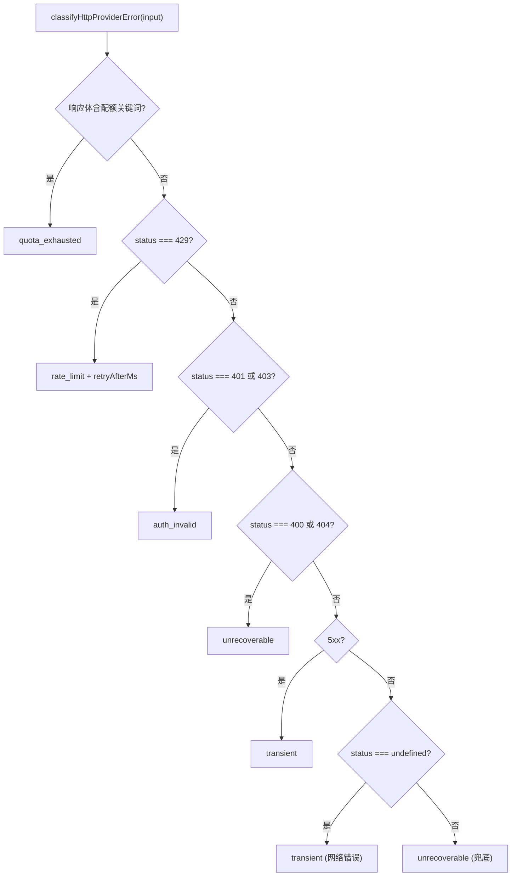

# error-classification.ts 需求说明

> 源文件：src/server/generation/providers/shared/error-classification.ts ｜ 类型：源码 ｜ 行数：137 ｜ 所属模块：server/generation/providers/shared ｜ 分析日期：2026-07-23

## 1. 文件定位总述

error-classification.ts 是 Server Beta 生成层的统一错误分类模型，将各种 AI 提供商的 HTTP 错误和运行时错误映射为六种标准化的错误类别（transient/unrecoverable/rate_limit/quota_exhausted/auth_invalid/parse_error）。该文件是 server-beta 本地副本，避免从 `src/services/worker/*` 导入（Phase 5 反模式防护）。它提供通用 HTTP 错误分类函数供 Gemini 和 OpenRouter adapter 共用，各 provider 的特殊错误可在上层叠加处理。

## 2. 功能需求

| 编号 | 需求描述（系统应当…） | 触发条件 / 输入 | 处理规则与输出 | 证据 |
|------|----------------------|----------------|---------------|------|
| FR-ERRCLS-01 | 系统应当能将 HTTP 错误分类为标准化的错误类别 | 调用 `classifyHttpProviderError(input)` | 根据响应体关键词、HTTP 状态码和网络错误特征映射到 6 种错误类别 | `error-classification.ts:77-136` |
| FR-ERRCLS-02 | 系统应当优先识别配额耗尽错误，通过响应体中的关键词匹配 | 响应体包含 "quota exceeded"、"insufficient credits"、"insufficient_quota" 或 "resource_exhausted" | 分类为 `quota_exhausted`，不论 HTTP 状态码 | `error-classification.ts:83-93` |
| FR-ERRCLS-03 | 系统应当识别 HTTP 429 为速率限制错误，并尝试解析 Retry-After 头 | HTTP 状态码为 429 | 分类为 `rate_limit`，附带 retryAfterMs（毫秒） | `error-classification.ts:95-101` |
| FR-ERRCLS-04 | 系统应当识别 HTTP 401/403 为认证无效错误 | HTTP 状态码为 401 或 403 | 分类为 `auth_invalid` | `error-classification.ts:103-108` |
| FR-ERRCLS-05 | 系统应当识别 HTTP 400/404 为不可恢复错误 | HTTP 状态码为 400 或 404 | 分类为 `unrecoverable` | `error-classification.ts:110-115` |
| FR-ERRCLS-06 | 系统应当识别 HTTP 5xx 为瞬态错误（可重试） | HTTP 状态码 500-599 | 分类为 `transient` | `error-classification.ts:117-122` |
| FR-ERRCLS-07 | 系统应当将无 HTTP 状态码的网络错误分类为瞬态错误 | 网络异常（DNS 失败、连接超时等） | 分类为 `transient`，message 包含网络错误描述 | `error-classification.ts:124-130` |
| FR-ERRCLS-08 | 系统应当能解析 Retry-After 头（支持秒数和 HTTP-date 两种格式） | 响应包含 Retry-After 头 | 秒数格式返回 `Math.floor(seconds * 1000)` ms；HTTP-date 格式返回距当前时间的差值；无效值返回 undefined | `error-classification.ts:49-61` |

## 3. 业务规则与约束

1. **分类优先级**：配额关键词 > 429 > 401/403 > 400/404 > 5xx > 网络错误 > 兜底不可恢复（`error-classification.ts:83-136`）
2. **配额关键词不区分大小写**：通过 `body.toLowerCase()` 匹配（`error-classification.ts:80`）
3. **错误体截断**：兜底错误消息中截取 body 前 200 字符（`error-classification.ts:133`）
4. **开放枚举**：`ServerProviderErrorClass` 允许扩展为任意字符串（`(string & {})`）（`error-classification.ts:16`）
5. **模块隔离**：注释明确说明此为 server-beta 本地副本，不得从 `src/services/worker/*` 导入（`error-classification.ts:4-6`）

## 4. 对外暴露

| 导出项 | 类型 | 说明 |
|--------|------|------|
| `ServerProviderErrorClass` | type | 错误类别枚举（transient/unrecoverable/rate_limit/quota_exhausted/auth_invalid/parse_error） |
| `ServerClassifiedProviderError` | class | 分类后的错误对象，包含 kind、retryAfterMs、cause |
| `isServerClassified` | function | 类型守卫，判断错误是否为 ServerClassifiedProviderError |
| `parseRetryAfterMs` | function | 解析 Retry-After 头为毫秒数 |
| `classifyHttpProviderError` | function | 通用 HTTP 错误分类函数 |

## 5. 依赖关系

- **上游**：无外部依赖
- **下游**：被 GeminiObservationProvider、OpenRouterObservationProvider 等 adapter 调用

## 6. 数据结构

```typescript
class ServerClassifiedProviderError extends Error {
  readonly kind: ServerProviderErrorClass;
  readonly retryAfterMs?: number;
  readonly cause: unknown;
}

interface ClassifyHttpInput {
  status?: number;
  bodyText?: string;
  headers?: Headers | { get(name: string): string | null };
  cause: unknown;
  providerLabel: string;
}
```

## 7. 复杂逻辑图示



## 8. 逆向备注

注释说明 Retry-After 解析行为刻意镜像 worker providers 的辅助函数，确保 server 端重试策略与 worker 端一致（`error-classification.ts:46-48`）。
