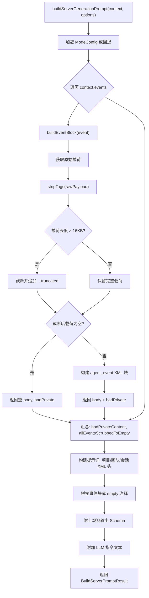

# prompt-builder.ts 需求说明

> 源文件：src/server/generation/providers/shared/prompt-builder.ts ｜ 类型：源码 ｜ 行数：165 ｜ 所属模块：generation/providers/shared ｜ 分析日期：2026-07-23

## 1. 文件定位总述

prompt-builder.ts 是 server-beta 生成管线的"提示词组装工厂"，承担将一组 `PostgresAgentEvent` 记录转换为单轮 LLM 提示词的核心职责。它位于 AI Provider 与事件数据之间，为 Claude/Gemini/OpenRouter 等上游提供者统一输入格式。该模块同时执行隐私过滤——在提示词组装阶段即剥离 `<private>` 等隐私标签内容——构成双保险隐私防线的前端屏障。

## 2. 功能需求

| 编号 | 需求描述（系统应当…） | 触发条件 / 输入 | 处理规则与输出 | 证据 |
|------|----------------------|----------------|---------------|------|
| FR-build-01 | 系统应当根据事件列表和项目/会话元数据，构建一条完整的单轮生成提示词 | 调用 `buildServerGenerationPrompt(context, options?)`，传入 `ServerGenerationContext`（含 events 数组、project 元数据、job 信息）和可选 ModeConfig | 将所有事件组装为 XML 结构的提示词，包含项目 ID、团队 ID、会话 ID、生成任务 ID 和事件列表，末尾附上观测输出的 XML Schema 定义 | `prompt-builder.ts:42-96` |
| FR-build-02 | 系统应当对每个事件载荷执行隐私标签剥离，过滤 `<private>` 等隐私内容 | 遍历 `context.events` 中的每个事件 | 调用 `stripTags(rawPayload)` 剥离隐私标签，返回结果中标记 `hadPrivateContent`；若剥离后载荷为空则跳过该事件 | `prompt-builder.ts:107-111` |
| FR-build-03 | 系统应当对每个事件的载荷文本截断至 16KB 上限，超出部分附加截断标记 | 事件载荷经隐私剥离后长度超过 `MAX_PAYLOAD_CHARS`（16384 字符） | 取前 16384 字符并追加 `\n[...truncated]`，防止提示词过长 | `prompt-builder.ts:40,109-111` |
| FR-build-04 | 系统应当检测"全部事件被隐私剥离后为空"的场景，标记跳过 | 所有事件的剥离后载荷均为空字符串（`allEventsScrubbedToEmpty = true`）且存在至少一个事件 | 返回 `skippedAll: true`，使调用方可直接返回合成跳过响应，避免向 LLM 发送空请求产生无效计费 | `prompt-builder.ts:49,63` |
| FR-build-05 | 系统应当基于当前活跃 Mode 配置生成观测输出的 XML Schema 描述 | 无活跃 Mode 或 Mode 加载失败时，使用内置回退列表 | 从 `ModeConfig.observation_types` 提取类型 ID 构成枚举（如 `[ discovery | progress | blocker | decision ]`），Schema 包含 type/title/subtitle/facts/narrative/concepts/files_read/files_modified 字段定义 | `prompt-builder.ts:141-155` |
| FR-build-06 | 系统应当在无法加载 Mode 时回退到预定义的四种观测类型 | `ModeManager.getInstance().getActiveMode()` 抛出异常（测试环境或首次安装无模式文件） | 使用 `FALLBACK_OBSERVATION_TYPES`：discovery、progress、blocker、decision，确保提示词始终可用 | `prompt-builder.ts:14-19,133-139` |
| FR-build-07 | 系统应当对所有注入 XML 的文本进行 XML 实体转义 | 构建提示词中的标签属性值和载荷内容 | 对 `& < > " '` 五种字符进行转义，防止 XML 注入破坏提示词结构 | `prompt-builder.ts:157-164` |
| FR-build-08 | 系统应当为每个事件构建标准化的 XML 块，包含 ID、事件类型、来源适配器、发生时间和载荷 | 事件剥离后载荷非空 | 生成 `<agent_event>` 块，包含 `<id>`、`<event_type>`、`<source_adapter>`、`<occurred_at>`（转为 ISO 格式）、`<payload>` 子标签 | `prompt-builder.ts:118-129` |

## 3. 业务规则与约束

- **单轮请求设计**：系统采用单轮（single-turn）提示词模式，不使用多轮 SDK 对话模型。`buildServerGenerationPrompt:24-26` 注释明确声明此意图。
- **隐私双保险**：本模块在提示词组装时执行隐私剥离，`processGeneratedResponse` 在下游同样丢弃完全源于隐私输入的观测结果，构成纵深防御。`prompt-builder.ts:30-32`
- **载荷长度限制**：单事件最大载荷为 `MAX_PAYLOAD_CHARS = 16 * 1024`（16384 字符），硬编码常量。`prompt-builder.ts:40`
- **XML 转义完整性**：仅覆盖五种基本 XML 实体，未处理 CDATA 或 Unicode 特殊情况。`prompt-builder.ts:157-164`

## 4. 对外暴露

| 导出项 | 类型 | 说明 |
|--------|------|------|
| `buildServerGenerationPrompt(context, options?)` | 函数 | 主入口，构建生成提示词并返回提示词文本、隐私标记和跳过标记 |
| `BuildServerPromptResult` | 接口 | 返回值类型：prompt、hadPrivateContent、skippedAll |
| `MAX_PAYLOAD_CHARS` | 常量（未导出） | 单事件载荷最大字符数，16384 |

## 5. 依赖关系

- **上游依赖**：`ModeManager`（加载活跃模式配置）、`stripTags`（隐私标签剥离工具）、`PostgresAgentEvent` 类型、`ServerGenerationContext` 类型
- **下游调用者**：`ClaudeObservationProvider.generate()` 以及其他 `ServerGenerationProvider` 实现

## 6. 数据结构

### BuildServerPromptResult
```typescript
interface BuildServerPromptResult {
  readonly prompt: string;            // 组装完成的完整提示词
  readonly hadPrivateContent: boolean; // 是否存在包含隐私内容的事件
  readonly skippedAll: boolean;        // 是否所有事件剥离后为空
}
```

### EventBlockResult（内部）
```typescript
interface EventBlockResult {
  body: string;       // XML 格式的事件块文本
  hadPrivate: boolean; // 该事件是否包含隐私内容
}
```

## 7. 复杂逻辑图示



上图展示了提示词构建的完整流程：从事件遍历、隐私剥离、截断处理到最终 XML 拼装。每个事件的隐私状态被独立追踪，最终汇总到返回结构中。

## 8. 逆向备注

- 注释中提到 `processGeneratedResponse` 也执行隐私过滤（"belt-and-suspenders"），但该函数不在本文件中，位于下游处理模块，未在本文件中证实其具体实现。
- `FALLBACK_OBSERVATION_TYPES` 类型断言 `as unknown as ModeConfig` 是一种弱类型兼容处理，推断：当回退模式使用时，`observation_types` 之外的字段（如 `instructions`）将为 undefined，但 `buildObservationOutputSchema` 仅使用 `observation_types`，因此不会产生运行时错误。
