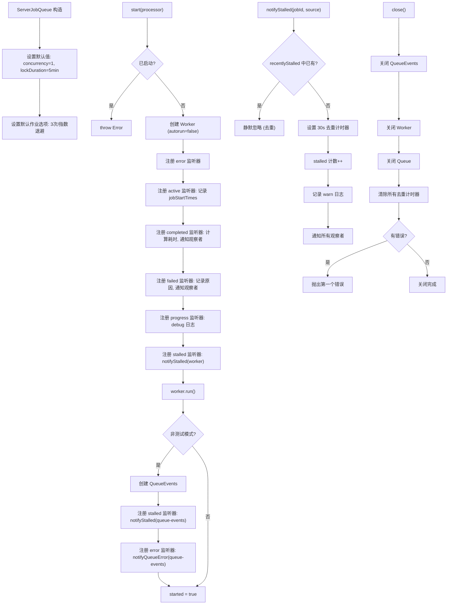

# ServerJobQueue.ts 需求说明

> 源文件：src/server/jobs/ServerJobQueue.ts ｜ 类型：源码 ｜ 行数：389 ｜ 所属模块：jobs ｜ 分析日期：2026-07-23

## 1. 文件定位总述

ServerJobQueue 是 BullMQ Queue + Worker 对的封装层，为 server-beta 提供类型安全的任务队列抽象。它封装了 BullMQ 的连接管理、Worker 生命周期、作业增删查计数和事件观察机制，并附加了停滞（stalled）作业的去重计数、per-process 生命周期计数器以及 Redis 不可用的统一错误包装。该类严格遵循"Postgres outbox 为权威、BullMQ 为传输层"的架构约束，默认并发度为 1 且 Worker 不自动运行，要求显式调用 `start()` 启动。

## 2. 功能需求

| 编号 | 需求描述（系统应当…） | 触发条件 / 输入 | 处理规则与输出 | 证据 |
|------|----------------------|----------------|---------------|------|
| FR-queue-01 | 系统应当向 BullMQ 队列添加作业，使用确定性 jobId 去重 | 调用 `add(jobId, payload, options?)` | 验证 jobId 不包含冒号（BullMQ 内部分隔符），合并默认选项和传入选项后调用 `Queue.add()` | `ServerJobQueue.ts:127-144` |
| FR-queue-02 | 系统应当通过 jobId 查询单个作业 | 调用 `getJob(jobId)` | 调用 `Queue.getJob(jobId)`，返回 `Job<TPayload> \| null \| undefined` | `ServerJobQueue.ts:146-152` |
| FR-queue-03 | 系统应当通过 jobId 移除作业 | 调用 `remove(jobId)` | 调用 `Queue.remove(jobId)` | `ServerJobQueue.ts:154-160` |
| FR-queue-04 | 系统应当查询队列的作业计数（waiting/active/delayed/failed/completed） | 调用 `getCounts()` | 调用 `Queue.getJobCounts()` 并返回 `ServerJobCounts` 结构 | `ServerJobQueue.ts:162-181` |
| FR-queue-05 | 系统应当在启动时创建 BullMQ Worker 并注册事件监听器 | 调用 `start(processor)` | 创建 Worker（autorun: false, concurrency 默认 1），注册 error/active/completed/failed/progress/stalled 六种事件监听器，调用 `worker.run()` 显式启动 | `ServerJobQueue.ts:233-321` |
| FR-queue-06 | 系统应当为 Worker 注册 error 事件监听器，防止未处理异常导致进程崩溃 | Worker 构造完成 | 调用 `worker.on('error', ...)` 转发到 `notifyQueueError()` | `ServerJobQueue.ts:247` |
| FR-queue-07 | 系统应当为 Worker 注册 completed/failed 事件监听器并计算作业执行耗时 | 作业完成或失败时 | completed 事件记录 jobId 起始时间与完成的 durationMs，failed 事件记录 attemptsMade 和错误原因；起始时间在 active 事件时记录 | `ServerJobQueue.ts:253-285` |
| FR-queue-08 | 系统应当为 Worker 注册 stalled 事件监听器并去重计数 | Worker 检测到作业停滞 | 调用 `notifyStalled(jobId, 'worker')`，在 30 秒去重窗口内同一 jobId 仅计数一次 | `ServerJobQueue.ts:293` |
| FR-queue-09 | 系统应当在非测试模式下启动 QueueEvents 订阅，监听 Redis pub/sub 的停滞事件 | Worker 启动且未使用 workerFactory | 创建 `QueueEvents` 实例订阅 `stalled` 事件，调用 `notifyStalled(jobId, 'queue-events')`；QueueEvents 的 error 事件也转发到 `notifyQueueError()` | `ServerJobQueue.ts:298-318` |
| FR-queue-10 | 系统应当对外暴露 observe() 方法注册作业生命周期观察者 | 调用 `observe(listener)` | 将 listener 加入监听器列表，completed/failed/stalled/error 事件均通知所有已注册监听器；监听器异常被隔离不影响其他监听器和队列运行 | `ServerJobQueue.ts:328-330` |
| FR-queue-11 | 系统应当提供 per-process 生命周期计数器（stalled/errored） | 调用 `getLifecycleCounters()` | 返回自启动以来累计的 stalled 和 errored 事件计数；stalled 计数包含 Worker 和 QueueEvents 两个来源的去重结果 | `ServerJobQueue.ts:338-340` |
| FR-queue-12 | 系统应当防止重复启动，再次调用 start() 抛出异常 | `this.started` 已为 true | 抛出 `Error('ServerJobQueue ${name} is already started')` | `ServerJobQueue.ts:234-236` |
| FR-queue-13 | 系统应当在 close() 时按顺序关闭 QueueEvents、Worker 和 Queue | 调用 `close()` | 依次关闭 QueueEvents → Worker → Queue，清除所有停滞去重计时器；任何关闭错误收集后抛出第一个 | `ServerJobQueue.ts:346-380` |
| FR-queue-14 | 系统应当将 Redis 不可用错误统一包装为可辨识的错误消息 | Queue/Worker 操作捕获到连接错误 | 通过 `toRedisUnavailableError()` 包装为 `ServerJobQueue ${name} requires Redis/Valkey...` 格式 | `ServerJobQueue.ts:382-387` |
| FR-queue-15 | 系统应当支持通过 queueFactory 和 workerFactory 注入替代实现（测试用途） | 构造时传入 factory 选项 | 使用注入的工厂替代 BullMQ 原生 Queue/Worker 实例 | `ServerJobQueue.ts:121-123,244-246` |
| FR-queue-16 | 系统应当对作业 ID 中的冒号字符进行校验并拒绝 | `add(jobId, ...)` 时 jobId 包含 `:` | 抛出 `Error('server job ID must not contain ":"')`，防止 BullMQ 内部分隔符冲突 | `ServerJobQueue.ts:128-130` |

## 3. 业务规则与约束

- **Worker autorun 禁用**：所有 Worker 构造时 `autorun: false`，必须显式调用 `worker.run()` 启动，确保启动顺序可控。`ServerJobQueue.ts:237`
- **默认并发度**：1（per-kind 调优在更高层控制）。`ServerJobQueue.ts:24`
- **默认锁时长**：5 分钟（`DEFAULT_LOCK_DURATION_MS = 300000`），可通过构造选项覆盖。`ServerJobQueue.ts:72`
- **默认重试策略**：3 次尝试，指数退避（delay=5000ms），completed 保留 7 天/1000 条，failed 保留 30 天/1000 条。`ServerJobQueue.ts:103-107`
- **停滞去重窗口**：30 秒（`STALLED_DEDUPE_WINDOW_MS = 30000`），同一 jobId 在窗口内仅计数一次，避免 Worker.on('stalled') 和 QueueEvents 双重触发。`ServerJobQueue.ts:95`
- **BullMQ 仅作传输**：不将 Worker 的 completed/failed 状态视为权威，权威数据源在 Postgres outbox 表。`ServerJobQueue.ts:26-28`
- **监听器隔离**：观察者回调中的异常被 catch 吞掉，不影响队列运行和其他监听器。`ServerJobQueue.ts:216,229,268,283`

## 4. 对外暴露

| 导出项 | 类型 | 说明 |
|--------|------|------|
| `ServerJobQueue<TPayload>` | 类 | BullMQ Queue + Worker 封装 |
| `ServerJobQueueOptions<TPayload>` | 接口 | 构造选项：name、config、concurrency、lockDurationMs、defaultJobOptions、queueFactory、workerFactory |
| `ServerJobCounts` | 接口 | 队列计数：waiting/active/delayed/failed/completed |
| `ServerJobLifecycleCounters` | 接口 | 生命周期计数：stalled/errored |
| `ServerJobObservedListener` | 接口 | 观察者回调：onCompleted/onFailed/onStalled/onError |
| `add(jobId, payload, options?)` | 方法 | 添加作业 |
| `getJob(jobId)` | 方法 | 查询作业 |
| `remove(jobId)` | 方法 | 移除作业 |
| `getCounts()` | 方法 | 获取队列计数 |
| `start(processor)` | 方法 | 启动 Worker |
| `observe(listener)` | 方法 | 注册观察者 |
| `getLifecycleCounters()` | 方法 | 获取生命周期计数 |
| `isStarted()` | 方法 | 查询启动状态 |
| `close()` | 方法 | 关闭队列 |

## 5. 依赖关系

- **上游**：BullMQ（Queue、Worker、QueueEvents）、`RedisQueueConfig`（连接配置）、`logger`（日志）
- **下游**：被 `ActiveServerBetaQueueManager` 内部创建和管理，间接服务于 `ActiveServerBetaGenerationWorkerManager`

## 6. 数据结构

### ServerJobQueueOptions
```typescript
interface ServerJobQueueOptions<TPayload> {
  name: string;                              // 队列名称
  config: RedisQueueConfig;                  // Redis 连接配置
  concurrency?: number;                      // 并发度，默认 1
  lockDurationMs?: number;                    // 锁时长，默认 300000
  defaultJobOptions?: JobsOptions;            // BullMQ 默认作业选项
  queueFactory?: (name, options) => Pick<Queue<TPayload>, ...>;  // 测试用队列工厂
  workerFactory?: (name, processor, options) => Pick<Worker<TPayload>, ...>;  // 测试用 Worker 工厂
}
```

### 默认作业选项（硬编码）
```typescript
const defaultJobOptions = {
  attempts: 3,
  backoff: { type: 'exponential', delay: 5000 },
  removeOnComplete: { age: 7 * 24 * 60 * 60, count: 1000 },  // 7天/1000条
  removeOnFail: { age: 30 * 24 * 60 * 60, count: 1000 }      // 30天/1000条
};
```

## 7. 复杂逻辑图示



上图展示了 ServerJobQueue 的三大核心流程：启动时的 Worker 和事件注册、停滞事件的双源去重机制、以及关闭时的有序资源释放。

## 8. 逆向备注

- 停滞去重使用 `Map<string, NodeJS.Timeout>` 实现 30 秒窗口，每个去重计时器通过 `unref()` 避免阻止进程退出。`ServerJobQueue.ts:202-207`
- `QueueEvents` 仅在非测试模式（`!this.workerFactory`）下创建，推断：测试用的 workerFactory 不提供真实 Redis 连接，QueueEvents 会连接失败。`ServerJobQueue.ts:302`
- `getCounts()` 不包含 stalled 计数，因为 BullMQ 不暴露可靠的 stalled 计数器（底层列表在消费时轮换）。stalled 计数通过 `getLifecycleCounters()` 单独提供。`ServerJobQueue.ts:38-41`
- Job ID 禁止冒号（`:`）的校验，推断：BullMQ 在 jobId 中使用冒号作为内部前缀分隔符，外部 jobId 包含冒号会导致冲突。`ServerJobQueue.ts:128-130`
