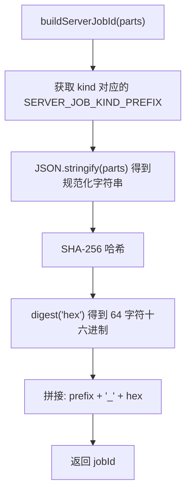

# job-id.ts 需求说明

> 源文件：src/server/jobs/job-id.ts ｜ 类型：源码 ｜ 行数：30 ｜ 所属模块：server/jobs ｜ 分析日期：2026-07-23

## 1. 文件定位总述

job-id.ts 负责 Server Beta 生成任务的确定性 ID 构建。它将任务的关键维度（kind、team_id、project_id、source_type、source_id）序列化为 JSON 后进行 SHA-256 哈希，生成全局唯一的 BullMQ jobId。确定性 ID 的设计目标是避免 Redis 键冲突和跨租户任务去重，同时保持 BullMQ jobId 去重机制在进程重启后的正确性。

## 2. 功能需求

| 编号 | 需求描述（系统应当…） | 触发条件 / 输入 | 处理规则与输出 | 证据 |
|------|----------------------|----------------|---------------|------|
| FR-JOBID-01 | 系统应当能基于任务的多维标识构建确定性 jobId，格式为 `{kindPrefix}_{sha256hex}` | 调用 `buildServerJobId(parts: ServerJobIdParts)` | 返回以 kind 前缀开头、后接 64 位十六进制 SHA-256 摘要的字符串 | `job-id.ts:19-30` |
| FR-JOBID-02 | 系统应当确保 jobId 中不包含冒号（`:`），因为 BullMQ 内部使用冒号作为键分隔符 | 构建 jobId 时 | 使用下划线分隔 kindPrefix 和哈希值，哈希值为纯十六进制 | `job-id.ts:17-18` |

## 3. 业务规则与约束

1. **ID 格式约束**：`${kindPrefix}_${sha256hex}`，kindPrefix 由 `SERVER_JOB_KIND_PREFIX` 映射表提供（`job-id.ts:20,28`）
2. **确定性保证**：相同 parts 输入（JSON 序列化后）始终产生相同 jobId，JSON.stringify 保证字段顺序稳定（`job-id.ts:21-29`）
3. **无冒号设计**：注释明确说明 BullMQ 使用 `:` 作为内部键分隔符，嵌入 `:` 会导致扫描/状态混淆（`job-id.ts:17`）
4. **跨租户安全**：SHA-256 哈希避免不同租户的任务产生相同 ID（`job-id.ts:14`）

## 4. 对外暴露

| 导出项 | 类型 | 说明 |
|--------|------|------|
| `ServerJobIdParts` | interface | jobId 的组成部分（kind, team_id, project_id, source_type, source_id） |
| `buildServerJobId` | function | 构建确定性 jobId |

## 5. 依赖关系

- **上游**：`crypto`（createHash）、`./types.js`（SERVER_JOB_KIND_PREFIX, ServerGenerationJobKind）
- **下游**：被 EndSessionService 等任务调度模块使用，构建 BullMQ jobId

## 6. 数据结构

```typescript
interface ServerJobIdParts {
  kind: ServerGenerationJobKind;   // 'event' | 'event-batch' | 'summary' | 'reindex'
  team_id: string;
  project_id: string;
  source_type: string;
  source_id: string;
}
// 输出格式: "evt_{sha256hex}" | "evtb_{sha256hex}" | "sum_{sha256hex}" | "rdx_{sha256hex}"
```

## 7. 复杂逻辑图示



## 8. 逆向备注

无特殊备注。
