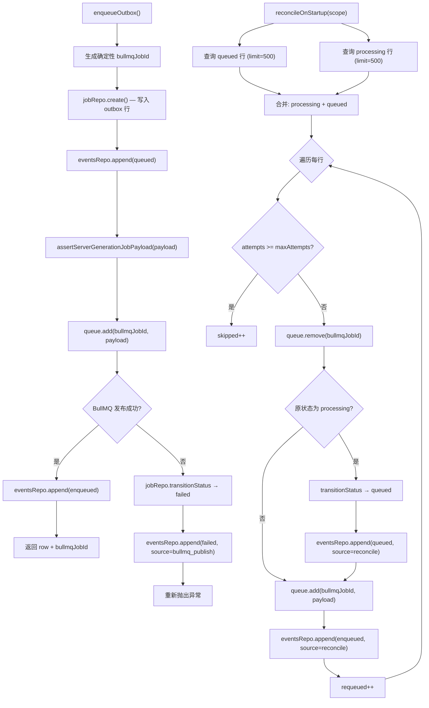

# outbox.ts 需求说明

> 源文件：src/server/jobs/outbox.ts ｜ 类型：源码 ｜ 行数：301 ｜ 所属模块：jobs ｜ 分析日期：2026-07-23

## 1. 文件定位总述

outbox.ts 实现了 server-beta 生成管线的"发件箱模式"（Outbox Pattern），以 Postgres 表 `observation_generation_jobs` 作为作业的权威持久化存储，BullMQ 队列仅作为执行传输层。它提供三大核心操作：入队（写入行并发布到 BullMQ）、启动协调（崩溃恢复时重新发布未完成作业）、状态标记（完成/失败）。该模块确保每个作业的生命周期事件（queued/enqueued/failed/completed）均有审计级日志记录，并在 BullMQ 发布失败时自动将行标记为 failed 以避免悬空状态。

## 2. 功能需求

| 编号 | 需求描述（系统应当…） | 触发条件 / 输入 | 处理规则与输出 | 证据 |
|------|----------------------|----------------|---------------|------|
| FR-outbox-01 | 系统应当先写入 Postgres outbox 行（权威记录），再发布到 BullMQ（传输层） | 调用 `enqueueOutbox(jobRepo, eventsRepo, queue, input)` | 生成确定性 `bullmqJobId`，创建 outbox 行，追加 `queued` 事件日志，验证载荷后调用 `queue.add()`，追加 `enqueued` 事件日志 | `outbox.ts:52-126` |
| FR-outbox-02 | 系统应当在 BullMQ 发布失败时将 outbox 行标记为 failed 并追加失败事件日志 | `queue.add()` 抛出异常 | 调用 `jobRepo.transitionStatus` 将状态转为 `failed`，记录错误来源为 `bullmq_publish`，追加 `failed` 事件日志，然后重新抛出异常 | `outbox.ts:103-123` |
| FR-outbox-03 | 系统应当在入队前验证 BullMQ 载荷的结构完整性 | 调用 `queue.add()` 之前 | 调用 `assertServerGenerationJobPayload(payload)` 同步验证，不合法则立即拒绝入队 | `outbox.ts:93` |
| FR-outbox-04 | 系统应当将三种作业类型映射为数据库 job_type 字符串 | 入队时 payload.kind 为 event/summary/reindex | event → `observation_generate_for_event`，summary → `observation_generate_session_summary`，reindex → `observation_reindex` | `outbox.ts:30-34` |
| FR-outbox-05 | 系统应当对每个 outbox 行追加状态变更事件日志 | 入队、发布、失败、完成等操作时 | 调用 `eventsRepo.append()` 记录 eventType（queued/enqueued/failed/completed）、statusAfter、attempt 和 details | `outbox.ts:80-87,95-102,114-121` |
| FR-outbox-06 | 系统应当在启动协调中重新发布崩溃后残留的 queued 和 processing 状态的作业 | 调用 `reconcileOnStartup(jobRepo, eventsRepo, queue, scope, options?)` | 查询指定作用域内 queued 和 processing 状态的行（默认限制各 500 条），先 remove 已有 BullMQ 作业再重新 add；processing 行先回退到 queued 状态 | `outbox.ts:133-205` |
| FR-outbox-07 | 系统应当在启动协调中跳过已达到最大重试次数的作业 | 行的 `attempts >= maxAttempts` | 计入 skipped 计数，不入队 | `outbox.ts:158-159` |
| FR-outbox-08 | 系统应当支持将作业标记为已完成 | 调用 `markCompleted(jobRepo, eventsRepo, input)` | 调用 `jobRepo.transitionStatus` 转为 `completed`，追加 `completed` 事件日志；行不存在则抛出错误 | `outbox.ts:207-230` |
| FR-outbox-09 | 系统应当支持将作业标记为失败，并可选地安排下次重试时间 | 调用 `markFailed(jobRepo, eventsRepo, input)` | 若提供 `nextAttemptAt` 则状态转为 `queued`（等待重试调度），否则转为 `failed`；追加 `retry_scheduled` 或 `failed` 事件日志 | `outbox.ts:232-264` |
| FR-outbox-10 | 系统应当为启动协调中 processing 状态的作业重置状态为 queued | 协调发现 processing 状态行 | 先调用 `transitionStatus` 回退到 queued，再重新发布到 BullMQ，追加带 `source: 'reconcile_on_startup'` 的事件日志 | `outbox.ts:173-189` |
| FR-outbox-11 | 系统应当从载荷中提取 agentEventId 和 serverSessionId 并持久化到 outbox 行 | 创建 outbox 行时 | event 类型的载荷提取 `agent_event_id`，summary 类型的载荷提取 `server_session_id`；其他类型返回 null | `outbox.ts:72-73,266-272` |
| FR-outbox-12 | 系统应当将未知 job_type 字符串转换回 kind 时抛出错误 | `jobTypeToKind()` 遇到无法匹配的类型字符串 | 抛出 `Error('unknown observation generation job_type: ...')` | `outbox.ts:291-300` |

## 3. 业务规则与约束

- **Postgres 优先于 BullMQ**：outbox 行是权威历史记录，BullMQ 仅为传输层；`ServerJobQueue` 注释明确说明"不要将 Worker 状态视为权威"。`outbox.ts:20-23`
- **确定性 Job ID 去重**：每个 outbox 行的 `bullmqJobId` 是确定性生成的，BullMQ 端也通过 jobId 去重，形成双重去重保障。`outbox.ts:59-65`
- **启动协调限制**：默认每类状态最多处理 500 行（`limit` 参数可调），防止超大规模协调阻塞启动。`outbox.ts:140`
- **协调优先级**：processing 状态优先于 queued 状态处理（数组展开顺序为 `[...processing, ...queued]`）。`outbox.ts:157`
- **载荷验证防御纵深**：入队时的 `assertServerGenerationJobPayload` 确保变形载荷不会产生缺失审计字段的作业。`outbox.ts:90-93`
- **事务边界**：`enqueueOutbox` 本身不在显式事务中（行写入和 BullMQ 发布分步执行），推断：BullMQ add 失败后通过状态回退保证一致性，而非数据库回滚。

## 4. 对外暴露

| 导出项 | 类型 | 说明 |
|--------|------|------|
| `SingleSourceJobPayload` | 类型 | 联合类型：`GenerateObservationsForEventJob | GenerateSessionSummaryJob | ReindexObservationJob` |
| `OutboxScope` | 接口 | 作用域：projectId、teamId |
| `EnqueueOutboxRowInput` | 接口 | 入队输入：payload、agentEventId、serverSessionId、maxAttempts |
| `enqueueOutbox(jobRepo, eventsRepo, queue, input)` | 函数 | 写入 outbox 行并发布到 BullMQ |
| `reconcileOnStartup(jobRepo, eventsRepo, queue, scope, options?)` | 函数 | 启动协调，重新发布未完成作业 |
| `markCompleted(jobRepo, eventsRepo, input)` | 函数 | 标记作业完成 |
| `markFailed(jobRepo, eventsRepo, input)` | 函数 | 标记作业失败或安排重试 |

## 5. 依赖关系

- **上游**：`PostgresObservationGenerationJobRepository`（行存储）、`PostgresObservationGenerationJobEventsRepository`（事件日志）、`ServerJobQueue`（BullMQ 抽象）、`buildServerJobId`（ID 生成）、`assertServerGenerationJobPayload`（载荷验证）
- **下游**：被 `IngestEventsService`（事件入队）、`ProviderObservationGenerator`（处理完成后标记状态）、启动协调流程调用

## 6. 数据结构

### KIND_TO_JOB_TYPE 映射
```typescript
const KIND_TO_JOB_TYPE: Record<string, string> = {
  event: 'observation_generate_for_event',
  summary: 'observation_generate_session_summary',
  reindex: 'observation_reindex'
};
```

### EnqueueOutboxRowInput
```typescript
interface EnqueueOutboxRowInput {
  payload: SingleSourceJobPayload;       // BullMQ 载荷
  agentEventId?: string | null;          // 关联的 agent_event ID
  serverSessionId?: string | null;       // 关联的 server_session ID
  maxAttempts?: number;                  // 最大重试次数
}
```

## 7. 复杂逻辑图示



上图左侧为正常入队流程（含 BullMQ 发布失败的回退），右侧为启动协调流程（崩溃恢复时的作业重新发布）。

## 8. 逆向备注

- `enqueueOutbox` 中 `eventsRepo.append` 在 BullMQ 发布失败前已追加了一条 `queued` 事件日志，发布失败后又追加一条 `failed` 事件日志。推断：这种设计允许通过事件日志审计完整生命周期，即使行状态最终为 failed 也能追溯其 queued 起源。
- `reconcileOnStartup` 的 remove 操作使用 try-catch 静默处理失败（debug 级别日志），推断：BullMQ 中可能已不存在该 jobId（如 Redis 重启清空），此时 remove 失败不应阻塞协调。`outbox.ts:165-171`
- `jobTypeToKind` 使用 `Object.entries` 遍历反查，推断：映射关系较小（3 条），线性遍历性能足够。
