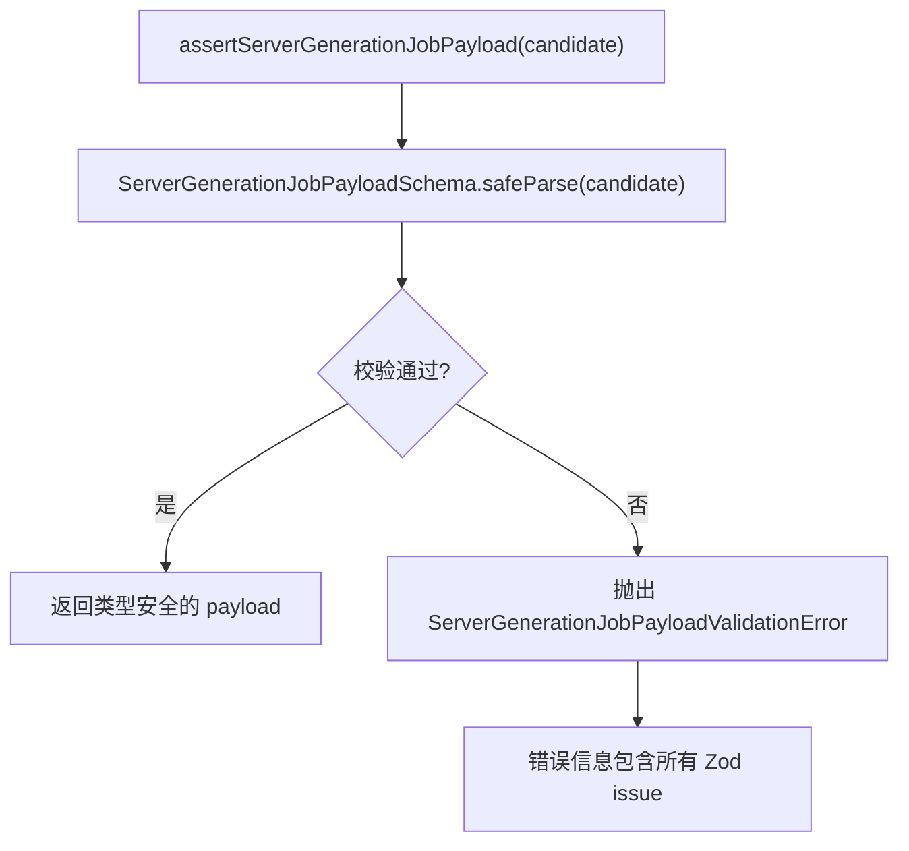

# types.ts 需求说明

> 源文件：src/server/jobs/types.ts ｜ 类型：源码 ｜ 行数：156 ｜ 所属模块：server/jobs ｜ 分析日期：2026-07-23

## 1. 文件定位总述

types.ts 定义了 Server Beta 生成任务的完整类型系统和 Zod 校验 schema。它规定了四种任务类型（event/event-batch/summary/reindex）的 TypeScript 接口、队列名称映射、kind 前缀映射和 Zod 鉴别联合校验。每种任务都携带完整的团队审计表面（team_id, project_id, source_type, source_id, generation_job_id, api_key_id, actor_id, source_adapter），确保 worker 在每次重试时都能审计和作用域校验。注释强调 BullMQ payload 中的 team_id 和 project_id 仅为参考，worker 必须从 Postgres 重新加载并比较。

## 2. 功能需求

| 编号 | 需求描述（系统应当…） | 触发条件 / 输入 | 处理规则与输出 | 证据 |
|------|----------------------|----------------|---------------|------|
| FR-JOBTYPES-01 | 系统应当定义四种生成任务类型的 TypeScript 接口，各自携带特定字段 | 编译期类型检查 | event → agent_event_id; event-batch → agent_event_ids[]; summary → server_session_id; reindex → observation_id | `types.ts:40-58` |
| FR-JOBTYPES-02 | 系统应当提供队列名称映射表，将任务类型映射到 BullMQ 队列名 | 队列创建时 | event → `server_beta_generate_event`; event-batch → `server_beta_generate_event_batch`; summary → `server_beta_generate_summary`; reindex → `server_beta_reindex` | `types.ts:66-71` |
| FR-JOBTYPES-03 | 系统应当提供 kind 前缀映射表，用于 jobId 构建 | jobId 构建时 | event → `evt`; event-batch → `evtb`; summary → `sum`; reindex → `rdx` | `types.ts:73-78` |
| FR-JOBTYPES-04 | 系统应当通过 Zod 鉴别联合 schema 校验 BullMQ payload，拒绝畸形 payload | 调用 `assertServerGenerationJobPayload(candidate)` | 使用 `z.discriminatedUnion('kind', [...])` 校验，失败抛出 `ServerGenerationJobPayloadValidationError` | `types.ts:124-155` |
| FR-JOBTYPES-05 | 系统应当在 base schema 中要求所有审计字段（team_id, project_id, source_type, source_id, generation_job_id, api_key_id, actor_id, source_adapter）必须存在 | Zod 校验时 | api_key_id 和 actor_id 允许 null 但字段必须存在；request_id 可选 | `types.ts:86-102` |

## 3. 业务规则与约束

1. **source_type 枚举**：`agent_event`、`session_summary`、`observation_reindex` 三种（`types.ts:89`）
2. **team_id/project_id 仅为参考**：注释明确说明 worker 必须从 Postgres 重新加载并比较，不得将这些字段视为认证权威（`types.ts:14-18`）
3. **api_key_id/actor_id 字段存在性**：允许 null（兼容 local-dev/system 入队），但字段本身必须存在于 payload 中以确保审计记录形状一致（`types.ts:92-94`）
4. **request_id 可选性**：可选字段（Phase 12 引入），旧任务可能缺失（`types.ts:98-101`）
5. **防御性校验**：注释说明每个入队点都应使用 assertServerGenerationJobPayload，worker 端也需重新校验（`types.ts:140-145`）
6. **agent_event_ids 非空**：event-batch 的 agent_event_ids 数组至少包含一个元素（`types.ts:110`）

## 4. 对外暴露

| 导出项 | 类型 | 说明 |
|--------|------|------|
| `ServerGenerationJobKind` | type | `'event' \| 'event-batch' \| 'summary' \| 'reindex'` |
| `ServerGenerationJobStatus` | type | 复用 Postgres ObservationGenerationJobStatus |
| `ServerGenerationJob` | interface | 基础任务接口（审计字段） |
| `GenerateObservationsForEventJob` | interface | 单事件生成任务 |
| `GenerateObservationsForEventBatchJob` | interface | 批量事件生成任务 |
| `GenerateSessionSummaryJob` | interface | 会话摘要生成任务 |
| `ReindexObservationJob` | interface | 观察重索引任务 |
| `ServerGenerationJobPayload` | type | 四种任务的联合类型 |
| `SERVER_JOB_QUEUE_NAMES` | const | 队列名称映射表 |
| `SERVER_JOB_KIND_PREFIX` | const | kind 前缀映射表 |
| `ServerGenerationJobPayloadSchema` | ZodSchema | 鉴别联合校验 schema |
| `ServerGenerationJobPayloadValidationError` | class | 校验错误类 |
| `assertServerGenerationJobPayload` | function | 校验 payload 并返回类型安全结果 |

## 5. 依赖关系

- **上游**：`zod`（校验）、`../../storage/postgres/generation-jobs.js`（ObservationGenerationJobSourceType, ObservationGenerationJobStatus）
- **下游**：被 job-id.ts、ActiveServerBetaQueueManager、EndSessionService、生成工作器等消费

## 6. 数据结构

```typescript
// 基础字段 schema（所有任务共有）
{
  team_id: string;           // 必填
  project_id: string;        // 必填
  source_type: 'agent_event' | 'session_summary' | 'observation_reindex';
  source_id: string;         // 必填
  generation_job_id: string; // 必填
  api_key_id: string | null; // 必填（允许 null）
  actor_id: string | null;   // 必填（允许 null）
  source_adapter: string;    // 必填
  request_id?: string | null; // 可选
}

// 各类型特有字段
event:        { kind: 'event';        agent_event_id: string }
event-batch:  { kind: 'event-batch';  agent_event_ids: string[] }
summary:      { kind: 'summary';      server_session_id: string }
reindex:      { kind: 'reindex';      observation_id: string }
```

## 7. 复杂逻辑图示



## 8. 逆向备注

注释中 "Phase 11" 标记表明完整的审计表面（api_key_id, actor_id, source_adapter）是在该阶段引入的（`types.ts:13`）。
