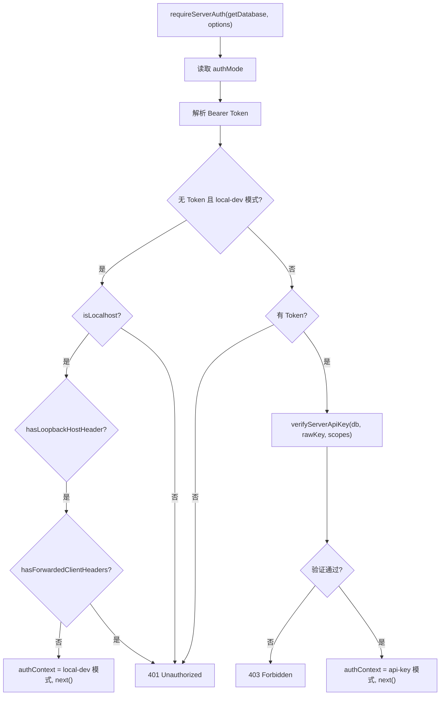

# auth.ts 需求说明

> 源文件：src/server/middleware/auth.ts ｜ 类型：源码 ｜ 行数：126 ｜ 所属模块：server/middleware ｜ 分析日期：2026-07-23

## 1. 文件定位总述

auth.ts 是基于 bun:sqlite 的 Express 认证中间件，为 Server Beta 路由提供 API Key 认证和本地开发绕过能力。它通过 Bearer Token 解析、loopback 检测和 scope 校验三个层级实现安全控制：生产环境强制 API Key 认证，本地开发模式下允许 loopback 请求绕过认证（需多重安全条件）。认证成功后将团队 ID、项目 ID、scope 列表等信息注入 `req.authContext` 供下游路由使用。

## 2. 功能需求

| 编号 | 需求描述（系统应当…） | 触发条件 / 输入 | 处理规则与输出 | 证据 |
|------|----------------------|----------------|---------------|------|
| FR-AUTHMW-01 | 系统应当从请求的 Authorization 头中提取 Bearer Token | 请求到达认证中间件时 | 正则匹配 `^Bearer\s+(.+)$` 提取 token 值 | `auth.ts:84-87` |
| FR-AUTHMW-02 | 系统应当在认证模式为 local-dev 且满足全部安全条件时允许 loopback 请求绕过认证 | authMode='local-dev'，无 API Key，请求来自 loopback IP，Host 头为 loopback，无转发头 | 设置 `req.authContext` 的 mode='local-dev'，scopes=['local-dev']，userId/teamId/projectId/apiKeyId 均为 null | `auth.ts:38-58` |
| FR-AUTHMW-03 | 系统应当在缺少 Bearer Token 时返回 401 错误 | 非绕过场景且 Authorization 头缺失或不含 Bearer Token | 返回 `{error:'Unauthorized', message:'Missing bearer API key'}`，HTTP 401 | `auth.ts:60-63` |
| FR-AUTHMW-04 | 系统应当通过 API Key 服务验证 token，验证失败返回 403 | 提供 Bearer Token 但验证不通过 | 调用 `verifyServerApiKey(db, rawKey, requiredScopes)`，失败返回 403 | `auth.ts:65-69` |
| FR-AUTHMW-05 | 系统应当在认证成功后将认证上下文注入 req.authContext | API Key 验证通过时 | 设置 mode='api-key'，teamId、projectId、scopes、apiKeyId 从验证结果中提取 | `auth.ts:71-80` |

## 3. 业务规则与约束

1. **认证模式优先级**：options.authMode > 环境变量 `CLAUDE_MEM_AUTH_MODE` > 默认值 `'api-key'`（`auth.ts:34`）
2. **本地开发绕过的四重安全条件**：必须同时满足 isLocalhost + hasLoopbackHostHeader + 无转发头 + `CLAUDE_MEM_ALLOW_LOCAL_DEV_BYPASS=1`（`auth.ts:38-46`）
3. **Loopback IP 白名单**：`127.0.0.1`、`::1`、`::ffff:127.0.0.1`、`localhost`（`auth.ts:89-95`）
4. **Loopback Host 头白名单**：`127.0.0.1`、`localhost`、`::1`（`auth.ts:97-102`）
5. **转发头检测**：存在 `forwarded`、`x-forwarded-for`、`x-forwarded-host`、`x-real-ip` 任一头即判定为非本地请求（`auth.ts:118-125`）
6. **scope 通配符**：API Key scopes 包含 `'*'` 时满足所有 scope 要求（`auth.ts:127`，定义在 api-key-service.ts）
7. **Express 类型扩展**：通过 `declare module` 在 Request 接口上添加 `authContext` 可选属性（`auth.ts:17-21`）

## 4. 对外暴露

| 导出项 | 类型 | 说明 |
|--------|------|------|
| `AuthContext` | interface | 认证上下文（userId, organizationId, teamId, projectId, scopes, apiKeyId, mode） |
| `RequireAuthOptions` | interface | 中间件配置（requiredScopes?, authMode?, allowLocalDevBypass?） |
| `requireServerAuth` | function | Express 中间件工厂，接受 getDatabase 回调和配置选项 |

## 5. 依赖关系

- **上游**：`../auth/api-key-service.js`（verifyServerApiKey）、`bun:sqlite`（Database 类型）
- **下游**：被 Server Beta 的 SQLite 存储路由注册为认证中间件

## 6. 数据结构

```typescript
interface AuthContext {
  userId: string | null;
  organizationId: string | null;
  teamId: string | null;
  projectId: string | null;
  scopes: string[];
  apiKeyId: string | null;
  mode: 'api-key' | 'local-dev';
}
```

## 7. 复杂逻辑图示



## 8. 逆向备注

1. 该中间件为 SQLite 后端版本，Postgres 后端有对应的 `postgres-auth.ts` 实现
2. Host 头解析支持 IPv6 方括号格式（`[::1]:port`）（`auth.ts:106-109`）
