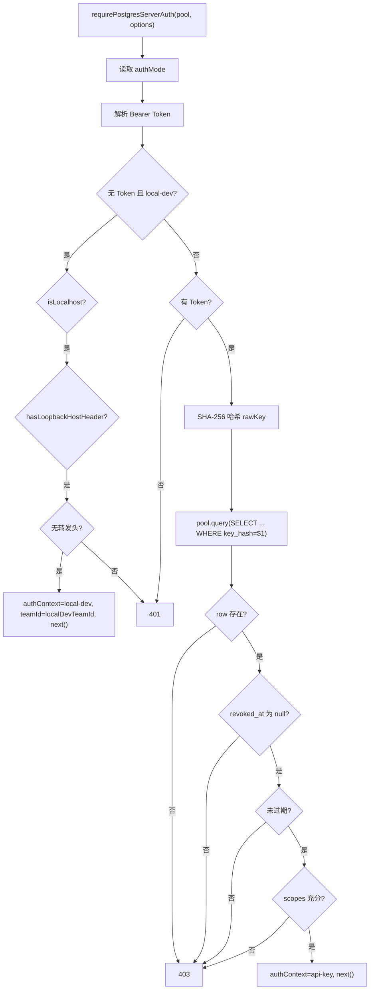

# postgres-auth.ts 需求说明

> 源文件：src/server/middleware/postgres-auth.ts ｜ 类型：源码 ｜ 行数：200 ｜ 所属模块：server/middleware ｜ 分析日期：2026-07-23

## 1. 文件定位总述

postgres-auth.ts 是基于 Postgres 的 Express 认证中间件，是 auth.ts（SQLite 版本）的 Postgres 对等实现。它通过直接查询 Postgres `api_keys` 表验证 API Key，而非委托给 AuthRepository。除了支持与 SQLite 版本相同的 Bearer Token 认证和 loopback 绕过外，还额外支持 `localDevTeamId` 选项，允许本地开发绕过时指定一个默认团队 ID。该中间件为 Phase 4+ 的 Server Beta 路由提供认证，是运行时中唯一依赖 Postgres 的认证路径。

## 2. 功能需求

| 编号 | 需求描述（系统应当…） | 触发条件 / 输入 | 处理规则与输出 | 证据 |
|------|----------------------|----------------|---------------|------|
| FR-PGAUTH-01 | 系统应当从请求的 Authorization 头中提取 Bearer Token | 请求到达认证中间件时 | 正则匹配 `^Bearer\s+(.+)$` 提取 token 值 | `postgres-auth.ts:158-161` |
| FR-PGAUTH-02 | 系统应当在认证模式为 local-dev 且满足全部安全条件时允许 loopback 请求绕过认证，并支持可选的 localDevTeamId | authMode='local-dev'，满足安全条件 | 设置 `req.authContext` 的 mode='local-dev'，teamId 使用 `options.localDevTeamId ?? null` | `postgres-auth.ts:41-61` |
| FR-PGAUTH-03 | 系统应当通过直接查询 Postgres api_keys 表验证 API Key，检查哈希匹配、未吊销、未过期、scope 充分 | 提供 Bearer Token 时 | SHA-256 哈希后查询 `WHERE key_hash = $1`，校验 revoked_at/expires_at/scopes | `postgres-auth.ts:98-142` |
| FR-PGAUTH-04 | 系统应当在缺少 Bearer Token 时返回 401 错误 | 非绕过场景且无 Token | 返回 401 JSON | `postgres-auth.ts:63-66` |
| FR-PGAUTH-05 | 系统应当在验证失败时返回 403 错误 | Token 存在但验证不通过 | 返回 403 JSON | `postgres-auth.ts:69-72` |
| FR-PGAUTH-06 | 系统应当将中间件内部错误传递给 Express 的 next 中间件处理 | 验证过程抛出异常时 | catch 块调用 `next(error)` | `postgres-auth.ts:85-87` |

## 3. 业务规则与约束

1. **认证模式优先级**：options.authMode > 环境变量 `CLAUDE_MEM_AUTH_MODE` > 默认值 `'api-key'`（`postgres-auth.ts:35`）
2. **Postgres 直接查询**：不使用 AuthRepository，直接 `pool.query`（`postgres-auth.ts:104-111`）
3. **本地绕过安全条件**：与 SQLite 版本相同 -- isLocalhost + hasLoopbackHostHeader + 无转发头 + `ALLOW_LOCAL_DEV_BYPASS=1`（`postgres-auth.ts:41-48`）
4. **localDevTeamId 安全警告**：注释明确声明该值仅用于本地开发绕过，绝不能用于生产请求的 scope 判定（`postgres-auth.ts:24-25`）
5. **吊销检测**：`revoked_at IS NOT NULL` 即视为已吊销（`postgres-auth.ts:126`）
6. **过期检测**：`expires_at` 不为 null 且 `<= Date.now()` 即视为过期（`postgres-auth.ts:129`）
7. **scope 规范化**：从 Postgres 读取的 scopes 可能是任意类型，需过滤为 string[]（`postgres-auth.ts:144-149`）
8. **Express 类型扩展**：复用 auth.ts 中定义的 `AuthContext` 接口和 Request 扩展（`postgres-auth.ts:7,17-21`）

## 4. 对外暴露

| 导出项 | 类型 | 说明 |
|--------|------|------|
| `PostgresRequireAuthOptions` | interface | 中间件配置（requiredScopes?, authMode?, allowLocalDevBypass?, localDevTeamId?） |
| `requirePostgresServerAuth` | function | Express 中间件工厂，接受 PostgresPool 和配置选项 |
| `verifyPostgresApiKey` | function | Postgres API Key 验证函数（可独立调用） |

## 5. 依赖关系

- **上游**：`crypto`（createHash）、`../../storage/postgres/pool.js`（PostgresPool）、`../../storage/postgres/auth.js`（PostgresApiKey 类型）、`./auth.js`（AuthContext 接口，共享）
- **下游**：被 Server Beta 的 Postgres 路由（Phase 4+）注册为认证中间件

## 6. 数据结构

```typescript
interface PostgresRequireAuthOptions {
  requiredScopes?: string[];
  authMode?: string;
  allowLocalDevBypass?: boolean;
  localDevTeamId?: string | null;  // 比 SQLite 版本多此选项
}

interface VerifiedPostgresApiKey {
  apiKeyId: string;
  teamId: string | null;
  projectId: string | null;
  scopes: string[];
}
```

## 7. 复杂逻辑图示



## 8. 逆向备注

1. `verifyPostgresApiKey` 作为独立导出函数，可被其他模块直接调用进行 Postgres API Key 验证（`postgres-auth.ts:98-142`）
2. 与 SQLite 版本的辅助函数（parseBearerToken、isLocalhost、hasLoopbackHostHeader、parseHostWithoutPort、hasForwardedClientHeaders）完全重复，推断是 Phase 4 架构隔离要求所致
