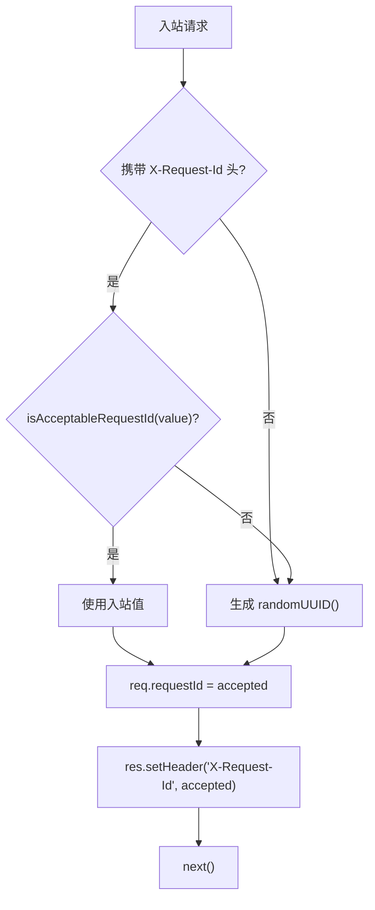

# request-id.ts 需求说明

> 源文件：src/server/middleware/request-id.ts ｜ 类型：源码 ｜ 行数：41 ｜ 所属模块：server/middleware ｜ 分析日期：2026-07-23

## 1. 文件定位总述

request-id.ts 是 Express 请求 ID 中间件，为每个入站 HTTP 请求生成或透传一个唯一标识符。它优先接受上游网关/负载均衡器通过 `X-Request-Id` 头传入的 ID（需符合安全格式校验），否则自动生成 UUID v4。生成的 ID 附加到 `req.requestId` 并通过响应头返回给客户端，供路由处理器、ingest 服务和生成任务在日志中关联原始 HTTP 调用。

## 2. 功能需求

| 编号 | 需求描述（系统应当…） | 触发条件 / 输入 | 处理规则与输出 | 证据 |
|------|----------------------|----------------|---------------|------|
| FR-REQID-01 | 系统应当为每个入站请求分配一个唯一请求 ID 并附加到 req.requestId | Express 中间件层拦截请求 | 优先使用合规的入站 `X-Request-Id` 头，否则生成 UUID v4 | `request-id.ts:27-34` |
| FR-REQID-02 | 系统应当将最终使用的请求 ID 通过 `X-Request-Id` 响应头返回给客户端 | 请求处理前 | `res.setHeader('X-Request-Id', accepted)` | `request-id.ts:31` |
| FR-REQID-03 | 系统应当对入站 `X-Request-Id` 进行格式校验，拒绝不符合规范的值 | 入站请求携带 `X-Request-Id` 头时 | 校验规则：长度 1-64，正则 `^[A-Za-z0-9][A-Za-z0-9\-_]{0,63}$`，不合格则回退到 UUID | `request-id.ts:36-40` |

## 3. 业务规则与约束

1. **纯审计用途**：注释明确声明请求 ID 仅用于日志关联，不得用于认证决策（`request-id.ts:14`）
2. **入站 ID 安全校验**：白名单字符 `[A-Za-z0-9\-_]`，防止注入（`request-id.ts:18`）
3. **最大长度限制**：64 字符（`request-id.ts:17`）
4. **header 名称**：读取和设置均使用 `x-request-id`（不区分大小写）（`request-id.ts:16,31`）
5. **Express 类型扩展**：通过 `declare module` 扩展 Request 接口添加 `requestId` 可选属性（`request-id.ts:20-24`）

## 4. 对外暴露

| 导出项 | 类型 | 说明 |
|--------|------|------|
| `requestIdMiddleware` | function | Express 中间件工厂，返回 RequestHandler |
| `isAcceptableRequestId` | function | 校验字符串是否符合请求 ID 格式要求 |

## 5. 依赖关系

- **上游**：`crypto`（randomUUID）
- **下游**：被 Express 应用注册为全局中间件，后续路由处理器通过 `req.requestId` 使用

## 6. 数据结构

Express Request 扩展：
```typescript
declare module 'express-serve-static-core' {
  interface Request {
    requestId?: string;
  }
}
```

## 7. 复杂逻辑图示



## 8. 逆向备注

注释标记为"Phase 12"，表明该中间件是分阶段架构演进中的产物（`request-id.ts:6`）。
