# BullMqObservationQueueEngine.ts 需求说明

> 源文件：src/server/queue/BullMqObservationQueueEngine.ts ｜ 类型：源码 ｜ 行数：548 ｜ 所属模块：server/queue ｜ 分析日期：2026-07-23

## 1. 文件定位总述

BullMqObservationQueueEngine 是基于 BullMQ + Redis/Valkey 的观察队列引擎实现，充当 `ObservationQueueEngine` 接口的 Redis 后端替代方案。当 `CLAUDE_MEM_QUEUE_ENGINE=bullmq` 时，系统使用本引擎替代默认的 SQLite 内存队列，以支持多进程/多实例水平扩展。该引擎为每个会话（session）创建独立的 BullMQ Queue 和 Worker 对，通过 per-session 隔离实现并发消费；同时通过 Redis Set 维护活跃会话注册表，支持跨进程的会话发现和队列深度统计。该类同时实现 `HealthCheckedObservationQueueEngine` 和 `ObservationQueueInspection` 两个接口，提供健康检查和队列窥视能力。

## 2. 功能需求

| 编号 | 需求描述（系统应当…） | 触发条件 / 输入 | 处理规则与输出 | 证据 |
|------|----------------------|----------------|---------------|------|
| FR-ENQ-01 | 系统应当将待处理的观察消息入队到指定会话的 BullMQ 队列，并返回自增入队 ID | 调用 `enqueue(sessionDbId, contentSessionId, message)` | 根据 sessionDbId 获取或创建对应的 Queue 实例，基于 contentSessionId、message 内容和当前时间戳生成幂等 jobId（SHA-256 哈希），若同 ID 已存在且处于非终态则返回 0（跳过重复），若存在终态 job 则先删除再入队。入队时设置 attempts=1000000、removeOnComplete=true、removeOnFail 保留 24h 最多 1000 条。入队后触发该 session 的 'message' 事件通知消费端。 | `src/server/queue/BullMqObservationQueueEngine.ts:94-132` |
| FR-ITR-01 | 系统应当为指定会话创建异步迭代器，以轮询 + 事件驱动混合模式消费队列中的待处理消息 | 调用 `createIterator(options)` | 使用 `worker.getNextJob(token, { block: false })` 非阻塞获取下一个 job。获取到 job 后将其标记为 claimed（记录 claimId、job、token），启动锁续约定时器，yield 出消息体及持久化 ID。无 job 时通过 EventEmitter 等待 'message' 事件（默认间隔 250ms），超时后检查空闲超时（默认 3 分钟）并回调 `onIdleTimeout` 后退出迭代。迭代器在整个生命周期内受 AbortSignal 控制。 | `src/server/queue/BullMqObservationQueueEngine.ts:134-181` |
| FR-CFM-01 | 系统应当将已认领并处理完毕的 job 标记为完成状态 | 调用 `confirmProcessed(messageId)` | 根据 claimId 从 activeClaims 中查找对应 job，调用 `job.moveToCompleted` 将其标记完成，清除锁续约定时器并移除 claim 记录，随后检查该 session 队列是否为空以决定是否注销会话。返回 1 表示成功，0 表示未找到对应 claim。 | `src/server/queue/BullMqObservationQueueEngine.ts:183-198` |
| FR-CLR-01 | 系统应当清空指定会话队列中的所有待处理消息，包括已认领但未完成的 job | 调用 `clearPendingForSession(sessionDbId)` | 对该 session 的 Queue 执行 `obliterate({ force: true })` 强制清除，同时遍历 activeClaims 清除属于该 session 的所有认领。返回被清除的 job 数量。 | `src/server/queue/BullMqObservationQueueEngine.ts:200-219` |
| FR-RST-01 | 系统应当将指定会话中已处于活跃处理状态（已认领但未完成）的 job 重置为等待状态 | 调用 `resetProcessingToPending(sessionDbId)` | 遍历 activeClaims，对匹配 sessionDbId 的 claimed job 调用 `moveToWait` 将其从 active 状态回退到 waiting 状态，清除锁续约定时器并移除 claim。若部分 job 重置失败，记录警告日志但继续处理剩余 job，最后若有错误则抛出。 | `src/server/queue/BullMqObservationQueueEngine.ts:221-251` |
| FR-PCNT-01 | 系统应当返回指定会话队列中所有非终态 job 的数量 | 调用 `getPendingCount(sessionDbId)` | 查询该 session Queue 的 waiting、active、delayed、prioritized、waiting-children 五种状态的 job 计数并求和返回。 | `src/server/queue/BullMqObservationQueueEngine.ts:253-256` |
| FR-TDEP-01 | 系统应当返回所有已注册会话及内存中已知会话的队列深度总和 | 调用 `getTotalQueueDepth()` | 合并 Redis 注册表中的会话 ID 和内存 sessions Map 中的会话 ID，逐一查询每个 session 的 pendingCount 并累加。 | `src/server/queue/BullMqObservationQueueEngine.ts:258-268` |
| FR-PEEK-01 | 系统应当返回指定会话队列中待处理 job 的类型和工具名称摘要 | 调用 `peekPendingTypes(sessionDbId)` | 获取该 session 队列所有非终态 job（按优先级排序），返回每个 job 的 message_type 和 tool_name 列表。 | `src/server/queue/BullMqObservationQueueEngine.ts:270-276` |
| FR-HLT-01 | 系统应当检查 Redis/Valkey 连接的健康状态 | 调用 `getHealth()` | 建立健康检查专用 Redis 连接，若连接处于 wait 或 end 状态则重新 connect，执行 ping 操作。返回包含引擎名称、Redis 模式、主机、端口、前缀及 ok/error 状态的结构化健康信息。 | `src/server/queue/BullMqObservationQueueEngine.ts:278-308` |
| FR-AHL-01 | 系统应当在 Redis 不健康时抛出明确的错误信息，告知所需 Redis 地址 | 调用 `assertHealthy()` | 调用 `getHealth()` 检查，若 Redis 状态非 'ok' 则抛出包含 Redis 地址和错误详情的 Error。 | `src/server/queue/BullMqObservationQueueEngine.ts:310-317` |
| FR-CLS-01 | 系统应当在关闭时安全释放所有资源：将活跃认领回退到等待状态，关闭所有 Queue 和 Worker，关闭健康检查 Redis 连接，清理内存状态 | 调用 `close()` | 先尝试将所有 activeClaims 回退到 wait 状态（即使失败也继续清理），然后逐个清除 EventEmitter 监听器、关闭 Worker 和 Queue（关闭失败仅记警告），清除 sessions Map，最后关闭 healthClient。 | `src/server/queue/BullMqObservationQueueEngine.ts:319-352` |
| FR-SJID-01 | 系统应当为每条入队消息生成确定性、幂等的 jobId | 入队操作内部调用 `getSafeJobId()` | observation 类型消息：若含 toolUseId 则基于 `contentSessionId + toolUseId` 的 SHA-256 生成 `obs_` 前缀 ID；否则基于 contentSessionId + 时间戳 + 消息指纹生成。其他类型基于 contentSessionId + 时间戳 + 消息类型的 SHA-256 生成 `sum_` 前缀 ID。 | `src/server/queue/BullMqObservationQueueEngine.ts:518-526` |
| FR-LOCK-01 | 系统应当为已认领的 job 持续续约锁，防止长时间处理导致锁过期 | job 被认领后 | 启动定时器，间隔为 `max(1000ms, lockDurationMs/2)`（默认 150s），每次调用 `job.extendLock(token, lockDurationMs)`。续约失败仅记警告日志不中断处理。 | `src/server/queue/BullMqObservationQueueEngine.ts:430-443` |

## 3. 业务规则与约束

| 编号 | 规则描述 | 证据 |
|------|---------|------|
| BR-01 | **幂等入队**：同一 contentSessionId + toolUseId（observation 类型）或 contentSessionId + 时间戳 + 消息指纹产生的 jobId 具有确定性，重复入队不会创建重复 job。已存在的非终态 job 直接跳过（返回 0）。 | `src/server/queue/BullMqObservationQueueEngine.ts:106-109` |
| BR-02 | **超大规模重试**：BullMQ job 的 attempts 被设置为 1,000,000，意味着 job 失败后由 BullMQ 自身机制进行大量重试，而非依赖应用层重试控制。 | `src/server/queue/BullMqObservationQueueEngine.ts:121` |
| BR-03 | **失败 job 自动清理**：完成态 job 立即移除；失败态 job 保留 24 小时且最多保留 1000 条后自动清除。 | `src/server/queue/BullMqObservationQueueEngine.ts:122-123` |
| BR-04 | **per-session 隔离**：每个 sessionDbId 拥有独立的 BullMQ Queue（命名 `claude_mem_session_{sessionDbId}`）和 Worker，Worker 设置 `concurrency: 1` 和 `autorun: false`，确保同一会话串行处理。 | `src/server/queue/BullMqObservationQueueEngine.ts:360-371` |
| BR-05 | **默认锁时长 5 分钟**，轮询间隔 250ms，空闲超时 3 分钟。 | `src/server/queue/BullMqObservationQueueEngine.ts:72-73` |
| BR-06 | **Redis 不可用统一处理**：所有 Redis 操作失败统一转换为包含 `BullMQ queue operation failed; Redis/Valkey is required when CLAUDE_MEM_QUEUE_ENGINE=bullmq` 前缀的错误消息。 | `src/server/queue/BullMqObservationQueueEngine.ts:512-515` |
| BR-07 | **会话注册表**：使用 Redis Set（key 为 `{prefix}:queue_registry:sessions`）维护活跃会话 ID，入队时注册，队列为空时注销。用于跨进程的队列深度统计。 | `src/server/queue/BullMqObservationQueueEngine.ts:91, 394-423` |
| BR-08 | **Token 格式**：claim token 格式为 `claude-mem-{pid}-{sessionDbId}-{timestamp}-{random}`，确保唯一性。 | `src/server/queue/BullMqObservationQueueEngine.ts:508-510` |
| BR-09 | **依赖注入**：Queue、Worker、Redis 客户端均可通过构造选项的工厂方法注入，便于测试和定制。 | `src/server/queue/BullMqObservationQueueEngine.ts:48-56` |

## 4. 对外暴露

| 类型 | 名称 | 说明 |
|------|------|------|
| 类 | `BullMqObservationQueueEngine` | 实现 `HealthCheckedObservationQueueEngine` 和 `ObservationQueueInspection` 接口，主入口类 |
| 接口 | `BullMqObservationQueueEngineOptions` | 构造选项：config、queueFactory、workerFactory、redisFactory、onMutate、lockDurationMs、pollIntervalMs |
| 函数 | `getSafeJobId(contentSessionId, message, createdAtEpoch)` | 导出的 jobId 生成函数，供外部复用 |

## 5. 依赖关系

| 方向 | 依赖项 | 说明 |
|------|--------|------|
| 上游（接口） | `ObservationQueueEngine` | 定义核心队列操作接口 |
| 上游（接口） | `ObservationQueueInspection` | 定义队列窥视接口 |
| 上游（接口） | `HealthCheckedObservationQueueEngine` | 定义健康检查接口 |
| 上游（类型） | `PendingMessage`, `PendingMessageWithId` | 消息类型定义 |
| 上游（类型） | `CreateIteratorOptions` | 迭代器选项 |
| 外部库 | `bullmq` | Queue, Worker, Job 等核心类型 |
| 外部库 | `ioredis` | Redis 客户端 |
| 内部 | `redis-config.ts` | Redis 连接配置获取 |
| 内部 | `logger.ts` | 日志工具 |

## 6. 数据结构

### BullMqPendingPayload（BullMQ Job 载荷）

| 字段 | 类型 | 说明 |
|------|------|------|
| sessionDbId | number | 所属会话的数据库 ID |
| contentSessionId | string | 内容会话唯一标识 |
| createdAtEpoch | number | 创建时间戳（毫秒） |
| message | PendingMessage | 待处理的观察/摘要消息体 |

### SessionRuntime（per-session 运行时）

| 字段 | 类型 | 说明 |
|------|------|------|
| queue | BullMqQueue | 该 session 的 BullMQ 队列实例 |
| worker | BullMqWorker | 该 session 的 BullMQ Worker 实例 |
| events | EventEmitter | 该 session 的事件发射器，用于通知新消息到达 |

### ClaimedJob（已认领 job 记录）

| 字段 | 类型 | 说明 |
|------|------|------|
| sessionDbId | number | 所属会话 ID |
| job | BullMqJob | BullMQ Job 引用 |
| token | string | 认领令牌 |
| lockTimer | ReturnType\<setInterval\> \| null | 锁续约定时器句柄 |

## 7. 复杂逻辑图示

```mermaid
flowchart TB
    subgraph "入队流程"
        A["enqueue(sessionDbId, message)"] --> B["getSessionRuntime"]
        B --> C["registerSession (Redis SADD)"]
        C --> D["getSafeJobId (SHA-256)"]
        D --> E{"已有同名 Job?"}
        E -->|"存在且非终态"| F["返回 0 (跳过)"]
        E -->|"存在且终态"| G["remove 后重新入队"]
        E -->|"不存在"| G
        G --> H["queue.add(payload, options)"]
        H --> I["events.emit('message')"]
        I --> J["返回 nextEnqueueId++"]
    end

    subgraph "消费流程"
        K["createIterator(options)"] --> L["worker.getNextJob (block:false)"]
        L -->|"获取到 Job"| M["创建 ClaimedJob"]
        M --> N["startLockRenewal (定时续约)"]
        N --> O["yield PendingMessageWithId"]
        O --> L
        L -->|"无 Job"| P["waitForMessage (事件/超时)"]
        P -->|"收到 message 事件"| L
        P -->|"超时"| Q{"空闲超时?"}
        Q -->|"是"| R["onIdleTimeout() 并退出"]
        Q -->|"否"| P
    end

    subgraph "确认流程"
        S["confirmProcessed(messageId)"] --> T["查找 ClaimedJob"]
        T -->|"找到"| U["moveToCompleted"]
        U --> V["finishClaim (清除定时器)"]
        V --> W["unregisterSessionIfEmpty"]
        W --> X["返回 1"]
        T -->|"未找到"| Y["返回 0"]
    end
```

上图展示了引擎三个核心流程。入队流程通过 SHA-256 哈希保证幂等性，消费流程采用轮询与事件驱动混合模式，确认流程将 job 移至完成态并释放锁续约资源。

## 8. 逆向备注

1. `attempts: 1000000`（第 121 行）是一个极值设置，推断意图是让 BullMQ 的内置重试机制"永不真正耗尽"，实际的重试控制由上游的 `markGenerationFailed` 等逻辑通过状态转换来管理。
2. `BullMqQueue` 和 `BullMqWorker` 类型是通过对原始 BullMQ 类型的 `Pick` 截取的子集，推断目的是限制引擎对 BullMQ API 的使用范围，便于测试时用 mock 替代。
3. 消息指纹函数 `stableMessageFingerprint`（第 528-539 行）仅选取了消息的部分字段（type, tool_name, tool_input, tool_response, cwd, prompt_number, agentId, agentType），排除了 `last_assistant_message` 等字段，推断这是有意为之以在内容相似时仍然识别为同一条消息。
4. 健康检查使用独立的 Redis 客户端而非复用 Queue/Worker 的连接，推断是为了避免健康检查与业务操作的连接状态互相影响。
