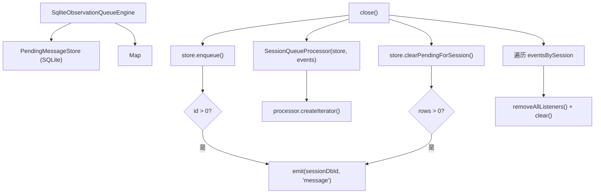

# ObservationQueueEngine.ts 需求说明

> 源文件：src/server/queue/ObservationQueueEngine.ts ｜ 类型：源码 ｜ 行数：133 ｜ 所属模块：server/queue ｜ 分析日期：2026-07-23

## 1. 文件定位总述

ObservationQueueEngine.ts 定义了观察队列引擎的接口及其 SQLite 实现。队列引擎负责管理待处理的 AI 观察生成消息的生命周期：入队、迭代消费、确认处理、清除、重置状态等。SQLite 实现基于 `PendingMessageStore` 持久化，使用 per-session 的 EventEmitter 实现消息到达通知机制。该文件还定义了队列健康检查和检查（inspection）的扩展接口，支持 per-lane 指标采集。

## 2. 功能需求

| 编号 | 需求描述（系统应当…） | 触发条件 / 输入 | 处理规则与输出 | 证据 |
|------|----------------------|----------------|---------------|------|
| FR-OQE-01 | 系统应当能将待处理消息入队，并在入队成功后触发 session 级事件通知 | 调用 `enqueue(sessionDbId, contentSessionId, message)` | 通过 PendingMessageStore 持久化，成功后 emit('message')，返回消息 ID | `ObservationQueueEngine.ts:68-74` |
| FR-OQE-02 | 系统应当能为指定 session 创建异步迭代器，用于顺序消费待处理消息 | 调用 `createIterator(options)` | 委托 SessionQueueProcessor 创建 AsyncIterableIterator | `ObservationQueueEngine.ts:76-79` |
| FR-OQE-03 | 系统应当能确认消息已处理完毕 | 调用 `confirmProcessed(messageId)` | 委托 PendingMessageStore 更新状态，返回受影响行数 | `ObservationQueueEngine.ts:81-83` |
| FR-OQE-04 | 系统应当能清除指定 session 的所有待处理消息 | 调用 `clearPendingForSession(sessionDbId)` | 清除后触发 session 事件通知，返回清除行数 | `ObservationQueueEngine.ts:85-91` |
| FR-OQE-05 | 系统应当能将处理中的消息重置为待处理状态（用于重试） | 调用 `resetProcessingToPending(sessionDbId)` | 重置后触发事件通知，返回受影响行数 | `ObservationQueueEngine.ts:93-99` |
| FR-OQE-06 | 系统应当能查询指定 session 的待处理消息数量和全局队列深度 | 调用 `getPendingCount(sessionDbId)` 或 `getTotalQueueDepth()` | 委托 PendingMessageStore 查询 | `ObservationQueueEngine.ts:101-107` |
| FR-OQE-07 | 系统应当能窥视指定 session 的待处理消息类型和工具名称（用于检查） | 调用 `peekPendingTypes(sessionDbId)` | 返回 `Array<{message_type, tool_name}>` | `ObservationQueueEngine.ts:109-111` |
| FR-OQE-08 | 系统应当在关闭时清理所有 session 的事件监听器 | 调用 `close()` | 遍历 eventsBySession Map，调用 removeAllListeners 后清空 Map | `ObservationQueueEngine.ts:113-118` |

## 3. 业务规则与约束

1. **事件通知范围**：仅 per-session 级别，不同 session 的消息到达不会互相干扰（`ObservationQueueEngine.ts:62`）
2. **入队通知条件**：仅在 id > 0 时触发事件（`ObservationQueueEngine.ts:70`）
3. **清除/重置通知条件**：仅在受影响行数 > 0 时触发事件（`ObservationQueueEngine.ts:87,95`）
4. **接口分层**：基础接口 `ObservationQueueEngine` → 扩展 `InspectableObservationQueueEngine`（+peek） → 扩展 `HealthCheckedObservationQueueEngine`（+health+assert），逐步增强（`ObservationQueueEngine.ts:54-58`）
5. **健康检查 lane 指标**：`unavailable: true` 表示采样时 Redis 不可达，健康端点不应因此 503（`ObservationQueueEngine.ts:22-24`）

## 4. 对外暴露

| 导出项 | 类型 | 说明 |
|--------|------|------|
| `ObservationQueueEngine` | interface | 队列引擎基础接口（7 个方法） |
| `ObservationQueueHealthLaneSnapshot` | interface | per-lane 队列指标快照 |
| `ObservationQueueHealth` | interface | 队列健康状态（含 Redis 信息和 lane 列表） |
| `ObservationQueueInspection` | interface | 队列检查接口（peekPendingTypes） |
| `InspectableObservationQueueEngine` | type | 基础接口 + 检查接口 |
| `HealthCheckedObservationQueueEngine` | type | 检查接口 + 健康检查接口 |
| `SqliteObservationQueueEngine` | class | SQLite 实现类 |

## 5. 依赖关系

- **上游**：`events`（EventEmitter）、`bun:sqlite`（Database）、`../../services/queue/SessionQueueProcessor.js`、`../../services/sqlite/PendingMessageStore.js`、`../../services/worker-types.js`（PendingMessage 类型）
- **下游**：被 Server Beta 的创建脚本实例化，供 ingest 服务和生成工作器使用

## 6. 数据结构

```typescript
interface ObservationQueueHealthLaneSnapshot {
  kind: string;
  name: string;
  waiting: number;
  active: number;
  completed: number;
  failed: number;
  delayed: number;
  stalled: number;
  unavailable: boolean;
  unavailableReason?: string;
}
```

## 7. 复杂逻辑图示



## 8. 逆向备注

无特殊备注。
