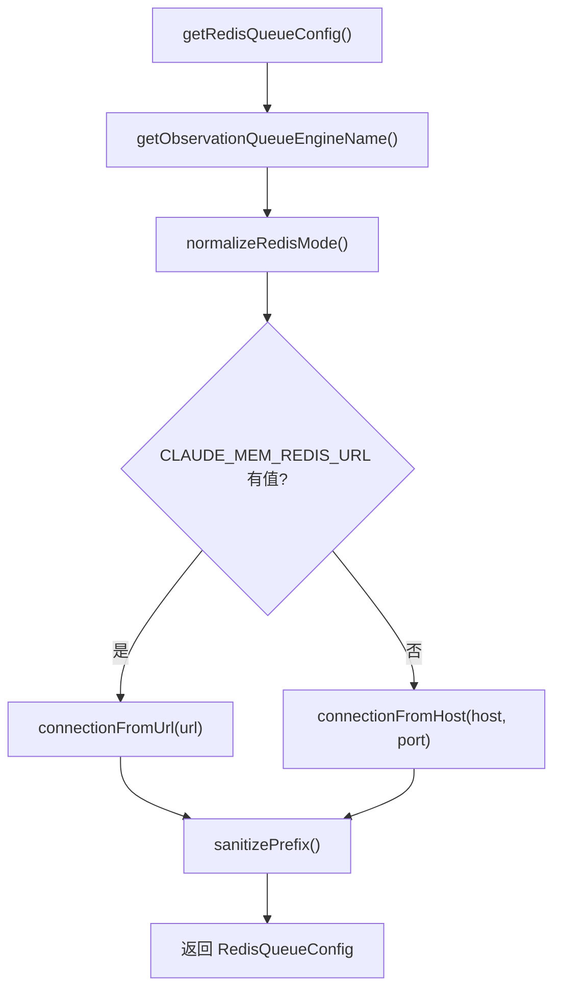

# redis-config.ts 需求说明

> 源文件：src/server/queue/redis-config.ts ｜ 类型：源码 ｜ 行数：121 ｜ 所属模块：server/queue ｜ 分析日期：2026-07-23

## 1. 文件定位总述

redis-config.ts 是 Server Beta 队列引擎的配置模块，负责从环境变量和用户配置文件中读取并解析 Redis/BullMQ 的连接参数。它支持两种队列引擎（sqlite/bullmq）和三种 Redis 模式（external/managed/docker），提供 URL 连接和 Host:Port 连接两种方式。所有配置项均有默认值、类型校验和合理的安全约束，确保队列引擎的配置过程可预测且不易出错。

## 2. 功能需求

| 编号 | 需求描述（系统应当…） | 触发条件 / 输入 | 处理规则与输出 | 证据 |
|------|----------------------|----------------|---------------|------|
| FR-REDIS-01 | 系统应当能读取并校验队列引擎名称，仅接受 `sqlite` 或 `bullmq` | 调用 `getObservationQueueEngineName()` | 从环境变量或配置文件读取 `CLAUDE_MEM_QUEUE_ENGINE`，非法值抛出 Error | `redis-config.ts:22-28` |
| FR-REDIS-02 | 系统应当能构建完整的 Redis 队列配置对象，包含引擎、模式、连接参数和 key 前缀 | 调用 `getRedisQueueConfig()` | 返回 `RedisQueueConfig` 对象，包含 engine、mode、url、host、port、prefix、connection | `redis-config.ts:30-48` |
| FR-REDIS-03 | 系统应当支持通过 URL 方式配置 Redis 连接，解析 redis:// 和 rediss:// 协议 | CLAUDE_MEM_REDIS_URL 有值时 | 解析 hostname、port、username、password、db、tls(rediss)，构建 RedisOptions | `redis-config.ts:90-112` |
| FR-REDIS-04 | 系统应当对 Redis key 前缀进行安全过滤，仅保留字母、数字、下划线和连字符 | 读取 CLAUDE_MEM_QUEUE_REDIS_PREFIX 时 | 正则 `[^a-zA-Z0-9_-]` 替换为 `_`，空值默认为 `'claude_mem'` | `redis-config.ts:76-78` |

## 3. 业务规则与约束

1. **配置优先级**：环境变量 > 用户配置文件（`USER_SETTINGS_PATH`）> 系统默认值（`redis-config.ts:50-58`）
2. **队列引擎限定**：仅 `sqlite` 和 `bullmq` 两种（`redis-config.ts:24-25`）
3. **Redis 模式限定**：仅 `external`、`managed`、`docker` 三种（`redis-config.ts:60-66`）
4. **端口校验**：必须为 1-65535 之间的整数（`redis-config.ts:68-74`）
5. **URL 协议限定**：仅 `redis://` 和 `rediss://`（`redis-config.ts:92-93`）
6. **Redis 数据库编号**：URL 路径中的 db 必须为非负整数（`redis-config.ts:95-99`）
7. **连接默认参数**：`maxRetriesPerRequest: null`（禁用 BullMQ 内置重试）、`connectTimeout: 1000ms`、`lazyConnect: true`（`redis-config.ts:81-88`）
8. **rediss 自动启用 TLS**：协议为 `rediss://` 时 `tls: {}`（`redis-config.ts:107`）

## 4. 对外暴露

| 导出项 | 类型 | 说明 |
|--------|------|------|
| `ObservationQueueEngineName` | type | `'sqlite' \| 'bullmq'` |
| `RedisMode` | type | `'external' \| 'managed' \| 'docker'` |
| `RedisQueueConfig` | interface | 完整的 Redis 队列配置 |
| `getObservationQueueEngineName` | function | 读取并校验队列引擎名称 |
| `getRedisQueueConfig` | function | 构建完整的 Redis 队列配置 |

## 5. 依赖关系

- **上游**：`ioredis`（RedisOptions 类型）、`fs`（existsSync）、`../../shared/SettingsDefaultsManager.js`（配置读取）、`../../shared/paths.js`（USER_SETTINGS_PATH）
- **下游**：被 ActiveServerBetaQueueManager 和队列引擎消费，获取 Redis 连接配置

## 6. 数据结构

```typescript
interface RedisQueueConfig {
  engine: 'sqlite' | 'bullmq';
  mode: 'external' | 'managed' | 'docker';
  url: string | null;
  host: string;
  port: number;
  prefix: string;
  connection: RedisOptions;
}
```

## 7. 复杂逻辑图示



## 8. 逆向备注

无特殊备注。
