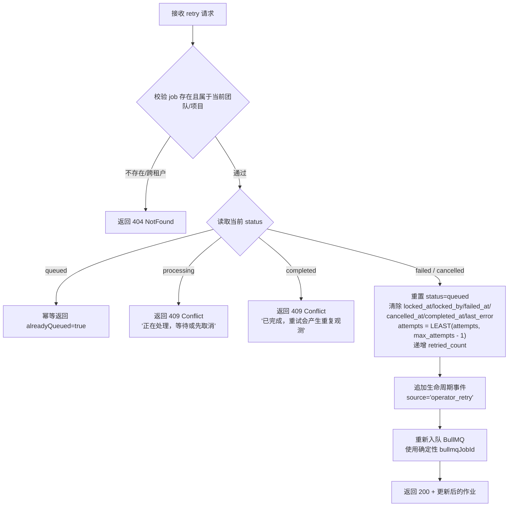
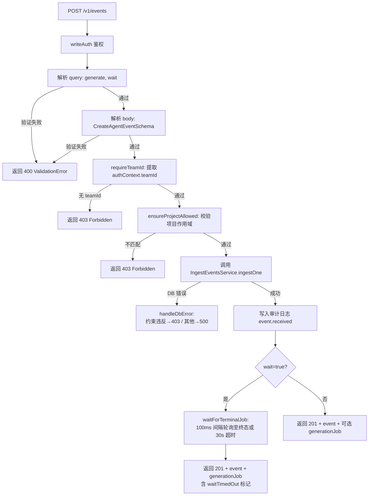

# ServerV1PostgresRoutes.ts 需求说明

> 源文件：src/server/routes/v1/ServerV1PostgresRoutes.ts ｜ 类型：源码 ｜ 行数：1803 ｜ 所属模块：server/routes ｜ 分析日期：2026-07-23

## 1. 文件定位总述

ServerV1PostgresRoutes 是 Claude-mem 多租户 Postgres 服务器的 V1 REST API 路由核心定义层。该文件实现 `RouteHandler` 接口，在 Express 应用上注册 `/v1` 前缀的全部 HTTP 端点，覆盖 Agent 事件摄入（单条/批量）、事件查询、事件关联观测查询、生成作业生命周期管理（列表/详情/重试/取消）、服务器会话管理（创建/查询/结束）、手动记忆插入、全文搜索及上下文打包等能力。

该文件位于调用链的"路由编排层"：上游由 Express 服务器调用 `setupRoutes(app)` 挂载路由；下游委托 `IngestEventsService`（事件摄入）、`EndSessionService`（会话结束）完成核心业务逻辑，并直接操作 `PostgresPool` 执行原生 SQL 进行租户隔离查询和作业状态变更。所有端点均经过 `requirePostgresServerAuth` 中间件做 API Key 鉴权，并通过 `requestIdMiddleware` 注入请求关联 ID。每个读写操作均写入审计日志。跨租户请求统一返回 404 以避免泄露租户存在性。

## 2. 功能需求

### 2.1 请求级基础设施

| 编号 | 需求描述（系统应当…） | 触发条件 / 输入 | 处理规则与输出 | 证据 |
|------|----------------------|----------------|---------------|------|
| FR-INFRA-01 | 系统应当在所有 `/v1` 路由之前注入请求 ID 中间件，为每个 HTTP 请求生成稳定关联 ID | 任意 `/v1` 前缀请求 | `requestIdMiddleware` 挂载于 `/v1` 路径，支持外部 `X-Request-Id` 头透传，中间件幂等 | `src/server/routes/v1/ServerV1PostgresRoutes.ts:139` |
| FR-INFRA-02 | 系统应当为写入操作和读取操作分别建立鉴权中间件实例，区分 `memories:write` 与 `memories:read` 作用域 | 路由注册阶段 | `writeAuth` 要求 `memories:write` 作用域；`readAuth` 要求 `memories:read` 作用域；均支持本地开发旁路 | `src/server/routes/v1/ServerV1PostgresRoutes.ts:140-149` |

### 2.2 事件摄入

| 编号 | 需求描述（系统应当…） | 触发条件 / 输入 | 处理规则与输出 | 证据 |
|------|----------------------|----------------|---------------|------|
| FR-EVT-01 | 系统应当接受单条 Agent 事件 POST 请求，验证请求体后持久化事件并可选地触发异步观测生成 | POST `/v1/events`；Body 需符合 `CreateAgentEventSchema`；Query 参数 `generate`（默认 true）和 `wait`（默认 false） | 1) 解析并验证 query 与 body；2) 校验 teamId 与 projectId 权限；3) 调用 `IngestEventsService.ingestOne` 持久化事件并创建 outbox 行；4) 写入审计日志；5) 若 `wait=true` 则轮询 outbox 行至终态；6) 返回 201 + 事件与可选的生成作业信息 | `src/server/routes/v1/ServerV1PostgresRoutes.ts:152-223` |
| FR-EVT-02 | 系统应当接受批量事件 POST 请求（1~500 条），对整批进行预校验后原子插入 | POST `/v1/events/batch`；Body 为 `CreateAgentEventSchema[]`（长度 1~500）；同上的 query 参数 | 1) 解析并验证 query 与 body；2) 调用 `preValidateBatch` 校验 API Key 项目作用域与事件列表一致性；3) 调用 `IngestEventsService.ingestBatch` 批量写入；4) `sourceAdapter` 传入 null 以保留每条事件的独立适配器标识；5) 写入审计日志；6) 若 `wait=true` 则逐条轮询并在总超时窗口内分摊剩余时间；7) 返回 201 + 事件数组与可选的生成作业数组 | `src/server/routes/v1/ServerV1PostgresRoutes.ts:226-314` |
| FR-EVT-03 | 系统应当在单条和批量摄入时支持 `?generate=false` 参数以跳过异步观测生成 | 请求 query 中 `generate=false` | 默认 generate 为 true；仅当显式传入 `generate=false` 时跳过 outbox 创建 | `src/server/routes/v1/ServerV1PostgresRoutes.ts:158,232` |
| FR-EVT-04 | 系统应当在 `?wait=true` 时同步等待生成作业到达终态，并在超时（30 秒）时标记 `waitTimedOut` | 请求 query 中 `wait=true` | 轮询间隔 100ms，总超时 30 秒，终态包括 `completed/failed/cancelled`；批量模式下所有作业共享同一截止时间窗口 | `src/server/routes/v1/ServerV1PostgresRoutes.ts:61-96,200-215,279-303` |

### 2.3 事件查询

| 编号 | 需求描述（系统应当…） | 触发条件 / 输入 | 处理规则与输出 | 证据 |
|------|----------------------|----------------|---------------|------|
| FR-EVTQRY-01 | 系统应当支持按事件 ID 查询单条事件详情，强制租户与项目作用域隔离 | GET `/v1/events/:id`；需 `memories:read` 鉴权 | 1) 先按 `id + team_id` 原生 SQL 查询 agent_events 表；2) 校验项目作用域；3) 通过 repo 获取完整事件对象；4) 跨租户/跨项目返回 404 | `src/server/routes/v1/ServerV1PostgresRoutes.ts:317-359` |
| FR-EVTQRY-02 | 系统应当支持查询指定事件关联的所有观测（通过 `observation_sources` 关联表），强制租户隔离 | GET `/v1/events/:id/observations`；需 `memories:read` 鉴权 | 1) 先验证事件存在且属于当前租户；2) 通过 JOIN `observation_sources` + `observations` 查询关联观测，WHERE 条件包含 `source_type='agent_event'` + `team_id` + `project_id`；3) 按 `created_at ASC` 排序；4) 写入审计日志；5) 跨租户返回 404 | `src/server/routes/v1/ServerV1PostgresRoutes.ts:365-408` |

### 2.4 生成作业管理

| 编号 | 需求描述（系统应当…） | 触发条件 / 输入 | 处理规则与输出 | 证据 |
|------|----------------------|----------------|---------------|------|
| FR-JOB-01 | 系统应当支持按团队维度列出生成作业，支持状态过滤与分页 | GET `/v1/teams/:teamId/jobs`；支持 query 参数 `status`、`limit`（默认 50，最大 200）、`offset`（默认 0） | 1) 验证 `targetTeamId === callerTeamId`，否则返回 404；2) 项目级 API Key 仅看到本项目作业，团队级 Key 看到全团队作业；3) SQL 层 WHERE 子句强制 `team_id` 过滤；4) 返回 `{ jobs, total, limit, offset }` | `src/server/routes/v1/ServerV1PostgresRoutes.ts:415-456` |
| FR-JOB-02 | 系统应当支持按项目维度列出生成作业 | GET `/v1/projects/:projectId/jobs`；支持同上 query 参数 | 1) 验证项目属于当前团队；2) 项目级 Key 必须匹配请求的项目 ID；3) SQL 层 WHERE 子句强制 `team_id + project_id` 过滤 | `src/server/routes/v1/ServerV1PostgresRoutes.ts:462-515` |
| FR-JOB-03 | 系统应当提供通用作业列表端点，支持更丰富的过滤条件（状态、来源类型、起始时间），并默认屏蔽敏感 payload 字段 | GET `/v1/jobs`；支持 query 参数 `status`、`source_type`、`limit`、`offset`、`since`（ISO 时间戳）、`include`（逗号分隔，含 `payload` 时需 admin 权限） | 1) `include=payload` 需 admin 作用域，否则返回 403；2) 项目级 Key 见本项目，团队级 Key 见全团队；3) `source_type` 白名单：`agent_event`、`session_summary`、`observation_reindex`；4) SQL 层 WHERE 子句包含所有过滤条件；5) payload 列默认不返回 | `src/server/routes/v1/ServerV1PostgresRoutes.ts:523-576` |
| FR-JOB-04 | 系统应当支持按 ID 查询单条生成作业详情 | GET `/v1/jobs/:id`；需 `memories:read` 鉴权 | 按 `id + team_id` 原生 SQL 查询后校验项目作用域，跨租户/跨项目返回 404 | `src/server/routes/v1/ServerV1PostgresRoutes.ts:579-607` |
| FR-JOB-05 | 系统应当支持操作员重试失败的/已取消的生成作业，且幂等安全 | POST `/v1/jobs/:id/retry`；需 `memories:write` 鉴权 | 状态机规则：`queued` → 幂等返回（alreadyQueued=true）；`processing` → 409 Conflict；`completed` → 409 Conflict（防重复观测）；`failed/cancelled` → 重置为 `queued`，清除锁与生命周期时间戳，递增 `retried_count` 元数据，重新入队 BullMQ，追加生命周期事件 | `src/server/routes/v1/ServerV1PostgresRoutes.ts:616-628,1130-1302` |
| FR-JOB-06 | 系统应当支持操作员取消生成作业，且幂等安全 | POST `/v1/jobs/:id/cancel`；需 `memories:write` 鉴权 | 状态机规则：`cancelled` → 幂等返回（alreadyCancelled=true）；`completed` → 409 Conflict；其他状态 → 设置 `cancelled`，记录 `cancelled_at`，追加生命周期事件，尽力移除 BullMQ 队列中的作业 | `src/server/routes/v1/ServerV1PostgresRoutes.ts:635-646,1309-1410` |

### 2.5 服务器会话管理

| 编号 | 需求描述（系统应当…） | 触发条件 / 输入 | 处理规则与输出 | 证据 |
|------|----------------------|----------------|---------------|------|
| FR-SES-01 | 系统应当支持创建或查找服务器会话，基于 `(project_id, external_session_id)` 幂等 | POST `/v1/sessions/start`；Body 含 `projectId`（必填）、`externalSessionId`（可选）及其他可选字段 | 1) 若有 `externalSessionId` 则先查询已存在的会话，找到则返回 200；2) 未找到则创建新会话并返回 201；3) 并发竞态时捕获唯一约束违反（Postgres 23505）后重新查询返回已有行 | `src/server/routes/v1/ServerV1PostgresRoutes.ts:651-718` |
| FR-SES-02 | 系统应当支持按 ID 查询会话详情 | GET `/v1/sessions/:id`；需 `memories:read` 鉴权 | 按 `id + team_id` 原生 SQL 查询后校验项目作用域 | `src/server/routes/v1/ServerV1PostgresRoutes.ts:721-742` |
| FR-SES-03 | 系统应当支持结束会话（设置 `ended_at`），并自动创建会话摘要生成作业 | POST `/v1/sessions/:id/end`；需 `memories:write` 鉴权 | 1) 校验会话存在与作用域；2) 调用 `EndSessionService.end` 执行结束并创建 outbox 行；3) 已结束的会话再次结束为幂等（outbox 唯一约束防止重复行）；4) 返回会话与可选的生成作业信息 | `src/server/routes/v1/ServerV1PostgresRoutes.ts:749-798` |

### 2.6 手动记忆插入

| 编号 | 需求描述（系统应当…） | 触发条件 / 输入 | 处理规则与输出 | 证据 |
|------|----------------------|----------------|---------------|------|
| FR-MEM-01 | 系统应当支持直接手动插入观测（记忆），且不得触发生成器或创建 outbox 行 | POST `/v1/memories`；Body 含 `projectId`（必填）、`content`（必填）、`serverSessionId`（可选）、`kind`（可选，默认 `manual`） | 直接调用 `PostgresObservationRepository.create` 持久化观测，无 outbox 创建，写入审计日志 | `src/server/routes/v1/ServerV1PostgresRoutes.ts:800-830` |

### 2.7 搜索与上下文

| 编号 | 需求描述（系统应当…） | 触发条件 / 输入 | 处理规则与输出 | 证据 |
|------|----------------------|----------------|---------------|------|
| FR-SRCH-01 | 系统应当支持全文搜索已生成的观测，使用 GIN tsvector 索引，结果按相关度排序 | POST `/v1/search`；Body 含 `projectId`（必填）、`query`（必填）、`limit`（可选，默认 20，最大 100） | 调用 `PostgresObservationRepository.search`，返回观测列表，写入审计日志 | `src/server/routes/v1/ServerV1PostgresRoutes.ts:836-868` |
| FR-SRCH-02 | 系统应当支持上下文打包：在搜索基础上返回拼接的文本内容，用于提示词注入 | POST `/v1/context`；Body 含 `projectId`（必填）、`query`（必填）、`limit`（可选，默认 10，最大 50） | 1) 同 FTS 搜索路径；2) 将结果的 `content` 字段用 `\n\n` 拼接为 `context` 字符串；3) 仅拼接非空字符串；4) 返回 `{ observations, context }` | `src/server/routes/v1/ServerV1PostgresRoutes.ts:874-911` |

## 3. 业务规则与约束

### 3.1 租户隔离与权限模型

1. **强制团队绑定**：所有端点在业务逻辑执行前必须从 `req.authContext.teamId` 提取团队 ID；缺失则返回 403 `API key is not bound to a team`。证据：`src/server/routes/v1/ServerV1PostgresRoutes.ts:997-1004`。

2. **项目作用域收敛**：若 API Key 绑定了特定 `projectId`，则请求中的 `projectId` 必须与之匹配，否则返回 403 `API key is scoped to a different project`。证据：`src/server/routes/v1/ServerV1PostgresRoutes.ts:1006-1012`。

3. **跨租户信息隐藏**：所有涉及资源不存在的场景（含跨团队、跨项目）统一返回 404 而非 403，防止通过响应差异推断租户存在性。证据：`src/server/routes/v1/ServerV1PostgresRoutes.ts:423-426,592-598`。

4. **Payload 防泄露**：作业列表默认不返回 payload 列（可能包含完整事件内容），仅在请求者拥有 admin 作用域（`*`、`admin`、`memories:admin`）且显式传入 `?include=payload` 时才返回。非 admin 请求返回 403。证据：`src/server/routes/v1/ServerV1PostgresRoutes.ts:530-541,1546-1553`。

### 3.2 生成作业生命周期状态机

- **终态**：`completed`、`failed`、`cancelled`。证据：`src/server/routes/v1/ServerV1PostgresRoutes.ts:63-67`。
- **重试规则**：
  - `queued` → 幂等，不重复入队。
  - `processing` → 拒绝（409），必须等待完成或先取消。
  - `completed` → 拒绝（409），因 LLM 输出非确定性，重复运行会产生重复观测。
  - `failed`/`cancelled` → 重置为 `queued`，清除锁与生命周期时间戳，递增 `retried_count`，重新入队 BullMQ。`attempts` 保留（通过 `LEAST(attempts, max_attempts - 1)` 避免绕过尝试上限）。
  证据：`src/server/routes/v1/ServerV1PostgresRoutes.ts:1162-1286`。
- **取消规则**：
  - `cancelled` → 幂等。
  - `completed` → 拒绝（409）。
  - 其他状态 → 设为 `cancelled`，尽力移除 BullMQ 队列中作业（Postgres 状态为准）。
  证据：`src/server/routes/v1/ServerV1PostgresRoutes.ts:1338-1395`。

### 3.3 幂等与并发

- **会话创建幂等**：基于 `(project_id, external_session_id)` 唯一约束。并发竞态通过捕获 Postgres 23505 错误后重新查询解决。证据：`src/server/routes/v1/ServerV1PostgresRoutes.ts:696-709`。
- **会话结束幂等**：`(team_id, project_id, source_type='session_summary', source_id)` 唯一约束阻止重复 outbox 行。证据：`src/server/routes/v1/ServerV1PostgresRoutes.ts:746-748`。
- **作业重试幂等**：BullMQ 使用确定性 `bullmqJobId`，重复发布在队列端合并；outbox 唯一键 `(team_id, project_id, source_type, source_id, job_type)` 防止重复观测。证据：`src/server/routes/v1/ServerV1PostgresRoutes.ts:1270-1278`。

### 3.4 轮询等待约束

- 单条等待超时：30 秒（`WAIT_TIMEOUT_MS`），轮询间隔 100ms（`WAIT_POLL_INTERVAL_MS`）。证据：`src/server/routes/v1/ServerV1PostgresRoutes.ts:61-62`。
- 批量等待共享时间窗口：所有作业共享同一 30 秒截止时间，后续作业使用剩余时间。证据：`src/server/routes/v1/ServerV1PostgresRoutes.ts:281,288`。

### 3.5 审计日志规则

- 所有写操作（事件摄入、会话创建/结束、记忆写入）均写入审计日志。证据：`src/server/routes/v1/ServerV1PostgresRoutes.ts:192-198,274-277,712,790,824`。
- 所有读操作同样写入审计日志（通过 `auditRead` 委托 `auditWrite`）。证据：`src/server/routes/v1/ServerV1PostgresRoutes.ts:914-922`。
- 每条审计记录携带 `request_id`（来自 `requestIdMiddleware`），使仪表盘可从单一 HTTP 请求追踪到所有相关行。证据：`src/server/routes/v1/ServerV1PostgresRoutes.ts:1038-1044`。
- `action` 映射为稳定的 `resource_type` 字段，便于仪表盘分组过滤。证据：`src/server/routes/v1/ServerV1PostgresRoutes.ts:1560-1587`。
- 审计失败仅 warn 日志，不阻断业务操作。证据：`src/server/routes/v1/ServerV1PostgresRoutes.ts:1056-1062`。

### 3.6 数据库错误处理

- 包含特定业务约束消息（`project_id must belong to team_id`、`server_session_id must belong`、`agent_event source_id must belong`）的数据库错误映射为 403 响应。证据：`src/server/routes/v1/ServerV1PostgresRoutes.ts:1016-1023`。
- 其他数据库错误映射为 500 响应。证据：`src/server/routes/v1/ServerV1PostgresRoutes.ts:1024-1026`。

### 3.7 分页与过滤常量

- 作业列表默认 `limit=50`，最大 `limit=200`。证据：`src/server/routes/v1/ServerV1PostgresRoutes.ts:1506-1507`。
- 搜索默认 `limit=20`，最大 100；上下文打包默认 `limit=10`，最大 50。证据：`src/server/routes/v1/ServerV1PostgresRoutes.ts:842,853,879,891`。
- 批量事件上限 500 条。证据：`src/server/routes/v1/ServerV1PostgresRoutes.ts:235`。
- `source_type` 合法值白名单：`agent_event`、`session_summary`、`observation_reindex`。证据：`src/server/routes/v1/ServerV1PostgresRoutes.ts:1472`。
- 作业 `status` 合法值白名单：`queued`、`processing`、`completed`、`failed`、`cancelled`。证据：`src/server/routes/v1/ServerV1PostgresRoutes.ts:1505`。

## 4. 对外暴露

### 4.1 HTTP 端点清单

| 方法 | 路径 | 鉴权 | 用途 |
|------|------|------|------|
| POST | `/v1/events` | write (`memories:write`) | 单条事件摄入 |
| POST | `/v1/events/batch` | write | 批量事件摄入（1~500） |
| GET | `/v1/events/:id` | read (`memories:read`) | 按 ID 查询事件 |
| GET | `/v1/events/:id/observations` | read | 查询事件关联的观测 |
| GET | `/v1/teams/:teamId/jobs` | read | 按团队列出生成作业 |
| GET | `/v1/projects/:projectId/jobs` | read | 按项目列出生成作业 |
| GET | `/v1/jobs` | read | 通用作业列表（支持 payload 可选返回） |
| GET | `/v1/jobs/:id` | read | 查询单条作业详情 |
| POST | `/v1/jobs/:id/retry` | write | 操作员重试作业 |
| POST | `/v1/jobs/:id/cancel` | write | 操作员取消作业 |
| POST | `/v1/sessions/start` | write | 创建或查找会话 |
| GET | `/v1/sessions/:id` | read | 查询会话详情 |
| POST | `/v1/sessions/:id/end` | write | 结束会话并触发摘要生成 |
| POST | `/v1/memories` | write | 手动插入观测/记忆 |
| POST | `/v1/search` | read | 全文搜索观测 |
| POST | `/v1/context` | read | 搜索 + 上下文打包 |

### 4.2 公共方法

| 方法 | 用途 |
|------|------|
| `getIngestEventsService()` | 暴露共享的摄入服务实例，供兼容路由适配器复用 |
| `getEndSessionService()` | 暴露共享的会话结束服务实例，供兼容路由适配器复用 |
| `setupRoutes(app)` | RouteHandler 接口实现，注册全部 V1 路由 |

## 5. 依赖关系

### 5.1 上游依赖（调用方）

- Express 服务器调用 `setupRoutes(app)` 挂载本路由处理器。证据：`src/server/routes/v1/ServerV1PostgresRoutes.ts:133`。

### 5.2 内部服务依赖

| 依赖 | 用途 |
|------|------|
| `IngestEventsService` | 事件摄入核心逻辑（单条与批量） |
| `EndSessionService` | 会话结束与摘要生成作业创建 |
| `PostgresPool` | 原生 SQL 查询（租户隔离、作业列表、状态变更） |
| `PostgresAgentEventsRepository` | 事件 CRUD |
| `PostgresObservationRepository` | 观测 CRUD 与全文搜索 |
| `PostgresObservationGenerationJobRepository` | 生成作业 CRUD |
| `PostgresObservationGenerationJobEventsRepository` | 作业生命周期事件追加 |
| `PostgresAuthRepository` | 审计日志写入 |
| `PostgresServerSessionsRepository` | 会话 CRUD |
| `requirePostgresServerAuth` | API Key 鉴权中间件 |
| `requestIdMiddleware` | 请求关联 ID 注入中间件 |
| `ServerBetaQueueManager` / `ActiveServerBetaQueueManager` | BullMQ 队列管理（事件与摘要队列） |

### 5.3 外部库依赖

| 库 | 用途 |
|------|------|
| `express` | HTTP 框架 |
| `zod` | 请求体验证 |

## 6. 数据结构

### 6.1 构造器选项 `ServerV1PostgresRoutesOptions`

| 字段 | 类型 | 必填 | 说明 |
|------|------|------|------|
| `pool` | `PostgresPool` | 是 | 数据库连接池 |
| `queueManager` | `ServerBetaQueueManager` | 是 | 队列管理器 |
| `authMode` | `string` | 否 | 鉴权模式 |
| `runtime` | `string` | 否 | 运行时标识 |
| `allowLocalDevBypass` | `boolean` | 否 | 是否允许本地开发旁路鉴权 |
| `getEventQueue` | `function` | 否 | 事件队列解析函数（测试用可替换） |
| `getSummaryQueue` | `function` | 否 | 摘要队列解析函数（测试用可替换） |
| `sessionPolicy` | `ServerSessionGenerationPolicy` | 否 | 会话生成策略 |
| `sessionDebounceWindowMs` | `number` | 否 | 会话去抖窗口（毫秒） |

### 6.2 内部数据结构

- **`BatchPreValidationFailure`**：批量预校验失败结果，含 `status` 与 `body`。证据：`src/server/routes/v1/ServerV1PostgresRoutes.ts:48-51`。
- **`JobListRow`**：作业列表行，映射 `observation_generation_jobs` 表列，`payload` 可选。证据：`src/server/routes/v1/ServerV1PostgresRoutes.ts:1454-1470`。
- **`ObservationWithSourceRow`**：带关联源的观测行，含 `observation_sources` JOIN 结果。证据：`src/server/routes/v1/ServerV1PostgresRoutes.ts:1698-1715`。

## 7. 复杂逻辑图示

### 7.1 生成作业重试状态机

下图展示操作员调用 `POST /v1/jobs/:id/retry` 时的完整状态转移逻辑：

### 7.2 事件摄入主流程

下图展示 `POST /v1/events`（单条）的核心处理流程，批量端点在验证后走相似路径：

## 8. 逆向备注

1. **`sourceAdapter` 默认值**：`SOURCE_ADAPTER_DEFAULT = 'api'` 作为默认适配器标识，在 `toAgentEventInput` 中当 `body.sourceType` 未提供时使用。证据：`src/server/routes/v1/ServerV1PostgresRoutes.ts:30,977`。

2. **`sourceEventId` 的非类型安全访问**：`toAgentEventInput` 中通过 `(body as Record<string, unknown>).sourceEventId` 访问，表明 `CreateAgentEventSchema` 中该字段可能未被 Zod schema 定义但代码仍处理其存在性。证据：`src/server/routes/v1/ServerV1PostgresRoutes.ts:984-986`。

3. **批量端点 `sourceAdapter` 传 null**：批量摄入时 `sourceAdapter` 显式传入 `null`，注释说明是为了保留每条事件的独立适配器标识（混合批次如 `mcp` + `api`），`ingestBatch` 内部的 `buildEventBullmqPayload` 会回退到事件自身的 `sourceAdapter`。证据：`src/server/routes/v1/ServerV1PostgresRoutes.ts:259-264`。

4. **队列解析策略**：`resolveEventQueue` 和 `resolveSummaryQueue` 优先使用注入的函数（`getEventQueue`/`getSummaryQueue`），其次回退到 `queueManager.getQueue()`。注释说明此设计是为了测试时可替换队列管理器，当管理器为 disabled 适配器时 enqueue 被静默跳过，outbox 行保持 `queued` 状态等待启动时协调。证据：`src/server/routes/v1/ServerV1PostgresRoutes.ts:38-42,946-974`。

5. **事件查询不走 repo getById**：`GET /v1/events/:id` 首次查询使用原生 SQL `WHERE id=$1 AND team_id=$2` 而非 repo 方法，因为 repo 的 `getByIdForScope` 需要 `projectId`，而路由参数中未提供。先查出 `project_id` 后再调用 repo 获取完整对象。证据：`src/server/routes/v1/ServerV1PostgresRoutes.ts:321-357`。

6. **retry 中 `attempts` 使用 `LEAST`**：重试时将 `attempts` 设为 `LEAST(attempts, max_attempts - 1)`，保留历史尝试次数但不绕过 BullMQ 的尝试上限。证据：`src/server/routes/v1/ServerV1PostgresRoutes.ts:1237`。
