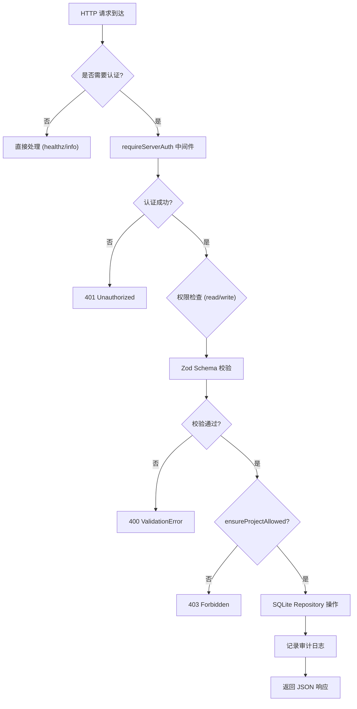

# ServerV1Routes.ts 需求说明

> 源文件：src/server/routes/v1/ServerV1Routes.ts ｜ 类型：源码 ｜ 行数：265 ｜ 所属模块：routes/v1 ｜ 分析日期：2026-07-23

## 1. 文件定位总述

ServerV1Routes 是 server-beta 的 SQLite 存储后端 V1 REST API 路由集，注册了从健康检查、项目/会话/事件/记忆的 CRUD 到搜索和审计查询的全部端点。它基于 SQLite Repository 层直接操作数据（区别于 Postgres 后端的 `IngestEventsService`），并实现统一的认证中间件、请求校验（Zod Schema）和项目作用域权限检查。所有写操作自动记录审计日志。

## 2. 功能需求

| 编号 | 需求描述（系统应当…） | 触发条件 / 输入 | 处理规则与输出 | 证据 |
|------|----------------------|----------------|---------------|------|
| FR-routes-01 | 系统应当提供健康检查端点，无需认证 | `GET /healthz` | 返回 `{ status: 'ok' }` | `ServerV1Routes.ts:47-49` |
| FR-routes-02 | 系统应当提供服务器信息端点，无需认证 | `GET /v1/info` | 返回 name（`claude-mem-server`）、version（构建时注入或 `development`）、可选 runtime、authMode | `ServerV1Routes.ts:51-58` |
| FR-routes-03 | 系统应当支持列出项目，根据 API Key 作用域过滤 | `GET /v1/projects`（需 `memories:read` 权限） | 若 API Key 绑定了 projectId 则仅返回该项目，否则返回全部项目列表 | `ServerV1Routes.ts:60-67` |
| FR-routes-04 | 系统应当支持创建项目，项目级 API Key 禁止创建 | `POST /v1/projects`（需 `memories:write` 权限） | 校验 `CreateProjectSchema`，项目级 Key 返回 403；成功创建返回 201 和项目数据 | `ServerV1Routes.ts:69-77` |
| FR-routes-05 | 系统应当支持读取单个项目 | `GET /v1/projects/:id`（需 `memories:read` 权限） | 按 ID 查找，不存在返回 404；检查项目作用域权限 | `ServerV1Routes.ts:79-89` |
| FR-routes-06 | 系统应当支持启动会话 | `POST /v1/sessions/start`（需 `memories:write` 权限） | 校验 `CreateServerSessionSchema`，检查项目作用域权限，创建并返回 201 | `ServerV1Routes.ts:91-96` |
| FR-routes-07 | 系统应当支持结束会话 | `POST /v1/sessions/:id/end`（需 `memories:write` 权限） | 查找会话，不存在返回 404；检查项目作用域权限，调用 `markCompleted` | `ServerV1Routes.ts:98-110` |
| FR-routes-08 | 系统应当支持读取单个会话 | `GET /v1/sessions/:id`（需 `memories:read` 权限） | 按 ID 查找，不存在返回 404；检查项目作用域权限 | `ServerV1Routes.ts:112-122` |
| FR-routes-09 | 系统应当支持写入单个事件 | `POST /v1/events`（需 `memories:write` 权限） | 校验 `CreateAgentEventSchema`，检查项目作用域权限，创建并返回 201 | `ServerV1Routes.ts:124-129` |
| FR-routes-10 | 系统应当支持批量写入事件，限制 1-500 条 | `POST /v1/events/batch`（需 `memories:write` 权限） | 校验 `z.array(CreateAgentEventSchema).min(1).max(500)`，在 SQLite 事务中批量创建，每个事件检查项目作用域 | `ServerV1Routes.ts:131-143` |
| FR-routes-11 | 系统应当支持读取单个事件 | `GET /v1/events/:id`（需 `memories:read` 权限） | 按 ID 查找，不存在返回 404；检查项目作用域权限 | `ServerV1Routes.ts:145-155` |
| FR-routes-12 | 系统应当支持写入记忆项 | `POST /v1/memories`（需 `memories:write` 权限） | 校验 `CreateMemoryItemSchema`，检查项目作用域权限，创建并返回 201 | `ServerV1Routes.ts:157-162` |
| FR-routes-13 | 系统应当支持读取单个记忆项 | `GET /v1/memories/:id`（需 `memories:read` 权限） | 按 ID 查找，不存在返回 404；检查项目作用域权限 | `ServerV1Routes.ts:164-174` |
| FR-routes-14 | 系统应当支持部分更新记忆项，禁止变更 projectId | `PATCH /v1/memories/:id`（需 `memories:write` 权限） | 校验 `CreateMemoryItemSchema.partial()`，验证 body.projectId 与已有值一致，更新并返回 | `ServerV1Routes.ts:176-192` |
| FR-routes-15 | 系统应当支持按项目搜索记忆，限制返回 100 条 | `POST /v1/search`（需 `memories:read` 权限） | 校验 projectId 和 query（均必需），limit 可选（默认 20，最大 100），检查项目作用域 | `ServerV1Routes.ts:194-203` |
| FR-routes-16 | 系统应当支持获取上下文（context），返回记忆列表和拼接的文本 | `POST /v1/context`（需 `memories:read` 权限） | 校验 projectId 和 query（均必需），limit 可选（默认 10，最大 50），从记忆中提取 narrative/text/title 拼接为换行分隔的上下文文本 | `ServerV1Routes.ts:205-214` |
| FR-routes-17 | 系统应当支持查询项目审计日志 | `GET /v1/audit`（需 `memories:read` 权限） | 必需 query 参数 projectId，检查项目作用域，返回按项目过滤的审计日志列表 | `ServerV1Routes.ts:216-224` |
| FR-routes-18 | 系统应当对所有读写操作自动记录审计日志 | 任何成功的数据操作完成后 | 调用 `audit()` 写入操作类型、目标 ID、项目 ID，actorType 区分 API Key 和 system | `ServerV1Routes.ts:253-263` |

## 3. 业务规则与约束

- **双级权限模型**：读操作需 `memories:read` 权限，写操作需 `memories:write` 权限，通过 `requireServerAuth` 中间件基于 SQLite auth 表验证。`ServerV1Routes.ts:36-45`
- **项目作用域隔离**：绑定了 projectId 的 API Key 只能访问其绑定的项目，跨项目访问返回 403。`ServerV1Routes.ts:241-247`
- **项目级 Key 限制**：项目级 API Key 不能创建新项目（会越权提升作用域）。`ServerV1Routes.ts:71-73`
- **批量事件上限**：`POST /v1/events/batch` 限制 1-500 条。`ServerV1Routes.ts:131`
- **Zod 校验统一处理**：所有 POST/PATCH 端点通过 `handleCreate` 中间件统一执行 Zod 校验，失败返回 `{ error: 'ValidationError', issues }`。`ServerV1Routes.ts:227-239`
- **审计记录粒度**：审计目标类型取操作名前缀（如 `event.write` → targetType 为 `event`），targetId 为资源 ID。`ServerV1Routes.ts:260`

## 4. 对外暴露

| 端点 | 方法 | 权限 | 说明 |
|------|------|------|------|
| `/healthz` | GET | 无 | 健康检查 |
| `/v1/info` | GET | 无 | 服务器信息 |
| `/v1/projects` | GET | read | 列出项目 |
| `/v1/projects` | POST | write | 创建项目 |
| `/v1/projects/:id` | GET | read | 读取项目 |
| `/v1/sessions/start` | POST | write | 启动会话 |
| `/v1/sessions/:id/end` | POST | write | 结束会话 |
| `/v1/sessions/:id` | GET | read | 读取会话 |
| `/v1/events` | POST | write | 写入事件 |
| `/v1/events/batch` | POST | write | 批量写入事件 |
| `/v1/events/:id` | GET | read | 读取事件 |
| `/v1/memories` | POST | write | 写入记忆 |
| `/v1/memories/:id` | GET | read | 读取记忆 |
| `/v1/memories/:id` | PATCH | write | 更新记忆 |
| `/v1/search` | POST | read | 搜索记忆 |
| `/v1/context` | POST | read | 获取上下文 |
| `/v1/audit` | GET | read | 查询审计日志 |

## 5. 依赖关系

- **存储层**：`ProjectsRepository`、`ServerSessionsRepository`、`AgentEventsRepository`、`MemoryItemsRepository`、`AuthRepository`（均来自 SQLite 存储）
- **认证**：`requireServerAuth` 中间件（SQLite auth）
- **校验**：Zod Schema：`CreateProjectSchema`、`CreateServerSessionSchema`、`CreateAgentEventSchema`、`CreateMemoryItemSchema`
- **框架**：Express `Application`、`RouteHandler` 接口

## 6. 数据结构

未定义自定义数据结构，使用 SQLite Repository 层返回的实体类型。

## 7. 复杂逻辑图示

上图展示了所有端点的统一请求处理流水线：认证 → 权限 → 校验 → 作用域检查 → 存储操作 → 审计 → 响应。

## 8. 逆向备注

- `/v1/events` 和 `/v1/events/batch` 端点直接写入 SQLite 并返回，不触发 BullMQ 队列或观测生成。推断：这些端点面向 SQLite 本地存储模式，观测生成由 Postgres 后端的 `IngestEventsService` 处理。
- `/v1/context` 端点的上下文拼接逻辑（`narrative ?? text ?? title`）直接在路由层执行，未委托给独立服务。推断：这是 SQLite 后端的轻量实现，Postgres 后端可能有不同的上下文构建逻辑。
- `__DEFAULT_PACKAGE_VERSION__` 是构建时注入的编译时常量，非运行时配置。`ServerV1Routes.ts:20-23`
- 批量端点使用 `db.transaction()` 进行 SQLite 事务包装，保证批量写入的原子性。`ServerV1Routes.ts:137-140`
