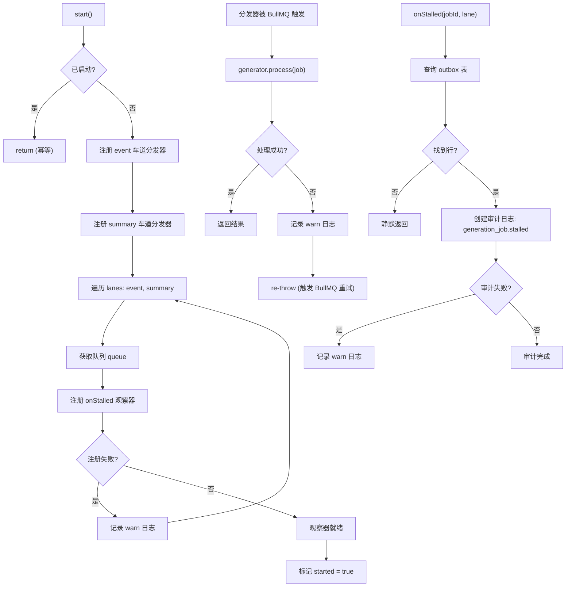

# ActiveServerBetaGenerationWorkerManager.ts 需求说明

> 源文件：src/server/runtime/ActiveServerBetaGenerationWorkerManager.ts ｜ 类型：源码 ｜ 行数：165 ｜ 所属模块：runtime ｜ 分析日期：2026-07-23

## 1. 文件定位总述

ActiveServerBetaGenerationWorkerManager 是 server-beta 生成管线的 Worker 调度中枢，负责将 BullMQ 队列（event 和 summary 两条车道）与 `ProviderObservationGenerator` 处理器绑定。它实现了 `ServerBetaGenerationWorkerManager` 接口，在启动时注册两条车道的分发器、挂载停滞任务审计观察器，并通过 `getHealth()` 提供运行时健康状态。该类仅在队列管理器和 AI Provider 同时就绪时才被实例化，否则系统使用 Disabled 版本。

## 2. 功能需求

| 编号 | 需求描述（系统应当…） | 触发条件 / 输入 | 处理规则与输出 | 证据 |
|------|----------------------|----------------|---------------|------|
| FR-wkmgr-01 | 系统应当在启动时将 BullMQ Worker 绑定到 event 车道，使队列消费触发观测生成 | 调用 `start()` 且队列管理器已初始化 | 调用 `queueManager.start('event', dispatcher)` 注册异步分发器，分发器内部调用 `generator.process(job)` 处理每个作业 | `ActiveServerBetaGenerationWorkerManager.ts:77` |
| FR-wkmgr-02 | 系统应当在启动时同时绑定 summary 车道，与 event 车道共用同一个生成器和分发器 | 调用 `start()` | 调用 `queueManager.start('summary', dispatcher)`，生成器内部通过 `job.data.source_type` 区分事件类型 | `ActiveServerBetaGenerationWorkerManager.ts:82` |
| FR-wkmgr-03 | 系统应当为 event 和 summary 两条车道分别注册停滞任务观察器，用于审计停滞作业 | 启动过程中且队列可获取 | 对每条车道调用 `queue.observe({ onStalled })`，触发时执行 `auditStalledJob()` 写入审计日志；注册失败仅记录警告不中断启动 | `ActiveServerBetaGenerationWorkerManager.ts:88-101` |
| FR-wkmgr-04 | 系统应当在分发器处理失败时记录警告日志并向上抛出异常，交由 BullMQ 重试机制处理 | `generator.process(job)` 抛出异常 | 以 warn 级别记录 jobId、kind 和 error message，然后 re-throw 使 BullMQ 按配置的退避策略重试 | `ActiveServerBetaGenerationWorkerManager.ts:68-75` |
| FR-wkmgr-05 | 系统应当通过查询 outbox 表定位停滞作业的团队和项目归属，写入审计行 | 收到停滞回调（`onStalled(jobId)`） | 通过 `bullmq_job_id` 列查询 `observation_generation_jobs` 表获取 team_id 和 project_id，然后创建 `generation_job.stalled` 审计日志 | `ActiveServerBetaGenerationWorkerManager.ts:110-138` |
| FR-wkmgr-06 | 系统应当支持通过测试注入的 `generatorFactory` 替换默认的 `ProviderObservationGenerator` | 构造时传入 `options.generatorFactory` | 使用工厂函数创建生成器实例，而非直接 `new ProviderObservationGenerator()` | `ActiveServerBetaGenerationWorkerManager.ts:48-49` |
| FR-wkmgr-07 | 系统应当提供健康状态查询，返回当前 Worker 的激活/禁用/错误状态 | 调用 `getHealth()` | 返回 `ServerBetaBoundaryHealth`，包含 status（active/disabled/errored）、reason 和 details（provider 标签、workerId） | `ActiveServerBetaGenerationWorkerManager.ts:141-155` |
| FR-wkmgr-08 | 系统应当防止重复启动，对多次 `start()` 调用幂等处理 | 再次调用 `start()` 时 `this.started` 已为 true | 直接 return，不重复注册分发器 | `ActiveServerBetaGenerationWorkerManager.ts:63-64` |
| FR-wkmgr-09 | 系统应当在关闭时标记为已关闭状态，且不重复关闭 | 调用 `close()` 且 `this.closed` 为 false | 设置 `closed = true`；底层 Worker 的关闭由队列管理器的级联关闭处理，不在此处双重关闭 | `ActiveServerBetaGenerationWorkerManager.ts:157-163` |

## 3. 业务规则与约束

- **并发控制**：event 和 summary 两条车道各自并发度为 1（由 `ServerJobQueue` 默认配置控制），确保同一服务器上同一时间只有一个活跃的 Provider 调用。`ActiveServerBetaGenerationWorkerManager.ts:17-19`
- **停滞审计的尽力而为原则**：停滞观察器注册失败或审计执行失败均不会导致 Worker 崩溃，仅记录警告日志。`ActiveServerBetaGenerationWorkerManager.ts:96-99,133-137`
- **Worker 生命周期归属**：底层 BullMQ Worker 的所有权在 `ServerJobQueue.close()`（由队列管理器驱动），本类 `close()` 不执行双重关闭。`ActiveServerBetaGenerationWorkerManager.ts:161-162`
- **身份上下文缺失处理**：停滞审计时原始 API Key 元数据可能不可用（BullMQ 重试可能超出会话生命周期），因此通过 outbox 行反查 team_id 和 project_id。`ActiveServerBetaGenerationWorkerManager.ts:106-108`

## 4. 对外暴露

| 导出项 | 类型 | 说明 |
|--------|------|------|
| `ActiveServerBetaGenerationWorkerManager` | 类 | 实现 `ServerBetaGenerationWorkerManager` 接口 |
| `ActiveServerBetaGenerationWorkerManagerOptions` | 接口 | 构造选项：pool、queueManager、provider、workerId、generatorFactory |
| `start()` | 方法 | 启动 Worker，绑定双车道分发器和停滞观察器 |
| `getHealth()` | 方法 | 返回 `ServerBetaBoundaryHealth` |
| `close()` | 方法 | 标记关闭，由队列管理器级联处理实际关闭 |

## 5. 依赖关系

- **上游**：`PostgresPool`（数据库连接）、`ActiveServerBetaQueueManager`（队列管理）、`ServerGenerationProvider`（AI Provider）、`ProviderObservationGenerator`（生成器）、`PostgresAuthRepository`（审计写入）
- **下游**：通过 `ServerBetaServiceGraph` 被 `createServerBetaService` 组装和启动
- **同层**：`DisabledServerBetaGenerationWorkerManager` 作为无 Provider 时的替代实现

## 6. 数据结构

### ServerBetaBoundaryHealth（推断，来自 types.ts）
```typescript
interface ServerBetaBoundaryHealth {
  status: 'active' | 'disabled' | 'errored';
  reason: string;
  details?: { provider: string; workerId: string };
}
```

## 7. 复杂逻辑图示



上图展示了 Worker 管理器的三大核心流程：启动时双车道注册、分发器处理逻辑以及停滞审计的尽力而为机制。

## 8. 逆向备注

- 注释中提及"Phase 6"和"Phase 12"标记，推断这些是分阶段开发计划中的里程碑，Phase 6 引入 summary 车道，Phase 12 引入停滞审计能力。
- `auditStalledJob` 中 `actorId` 和 `apiKeyId` 均设为 null，推断：BullMQ 重试场景下原始认证上下文已丢失，审计仅记录资源维度信息。
