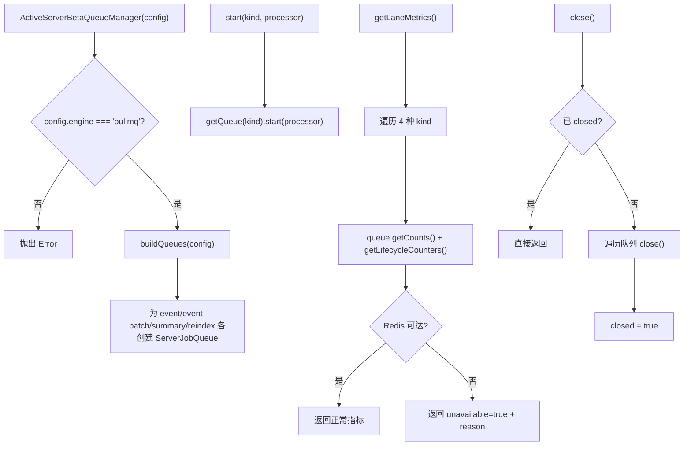

# ActiveServerBetaQueueManager.ts 需求说明

> 源文件：src/server/runtime/ActiveServerBetaQueueManager.ts ｜ 类型：源码 ｜ 行数：160 ｜ 所属模块：server/runtime ｜ 分析日期：2026-07-23

## 1. 文件定位总述

ActiveServerBetaQueueManager.ts 是 BullMQ 队列引擎的活跃管理器，实现 `ServerBetaQueueManager` 接口。它为四种生成任务类型（event、event-batch、summary、reindex）各创建一个独立的 BullMQ 队列，支持启动处理器、获取健康状态和采集 per-lane 指标。该管理器仅在 `CLAUDE_MEM_QUEUE_ENGINE=bullmq` 时被实例化，否则使用禁用态适配器。它不直接启动 Worker 处理器，而是提供 `start(kind, processor)` 方法供 Phase 4+ 的生成管道接入。

## 2. 功能需求

| 编号 | 需求描述（系统应当…） | 触发条件 / 输入 | 处理规则与输出 | 证据 |
|------|----------------------|----------------|---------------|------|
| FR-AQM-01 | 系统应当为四种任务类型各创建一个 BullMQ 队列 | 构造函数调用时 | 创建 event、event-batch、summary、reindex 四个 ServerJobQueue 实例 | `ActiveServerBetaQueueManager.ts:144-158` |
| FR-AQM-02 | 系统应当拒绝在非 bullmq 引擎模式下实例化 | 构造函数传入 config.engine !== 'bullmq' | 抛出 Error | `ActiveServerBetaQueueManager.ts:39-44` |
| FR-AQM-03 | 系统应当能按类型获取队列实例 | 调用 `getQueue(kind)` | 返回对应类型的 ServerJobQueue，未知 kind 抛出 Error | `ActiveServerBetaQueueManager.ts:48-54` |
| FR-AQM-04 | 系统应当能按类型启动队列的 BullMQ Worker 处理器 | 调用 `start(kind, processor)` | 在对应队列上调用 `queue.start(processor)` | `ActiveServerBetaQueueManager.ts:56-58` |
| FR-AQM-05 | 系统应当返回包含引擎配置和 lane 列表的健康状态 | 调用 `getHealth()` | 返回 `{status:'active', reason, details:{engine,mode,host,port,prefix,lanes}}` | `ActiveServerBetaQueueManager.ts:60-77` |
| FR-AQM-06 | 系统应当能采集每个 lane 的 BullMQ 计数指标（waiting/active/completed/failed/delayed/stalled） | 调用 `getLaneMetrics()` | 遍历四种 kind，调用 `queue.getCounts()` 和 `queue.getLifecycleCounters()`，Redis 不可达时标记 unavailable | `ActiveServerBetaQueueManager.ts:85-120` |
| FR-AQM-07 | 系统应当在关闭时逐一关闭所有队列，关闭后标记为 closed 状态 | 调用 `close()` | 已关闭时直接返回；否则遍历队列调用 close()，记录关闭错误 | `ActiveServerBetaQueueManager.ts:122-142` |

## 3. 业务规则与约束

1. **队列命名**：使用 `SERVER_JOB_QUEUE_NAMES` 映射表，格式为 `server_beta_generate_event`、`server_beta_generate_event_batch`、`server_beta_generate_summary`、`server_beta_reindex`（`ActiveServerBetaQueueManager.ts:66,148-155`）
2. **closed 状态幂等**：多次调用 close() 安全，第二次直接返回（`ActiveServerBetaQueueManager.ts:124-126`）
3. **关闭错误策略**：收集所有关闭错误，最终只抛出第一个（`ActiveServerBetaQueueManager.ts:135-141`）
4. **Redis 不可达容错**：getLaneMetrics 中 Redis 不可达时该 lane 标记 `unavailable: true` 并附带原因，不抛出异常（`ActiveServerBetaQueueManager.ts:104-117`）
5. **职责分离**：本管理器不启动 Worker，仅提供 start 方法供外部接入处理器（`ActiveServerBetaQueueManager.ts:22-25`）

## 4. 对外暴露

| 导出项 | 类型 | 说明 |
|--------|------|------|
| `ActiveServerBetaQueueManager` | class | 实现 ServerBetaQueueManager 接口的 BullMQ 队列管理器 |

## 5. 依赖关系

- **上游**：`bullmq`（Processor 类型）、`../jobs/ServerJobQueue.js`、`../jobs/types.js`（队列名称、任务类型）、`../queue/redis-config.js`（RedisQueueConfig）、`./types.js`（接口）
- **下游**：被 create-server-beta-service.ts 实例化，供 enqueueOutbox 和生成工作器使用

## 6. 数据结构

四种任务类型常量数组：`['event', 'event-batch', 'summary', 'reindex']`（`ActiveServerBetaQueueManager.ts:27`）

## 7. 复杂逻辑图示

## 8. 逆向备注

注释标注为 Phase 12，表明 per-lane 指标采集是分阶段架构演进中的较新功能（`ActiveServerBetaQueueManager.ts:79`）。
