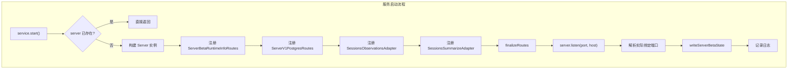
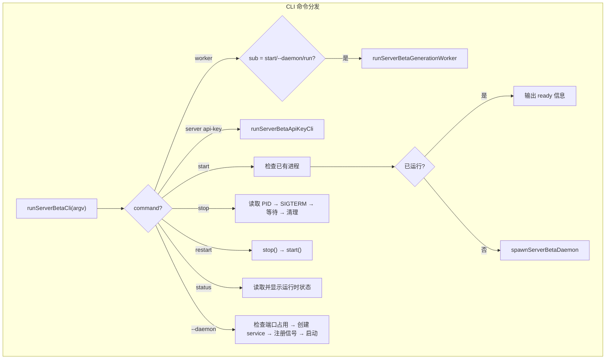
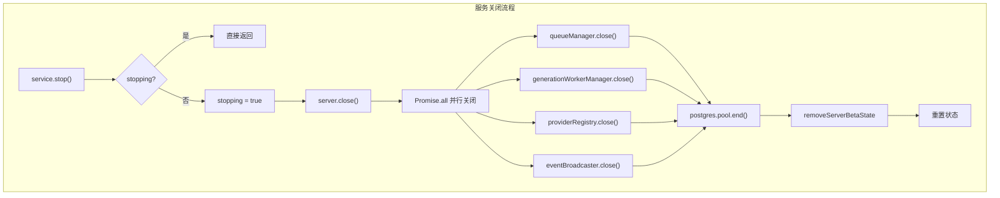

# ServerBetaService.ts 需求说明

> 源文件：src/server/runtime/ServerBetaService.ts ｜ 类型：源码 ｜ 行数：664 ｜ 所属模块：server/runtime ｜ 分析日期：2026-07-23

## 1. 文件定位总述

ServerBetaService 是 Claude-mem Server Beta 运行时的核心服务类和 CLI 入口文件，承担双重职责：(1) 作为 `ServerBetaService` 类管理 HTTP 服务的生命周期（启动/停止/重启），编排路由注册（info 路由、V1 Postgres 路由、兼容适配器路由）、队列健康检查暴露和资源清理；(2) 作为 `runServerBetaCli` 函数提供完整的命令行接口，支持 daemon 模式运行、进程管理（start/stop/restart/status）和子命令派发（worker 模式、api-key 管理）。该文件是 Server Beta 架构的"总指挥"，通过 `ServerBetaServiceGraph` 依赖图连接 Postgres 连接池、队列管理器、生成 Worker 管理器、Provider 注册表和事件广播器等所有基础设施边界。

## 2. 功能需求

| 编号 | 需求描述（系统应当…） | 触发条件 / 输入 | 处理规则与输出 | 证据 |
|------|----------------------|----------------|---------------|------|
| FR-STR-01 | 系统应当启动 HTTP 服务，监听指定端口，并完成路由注册和运行时状态持久化 | 调用 `service.start()` | 构建 Server 实例，注册 `/healthz`、`/v1/info`、V1 Postgres 路由和兼容适配器路由，调用 `server.listen` 监听端口，写入 PID 文件、端口文件和运行时状态文件。若 server 已存在则直接返回。 | `src/server/runtime/ServerBetaService.ts:115-211` |
| FR-STP-01 | 系统应当安全停止 HTTP 服务并关闭所有基础设施边界（队列管理器、Worker 管理器、Provider 注册表、事件广播器、Postgres 连接池），最后清除运行时状态文件 | 调用 `service.stop()` | 防重入（stopping 标志），依次关闭 HTTP server、四个边界组件和 Postgres pool，清理 PID/端口/状态文件。 | `src/server/runtime/ServerBetaService.ts:213-244` |
| FR-RTS-01 | 系统应当返回当前运行时状态快照，包含 pid、port、host、启动时间、bootstrap 状态和所有边界组件健康信息 | 调用 `service.getRuntimeState()` | 返回 `ServerBetaRuntimeState` 结构。 | `src/server/runtime/ServerBetaService.ts:246-265` |
| FR-HPZ-01 | 系统应当通过 `/healthz` 端点返回简单的健康检查响应 | HTTP GET /healthz | 返回 `{ status: 'ok', runtime: 'server-beta' }`。 | `src/server/runtime/ServerBetaService.ts:53-55` |
| FR-INF-01 | 系统应当通过 `/v1/info` 端点返回详细的服务信息，包含服务名、运行时标识、认证模式、Postgres bootstrap 状态、所有边界组件健康状态和队列 lane 指标 | HTTP GET /v1/info | 调用 `collectQueueLaneMetrics` 获取队列 lane 指标，组装完整信息返回。 | `src/server/runtime/ServerBetaService.ts:61-79` |
| FR-QRY-01 | 系统应当在 `/api/health`（Server 内置路由）中暴露 BullMQ/Valkey 健康状态和 per-lane 队列计数 | Server 构造时的 `getQueueHealth` 回调 | 从 queueManager 获取健康信息，若引擎为 bullmq 且状态 active，则拉取 lane 指标并格式化为 ObservationQueueHealth 结构（含 lanes 数组）。 | `src/server/runtime/ServerBetaService.ts:142-171` |
| FR-REG-01 | 系统应当注册 V1 Postgres 路由（API 端点）和两个兼容适配器路由（sessions-observations 和 sessions-summarize） | 启动 HTTP 服务时 | 通过 `server.registerRoutes` 注册 `ServerV1PostgresRoutes`（V1 API）、`SessionsObservationsAdapter`（兼容旧版观察路由）、`SessionsSummarizeAdapter`（兼容旧版摘要路由）。兼容适配器共享 V1 路由的底层服务。 | `src/server/runtime/ServerBetaService.ts:174-200` |
| FR-CLI-01 | 系统应当作为 CLI 入口支持 start/stop/restart/status/--daemon 子命令 | 直接运行脚本文件 | start：检查已有进程 → 若已运行则输出 ready 信息 → 否则 fork 子进程以 daemon 模式启动。stop：读取 PID 文件 → 发送 SIGTERM → 等待退出 → 清理状态文件。restart：顺序调用 stop + start。status：读取并显示运行时状态。--daemon：检查端口占用 → 导入并创建 service → 注册信号处理 → 启动服务。 | `src/server/runtime/ServerBetaService.ts:273-372` |
| FR-WRK-01 | 系统应当支持仅运行 BullMQ generation worker 而不启动 HTTP 服务（独立进程模式，用于容器化水平扩展） | CLI 命令 `worker start` | 导入并创建 service 但不调用 start()（不启动 HTTP），清除 CLAUDE_MEM_GENERATION_DISABLED 环境变量以确保 generation 被启用，注册 SIGTERM/SIGINT 处理器后永久阻塞（让 BullMQ Workers 后台消费 job）。 | `src/server/runtime/ServerBetaService.ts:281-289, 536-569` |
| FR-APK-01 | 系统应当提供 Postgres 支持的 API Key 管理子命令：create（创建密钥）、list（列出密钥）、revoke（撤销密钥） | CLI 命令 `server api-key create|list|revoke` | create：生成 `cmem_` 前缀的 24 字节随机密钥，SHA-256 哈希存储到 api_keys 表，支持指定 scope、team、project、name。list：分页查询 api_keys 表，支持 --team 过滤，上限 500 条。revoke：设置 revoked_at 时间戳。 | `src/server/runtime/ServerBetaService.ts:378-510` |
| FR-APK-02 | 系统应当在 API Key 创建时自动解析 teamId 和 projectId：若调用者指定则使用指定值，否则通过 bootstrapServerBetaApiKey 获取或创建默认的 team+project | CLI `api-key create` 执行中 | 如果 --team 或 --project 未提供，调用 `bootstrapServerBetaApiKey` 获取 teamId 和 projectId。 | `src/server/runtime/ServerBetaService.ts:404-411` |
| FR-APK-03 | 系统应当限制 API Key 列表查询的返回条数，默认 100 条，最大 500 条，防止跨租户数据泄露 | CLI `api-key list` 执行中 | 解析 --limit 参数，约束在 1-500 范围内，超出范围回退为 100。 | `src/server/runtime/ServerBetaService.ts:438-442` |
| FR-LND-01 | 系统应当在 daemon 模式启动前检测端口是否已被占用，避免重复监听 | `--daemon` 子命令 | 调用 `isPortInUse` 通过 TCP 连接检测端口。若 PID 文件存在且进程活跃，或端口已被占用，则直接 exit(0)。 | `src/server/runtime/ServerBetaService.ts:352-354` |
| FR-PRC-01 | 系统应当通过 UID 取模计算默认端口号，实现同一主机多用户端口隔离 | 未设置 CLAUDE_MEM_SERVER_PORT 环境变量时 | 默认端口 = 37877 + (uid % 100)。容器化部署通过环境变量显式指定。 | `src/server/runtime/ServerBetaService.ts:571-580` |

## 3. 业务规则与约束

| 编号 | 规则描述 | 证据 |
|------|---------|------|
| BR-01 | **运行时常量**：runtime 标识固定为 `'server-beta'`，默认监听地址 `127.0.0.1`，默认端口 37877。 | `src/server/runtime/ServerBetaService.ts:23-25` |
| BR-02 | **端口可配置层级**：优先级为 构造选项 port > 环境变量 CLAUDE_MEM_SERVER_PORT > getServerBetaPort() 计算值。host 同理，优先级为 构造选项 host > 环境变量 CLAUDE_MEM_SERVER_HOST > '127.0.0.1'。 | `src/server/runtime/ServerBetaService.ts:110-112` |
| BR-03 | **运行时状态持久化**：start 时写入三个文件（PID 文件、端口文件、运行时状态 JSON 文件），stop 时删除。可通过 `persistRuntimeState` 选项关闭。 | `src/server/runtime/ServerBetaService.ts:207-209, 237-239` |
| BR-04 | **PID 文件所有权验证**：start/stop/status 操作前通过 `verifyPidFileOwnership` 验证 PID 文件中的进程是否仍在运行，避免操作已失效的 PID。 | `src/server/runtime/ServerBetaService.ts:303-306, 318-322, 339` |
| BR-05 | **authMode 降级**：当 graph.authMode 为 'disabled' 时，V1 路由和兼容适配器的 authMode 被降级为 'api-key'，确保即使全局禁用认证，API 路由仍然需要 API key。 | `src/server/runtime/ServerBetaService.ts:177, 190` |
| BR-06 | **daemon 进程隔离**：daemon 模式通过 `spawn` 创建 detached 子进程，stdio 设为 'ignore'，父进程通过 `child.unref()` 不等待子进程。 | `src/server/runtime/ServerBetaService.ts:582-594` |
| BR-07 | **worker 模式强制启用 generation**：worker 入口显式 `delete process.env.CLAUDE_MEM_GENERATION_DISABLED`，确保 worker 进程始终执行 generation 任务。 | `src/server/runtime/ServerBetaService.ts:543` |
| BR-08 | **API Key 前缀**：所有通过 CLI 创建的 API key 以 `cmem_` 开头，密钥体为 48 个十六进制字符（24 字节），存储时仅保留 SHA-256 哈希值。 | `src/server/runtime/ServerBetaService.ts:412-413` |
| BR-09 | **CLI env 依赖**：`server api-key` 子命令要求 `CLAUDE_MEM_SERVER_DATABASE_URL` 环境变量，否则报错退出。 | `src/server/runtime/ServerBetaService.ts:382-385` |
| BR-10 | **信号处理**：daemon 模式和 worker 模式均注册 SIGTERM 和 SIGINT 处理器，确保优雅关闭。stop 命令发送 SIGTERM 后等待最多 5 秒（轮询间隔 100ms）。 | `src/server/runtime/ServerBetaService.ts:362-363, 563-564, 648-656` |
| BR-11 | **兼容适配器共享服务**：SessionsObservationsAdapter 和 SessionsSummarizeAdapter 复用 V1 路由的底层服务实例（getIngestEventsService、getEndSessionService），避免重复的 ingest 或 session-end 逻辑。 | `src/server/runtime/ServerBetaService.ts:185-200` |

## 4. 对外暴露

| 类型 | 名称 | 说明 |
|------|------|------|
| 类 | `ServerBetaService` | 核心服务类，方法：start()、stop()、getRuntimeState() |
| 函数 | `runServerBetaCli(argv)` | CLI 入口函数 |
| 函数 | `runServerBetaApiKeyCli(argv)` | API Key 管理 CLI 子函数 |
| 函数 | `runServerBetaGenerationWorker()` | 独立 generation worker 入口函数 |
| 接口 | `ServerBetaServiceOptions` | 构造选项：graph、host、port、persistRuntimeState |
| 接口 | `ServerBetaRuntimeState` | 运行时状态快照结构 |

### HTTP 端点

| 方法 | 路径 | 说明 |
|------|------|------|
| GET | `/healthz` | 简单健康检查 |
| GET | `/v1/info` | 详细服务信息（含队列 lane 指标） |
| GET | `/api/health` | Server 内置健康路由（含 BullMQ/Valkey 状态和 lane 计数） |
| * | `/v1/*` | V1 Postgres API 路由（由 ServerV1PostgresRoutes 注册） |
| * | `/api/sessions/observations` | 兼容适配器路由 |
| * | `/api/sessions/summarize` | 兼容适配器路由 |

### CLI 子命令

| 命令 | 说明 |
|------|------|
| `start` | 以 daemon 模式启动 HTTP 服务 |
| `stop` | 停止 daemon 进程 |
| `restart` | 重启 daemon |
| `status` | 查看运行状态 |
| `--daemon` | 前台 daemon 模式（内部使用） |
| `worker start` | 启动独立的 generation worker（无 HTTP） |
| `server api-key create` | 创建 API Key |
| `server api-key list` | 列出 API Key |
| `server api-key revoke <id>` | 撤销 API Key |

## 5. 依赖关系

| 方向 | 依赖项 | 说明 |
|------|--------|------|
| 内部 | `services/server/Server.ts` | HTTP Server 基础设施（监听、路由注册、关闭） |
| 内部 | `runtime/types.ts` | ServerBetaServiceGraph、ServerBetaRuntimeState 等类型定义 |
| 内部 | `runtime/create-server-beta-service.ts` | service 工厂函数（动态导入） |
| 内部 | `runtime/ActiveServerBetaQueueManager.ts` | 队列管理器（用于 lane 指标采集） |
| 内部 | `routes/v1/ServerV1PostgresRoutes.ts` | V1 Postgres API 路由 |
| 内部 | `compat/SessionsObservationsAdapter.ts` | 旧版观察路由兼容适配器 |
| 内部 | `compat/SessionsSummarizeAdapter.ts` | 旧版摘要路由兼容适配器 |
| 内部 | `supervisor/process-registry.ts` | PID 文件管理工具 |
| 内部 | `shared/paths.ts` | 运行时状态文件路径 |
| 内部 | `services/hooks/server-beta-bootstrap.ts` | server-beta 引导和默认 team/project 创建 |
| 内部 | `storage/postgres/index.ts` | 共享 Postgres 连接池 |
| 内部 | `storage/postgres/auth.ts` | API Key 的 Postgres 仓库 |
| Node.js 内置 | child_process, fs, net, path | 进程 spawn、文件操作、端口检测 |

## 6. 数据结构

### ServerBetaRuntimeState

| 字段 | 类型 | 说明 |
|------|------|------|
| runtime | string | 固定值 'server-beta' |
| pid | number | 进程 PID |
| port | number | 实际绑定端口 |
| host | string | 监听地址 |
| startedAt | string | ISO 格式启动时间 |
| bootstrap | ServerBetaBootstrapStatus | Postgres 引导状态 |
| boundaries | object | 四个边界组件的健康状态快照 |

### boundaries 子结构

| 字段 | 类型 | 说明 |
|------|------|------|
| queueManager | ServerBetaBoundaryHealth | 队列管理器健康状态 |
| generationWorkerManager | ServerBetaBoundaryHealth | 生成 Worker 管理器健康状态 |
| providerRegistry | ServerBetaBoundaryHealth | Provider 注册表健康状态 |
| eventBroadcaster | ServerBetaBoundaryHealth | 事件广播器健康状态 |

## 7. 复杂逻辑图示

上图展示了 HTTP 服务的启动流程，依次注册四组路由后开始监听，最后持久化运行时状态。

上图展示了 CLI 的完整命令分发逻辑，涵盖 daemon 管理、worker 模式和 API Key 管理三条主路径。

上图展示了关闭流程，先停 HTTP 再并行关闭四个边界组件和数据库连接池，最后清理状态文件。

## 8. 逆向备注

1. `runServerBetaCli` 函数在文件末尾（第 658-663 行）通过检查 `process.argv[1]` 是否以 `ServerBetaService.ts` 或 `server-beta-service.cjs` 结尾来决定是否自动执行 CLI，这是一种"双模式模块"模式——既可被 import 使用，也可直接作为脚本运行。
2. `collectQueueLaneMetrics` 函数（第 83-97 行）在 `ActiveServerBetaQueueManager` 实例检查失败时返回空数组而非抛出异常，注释说明 `/api/health` 和 `/v1/info` "MUST never throw on a queue blip"——这是生产可用性的关键设计决策。
3. `runServerBetaGenerationWorker`（第 536-569 行）通过 `await new Promise<void>(() => {})` 永久阻塞主线程，注释解释是因为 BullMQ Workers 在后台运行，若主线程退出则 job 无人消费。这是一种不优雅但有效的 Node.js 进程保活方式。
4. 兼容适配器（SessionsObservationsAdapter 和 SessionsSummarizeAdapter）的存在表明 Server Beta 架构存在一个旧版 API（`/api/sessions/*`）的迁移路径，注释建议新客户端直接使用 `/v1/*` 路由。
5. authMode 降级逻辑（disabled → api-key）在第 177 行和第 190 行出现两次，推断是因为 Server 构造函数的 `authMode` 参数和 V1 路由/兼容适配器的 authMode 需要分别处理。
