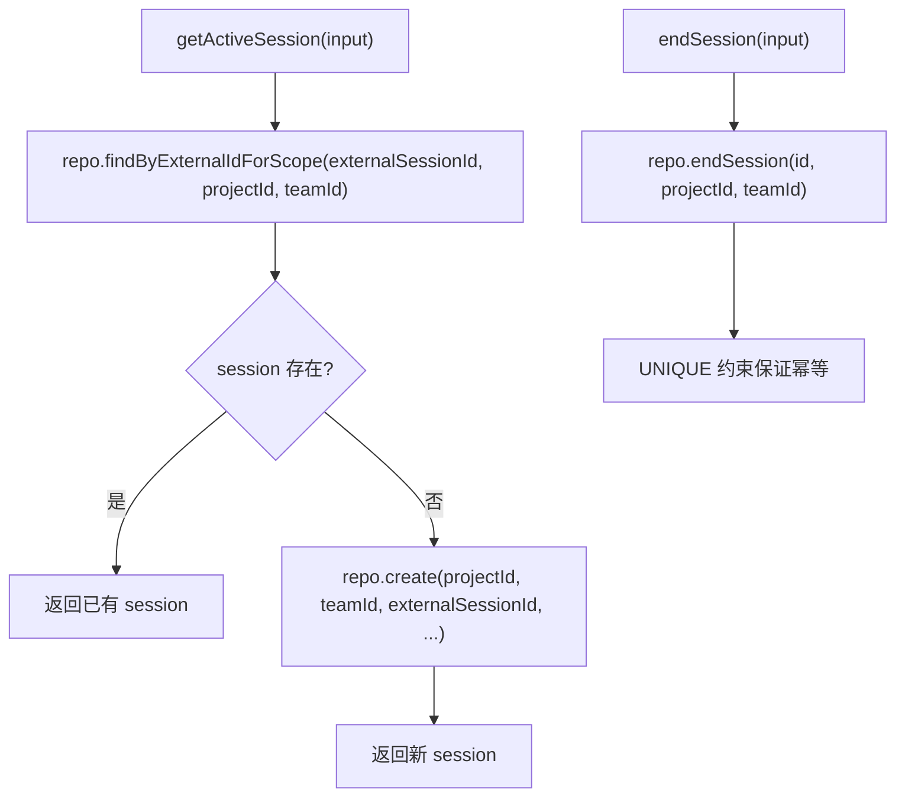

# ServerSessionRuntimeRepository.ts 需求说明

> 源文件：src/server/runtime/ServerSessionRuntimeRepository.ts ｜ 类型：源码 ｜ 行数：164 ｜ 所属模块：server/runtime ｜ 分析日期：2026-07-23

## 1. 文件定位总述

ServerSessionRuntimeRepository.ts 是 Server Beta 的会话运行时仓库层，为路由和生成策略提供薄薄的会话操作抽象。每个方法都要求显式传入 `team_id` + `project_id`，通过底层 `PostgresServerSessionsRepository`（调用 `assertProjectOwnership`）验证作用域。该仓库刻意不缓存状态，所有调用直接访问 Postgres，防止内存中的 ActiveSession 对象导致状态不一致（Phase 6 反模式防护）。

## 2. 功能需求

| 编号 | 需求描述（系统应当…） | 触发条件 / 输入 | 处理规则与输出 | 证据 |
|------|----------------------|----------------|---------------|------|
| FR-SSRR-01 | 系统应当能查找或创建指定外部会话 ID 的 Server beta 会话行，幂等基于 (project_id, external_session_id) | 调用 `getActiveSession(input)` | 先按 externalId+scope 查找，存在则返回；不存在则创建并返回新行 | `ServerSessionRuntimeRepository.ts:52-71` |
| FR-SSRR-02 | 系统应当能按 ID 和 scope 查找会话 | 调用 `getById(input)` | 委托 repo.getByIdForScope，需 teamId + projectId | `ServerSessionRuntimeRepository.ts:73-79` |
| FR-SSRR-03 | 系统应当能按外部会话 ID 和 scope 查找会话 | 调用 `findByExternalId(input)` | 委托 repo.findByExternalIdForScope | `ServerSessionRuntimeRepository.ts:81-89` |
| FR-SSRR-04 | 系统应当能列出指定 server_session 的未处理事件，支持可选 limit | 调用 `listUnprocessedEvents(input)` | 委托 repo.listUnprocessedEvents，需 serverSessionId + teamId + projectId | `ServerSessionRuntimeRepository.ts:91-108` |
| FR-SSRR-05 | 系统应当能结束会话，幂等处理（重新结束返回未变更的行且不创建重复摘要任务） | 调用 `endSession(input)` | 委托 repo.endSession，幂等由 UNIQUE 约束保证 | `ServerSessionRuntimeRepository.ts:117-125` |
| FR-SSRR-06 | 系统应当能标记会话的生成状态为 started/completed/failed | 调用 markGenerationStarted/markGenerationCompleted/markGenerationFailed | 分别委托 repo 的对应方法，均需 id + teamId + projectId | `ServerSessionRuntimeRepository.ts:127-156` |
| FR-SSRR-07 | 系统应当提供便捷工厂函数从 PostgresPool 创建实例 | 调用 `createServerSessionRuntimeRepository(pool)` | 返回 `new ServerSessionRuntimeRepository({client: pool})` | `ServerSessionRuntimeRepository.ts:159-163` |

## 3. 业务规则与约束

1. **显式 scope 要求**：每个方法都要求 `teamId` + `projectId` 参数，不接受隐式作用域（`ServerSessionRuntimeRepository.ts:52-53`）
2. **无状态设计**：注释明确说明不缓存状态，每次调用都访问 Postgres（`ServerSessionRuntimeRepository.ts:14-18`）
3. **反模式防护**：不得查询 worker 的 `ActiveSession` 或任何 legacy SessionStore，`server_sessions` 是唯一规范模型（`ServerSessionRuntimeRepository.ts:50`）
4. **结束幂等性**：UNIQUE 约束 `(team_id, project_id, source_type='session_summary', source_id)` 保证不创建重复摘要任务（`ServerSessionRuntimeRepository.ts:113-114`）

## 4. 对外暴露

| 导出项 | 类型 | 说明 |
|--------|------|------|
| `ServerSessionScope` | interface | 作用域（teamId + projectId） |
| `GetActiveSessionInput` | interface | getActiveSession 的输入参数 |
| `ServerSessionRuntimeRepositoryOptions` | interface | 构造选项（client: PostgresQueryable） |
| `ServerSessionRuntimeRepository` | class | 会话运行时仓库 |
| `createServerSessionRuntimeRepository` | function | 从 PostgresPool 创建实例的工厂函数 |

## 5. 依赖关系

- **上游**：`../../storage/postgres/server-sessions.js`（PostgresServerSessionsRepository）、`../../storage/postgres/agent-events.js`（PostgresAgentEvent）、`../../storage/postgres/pool.js`（PostgresPool）
- **下游**：被 Server Beta 路由处理器、IngestEventsService、EndSessionService 等消费

## 6. 数据结构

```typescript
interface ServerSessionScope {
  teamId: string;
  projectId: string;
}

interface GetActiveSessionInput extends ServerSessionScope {
  externalSessionId: string;
  contentSessionId?: string | null;
  agentId?: string | null;
  agentType?: string | null;
  platformSource?: string | null;
  metadata?: JsonObject;
}
```

## 7. 复杂逻辑图示



## 8. 逆向备注

无特殊备注。
