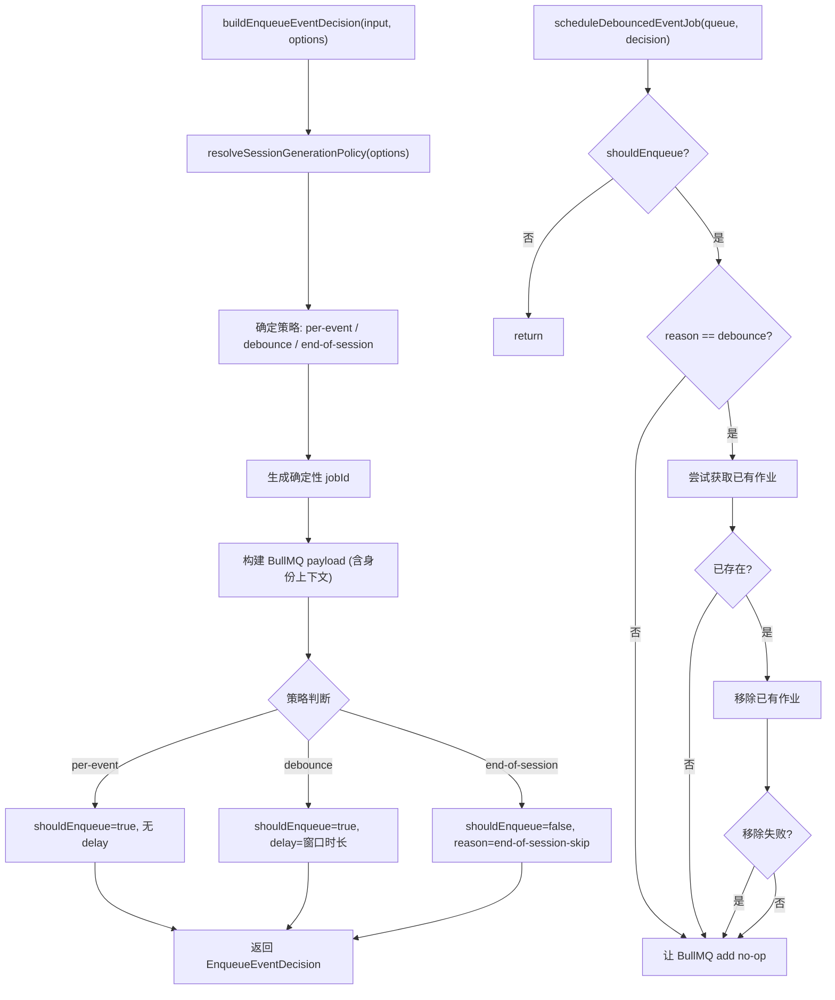

# SessionGenerationPolicy.ts 需求说明

> 源文件：src/server/runtime/SessionGenerationPolicy.ts ｜ 类型：源码 ｜ 行数：207 ｜ 所属模块：runtime ｜ 分析日期：2026-07-23

## 1. 文件定位总述

SessionGenerationPolicy 是 server-beta 生成管线的调度策略引擎，决定何时将事件和会话摘要的生成任务投递到 BullMQ 队列。它支持三种策略——即时（per-event）、防抖（debounce）和会话结束时批量（end-of-session）——通过环境变量和调用参数灵活配置。该模块同时提供摘要作业（summary job）的 ID 生成和载荷构建能力，是事件摄入与队列投递之间的策略决策层。

## 2. 功能需求

| 编号 | 需求描述（系统应当…） | 触发条件 / 输入 | 处理规则与输出 | 证据 |
|------|----------------------|----------------|---------------|------|
| FR-policy-01 | 系统应当解析并确定当前生效的生成调度策略 | 调用 `resolveSessionGenerationPolicy(options)` | 优先级：调用参数 `options.policy` > 环境变量 `CLAUDE_MEM_SERVER_SESSION_POLICY` > 默认值 `per-event`；环境变量值必须为三个合法值之一，否则回退到 per-event | `SessionGenerationPolicy.ts:43-60` |
| FR-policy-02 | 系统应当在 per-event 策略下，对每个事件立即生成入队决策 | 策略为 per-event | 返回 `shouldEnqueue: true`，无 delay，reason 为 `per-event` | `SessionGenerationPolicy.ts:123-124` |
| FR-policy-03 | 系统应当在 debounce 策略下，为事件生成带延迟的入队决策 | 策略为 debounce | 返回 `shouldEnqueue: true`，`jobsOptions.delay` 为防抖窗口时长，reason 为 `debounce` | `SessionGenerationPolicy.ts:113-121` |
| FR-policy-04 | 系统应当在 end-of-session 策略下，跳过事件的入队 | 策略为 end-of-session | 返回 `shouldEnqueue: false`，reason 为 `end-of-session-skip`；outbox 行保留为 queued 状态等待启动协调或会话结束时发布 | `SessionGenerationPolicy.ts:109-111` |
| FR-policy-05 | 系统应当从环境变量解析防抖窗口时长 | 读取 `CLAUDE_MEM_SERVER_SESSION_DEBOUNCE_MS` | 解析为整数，无效值回退到默认 5000ms；调用参数 `debounceWindowMs` 优先于环境变量 | `SessionGenerationPolicy.ts:51-59` |
| FR-policy-06 | 系统应当为每个事件生成确定性的 BullMQ Job ID | 调用 `buildEnqueueEventDecision(input, options)` | 优先使用 outbox 行已有的 `bullmqJobId`，否则通过 `buildServerJobId()` 基于 kind/team_id/project_id/source_type/source_id 生成；确定性 ID 保证重复入队在 BullMQ 端去重 | `SessionGenerationPolicy.ts:88-94` |
| FR-policy-07 | 系统应当将事件的完整身份上下文（API Key ID、Actor ID、Source Adapter、Request ID）嵌入到 BullMQ 载荷中 | 构建事件入队决策时 | 载荷包含 `api_key_id`、`actor_id`、`source_adapter`、`request_id` 字段，确保生成 Worker 在处理时可追溯调用来源 | `SessionGenerationPolicy.ts:95-107` |
| FR-policy-08 | 系统应当在防抖策略下执行"先删再加"的替换逻辑 | 调用 `scheduleDebouncedEventJob(queue, decision)` 且 decision.reason 为 debounce | 先尝试获取已有延迟作业并移除，再添加新的延迟作业；移除失败时静默忽略，让 BullMQ 的 add no-op 机制处理 | `SessionGenerationPolicy.ts:146-163` |
| FR-policy-09 | 系统应当为摘要作业生成确定性 Job ID | 调用 `buildSummaryJobId(input)` | 基于 kind=summary、team_id、project_id、source_type=session_summary、source_id=serverSessionId 构建 | `SessionGenerationPolicy.ts:178-190` |
| FR-policy-10 | 系统应当构建摘要作业的完整 BullMQ 载荷 | 调用 `buildSummaryJobPayload(input)` | 返回 `GenerateSessionSummaryJob`，包含 kind、team_id、project_id、source_type/id、generation_job_id、server_session_id 和身份上下文字段 | `SessionGenerationPolicy.ts:192-206` |

## 3. 业务规则与约束

- **策略输入源优先级**：调用参数 > 环境变量 > 硬编码默认值。`SessionGenerationPolicy.ts:47-49`
- **默认防抖窗口**：5000ms（5 秒）。`SessionGenerationPolicy.ts:36`
- **确定性 Job ID 机制**：同一事件的重复入队会因 BullMQ 的 jobId 去重机制而折叠，配合防抖的"先删再加"实现事件窗口内的最终一致投递。`SessionGenerationPolicy.ts:138-145`
- **反模式约束**：策略模块不得使用 `ActiveSession` 式的缓存状态，所有输入由调用者从 Postgres 重新加载。`SessionGenerationPolicy.ts:31-32`
- **end-of-session 策略的兜底**：跳过入队的事件 outbox 行保持 queued 状态，由启动协调（`reconcileOnStartup`）在重启时重新发布。`SessionGenerationPolicy.ts:27-28`

## 4. 对外暴露

| 导出项 | 类型 | 说明 |
|--------|------|------|
| `ServerSessionGenerationPolicy` | 类型 | `'per-event' \| 'debounce' \| 'end-of-session'` |
| `resolveSessionGenerationPolicy(options?)` | 函数 | 解析并返回生效的策略和防抖窗口配置 |
| `EnqueueEventDecisionInput` | 接口 | 事件入队决策的输入：event、outbox、身份上下文 |
| `EnqueueEventDecision` | 接口 | 事件入队决策的输出：shouldEnqueue、jobId、payload、jobsOptions、reason |
| `buildEnqueueEventDecision(input, options?)` | 函数 | 构建事件入队决策 |
| `DebounceableEventQueue` | 接口 | 防抖队列的最小接口：add、remove、getJob |
| `scheduleDebouncedEventJob(queue, decision)` | 函数 | 执行防抖调度（先删再加） |
| `BuildSummaryJobInput` | 接口 | 摘要作业输入 |
| `buildSummaryJobId(input)` | 函数 | 生成摘要作业的确定性 Job ID |
| `buildSummaryJobPayload(input)` | 函数 | 构建摘要作业的 BullMQ 载荷 |

## 5. 依赖关系

- **上游**：`buildServerJobId`（Job ID 生成）、`PostgresAgentEvent` 类型、`PostgresObservationGenerationJob` 类型、BullMQ `JobsOptions` 类型
- **下游调用者**：`IngestEventsService.publishEventJob()`（事件入队）、会话结束端点（摘要入队）

## 6. 数据结构

### EnqueueEventDecision
```typescript
interface EnqueueEventDecision {
  shouldEnqueue: boolean;                    // 是否应入队
  jobId: string;                            // BullMQ Job ID（确定性）
  payload: GenerateObservationsForEventJob; // BullMQ 载荷
  jobsOptions?: JobsOptions;                 // 附加选项（如 delay）
  reason: 'per-event' | 'debounce' | 'end-of-session-skip';
}
```

## 7. 复杂逻辑图示



上图展示了事件入队决策的构建流程和防抖调度的"先删再加"替换逻辑。

## 8. 逆向备注

- `scheduleDebouncedEventJob` 中移除作业失败时采用"best-effort"策略，推断：如果作业已从 delayed 移动到 active 状态（被消费），移除操作会失败，此时让 `add` 的 no-op 机制或调用者的错误处理器兜底。`SessionGenerationPolicy.ts:152-160`
- `DebounceableEventQueue` 接口被设计为结构化类型（非 `Pick` 形式），推断：为了避免 BullMQ 的泛型 `TPayload` 不变类型检查导致调用处类型不兼容。`SessionGenerationPolicy.ts:126-131`
