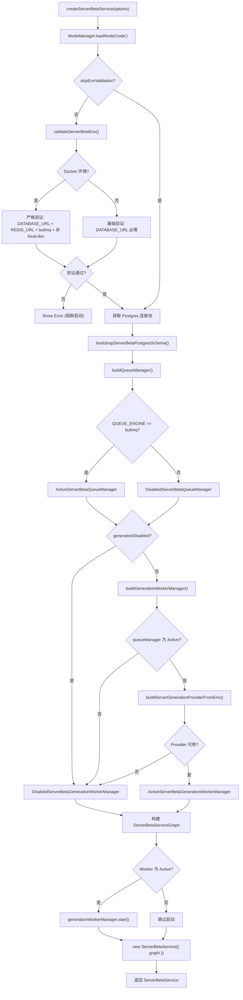

# create-server-beta-service.ts 需求说明

> 源文件：src/server/runtime/create-server-beta-service.ts ｜ 类型：源码 ｜ 行数：308 ｜ 所属模块：runtime ｜ 分析日期：2026-07-23

## 1. 文件定位总述

create-server-beta-service.ts 是 server-beta 运行时的服务组装工厂，承担从环境配置解析、Postgres 初始化、队列管理器构建、AI Provider 实例化到最终 `ServerBetaService` 对象组装的全生命周期编排职责。它实现了"优雅降级"设计——当队列引擎、AI Provider 或生成功能被禁用时，系统使用 Disabled 占位对象保证 HTTP 前端始终可启动。该文件同时包含 Docker 环境检测和启动时环境验证逻辑，确保生产环境的配置错误在启动阶段即被拦截。

## 2. 功能需求

| 编号 | 需求描述（系统应当…） | 触发条件 / 输入 | 处理规则与输出 | 证据 |
|------|----------------------|----------------|---------------|------|
| FR-factory-01 | 系统应当创建并返回完整的 ServerBetaService 实例 | 调用 `createServerBetaService(options?)` | 执行 Mode 加载、环境验证、Postgres 初始化、队列构建、Provider 实例化、Worker Manager 组装，最终构建 `ServerBetaServiceGraph` 并创建 `ServerBetaService` | `create-server-beta-service.ts:157-207` |
| FR-factory-02 | 系统应当在启动时加载 Mode（默认 'code'）以支持提示词构建 | 服务创建阶段 | 调用 `ModeManager.getInstance().loadMode('code')`，失败时仅记录警告不阻塞启动 | `create-server-beta-service.ts:162-171` |
| FR-factory-03 | 系统应当在启动时验证环境配置，生产环境缺失关键配置则抛出异常阻断启动 | 调用 `validateServerBetaEnv()`（除非 `skipEnvValidation` 为 true） | 验证 DATABASE_URL、REDIS_URL、AUTH_MODE、QUEUE_ENGINE、RUNTIME；Docker 环境下禁止 local-dev 模式和本地开发绕过；缺失必要配置则 throw Error | `create-server-beta-service.ts:81-155` |
| FR-factory-04 | 系统应当检测 Docker 运行环境 | 检查环境变量和文件系统 | 通过 `CLAUDE_MEM_DOCKER=1/true` 或 `/.dockerenv` 文件存在判定为 Docker 环境 | `create-server-beta-service.ts:70-79` |
| FR-factory-05 | 系统应当根据环境变量 CLAUDE_MEM_QUEUE_ENGINE 选择队列管理器 | 服务创建阶段 | 值为 `bullmq` 时构建 `ActiveServerBetaQueueManager`，否则返回 `DisabledServerBetaQueueManager` 并附带原因说明 | `create-server-beta-service.ts:269-277` |
| FR-factory-06 | 系统应当根据环境变量 CLAUDE_MEM_SERVER_PROVIDER 选择并实例化 AI Provider | 队列管理器为 Active 且生成未禁用 | `claude`/`anthropic` → `ClaudeObservationProvider`，`gemini` → `GeminiObservationProvider`，`openrouter` → `OpenRouterObservationProvider`；无匹配或缺少 API Key 则返回 null | `create-server-beta-service.ts:232-261` |
| FR-factory-07 | 系统应当在无 Provider 或队列管理器为 Disabled 时使用 DisabledGenerationWorkerManager | Provider 为 null 或队列非 Active | 创建 `DisabledServerBetaGenerationWorkerManager` 并附带原因说明 | `create-server-beta-service.ts:214-224,225-229` |
| FR-factory-08 | 系统应当支持通过 CLAUDE_MEM_GENERATION_DISABLED 环境变量禁用生成功能 | `CLAUDE_MEM_GENERATION_DISABLED=1/true` | 创建 `DisabledServerBetaGenerationWorkerManager`，说明此服务器仅运行 HTTP 前端，生成由独立的 worker 进程消费 BullMQ 队列 | `create-server-beta-service.ts:179-187` |
| FR-factory-09 | 系统应当在生成 Worker Manager 为 Active 时自动启动它 | `generationWorkerManager` 是 `ActiveServerBetaGenerationWorkerManager` 实例 | 调用 `generationWorkerManager.start()` 绑定 BullMQ Worker | `create-server-beta-service.ts:202-204` |
| FR-factory-10 | 系统应当初始化 Postgres Schema 并返回引导状态 | 服务创建阶段 | 调用 `bootstrapServerBetaPostgresSchema(pool)` 执行迁移，查询 `server_beta_schema_migrations` 表确认当前版本 | `create-server-beta-service.ts:279-300` |
| FR-factory-11 | 系统应当为 Active 的 Worker Manager 构建完整的 ServiceGraph | Worker Manager 为 Active | 构建 `ServerBetaServiceGraph` 包含：pool、bootstrap 状态、authMode、queueManager、generationWorkerManager、providerRegistry（Disabled 占位）、eventBroadcaster（Disabled 占位）、storage repositories | `create-server-beta-service.ts:188-200` |
| FR-factory-12 | 系统应当将未识别的 authMode 值默认回退为 `api-key` | `CLAUDE_MEM_AUTH_MODE` 为非 `local-dev`/`disabled` 的其他值 | 通过 `parseAuthMode()` 返回 `api-key` | `create-server-beta-service.ts:302-307` |

## 3. 业务规则与约束

- **优雅降级原则**：系统在任何组件不可用时均使用 Disabled 占位对象保证 HTTP 服务可启动，不会因缺少 Provider 或队列而崩溃。`create-server-beta-service.ts:183-187,214-224`
- **Docker 环境安全约束**：Docker 容器内禁止 `local-dev` 认证模式（因容器可被服务间网络访问）、禁止 `CLAUDE_MEM_ALLOW_LOCAL_DEV_BYPASS`、必须使用 `bullmq` 队列引擎（容器间不能用内存队列）。`create-server-beta-service.ts:102-127`
- **Provider 选择严格匹配**：`CLAUDE_MEM_SERVER_PROVIDER` 必须精确匹配四个值之一（claude/anthropic/gemini/openrouter），空字符串或其他值均返回 null（禁用生成）。`create-server-beta-service.ts:233-261`
- **API Key 来源**：每种 Provider 支持两个环境变量名的 API Key（官方名和 CLAUDE_MEM 前缀名），官方名优先。`create-server-beta-service.ts:237-254`
- **测试注入支持**：构造选项支持注入 pool、queueManager、generationProvider、generationWorkerManager、skipEnvValidation 等测试桩。`create-server-beta-service.ts:29-44`
- **Phase 10 分离设计**：`generationDisabled` 选项支持"仅 HTTP 前端"模式，BullMQ 队列由独立的 `claude-mem server worker start` 进程消费。`create-server-beta-service.ts:38-40`

## 4. 对外暴露

| 导出项 | 类型 | 说明 |
|--------|------|------|
| `createServerBetaService(options?)` | 函数（异步） | 主工厂函数，创建并启动 ServerBetaService |
| `CreateServerBetaServiceOptions` | 接口 | 工厂选项：pool、authMode、bootstrapSchema、queueManager、generationProvider、generationWorkerManager、generationDisabled、skipEnvValidation |
| `validateServerBetaEnv(options?)` | 函数 | 环境配置验证，Docker 环境下严格检查 |
| `detectDockerEnvironment(env?)` | 函数 | Docker 环境检测 |
| `ServerBetaEnvValidationResult` | 接口 | 验证结果：isDocker、runtime、authMode、queueEngine、hasDatabaseUrl、hasRedisUrl |
| `ServerBetaEnvValidationOptions` | 接口 | 验证选项：env、isDocker |

## 5. 依赖关系

- **内部模块**：`ServerBetaService`（服务主体）、`ActiveServerBetaQueueManager` / `DisabledServerBetaQueueManager`（队列）、`ActiveServerBetaGenerationWorkerManager` / `DisabledServerBetaGenerationWorkerManager`（Worker）、`ClaudeObservationProvider` / `GeminiObservationProvider` / `OpenRouterObservationProvider`（AI Provider）、`ModeManager`（模式管理）、`getSharedPostgresPool`（连接池）、`bootstrapServerBetaPostgresSchema`（Schema 迁移）、`createPostgresStorageRepositories`（存储仓库）、`getRedisQueueConfig`（Redis 配置）
- **外部**：Postgres、Redis/Valkey、Bun:sqlite（通过 Database 类型引用）
- **环境变量**：`CLAUDE_MEM_SERVER_DATABASE_URL`、`CLAUDE_MEM_REDIS_URL`、`CLAUDE_MEM_QUEUE_ENGINE`、`CLAUDE_MEM_AUTH_MODE`、`CLAUDE_MEM_RUNTIME`、`CLAUDE_MEM_SERVER_PROVIDER`、`CLAUDE_MEM_SERVER_MODEL`、`CLAUDE_MEM_GENERATION_DISABLED`、`CLAUDE_MEM_DOCKER`、`CLAUDE_MEM_ALLOW_LOCAL_DEV_BYPASS`

## 6. 数据结构

### ServerBetaServiceGraph（推断，来自 types.ts）
```typescript
interface ServerBetaServiceGraph {
  runtime: 'server-beta';
  postgres: { pool: PostgresPool; bootstrap: ServerBetaBootstrapStatus };
  authMode: ServerBetaAuthMode;
  queueManager: ServerBetaQueueManager;
  generationWorkerManager: ServerBetaGenerationWorkerManager;
  providerRegistry: ServerBetaProviderRegistry;
  eventBroadcaster: ServerBetaEventBroadcaster;
  storage: PostgresStorageRepositories;
}
```

## 7. 复杂逻辑图示



上图展示了服务组装的决策树：从 Mode 加载到环境验证，再到队列和 Provider 的分层降级选择，最终构建完整的服务图。

## 8. 逆向备注

- `providerRegistry` 和 `eventBroadcaster` 在 ServiceGraph 中均使用 Disabled 占位对象，推断这些是未来 Phase 的预留接口，当前版本未实现。"Phase 5 keeps the provider registry boundary as inert" 和 "Phase 2 boundary only; SSE/event broadcasting is not wired"。`create-server-beta-service.ts:197-198`
- `buildServerGenerationProviderFromEnv` 中 Provider 构造包裹在 try-catch 中，构造失败（如无效 API Key）静默返回 null。推断：即使 Provider 名配置正确但 API Key 无效，系统也降级为 Disabled 而非报错。`create-server-beta-service.ts:257-259`
- `__DEFAULT_PACKAGE_VERSION__` 在 `ServerV1Routes.ts` 中使用编译时注入，本文件未引用该常量，推断版本信息由路由层单独管理。
