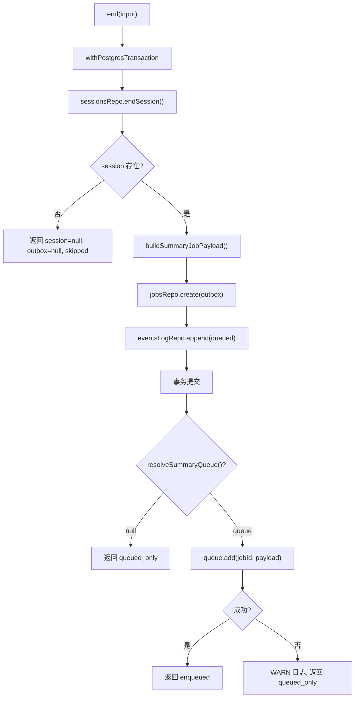

# EndSessionService.ts 需求说明

> 源文件：src/server/services/EndSessionService.ts ｜ 类型：源码 ｜ 行数：156 ｜ 所属模块：server/services ｜ 分析日期：2026-07-23

## 1. 文件定位总述

EndSessionService.ts 是会话结束与摘要排队的共享服务，同时服务于规范端点 `POST /v1/sessions/:id/end` 和遗留兼容适配器 `SessionsSummarizeAdapter`。它在 Postgres 事务中原子性地完成三件事：结束会话（设置 ended_at）、创建摘要生成 outbox 行（含 BullMQ payload 持久化）、追加事件日志。事务成功后尝试将任务发布到 BullMQ，若发布失败则降级为"仅入队"状态。该模块不得从 `src/services/worker/*` 导入（Phase 9 隔离约束）。

## 2. 功能需求

| 编号 | 需求描述（系统应当…） | 触发条件 / 输入 | 处理规则与输出 | 证据 |
|------|----------------------|----------------|---------------|------|
| FR-ENDSVC-01 | 系统应当在一个 Postgres 事务中原子性地结束会话、创建 outbox 行和追加事件日志 | 调用 `end(input: EndSessionInput)` | `withPostgresTransaction` 包裹三个操作：endSession、create outbox、append event log | `EndSessionService.ts:59-112` |
| FR-ENDSVC-02 | 系统应当在 outbox 行中持久化 BullMQ payload，确保重试和协调时可通过 Postgres 重新入队 | 创建 outbox 时 | payload 通过 `buildSummaryJobPayload` 构建，与 outbox.bullmqJobId 一起存储 | `EndSessionService.ts:74-101` |
| FR-ENDSVC-03 | 系统应当在事务成功后尝试将摘要任务发布到 BullMQ 队列 | 事务提交后 | 调用 `queue.add(jobId, payload)`，成功返回 `'enqueued'` | `EndSessionService.ts:121-154` |
| FR-ENDSVC-04 | 系统应当在 BullMQ 发布失败时降级为"仅入队"状态并记录 WARN 日志 | queue.add() 抛出异常时 | 返回 `enqueueState='queued_only'`，记录 WARN 日志 | `EndSessionService.ts:147-153` |
| FR-ENDSVC-05 | 系统应当在队列解析器返回 null 时降级为"仅入队"状态 | `resolveSummaryQueue()` 返回 null | 返回 `enqueueState='queued_only'`，不尝试发布 | `EndSessionService.ts:127-129` |
| FR-ENDSVC-06 | 系统应当在会话不存在时返回空 session 和空 outbox | endSession 返回 null | 返回 `{session: null, outbox: null, enqueueState: 'skipped'}` | `EndSessionService.ts:114-116` |
| FR-ENDSVC-07 | 系统应当将 API Key ID、Actor ID 和 sourceAdapter 传播到摘要任务的 BullMQ payload 中 | 构建 payload 时 | buildSummaryJobPayload 包含 apiKeyId、actorId、sourceAdapter 字段 | `EndSessionService.ts:83-86,135-143` |

## 3. 业务规则与约束

1. **事务原子性**：会话结束 + outbox 创建 + 事件日志三者必须在同一事务中完成（`EndSessionService.ts:59`）
2. **幂等性**：通过 UNIQUE 约束 `(team_id, project_id, source_type='session_summary', source_id)` 保证重复结束不产生重复 outbox 行（推断：由 Postgres 约束保证，注释在 SessionsSummarizeAdapter.ts 中）
3. **source 默认值**：默认为 `'http_post_v1_sessions_end'`（`EndSessionService.ts:57`）
4. **job type 固定**：`'observation_generate_session_summary'`（`EndSessionService.ts:29`）
5. **模块隔离**：不得从 `src/services/worker/*` 导入（`EndSessionService.ts:9-10`）
6. **outbox ID 生成**：使用 `newId()` 生成新 ID（`EndSessionService.ts:77`）

## 4. 对外暴露

| 导出项 | 类型 | 说明 |
|--------|------|------|
| `EndSessionServiceOptions` | interface | 构造选项（pool, resolveSummaryQueue） |
| `EndSessionResult` | interface | 返回结果（session, outbox, enqueueState） |
| `EndSessionInput` | interface | 输入参数（sessionId, projectId, teamId, source?, apiKeyId?, actorId?, sourceAdapter?） |
| `EndSessionService` | class | 会话结束服务 |

## 5. 依赖关系

- **上游**：`../../storage/postgres/generation-jobs.js`（outbox 仓库和事件日志仓库）、`../../storage/postgres/pool.js`（PostgresPool + withPostgresTransaction）、`../../storage/postgres/server-sessions.js`（会话仓库）、`../runtime/SessionGenerationPolicy.js`（buildSummaryJobId/buildSummaryJobPayload）、`../jobs/types.js`（GenerateSessionSummaryJob）、`./IngestEventsService.js`（EventQueueLike, EnqueueOutcome）
- **下游**：被 `/v1/sessions/:id/end` 路由和 `SessionsSummarizeAdapter` 调用

## 6. 数据结构

```typescript
type EnqueueOutcome = 'enqueued' | 'queued_only';

interface EndSessionResult {
  session: PostgresServerSession | null;
  outbox: PostgresObservationGenerationJob | null;
  enqueueState: EnqueueOutcome;
}
```

## 7. 复杂逻辑图示



## 8. 逆向备注

1. 注释说明该服务同时服务于规范端点和遗留适配器，两者必须产生相同的 Postgres 状态和队列效果（`EndSessionService.ts:3-7`）
2. payload 在创建时持久化到 Postgres 是为了支持协调器重试和验证 worker 的 `assertServerGenerationJobPayload`（`EndSessionService.ts:74-76`）
