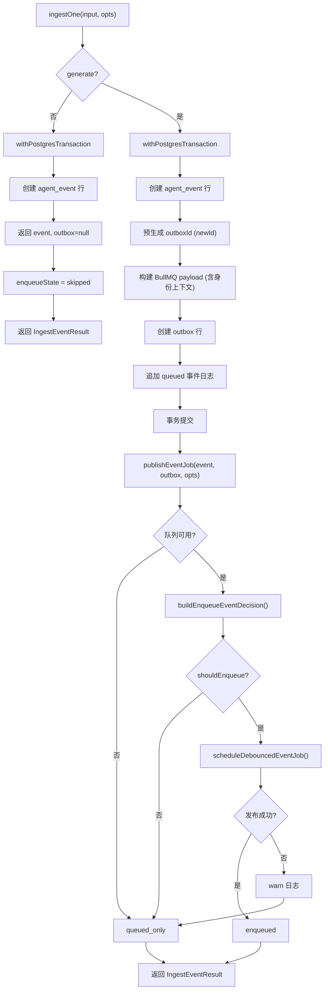

# IngestEventsService.ts 需求说明

> 源文件：src/server/services/IngestEventsService.ts ｜ 类型：源码 ｜ 行数：274 ｜ 所属模块：services ｜ 分析日期：2026-07-23

## 1. 文件定位总述

IngestEventsService 是 server-beta 事件摄入的核心服务，承担"写后发布"（write-then-publish）模式的统一实现。它集中了事件写入（agent_event 行 + outbox 行 + 生命周期事件日志）的数据库事务操作和事务提交后的 BullMQ 队列发布逻辑，供 `/v1/events`（标准 API）和 `SessionsObservationsAdapter`（兼容适配器）两个入口共用。该服务严格遵守不导入 worker 层代码的约束，确保 server-beta 核心与旧 worker 架构完全解耦。

## 2. 功能需求

| 编号 | 需求描述（系统应当…） | 触发条件 / 输入 | 处理规则与输出 | 证据 |
|------|----------------------|----------------|---------------|------|
| FR-ingest-01 | 系统应当在单个 Postgres 事务中原子性地写入 agent_event 行、outbox 行和初始事件日志 | 调用 `ingestOne(input, opts)` 且 `generate` 为 true | 使用 `withPostgresTransaction` 开启事务，依次创建 event 行、预生成 outboxId、构建 BullMQ 载荷、创建 outbox 行、追加 queued 事件日志；事务回滚则所有写入一起撤销 | `IngestEventsService.ts:103-154` |
| FR-ingest-02 | 系统应当在事务提交后，根据 SessionGenerationPolicy 决定是否将事件发布到 BullMQ | 事务成功提交且 outbox 行存在 | 调用 `publishEventJob()` 获取队列、构建入队决策、执行发布；决策为不入队时返回 `queued_only` | `IngestEventsService.ts:157-161` |
| FR-ingest-03 | 系统应当支持批量摄入事件，在同一个 Postgres 事务中写入多组 event + outbox 行 | 调用 `ingestBatch(inputs, opts)` | 遍历输入数组，在事务中依次创建每个事件的 agent_event 行、outbox 行和 queued 事件日志；事务提交后并行发布所有事件 | `IngestEventsService.ts:163-228` |
| FR-ingest-04 | 系统应当支持跳过生成环节（仅写入事件，不创建 outbox 行） | 调用时 `opts.generate` 为 false | 仅创建 agent_event 行，不创建 outbox 行和事件日志；enqueueState 返回 `skipped` | `IngestEventsService.ts:107-109` |
| FR-ingest-05 | 系统应当在队列解析器返回 null 时将 outbox 行保留为 queued 状态 | `resolveEventQueue()` 返回 null | 返回 `queued_only`，等待启动协调（`reconcileOnStartup`）在后续重新发布 | `IngestEventsService.ts:235-237` |
| FR-ingest-06 | 系统应当将身份上下文（API Key ID、Actor ID、Source Adapter、Request ID）注入到 BullMQ 载荷中 | 构建事件载荷时 | 载荷包含 `api_key_id`、`actor_id`、`source_adapter`、`request_id` 字段，用于生成 Worker 的审计追踪 | `IngestEventsService.ts:118-125` |
| FR-ingest-07 | 系统应当在 BullMQ 发布失败时不回滚已提交的事务，仅记录警告并将状态标记为 queued_only | `scheduleDebouncedEventJob()` 抛出异常 | 以 warn 级别记录 outboxId 和错误信息，返回 `queued_only`；outbox 行保持 queued 状态等待后续协调 | `IngestEventsService.ts:265-271` |
| FR-ingest-08 | 系统应当为每个 outbox 行预生成 UUID，确保护照的 BullMQ 载荷引用正确的 outbox ID | 创建 outbox 行前 | 调用 `newId()` 生成 outboxId，同时用于载荷的 `generation_job_id` 和 outbox 行的 `id` | `IngestEventsService.ts:117` |
| FR-ingest-09 | 系统应当在批量摄入中对每个事件独立处理发布结果 | 批量事务提交后 | 使用 `Promise.all` 并行处理每个事件的发布，每个事件独立返回 `enqueued`、`queued_only` 或 `skipped` | `IngestEventsService.ts:222-228` |
| FR-ingest-10 | 系统应当记录事件来源标识（source）到初始事件日志的 details 中 | 写入 queued 事件日志时 | 默认 source 为 `http_post_v1_events`（单条）或 `http_post_v1_events_batch`（批量），可通过 `opts.source` 覆盖 | `IngestEventsService.ts:101,151,168,215` |

## 3. 业务规则与约束

- **模块隔离**：本模块不得导入 `src/services/worker/*`，确保 server-beta 核心与旧 worker 架构解耦。`IngestEventsService.ts:9-11`
- **事务原子性**：event 行和 outbox 行在同一个 Postgres 事务中创建，要么同时成功要么同时回滚。`IngestEventsService.ts:103`
- **发布与写入分离**：BullMQ 发布在事务提交后执行（分步提交），发布失败不会回滚数据库写入。`IngestEventsService.ts:157-160`
- **队列惰性解析**：通过 `resolveEventQueue` 回调而非构造时注入，支持队列管理器在服务启动后延迟初始化。`IngestEventsService.ts:62-63`
- **策略传递**：`sessionPolicy` 和 `sessionDebounceWindowMs` 通过构造选项传入，传递给 `buildEnqueueEventDecision` 进行策略决策。`IngestEventsService.ts:239-245`

## 4. 对外暴露

| 导出项 | 类型 | 说明 |
|--------|------|------|
| `IngestEventsService` | 类 | 核心事件摄入服务 |
| `IngestEventsServiceOptions` | 接口 | 构造选项：pool、resolveEventQueue、sessionPolicy、sessionDebounceWindowMs |
| `EventQueueLike` | 接口 | 队列最小接口：add(jobId, payload, options?) |
| `IngestEventResult` | 接口 | 摄入结果：event、outbox、enqueueState |
| `IngestEventOptions` | 接口 | 摄入选项：generate、source、身份上下文字段 |
| `EnqueueOutcome` | 类型 | `'enqueued' \| 'queued_only' \| 'skipped'` |
| `ingestOne(input, opts?)` | 方法 | 单条事件摄入 |
| `ingestBatch(inputs, opts?)` | 方法 | 批量事件摄入 |

## 5. 依赖关系

- **上游**：`PostgresPool`（数据库连接）、`PostgresAgentEventsRepository`（事件存储）、`PostgresObservationGenerationJobRepository`（outbox 存储）、`PostgresObservationGenerationJobEventsRepository`（事件日志）、`withPostgresTransaction`（事务管理）、`buildEnqueueEventDecision` / `scheduleDebouncedEventJob`（策略调度）、`buildServerJobId`（ID 生成）
- **下游调用者**：`/v1/events` 路由处理器（标准 API）、`SessionsObservationsAdapter`（兼容适配器）

## 6. 数据结构

### IngestEventResult
```typescript
interface IngestEventResult {
  event: PostgresAgentEvent;                          // 写入的事件行
  outbox: PostgresObservationGenerationJob | null;    // 写入的 outbox 行（generate=false 时为 null）
  enqueueState: EnqueueOutcome;                         // 发布状态
}
```

### IngestEventOptions
```typescript
interface IngestEventOptions {
  generate?: boolean;              // 是否生成观测（默认 true）
  source?: string;                  // 事件来源标识
  apiKeyId?: string | null;        // Phase 11: API Key ID
  actorId?: string | null;          // Phase 11: Actor ID
  sourceAdapter?: string | null;    // 来源适配器
  requestId?: string | null;        // Phase 12: 请求关联 ID
}
```

## 7. 复杂逻辑图示



上图展示了 `ingestOne` 的完整流程：事务内的原子性写入和事务后的策略驱动队列发布。批量摄入 `ingestBatch` 在事务内循环执行相同写入逻辑，事务后并行发布。

## 8. 逆向备注

- `resolveEventQueue` 被设计为回调函数而非直接注入队列实例，推断：这是为了避免循环依赖——IngestEventsService 在启动时可能早于队列管理器创建，通过惰性解析延迟绑定。`IngestEventsService.ts:61-63`
- 发布阶段使用 `queue as never` 类型断言，推断：`EventQueueLike` 的 `add` 签名与 `DebounceableEventQueue.add` 结构兼容但泛型约束不同，需强制绕过 TypeScript 检查。`IngestEventsService.ts:263`
- 批量摄入的 BullMQ 载荷中 `requestId` 对所有事件共用同一个值，推断：批量请求的 requestId 在外层请求中间件生成，一次批量操作视为同一请求。
