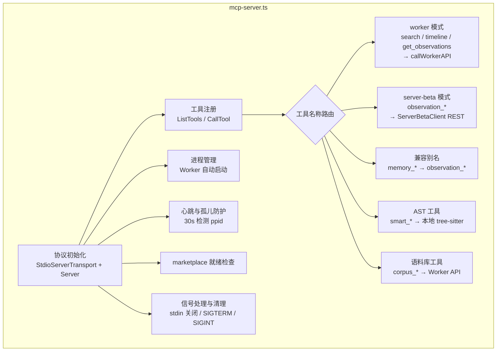

# SERVERS 模块汇总

> 分析范围：`doc/src/servers/mcp-server.ts.md` ｜ 分析日期：2026-07-23

## 1. 模块职责总述

servers 模块是 claude-mem 作为 MCP（Model Context Protocol）服务器的主入口，通过 stdio 传输层向 Claude Code 暴露全部工具集。该模块承载两种运行时——**worker 模式**通过本地 HTTP 调用 Worker 进程的搜索/时间线/批量观察等能力，**server-beta 模式**通过 REST 客户端直连远端 API 完成观察写入、搜索与事件记录。此外，模块还负责 Worker 自动启动、父进程心跳检测与孤儿防护、marketplace 目录就绪检查等基础设施职责。

## 2. 功能需求汇总

| 编号 | 需求描述 | 来源 |
|------|---------|------|
| FR-MCPServer-01 | 通过 stdio 传输层启动 MCP 服务器并注册工具列表与调用处理器 | [mcp-server.ts.md](mcp-server.ts.md) |
| FR-MCPServer-02 | 拦截 `console.log` 以保护 MCP 协议不受 stdout 污染 | [mcp-server.ts.md](mcp-server.ts.md) |
| FR-MCPServer-03 | 提供 3 层搜索工作流指引工具 `__IMPORTANT` | [mcp-server.ts.md](mcp-server.ts.md) |
| FR-MCPServer-04 | 提供 `search` 工具，通过 Worker GET `/api/search` 执行记忆搜索 | [mcp-server.ts.md](mcp-server.ts.md) |
| FR-MCPServer-05 | 提供 `timeline` 工具，通过 Worker GET `/api/timeline` 获取时间线上下文 | [mcp-server.ts.md](mcp-server.ts.md) |
| FR-MCPServer-06 | 提供 `get_observations` 工具，通过 Worker POST `/api/observations/batch` 批量获取观察详情 | [mcp-server.ts.md](mcp-server.ts.md) |
| FR-MCPServer-07 | 提供 `observation_add` 工具，在 server-beta 模式下插入手动观察 | [mcp-server.ts.md](mcp-server.ts.md) |
| FR-MCPServer-08 | 提供 `observation_record_event` 工具，在 server-beta 模式下记录代理事件 | [mcp-server.ts.md](mcp-server.ts.md) |
| FR-MCPServer-09 | 提供 `observation_search` 工具，在 server-beta 模式下全文搜索观察 | [mcp-server.ts.md](mcp-server.ts.md) |
| FR-MCPServer-10 | 提供 `observation_context` 工具，在 server-beta 模式下获取上下文注入用的观察 | [mcp-server.ts.md](mcp-server.ts.md) |
| FR-MCPServer-11 | 提供 `observation_generation_status` 工具，查询观察生成作业状态 | [mcp-server.ts.md](mcp-server.ts.md) |
| FR-MCPServer-12 | 提供 `memory_add`、`memory_search`、`memory_context` 兼容别名工具，委托给对应的 observation_* 处理器 | [mcp-server.ts.md](mcp-server.ts.md) |
| FR-MCPServer-13 | 提供 `smart_search` 工具，使用 tree-sitter AST 搜索代码库 | [mcp-server.ts.md](mcp-server.ts.md) |
| FR-MCPServer-14 | 提供 `smart_unfold` 工具，展开指定符号的完整源码 | [mcp-server.ts.md](mcp-server.ts.md) |
| FR-MCPServer-15 | 提供 `smart_outline` 工具，获取文件结构大纲（折叠体） | [mcp-server.ts.md](mcp-server.ts.md) |
| FR-MCPServer-16 | 提供知识语料库工具组：`build_corpus`、`list_corpora`、`prime_corpus`、`query_corpus`、`rebuild_corpus`、`reprime_corpus` | [mcp-server.ts.md](mcp-server.ts.md) |
| FR-MCPServer-17 | 启动后尝试自动连接或启动 Worker（非 server-beta 模式时） | [mcp-server.ts.md](mcp-server.ts.md) |
| FR-MCPServer-18 | 检测父进程是否死亡并在检测到时自动退出，防止孤儿进程 | [mcp-server.ts.md](mcp-server.ts.md) |
| FR-MCPServer-19 | 启动时检查 marketplace 目录是否存在，缺失时输出诊断日志 | [mcp-server.ts.md](mcp-server.ts.md) |
| FR-MCPServer-20 | 在 stdin 关闭、stdio 错误、SIGTERM、SIGINT 时执行清理并退出码 0 | [mcp-server.ts.md](mcp-server.ts.md) |

## 3. 模块内部结构

当前 servers 模块由单一文件 `mcp-server.ts` 构成，内聚了 MCP 协议通信、工具注册、双运行时路由与进程生命周期管理。内部按职责可划分为以下逻辑区段：

- **协议初始化区**：stdio 传输层创建、Server 实例连接、console.log 劫持（FR-01, FR-02）
- **工具注册区**：全部 MCP 工具定义及 CallTool 处理器分发（FR-03 ~ FR-16）
- **运行时选择区**：server-beta / worker 双模态切换与校验逻辑
- **进程管理区**：Worker 自动启动、父进程心跳检测、信号处理与清理（FR-17 ~ FR-20）

## 4. 对外接口

模块通过 MCP 协议（stdio 传输）向 Claude Code 暴露以下工具：

| 工具名 | 类型 | 说明 |
|--------|------|------|
| `__IMPORTANT` | 指引工具 | 3 层搜索工作流说明 |
| `search` | 功能工具 | Worker 模式记忆搜索 |
| `timeline` | 功能工具 | Worker 模式时间线上下文 |
| `get_observations` | 功能工具 | Worker 模式批量获取观察 |
| `observation_add` | 功能工具 | server-beta 写入观察 |
| `observation_record_event` | 功能工具 | server-beta 记录代理事件 |
| `observation_search` | 功能工具 | server-beta 全文搜索 |
| `observation_context` | 功能工具 | server-beta 上下文获取 |
| `observation_generation_status` | 功能工具 | server-beta 作业状态查询 |
| `memory_add` / `memory_search` / `memory_context` | 兼容工具 | 委托给对应 observation_* |
| `smart_search` / `smart_unfold` / `smart_outline` | 功能工具 | AST 代码搜索与导航 |
| `build_corpus` / `list_corpora` / `prime_corpus` / `query_corpus` / `rebuild_corpus` / `reprime_corpus` | 功能工具 | 知识语料库管理 |

模块本身不导出 TypeScript 类型或事件供其他内部模块直接调用；它是系统的最外层入口，通过 MCP 协议与外部通信。

## 5. 数据与外部资源

### 下游 HTTP 端点（模块消费）

| 端点 | 所属运行时 | 用途 |
|------|-----------|------|
| Worker GET `/api/search` | worker | 记忆搜索 |
| Worker GET `/api/timeline` | worker | 时间线上下文 |
| Worker POST `/api/observations/batch` | worker | 批量获取观察 |
| Worker `/api/corpus/*` | worker | 语料库 CRUD |
| server-beta POST `/v1/memories` | server-beta | 写入观察 |
| server-beta POST `/v1/events` | server-beta | 记录事件 |
| server-beta GET `/v1/search` | server-beta | 全文搜索（GIN tsvector 索引） |
| server-beta GET `/v1/context` | server-beta | 上下文注入 |
| server-beta GET `/v1/jobs/:id` | server-beta | 作业状态查询 |

### 文件系统路径

- marketplace 目录（多个候选路径，启动时检查就绪性）

### 环境变量

| 变量 | 用途 |
|------|------|
| `CLAUDE_MEM_RUNTIME` | 运行时选择（`server-beta` 或默认 worker） |
| `__DEFAULT_PACKAGE_VERSION__` | 构建时注入的包版本号，fallback 为 `0.0.0-dev` |

## 6. 存疑与备注

- `__IMPORTANT` 工具名使用双下划线前缀，推断是为了在工具列表中排在最前面，引导 LLM 优先阅读工作流指引。（未在代码中证实/推断）
- `packageVersion` 通过构建时注入的 `__DEFAULT_PACKAGE_VERSION__` 常量获取，fallback 为 `'0.0.0-dev'`。
- `main()` 中的 fatal catch 回调使用 `process.exit(0)` 而非 `process.exit(1)`，遵循项目退出码策略（不阻塞宿主终端）。
