# services 模块汇总

## 1. 模块职责总述

services 模块是 claude-mem 系统的核心服务层，承担三大职责：运行本地 HTTP Worker 服务（Express 服务器 + AI Provider 管理 + 后台任务调度）、持久化数据存储（SQLite 数据库 + Schema 版本化迁移 + 全文搜索）以及外部集成（向量同步、Transcript 监听、IDE 安装器）。该模块以 `worker-service.ts`（1673 行）为编排中枢，向下管理 18 个子目录共计约 160 个源文件，覆盖数据库 CRUD、AI 会话处理、搜索编排、HTTP 路由、报告生成、知识语料库、同步代理等完整业务能力。模块采用分层架构：基础设施层（进程管理、健康监控）支撑服务层（数据库、Worker、Server），服务层向上暴露 HTTP 路由供 CLI hook 层和 Viewer UI 消费。

## 2. 功能需求汇总

> 以下按子模块合并去重各文件的 FR 表。由于子模块数量庞大（18 个子目录、168 个文档文件），此处仅收录各子模块核心文件的代表性需求，完整需求详见各子文件文档。

### worker-service.ts（核心编排器，1673 行）

| 编号 | 需求描述 | 来源 |
|------|----------|------|
| FR-Lifecycle-01 | 启动 Worker 进程并监听指定端口和绑定地址 | worker-service.ts |
| FR-Lifecycle-02 | 启动前拒绝重复实例（PID + 端口双重检查） | worker-service.ts |
| FR-Lifecycle-03 | 按顺序执行后台初始化：模式加载->迁移->报告调度->DB->搜索->Transcript->Chroma->MCP | worker-service.ts |
| FR-Lifecycle-04 | 关闭时依次停止 settings/transcript/report 监听器后优雅关闭 | worker-service.ts |
| FR-Routes-01 | Server 模式下所有路由前置 serverApiGate 中间件 | worker-service.ts |
| FR-Routes-02 | 数据库未初始化时 `/api` 路径返回 503 | worker-service.ts |
| FR-Routes-04 | 注册约 15 个路由组（Viewer/Session/Data/Report/Settings/Logs/Memory/Chroma/Admin/Sync/Search/Corpus 等） | worker-service.ts |
| FR-Session-01 | 按优先级选择 AI Provider（Qwen > OpenRouter > Gemini > Claude） | worker-service.ts |
| FR-Session-02 | 启动会话处理器驱动 AI Provider 执行会话生成 | worker-service.ts |
| FR-Session-03 | 对不可恢复错误终止生成器且不重启 | worker-service.ts |
| FR-Session-05 | 检测会话终止错误触发备用 Provider 链（Gemini->OpenRouter->放弃） | worker-service.ts |
| FR-Sync-01 | Client 模式下同步启用时启动 SyncAgent | worker-service.ts |
| FR-Sync-02 | 首次启动失败时监听 settings.json 变更自动重试 | worker-service.ts |
| FR-CLI-01 | 解析并分发 CLI 命令：start/stop/restart/status/hook/generate/clean/adopt/server-* 等 | worker-service.ts |
| FR-SSE-01 | 处理队列变化时通过 SSE 广播处理状态 | worker-service.ts |

### worker-spawner.ts

| 编号 | 需求描述 | 来源 |
|------|----------|------|
| FR-ws-01 | Hook 调用前确保 worker 已启动（多阶段检测） | worker-spawner.ts |
| FR-ws-02 | 通过 PID 文件检测现有 worker | worker-spawner.ts |
| FR-ws-03 | 快速健康探测判断 worker 是否运行 | worker-spawner.ts |
| FR-ws-04 | Windows 上实现 2 分钟启动冷却锁 | worker-spawner.ts |
| FR-ws-06 | 守护进程 spawn 启动 worker | worker-spawner.ts |

### sqlite/（数据持久层）

| 编号 | 需求描述 | 来源 |
|------|----------|------|
| FR-CREATE-01 | 创建 SQLite 连接并配置 PRAGMA（WAL、内存临时存储、256MB mmap、10K 页缓存） | sqlite/Database.ts |
| FR-SINGLETON-01 | DatabaseManager 单例模式 | sqlite/Database.ts |
| FR-INIT-01 | 异步初始化数据库并执行迁移 | sqlite/Database.ts |
| FR-MIGRATE-01 | 仅执行版本号大于已应用版本的迁移 | sqlite/Database.ts |
| FR-MIG-01 | 实例化时自动创建基础表（schema_versions/sdk_sessions/observations/session_summaries） | sqlite/SessionStore.ts |
| FR-MIG-02 | 按版本号顺序执行增量迁移，已应用的跳过 | sqlite/SessionStore.ts |
| FR-MIG-05 | 创建 FTS5 全文搜索虚拟表及同步触发器 | sqlite/SessionStore.ts |
| FR-OBS-01 | 存储单条观测记录，基于 (memory_session_id, content_hash) 去重 | sqlite/SessionStore.ts |
| FR-OBS-03 | 批量存储观测并原子性标记 pending_messages 完成 | sqlite/SessionStore.ts |
| FR-SESS-01 | 创建 SDK 会话记录（content_session_id + project + platform_source） | sqlite/SessionStore.ts |
| FR-SUM-01 | 存储单条会话摘要 | sqlite/SessionStore.ts |
| FR-PROMPT-01 | 存储用户提示，支持优先使用 hook 事件时间戳 | sqlite/SessionStore.ts |
| FR-SS-01 | 构造时自动检测 FTS5 可用性并创建全文索引表及同步触发器 | sqlite/SessionSearch.ts |
| FR-SS-03 | 支持对 observations 表进行全文关键词搜索（FTS5 MATCH） | sqlite/SessionSearch.ts |
| FR-SS-08 | 支持按文件路径查找关联的 observations 和 session_summaries | sqlite/SessionSearch.ts |
| FR-pms-01 | 消息入队到持久化队列（INSERT OR IGNORE 幂等） | sqlite/PendingMessageStore.ts |
| FR-pms-02 | 原子认领下一条待处理消息（UPDATE...RETURNING） | sqlite/PendingMessageStore.ts |
| FR-SCHEMA-01 | 首次初始化创建核心持久化表（sessions/memories/overviews/diagnostics/transcript_events） | sqlite/migrations.ts |
| FR-SCHEMA-04 | 建立 SDK Agent 架构相关表（sdk_sessions/observations/session_summaries） | sqlite/migrations.ts |
| FR-SCHEMA-06 | 创建 FTS5 全文检索虚拟表及同步触发器（不可用时降级） | sqlite/migrations.ts |

### context/（上下文生成）

| 编号 | 需求描述 | 来源 |
|------|----------|------|
| FR-GEN-01 | 生成项目上下文文本（查询数据库->渲染时间线->拼接输出） | context/ContextBuilder.ts |
| FR-PROJ-01 | 自动解析当前工作目录对应的项目 | context/ContextBuilder.ts |
| FR-MULTI-01 | 支持多项目上下文查询 | context/ContextBuilder.ts |
| FR-QOBS-01 | 按类型和概念查询单项目观测记录 | context/ObservationCompiler.ts |
| FR-TL-BUILD-01 | 将观测和摘要合并为统一时间线（按时间正序） | context/ObservationCompiler.ts |
| FR-CCL-01 | 从设置文件和活动模式加载完整上下文配置 | context/ContextConfigLoader.ts |
| FR-TokenCalc-01 | 估算单条观察记录的 token 数量（字符数/4） | context/TokenCalculator.ts |

### worker/（Worker 核心子模块）

| 编号 | 需求描述 | 来源 |
|------|----------|------|
| FR-SessionMgmt | 会话生命周期管理（ActiveSession 队列、生成器控制、token 统计） | worker/SessionManager.ts |
| FR-Provider | Claude/Gemini/OpenRouter/Qwen 四种 AI Provider 封装 | worker/{Claude,Gemini,OpenRouter,Qwen}Provider.ts |
| FR-Search | 搜索编排（SQLite+ChromaDB+混合搜索策略+过滤+分页+排序） | worker/search/ |
| FR-Knowledge | 知识语料库管理（CorpusBuilder/CorpusStore/KnowledgeAgent） | worker/knowledge/ |
| FR-Report | 定时报告生成与调度（ReportScheduler/ReportGenerator/DailyReport） | worker/reports/ |
| FR-Settings | 设置读写管理 | worker/SettingsManager.ts |
| FR-Branch | Git 分支管理（BranchManager） | worker/BranchManager.ts |
| FR-Retry | 请求重试机制（retry.ts） | worker/retry.ts |
| FR-RateLimit | 速率限制存储（RateLimitStore） | worker/RateLimitStore.ts |

### server/（HTTP 服务层）

| 编号 | 需求描述 | 来源 |
|------|----------|------|
| FR-Server | Express HTTP 服务器封装（路由注册、错误处理、CORS、bodyParser） | server/Server.ts |
| FR-Middleware | HTTP 中间件（allowed-constants/flushResponseThen/Middleware） | server/ |
| FR-ErrorHandler | 统一错误处理（AppError 类及 HTTP 错误响应） | server/ErrorHandler.ts |

### worker/http/（HTTP 路由层）

| 编号 | 需求描述 | 来源 |
|------|----------|------|
| FR-Route | 约 18 个路由组覆盖全部 API 端点 | worker/http/routes/*.ts |
| FR-Auth | Token 认证、Server API Gate、白名单执行、Body 校验中间件 | worker/http/middleware/*.ts |
| FR-BaseRoute | 路由处理基类（BaseRouteHandler） | worker/http/BaseRouteHandler.ts |
| FR-AdminSession | 管理员会话存储（AdminSessionStore） | worker/http/AdminSessionStore.ts |

### sync/（同步子模块）

| 编号 | 需求描述 | 来源 |
|------|----------|------|
| FR-ChromaSync | ChromaDB 向量同步（MCP 连接、批量回填、状态追踪） | sync/ChromaSync.ts |
| FR-ChromaMcp | Chroma MCP 管理器（懒连接、连接状态监控） | sync/ChromaMcpManager.ts |
| FR-SyncAgent | 上游同步代理（增量推送、watermark、auth 认证链） | sync/SyncAgent.ts |
| FR-SyncAuth | 同步认证（ApiKeyAuth/NoopAuth/多模式支持） | sync/auth/ |

### transcripts/（Transcript 监听）

| 编号 | 需求描述 | 来源 |
|------|----------|------|
| FR-Watch | 文件系统监听 Claude Code 的 JSONL transcript 文件变化 | transcripts/watcher.ts |
| FR-Process | transcript 文件解析与处理（字段提取、状态转换） | transcripts/processor.ts |
| FR-Config | transcript 监听配置（路径映射、排除列表） | transcripts/config.ts |

### infrastructure/（基础设施）

| 编号 | 需求描述 | 来源 |
|------|----------|------|
| FR-ProcessMgr | 进程管理（PID 文件、守护进程 spawn、端口检测） | infrastructure/ProcessManager.ts |
| FR-HealthMon | 健康监控（端口探测、readiness 检查、超时处理） | infrastructure/HealthMonitor.ts |
| FR-GracefulShutdown | 优雅关闭（HTTP Server、SessionManager、MCP Client、DB、Chroma） | infrastructure/GracefulShutdown.ts |
| FR-Cleanup | V12.4.3 版本一次性清理 | infrastructure/CleanupV12_4_3.ts |
| FR-Worktree | Git worktree 领养（检测已合并的 worktree 分支并清理） | infrastructure/WorktreeAdoption.ts |

### integrations/（IDE 集成安装器）

| 编号 | 需求描述 | 来源 |
|------|----------|------|
| FR-Install | 各 IDE 的 hooks 安装器（Cursor/Gemini CLI/Windsurf/Codex/OpenCode/OpenClaw） | integrations/*.ts |
| FR-McpIntegrations | MCP 集成管理 | integrations/McpIntegrations.ts |
| FR-Telegram | Telegram 通知集成 | integrations/TelegramNotifier.ts |

### hooks/（运行时钩子）

| 编号 | 需求描述 | 来源 |
|------|----------|------|
| FR-RuntimeSelector | 运行时选择器（本地 Worker vs Server Beta 云端） | hooks/runtime-selector.ts |
| FR-ServerBeta | Server Beta 客户端（启动/停止云端会话、事件记录、认证错误判断） | hooks/server-beta-client.ts |
| FR-ServerBetaBootstrap | Server Beta 服务引导启动 | hooks/server-beta-bootstrap.ts |

### 其他子模块

| 编号 | 需求描述 | 来源 |
|------|----------|------|
| FR-ModeManager | 运行模式管理（加载/切换/获取活动模式及观测类型配置） | domain/ModeManager.ts |
| FR-QueueProcessor | 会话队列处理器（SessionQueueProcessor） | queue/SessionQueueProcessor.ts |
| FR-ShutdownHelper | 关闭辅助（shutdown-helper.ts） | install/shutdown-helper.ts |
| FR-SmartFileRead | 智能文件读取（parser + search，代码文件解析） | smart-file-read/ |

## 3. 模块内部结构

```mermaid
flowchart TB
    subgraph 入口层
        WS["worker-service.ts<br/>核心编排中枢 (1673行)"]
        WSP["worker-spawner.ts<br/>守护进程启动"]
        WT["worker-types.ts<br/>核心类型定义"]
        CG["context-generator.ts<br/>上下文桶导出"]
    end

    subgraph worker["worker/ Worker 子模块"]
        SM["SessionManager<br/>会话生命周期"]
        CP["ClaudeProvider"]
        GP["GeminiProvider"]
        OP["OpenRouterProvider"]
        QP["QwenProvider"]
        DM["DatabaseManager"]
        SRM["SearchManager"]
        SSE["SSEBroadcaster"]
        BM["BranchManager"]
        FS["FormattingService"]
        TS["TimelineService"]
        SetM["SettingsManager"]
        RG["RestartGuard"]
        PA["PaginationHelper"]
        RLS["RateLimitStore"]
    end

    subgraph worker_http["worker/http/ HTTP 路由"]
        BRH["BaseRouteHandler"]
        MID["middleware/<br/>tokenAuth/serverApiGate<br/>enforceAllowList/validateBody"]
        R["18 个路由组<br/>Viewer/Session/Data/Report<br/>Settings/Logs/Memory/Chroma<br/>Admin/Auth/Sync/Search<br/>Corpus/Users/Viewer"]
        ASM["AdminSessionStore"]
    end

    subgraph worker_agents["worker/agents/"]
        RP["ResponseProcessor"]
        OB["ObservationBroadcaster"]
        FEH["FallbackErrorHandler"]
        SCH["SessionCleanupHelper"]
    end

    subgraph worker_search["worker/search/"]
        SO["SearchOrchestrator"]
        CSS["ChromaSearchStrategy"]
        HYS["HybridSearchStrategy"]
        SSS["SQLiteSearchStrategy"]
        FIL["DateFilter/ProjectFilter<br/>TypeFilter"]
        RF["ResultFormatter"]
        TB["TimelineBuilder"]
    end

    subgraph worker_knowledge["worker/knowledge/"]
        CB["CorpusBuilder"]
        CR["CorpusRenderer"]
        CS["CorpusStore"]
        KA["KnowledgeAgent"]
    end

    subgraph worker_reports["worker/reports/"]
        RS["ReportScheduler"]
        RG["ReportGenerator"]
        DRG["DailyReportGenerator"]
        BT["batch.ts"]
        MH["mdToHtml.ts"]
    end

    subgraph worker_session["worker/session/"]
        SCEH["SessionCompletionHandler"]
        GEH["GeneratorExitHandler"]
    end

    subgraph sqlite["sqlite/ 数据持久层"]
        DB["Database.ts<br/>连接管理+迁移框架"]
        SS["SessionStore.ts<br/>核心DAL (3632行)"]
        SESR["SessionSearch.ts<br/>全文搜索 (597行)"]
        PMS["PendingMessageStore.ts<br/>消息队列"]
        MIG["migrations.ts<br/>Schema 定义"]
        OBS["Observations/"]
        SUM["Summaries/"]
        PRM["Prompts/"]
        SES["Sessions/"]
        TL["Timeline/"]
        IMP["Import/"]
        BLK["bulk.ts"]
        TXN["transactions.ts"]
    end

    subgraph context["context/ 上下文生成"]
        CTX["ContextBuilder.ts<br/>上下文编排器"]
        OC["ObservationCompiler.ts<br/>数据查询"]
        CCL["ContextConfigLoader.ts<br/>配置加载"]
        TC["TokenCalculator.ts<br/>Token 经济学"]
        AF["AgentFormatter"]
        HF["HumanFormatter"]
        HR["HeaderRenderer"]
        TR["TimelineRenderer"]
        FR["FooterRenderer"]
    end

    subgraph server["server/ HTTP 服务"]
        SVR["Server.ts<br/>Express 封装"]
        MW["Middleware"]
        EH["ErrorHandler"]
    end

    subgraph sync["sync/ 同步"]
        CHS["ChromaSync"]
        CMM["ChromaMcpManager"]
        CSSS["ChromaSyncState"]
        SA["SyncAgent"]
        SP["payload.ts"]
        SL["sync-state.ts"]
        EL["error-log.ts"]
        AUTH["auth/"]
    end

    subgraph transcripts["transcripts/"]
        TW["watcher.ts"]
        TP["processor.ts"]
        TCF["config.ts"]
        TCL["cli.ts"]
        TS["state.ts"]
        TFU["field-utils.ts"]
        TWE["transcript-watcher-entry.ts"]
    end

    subgraph infra["infrastructure/ 基础设施"]
        PM["ProcessManager"]
        HM["HealthMonitor"]
        GS["GracefulShutdown"]
        CLN["CleanupV12_4_3"]
        WTA["WorktreeAdoption"]
    end

    subgraph integrations["integrations/"]
        CCI["CodexCliInstaller"]
        CHI["CursorHooksInstaller"]
        GHI["GeminiCliHooksInstaller"]
        WHI["WindsurfHooksInstaller"]
        OCI["OpenCodeInstaller"]
        OCLI["OpenClawInstaller"]
        MI["McpIntegrations"]
        TN["TelegramNotifier"]
    end

    subgraph hooks["hooks/ 运行时"]
        RS["runtime-selector.ts"]
        SBC["server-beta-client.ts"]
        SBB["server-beta-bootstrap.ts"]
    end

    subgraph domain["domain/"]
        MM["ModeManager"]
    end

    subgraph queue["queue/"]
        SQP["SessionQueueProcessor"]
    end

    subgraph smart["smart-file-read/"]
        SFP["parser.ts"]
        SFS["search.ts"]
    end

    WS --> WSP
    WS --> CG
    WS --> SM
    WS --> DM
    WS --> SRM
    WS --> SSE
    WS --> TS
    WS --> CHS
    WS --> SA

    SM --> CP & GP & OP & QP
    SM --> RP
    SM --> OB
    SM --> SSE
    SM --> PMS
    SM --> TS
    SM --> SetM
    SM --> RG

    DM --> SS & DB

    SRM --> SO
    SO --> CSS & HYS & SSS
    SO --> FIL
    SO --> RF
    SO --> TB

    CG --> CTX
    CTX --> OC
    CTX --> CCL
    CTX --> TC
    CTX --> HR & TR & FR

    SS --> SESR
    SS --> PMS
    PMS --> SM

    WS --> SVR
    SVR --> MID & EH
    SVR --> R
    R --> BRH & MID

    SA --> AUTH
    SA --> SP
    SA --> SL

    WS --> PM & HM & GS
    WS --> RS
    RS --> RG & DRG

    WS --> MM
    WS --> SQP

    style WS fill:#d94a4a,color:#fff
    style SS fill:#4a90d9,color:#fff
    style WS fill:#d94a4a,color:#fff
```

**子模块间依赖关系说明：**

- **worker-service.ts** 是顶层编排中枢，向下管理所有子模块的初始化和生命周期。
- **worker/** 子目录包含 Worker 运行时的核心组件（会话管理、Provider、搜索、报告等）。
- **sqlite/** 是数据持久层，被 worker/ 和 context/ 共同依赖。SessionStore.ts（3632 行）是最大的单体文件，承载全部 CRUD 和 43 个 schema 迁移。
- **context/** 是上下文生成子系统，被 CLI hook 层和 Worker API 共同消费。
- **server/** 和 **worker/http/** 构成 HTTP 服务层，前者是 Express 封装，后者是路由注册。
- **sync/** 提供向量同步和上游同步能力，由 worker-service.ts 在后台初始化时启动。
- **transcripts/** 监听文件系统变化，由 worker-service.ts 按配置条件启动。
- **infrastructure/** 提供进程管理、健康监控、优雅关闭等底层能力。
- **integrations/** 包含各 IDE 平台的 hooks 安装器，由 CLI 命令触发。
- **hooks/** 提供 Server Beta 云端运行时支持，被 CLI 处理器层依赖。
- **domain/** 提供运行模式管理（ModeManager），被 context 配置加载器依赖。

## 4. 对外接口

### HTTP API 端点（约 18 个路由组）

| 路由组 | 典型路径 | 模式 |
|--------|---------|------|
| ViewerRoutes | `/api/viewer/*` | 全模式 |
| SessionRoutes | `/api/sessions/*` | 全模式 |
| DataRoutes | `/api/data/*` | 全模式 |
| ReportRoutes | `/api/reports/*` | 全模式 |
| DailyReportRoutes | `/api/daily-reports/*` | 全模式 |
| SettingsRoutes | `/api/settings/*` | 全模式 |
| LogsRoutes | `/api/logs/*` | 全模式 |
| MemoryRoutes | `/api/memory/*` | 全模式 |
| ServerV1Routes | `/v1/*` | 全模式 |
| SearchRoutes | 搜索端点 | 全模式（DB 初始化后） |
| CorpusRoutes | `/api/corpus/*` | 全模式 |
| ChromaRoutes | `/chroma/*` | 全模式 |
| AdminRoutes | `/api/admin/*` | 全模式 |
| SyncStatusRoutes | `/api/sync/status` | 全模式 |
| UsersRoutes | `/api/users/*` | 仅 Server |
| AuthRoutes | `/api/auth/*` | 仅 Server |
| SyncRoutes | `/api/sync/ingest` | 仅 Server |
| ViewerRoutes | 静态页面 | 全模式 |

### 核心导出

| 导出 | 所属文件 | 用途 |
|------|----------|------|
| `WorkerService` | worker-service.ts | 核心服务类 |
| `ensureWorkerStarted()` | worker-service.ts | Worker 启动保证 |
| `WorkerStartResult` | worker-spawner.ts | Worker 启动结果类型 |
| `SessionStore` | sqlite/SessionStore.ts | 核心数据访问层 |
| `SessionSearch` | sqlite/SessionSearch.ts | 全文搜索服务 |
| `PendingMessageStore` | sqlite/PendingMessageStore.ts | 消息持久化队列 |
| `generateContext` | context/ContextBuilder.ts | 上下文生成入口 |
| `SyncAgent` | sync/SyncAgent.ts | 上游同步代理 |
| `ChromaSync` | sync/ChromaSync.ts | 向量同步 |
| `ModeManager` | domain/ModeManager.ts | 运行模式管理 |

## 5. 数据与外部资源

### 外部依赖

| 依赖 | 用途 | 涉及文件 |
|------|------|----------|
| `bun:sqlite` | SQLite 数据库驱动 | sqlite/ 全部 |
| `@modelcontextprotocol/sdk` | MCP Client，用于 Chroma 连接和 loopback 自检 | worker-service.ts, sync/ChromaMcpManager.ts |
| `shell-quote` | Shell 命令解析 | cli/adapters/codex-file-context.ts |
| Express 及生态 | HTTP 服务器 | server/Server.ts |
| Child Process | 守护进程 spawn | worker-service.ts, infrastructure/ProcessManager.ts |
| Node.js fs/path/os | 文件系统操作 | 多处 |

### 核心数据表

| 表名 | 主键 | 核心用途 |
|------|------|----------|
| sdk_sessions | id AUTO | 会话主表（content_session_id UNIQUE） |
| observations | id AUTO | 观测记录（memory_session_id FK, content_hash 去重） |
| session_summaries | id AUTO | 会话摘要（memory_session_id FK） |
| user_prompts | id AUTO | 用户提示（content_session_id FK） |
| pending_messages | id AUTO | 待处理消息队列（status: pending/processing） |
| schema_versions | id AUTO | 迁移版本追踪 |
| sync_inbox | id AUTO | 同步去重（server-only） |
| weekly_reports | id AUTO | 周报表 |
| daily_reports | id AUTO | 日报表 |
| observation_feedback | id AUTO | 观测使用反馈 |
| observations_fts | 虚拟表 | FTS5 全文索引（同步触发器） |
| session_summaries_fts | 虚拟表 | FTS5 全文索引（同步触发器） |

### 数据库路径

- 默认位置：`~/.claude-mem/claude-mem.db`
- 可通过 `CLAUDE_MEM_DATA_DIR` 环境变量自定义
- Server-only 表（sync_inbox）通过 `CLAUDE_MEM_NODE_ROLE` 角色判断

### 端口与网络

- Worker 端口：默认 `37700 + (uid % 100)`，可通过 `CLAUDE_MEM_WORKER_PORT` 覆盖
- 绑定地址：Client 模式固定 127.0.0.1，Server 模式可通过 `CLAUDE_MEM_SERVER_BIND_HOST` 配置
- 非回环地址绑定触发警告日志

## 6. 存疑与备注

1. **SessionStore 体积问题**：SessionStore.ts 达 3632 行，承载了 43 个 schema 迁移版本和 60+ 个公开方法。尽管新版 Database.ts + migrations.ts 已拆分迁移框架，但 SessionStore 仍保留了大量遗留迁移代码和 CRUD 方法，是技术债务的主要集中点。

2. **双迁移体系并存**：Database.ts 的 `DatabaseManager` + `MigrationRunner` 与 SessionStore 内部的迁移方法并存。新版迁移（migration001~010）通过 DatabaseManager 执行，旧版迁移（v4~v46）通过 SessionStore 构造函数执行。两套体系在项目中同时运行，可能造成维护困惑。

3. **migrations.ts 版本号跳跃**：版本号从 7 跳至 25、26、27，中间版本缺失。推断中间版本可能在其他分支创建后被合并或废弃。

4. **WorkerService 角色差异未类型化**：`resolveBindAddress()` 返回的 `role` 字段以字符串 `'client' | 'server'` 形式存在但未定义为联合类型，代码中多处使用字符串比较，存在拼写错误风险。

5. **Provider 选择优先级不一致**：主选择链为 Qwen > OpenRouter > Gemini > Claude，备用链为 Gemini > OpenRouter > 放弃。两套优先级不同，且 Qwen 的可用性检查不要求 `isQwenSelected()`（其他 Provider 要求 selected + available 双重检查），推断为刻意设计但缺乏文档说明。

6. **Server Beta 集成深度不均**：CLI 层 observation、session-init、summarize 处理器支持 Server Beta，但 Worker 内部的部分模块（如 file-context handler）未集成。Server Beta 模式下 session-init 不执行语义注入。

7. **transcript 监听的稳定性**：Transcript 监听依赖文件系统事件（inotify/FSEvents），在不同平台和文件系统上的行为差异可能导致事件丢失。模块包含多种降级策略（Codex 原生 hook 覆盖检测、活跃 watch 为 0 时跳过、启动失败静默降级）。

8. **Chroma 同步的连接管理**：ChromaMcpManager 使用懒连接模式，通过 MCP 协议与 Chroma 通信。连接状态监控和错误恢复策略在文档中描述为独立模块（ChromaSyncState），但实际错误处理分散在多个文件中。

9. **context/ 子系统的数据库连接策略**：ContextBuilder 每次调用 `generateContext` 时创建新数据库连接并在完成后关闭，而非使用 DatabaseManager 的单例连接。这种设计确保上下文生成不与其他操作竞争连接，但增加了连接开销。

10. **MCP loopback 自检**：Worker 启动后通过 StdioClientTransport 连接自身 MCP Server 进行 60 秒超时的健康检查，失败仅记录日志不阻塞启动。此自检的目的和必要性在文档中未完全说明。
