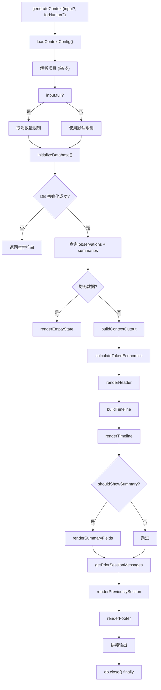

# ContextBuilder.ts 需求说明

> 源文件：src/services/context/ContextBuilder.ts ｜ 类型：源码 ｜ 行数：149 ｜ 所属模块：context ｜ 分析日期：2026-07-23

## 1. 文件定位总述

ContextBuilder 是上下文注入管道的顶层编排器，负责从数据库中查询观察记录和会话摘要，经过 token 经济计算、时间线构建、头部/尾部渲染等步骤，生成最终注入到 Claude 会话中的文本上下文。它是 SessionStart hook 链路的最终输出环节，支持单项目和多项目两种查询模式，并可选择面向 AI 或人类的渲染格式。当检测到原生模块加载失败时，它会尝试清理版本标记文件以触发自动重建。

## 2. 功能需求

| 编号 | 需求描述（系统应当…） | 触发条件 / 输入 | 处理规则与输出 | 证据 |
|------|----------------------|----------------|---------------|------|
| FR-GEN-01 | 系统应当生成项目上下文文本 | 调用 `generateContext(input?, forHuman?)` | 加载配置、解析项目、查询数据库、渲染时间线、拼接输出；input.full 时取消数量限制 | `ContextBuilder.ts:101-148` |
| FR-PROJ-01 | 系统应当自动解析当前工作目录对应的项目 | 未指定 input.projects | 使用 `getProjectContext(cwd)` 解析项目列表，取最后一个作为主项目 | `ContextBuilder.ts:107-110` |
| FR-MULTI-01 | 系统应当支持多项目上下文查询 | projects.length > 1 | 使用 `queryObservationsMulti` 和 `querySummariesMulti` 查询多个项目的数据 | `ContextBuilder.ts:123-128` |
| FR-EMPTY-01 | 系统应当在无数据时生成空状态消息 | observations 和 summaries 均为空 | 根据受众调用 renderHumanEmptyState 或 renderAgentEmptyState | `ContextBuilder.ts:130-132` |
| FR-BUILD-01 | 系统应当编排完整的上下文输出 | 有数据时 | 依次渲染：头部 → 时间线 → 最近摘要字段 → 先前对话 → 页脚 | `ContextBuilder.ts:64-99` |
| FR-RECOVERY-01 | 系统应当在原生模块加载失败时清理版本标记 | ERR_DLOPEN_FAILED 错误 | 删除 `.install-version` 标记文件，记录 error 日志提示重启 | `ContextBuilder.ts:43-54` |
| FR-DB-INIT-01 | 系统应当在使用后关闭数据库连接 | generateContext 执行完毕 | 在 finally 块中调用 db.close() | `ContextBuilder.ts:145-147` |

## 3. 业务规则与约束

- **配置加载**：每次调用 `generateContext` 时重新加载配置（`loadContextConfig()`），不缓存 (`ContextBuilder.ts:105`)
- **全量模式**：`input.full` 为 true 时将 totalObservationCount 和 sessionCount 设置为 999999，实际上取消所有限制 (`ContextBuilder.ts:112-115`)
- **会话数量限制**：通过 `config.sessionCount` 控制显示多少个会话摘要，默认值由 ContextConfigLoader 决定 (`ContextBuilder.ts:79`)
- **数据库连接生命周期**：每次 generateContext 调用创建新连接，完成后关闭（非长连接）(`ContextBuilder.ts:117,146`)
- **空数据短路**：observations 和 summaries 同时为空时直接返回空状态消息，跳过渲染管道 (`ContextBuilder.ts:130-132`)
- **摘要显示数量**：`displaySummaries` 从 summaries 中取前 sessionCount 条 (`ContextBuilder.ts:79`)
- **fullObservation 控制**：由 `getFullObservationIds` 根据 observations 列表和 config.fullObservationCount 决定哪些观察展开 (`ContextBuilder.ts:82`)

## 4. 对外暴露

| 导出函数 | 签名 | 说明 |
|---------|------|------|
| `generateContext` | `(input?: ContextInput, forHuman?: boolean): Promise<string>` | 生成完整上下文文本 |

## 5. 依赖关系

- **数据查询**：`SessionStore`（数据库连接）、`queryObservations`/`queryObservationsMulti`、`querySummaries`/`querySummariesMulti`、`getPriorSessionMessages`（来自 ObservationCompiler）
- **渲染组件**：`renderHeader`、`renderTimeline`、`renderSummaryFields`、`renderPreviouslySection`、`renderFooter`（来自 sections/）
- **格式化器**：`renderAgentEmptyState`（Agent）、`renderHumanEmptyState`（Human）
- **计算**：`loadContextConfig`（配置加载）、`calculateTokenEconomics`（token 统计）
- **上游调用**：SessionStart hook、context 子命令

## 6. 数据结构

**ContextInput**（来自 `./types.ts`）：
```typescript
{ cwd?: string; projects?: string[]; session_id?: string; full?: boolean }
```

## 7. 复杂逻辑图示



## 8. 逆向备注

- `initializeDatabase` 函数内部捕获 `ERR_DLOPEN_FAILED` 错误并尝试删除 `.install-version` 标记文件，这是一种自愈机制——下次重启 Claude Code 时会触发原生模块的自动重建 (`ContextBuilder.ts:43-54`)。
- `VERSION_MARKER_PATH` 硬编码为 `~/.claude/plugins/marketplaces/thedotmack/plugin/.install-version`，与插件安装路径强绑定 (`ContextBuilder.ts:29-37`)。
- 多项目查询使用 projects 数组的最后一个元素作为主项目名称（用于标题等），但查询数据时使用全部项目列表 (`ContextBuilder.ts:110,111`)。
- `buildContextOutput` 作为内部函数封装了完整的渲染编排逻辑，与数据库查询逻辑分离，便于测试 (`ContextBuilder.ts:64-99`)。
