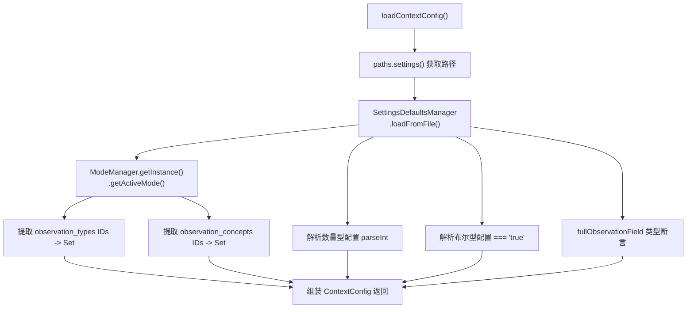

# ContextConfigLoader.ts 需求说明

> 源文件：src/services/context/ContextConfigLoader.ts ｜ 类型：源码 ｜ 行数：30 ｜ 所属模块：context ｜ 分析日期：2026-07-23

## 1. 文件定位总述

本文件是上下文注入流程的配置加载器，负责从设置文件和当前活动模式中读取配置参数，组装为 `ContextConfig` 对象供上下文渲染器使用。它从 `~/.claude-mem/settings.json` 读取观测数量、Token 显示开关等配置，从 `ModeManager` 获取当前活动模式中的观测类型和概念集合，合并后输出完整的上下文配置。

## 2. 功能需求

| 编号 | 需求描述（系统应当…） | 触发条件 / 输入 | 处理规则与输出 | 证据 |
|------|----------------------|----------------|---------------|------|
| FR-CCL-01 | 系统应当从设置文件和活动模式加载完整的上下文配置 | 调用 `loadContextConfig()` | 读取 settings.json 中的观测数量、Token 显示开关等配置，从 ModeManager 获取类型和概念集合，组装并返回 `ContextConfig` | `src/services/context/ContextConfigLoader.ts:7-29` |
| FR-CCL-02 | 系统应当将设置文件中的字符串值解析为正确的类型 | 读取布尔型配置项 | 使用 `=== 'true'` 比较，将 `showReadTokens`、`showWorkTokens`、`showSavingsAmount`、`showSavingsPercent`、`showLastSummary`、`showLastMessage` 转为布尔值 | `src/services/context/ContextConfigLoader.ts:19-27` |
| FR-CCL-03 | 系统应当将设置文件中的数量字符串解析为整数 | 读取数量型配置项 | 使用 `parseInt(..., 10)` 将 `totalObservationCount`、`fullObservationCount`、`sessionCount` 转为整数 | `src/services/context/ContextConfigLoader.ts:16-18` |
| FR-CCL-04 | 系统应当将活动模式的观测类型和概念 ID 收集为 Set 集合 | ModeManager 返回当前模式 | 将 `mode.observation_types.map(t => t.id)` 和 `mode.observation_concepts.map(c => c.id)` 转为 `Set<string>` | `src/services/context/ContextConfigLoader.ts:12-13` |

## 3. 业务规则与约束

| 编号 | 规则描述 | 证据 |
|------|---------|------|
| BR-CCL-01 | 设置项通过 `CLAUDE_MEM_CONTEXT_` 前缀的键名从 settings.json 读取 | `src/services/context/ContextConfigLoader.ts:16-28` |
| BR-CCL-02 | `fullObservationField` 断言为 `'narrative' | 'facts'` 枚举值（类型断言，无运行时校验） | `src/services/context/ContextConfigLoader.ts:25` |
| BR-CCL-03 | 配置加载是同步操作，每次调用都重新读取文件和模式 | `src/services/context/ContextConfigLoader.ts:7`（非 async） |

## 4. 对外暴露

| 导出项 | 类型 | 用途 |
|--------|------|------|
| `loadContextConfig` | 函数 | 加载并返回完整的上下文配置对象 |

## 5. 依赖关系

- **上游依赖**：
  - `../../shared/SettingsDefaultsManager.js`（`loadFromFile`）
  - `../../shared/paths.js`（`paths.settings()`）
  - `../domain/ModeManager.js`（`getInstance().getActiveMode()`）
  - `./types.js`（`ContextConfig` 类型）
- **下游消费者**：推断被上下文注入流程的入口调用，为渲染器提供配置

## 6. 数据结构

不适用（输出类型 `ContextConfig` 定义在 `./types.js`，本文件仅组装）。

## 7. 复杂逻辑图示

图示说明：从两个来源（设置文件 + 模式管理器）读取配置并合并为统一输出。

## 8. 逆向备注

- `fullObservationField` 使用类型断言（`as 'narrative' | 'facts'`）而非运行时校验，若 settings.json 中配置了非法值会在后续渲染阶段出错。
- 每次调用都重新读取文件，无缓存机制。对于频繁调用场景可能有性能影响，但上下文配置通常在会话级别加载一次。
