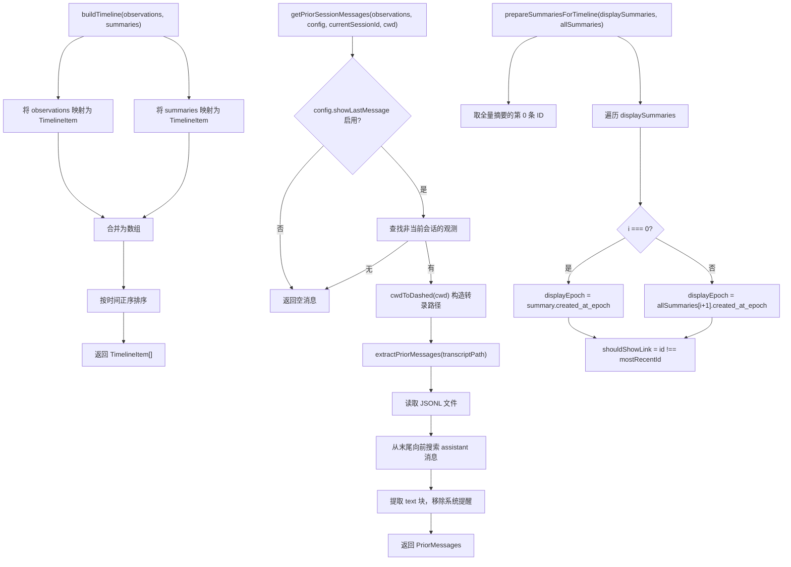

# ObservationCompiler.ts 需求说明

> 源文件：`src/services/context/ObservationCompiler.ts` ｜ 类型：源码 ｜ 行数：295 ｜ 所属模块：context ｜ 分析日期：2026-07-23

## 1. 文件定位总述

ObservationCompiler 是 claude-mem 上下文编译模块的核心数据查询与组装层。它负责从 SQLite 数据库中按项目、类型、概念等维度检索观测记录和会话摘要，将多项目检索结果合并去重，构建按时间排序的混合时间线，并提取历史会话的最后一条助手消息作为上下文注入的前置消息。该模块是 SessionStart hook 注入历史记忆时的关键数据提供者。

## 2. 功能需求

| 编号 | 需求描述（系统应当…） | 触发条件 / 输入 | 处理规则与输出 | 证据 |
|------|----------------------|----------------|---------------|------|
| FR-QOBS-01 | 系统应当按类型和概念查询单项目的观测记录 | 提供数据库实例、项目标识、ContextConfig | 查询 observations 表，条件包含项目匹配（含 merged_into_project）、类型过滤、概念过滤（通过 json_each 展开 JSON 数组）；按 created_at_epoch DESC 排序，返回受 config.totalObservationCount 限制的结果集 | `ObservationCompiler.ts:18-61` |
| FR-QSUM-01 | 系统应当按项目查询会话摘要 | 提供数据库实例、项目标识、ContextConfig | 查询 session_summaries 表，关联 sdk_sessions 获取 platform_source；按 created_at_epoch DESC 排序，返回 sessionCount + SUMMARY_LOOKAHEAD 条记录 | `ObservationCompiler.ts:63-86` |
| FR-QOBS-M-01 | 系统应当按多个项目联合查询观测记录 | 提供数据库实例、项目数组、ContextConfig | 使用 IN 子句匹配多个项目（含 merged_into_project），其余逻辑同 FR-QOBS-01；返回结果中包含 project 字段 | `ObservationCompiler.ts:88-135` |
| FR-QOBS-COUNT-01 | 系统应当统计多个项目的观测记录总数 | 提供数据库实例、项目数组 | 对 observations 表按项目列表执行 COUNT，空项目列表返回 0 | `ObservationCompiler.ts:137-146` |
| FR-QSUM-M-01 | 系统应当按多个项目联合查询会话摘要 | 提供数据库实例、项目数组、ContextConfig | 使用 IN 子句匹配多个项目，关联 sdk_sessions；返回 sessionCount + SUMMARY_LOOKAHEAD 条记录并包含 project 字段 | `ObservationCompiler.ts:148-175` |
| FR-PRIOR-01 | 系统应当从转录文件中提取历史会话的最后一条助手消息 | 提供转录文件路径 | 读取 JSONL 文件，从末尾向前搜索 `"type":"assistant"` 行，提取 message.content 中所有 text 块拼接的文本；移除系统提醒标签（SYSTEM_REMINDER_REGEX）；文件不存在或解析失败返回空消息 | `ObservationCompiler.ts:213-230` |
| FR-PRIOR-02 | 系统应当获取最近一次非当前会话的最后助手消息 | 提供观测列表、配置、当前会话 ID、工作目录 | 仅在 config.showLastMessage 启用且有非当前会话的观测时执行；构造转录文件路径为 `~/.claude/projects/<dashed-cwd>/<sessionId>.jsonl` | `ObservationCompiler.ts:232-251` |
| FR-TL-SUM-01 | 系统应当为摘要列表准备时间线展示数据 | 提供展示用摘要列表和全量摘要列表 | 为每条摘要计算 displayEpoch 和 displayTime（取下一条更早摘要的时间作为展示时间）；标记非最新摘要的 shouldShowLink 为 true | `ObservationCompiler.ts:253-268` |
| FR-TL-BUILD-01 | 系统应当将观测记录和摘要合并为统一时间线 | 提供观测列表和时间线摘要列表 | 将两种类型混合后按时间正序排列（observation 用 created_at_epoch，summary 用 displayEpoch） | `ObservationCompiler.ts:270-286` |
| FR-FULL-IDS-01 | 系统应当获取前 N 条观测记录的 ID 集合 | 提供观测列表和数量 | 返回前 count 条观测记录的 id 的 Set | `ObservationCompiler.ts:288-294` |

## 3. 业务规则与约束

- **SUMMARY_LOOKAHEAD 额外获取**：查询摘要时多取 `SUMMARY_LOOKAHEAD` 条（`ObservationCompiler.ts:85,174`），用于计算时间线展示时间，但不全部展示。
- **项目合并查询**：所有查询都同时匹配 `project` 和 `merged_into_project` 字段，确保项目重命名/合并后的历史数据不丢失（`ObservationCompiler.ts:46,82,119-120,143`）。
- **概念过滤使用 json_each**：observations 表中的 concepts 字段为 JSON 数组，通过 SQLite 的 `json_each` 虚拟表展开后进行 IN 匹配（`ObservationCompiler.ts:48-51`）。
- **默认 platform_source**：所有查询对 sdk_sessions 表使用 LEFT JOIN，platform_source 默认为 `'claude'`（`ObservationCompiler.ts:32,72,104,159`）。
- **助手消息提取方向**：从文件末尾向前搜索最后一条助手消息（`ObservationCompiler.ts:196-210`），确保获取最近的。
- **系统提醒标签移除**：提取的助手消息文本会移除 `SYSTEM_REMINDER_REGEX` 匹配的内容（`ObservationCompiler.ts:190`）。
- **转录文件路径构造**：使用 `cwdToDashed` 将工作目录中的 `/` 替换为 `-`，构成 Claude 的项目目录名（`ObservationCompiler.ts:177-179,249`）。

## 4. 对外暴露

| 公开函数 | 签名 | 说明 |
|---------|------|------|
| `queryObservations` | `(db, project, config) => Observation[]` | 单项目观测查询 |
| `querySummaries` | `(db, project, config) => SessionSummary[]` | 单项目摘要查询 |
| `queryObservationsMulti` | `(db, projects, config) => Observation[]` | 多项目观测查询 |
| `countObservationsByProjects` | `(db, projects) => number` | 多项目观测计数 |
| `querySummariesMulti` | `(db, projects, config) => SessionSummary[]` | 多项目摘要查询 |
| `extractPriorMessages` | `(transcriptPath) => PriorMessages` | 从转录文件提取前置消息 |
| `getPriorSessionMessages` | `(observations, config, currentSessionId, cwd) => PriorMessages` | 获取历史会话最后消息 |
| `prepareSummariesForTimeline` | `(displaySummaries, allSummaries) => SummaryTimelineItem[]` | 准备时间线摘要 |
| `buildTimeline` | `(observations, summaries) => TimelineItem[]` | 构建统一时间线 |
| `getFullObservationIds` | `(observations, count) => Set<number>` | 获取前 N 条观测 ID |

## 5. 依赖关系

**内部依赖**：
- `src/services/sqlite/SessionStore.ts` → `SessionStore`（`ObservationCompiler.ts:4`）
- `src/utils/logger.ts` → 日志（`ObservationCompiler.ts:5`）
- `src/utils/tag-stripping.ts` → `SYSTEM_REMINDER_REGEX`（`ObservationCompiler.ts:6`）
- `src/shared/paths.ts` → `CLAUDE_CONFIG_DIR`（`ObservationCompiler.ts:7`）
- `src/services/context/types.ts` → 类型定义和 `SUMMARY_LOOKAHEAD`（`ObservationCompiler.ts:8-16`）

**外部依赖**：
- Node.js `path`、`fs`

## 6. 数据结构

**关键查询结果类型**（定义于 `context/types.ts`）：
- `Observation`：含 id、memory_session_id、platform_source、type、title、subtitle、narrative、facts、concepts、files_read、files_modified、discovery_tokens、created_at、created_at_epoch
- `SessionSummary`：含 id、memory_session_id、request、investigated、learned、completed、next_steps、created_at 等
- `SummaryTimelineItem`：扩展 SessionSummary，含 displayEpoch、displayTime、shouldShowLink
- `TimelineItem`：联合类型 `{ type: 'observation', data: Observation } | { type: 'summary', data: SummaryTimelineItem }`
- `PriorMessages`：`{ userMessage: string, assistantMessage: string }`

## 7. 复杂逻辑图示

上图展示了 ObservationCompiler 的三个核心逻辑：时间线构建（混合排序观测与摘要）、历史消息提取（从 JSONL 转录中逆向搜索）、摘要时间线准备（计算展示时间和链接标记）。

## 8. 逆向备注

- `extractPriorMessages` 中 `userMessage` 始终返回空字符串（`ObservationCompiler.ts:221`），函数签名虽定义了 `userMessage` 字段但未实现用户消息提取逻辑，推断：（用户消息提取被有意排除或尚未实现）。
- `getPriorSessionMessages` 中查找非当前会话观测时使用 `observations.find(obs => obs.memory_session_id !== currentSessionId)`（`ObservationCompiler.ts:242`），由于 observations 已按时间 DESC 排序，找到的第一条即为最近的历史会话。
- `prepareSummariesForTimeline` 中当 `i === 0` 时 olderSummary 为 null（`ObservationCompiler.ts:260`），此时 displayEpoch 等于摘要自身时间，这意味着最新的摘要显示为其自身创建时间。
- 多项目查询函数 `queryObservationsMulti` 和 `querySummariesMulti` 在 SQL 中使用两份项目列表参数（project IN 和 merged_into_project IN），参数展开顺序为 `...projects, ...projects`（`ObservationCompiler.ts:129-130`），对应 SQL 中两处 `?` 占位符。
