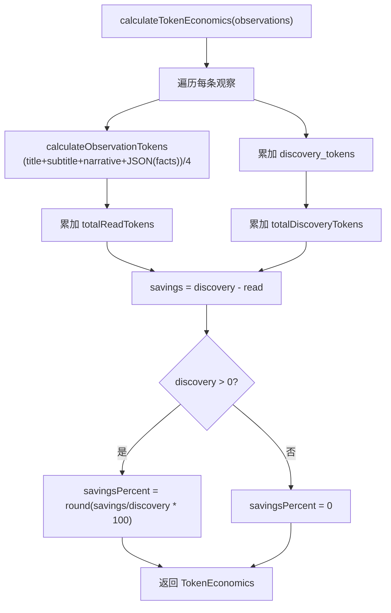

# TokenCalculator.ts 需求说明

> 源文件：src/services/context/TokenCalculator.ts | 类型：源码 | 行数：59 | 所属模块：context | 分析日期：2026-07-23

## 1. 文件定位总述

TokenCalculator 是上下文注入子系统的 Token 经济学计算模块，负责估算观察记录（Observation）的 token 消耗、汇总多观察的节约率指标、格式化单条观察的 token 展示信息，以及判断配置中是否启用了 token 经济学展示。它是 Claude-mem "压缩记忆节省 token" 价值主张的数据计算引擎。

## 2. 功能需求

| 编号 | 需求描述（系统应当…） | 触发条件 / 输入 | 处理规则与输出 | 证据 |
|------|----------------------|----------------|---------------|------|
| FR-TokenCalc-01 | 系统应当估算单条观察记录的 token 数量 | 调用 `calculateObservationTokens(obs)` | 将 title、subtitle、narrative 的字符长度加上 facts JSON 序列化后的字符长度，除以 `CHARS_PER_TOKEN_ESTIMATE`（4）向上取整 | `src/services/context/TokenCalculator.ts:6-12` |
| FR-TokenCalc-02 | 系统应当汇总一组观察记录的 token 经济学指标 | 调用 `calculateTokenEconomics(observations)` | 计算总观察数、总读取 token（估算值）、总发现 token（存储值）、节省量（discovery - read）和节省百分比（四舍五入） | `src/services/context/TokenCalculator.ts:14-37` |
| FR-TokenCalc-03 | 系统应当格式化单条观察的 token 展示数据 | 调用 `formatObservationTokenDisplay(obs, config)` | 返回 readTokens、discoveryTokens、discoveryDisplay（带 emoji 格式）、workEmoji | `src/services/context/TokenCalculator.ts:43-53` |
| FR-TokenCalc-04 | 系统应当判断配置是否启用 token 经济学展示 | 调用 `shouldShowContextEconomics(config)` | 当配置中 `showReadTokens`、`showWorkTokens`、`showSavingsAmount`、`showSavingsPercent` 任一为 true 时返回 true | `src/services/context/TokenCalculator.ts:55-58` |

## 3. 业务规则与约束

- **Token 估算模型**：采用固定比率 4 字符/token（`CHARS_PER_TOKEN_ESTIMATE = 4`），未使用分词器实际计算。推断：（简化实现，适用于展示场景的近似估算）。`src/services/context/TokenCalculator.ts:3`
- **节省百分比计算**：当 totalDiscoveryTokens 为 0 时，节省百分比直接为 0，避免除零错误。`src/services/context/TokenCalculator.ts:26-27`
- **facts 计算方式**：facts 以 `JSON.stringify` 后的字符串长度计入，而非原始数组元素长度。`src/services/context/TokenCalculator.ts:10`
- **节省量可能为负**：代码未对 `savings`（discovery - read）做下限保护，当估算的 read token 超过 discovery token 时，节省量为负数。`src/services/context/TokenCalculator.ts:25`

## 4. 对外暴露

| 名称 | 类型 | 说明 |
|------|------|------|
| `calculateObservationTokens(obs)` | 函数 | 估算单条观察 token 数 |
| `calculateTokenEconomics(observations)` | 函数 | 汇总 token 经济学指标 |
| `getWorkEmoji(obsType)` | 函数 | 获取工作类型对应的 emoji（委托 ModeManager） |
| `formatObservationTokenDisplay(obs, config)` | 函数 | 格式化单条观察 token 展示 |
| `shouldShowContextEconomics(config)` | 函数 | 判断是否启用经济学展示 |

## 5. 依赖关系

- **types.ts**（`./types.js`）：提供 Observation、TokenEconomics、ContextConfig 类型和 CHARS_PER_TOKEN_ESTIMATE 常量
- **ModeManager**（`../domain/ModeManager.js`）：提供 getWorkEmoji 方法（通过 `formatObservationTokenDisplay` 间接使用）

## 6. 数据结构

**TokenEconomics**（返回结构）：
```typescript
{
  totalObservations: number;
  totalReadTokens: number;        // 估算值（字符数/4）
  totalDiscoveryTokens: number;   // 存储值
  savings: number;                // discovery - read（可为负）
  savingsPercent: number;          // 四舍五入百分比
}
```

## 7. 复杂逻辑图示



Token 经济学计算汇总所有观察的读取 token 估算值和发现 token 存储值，计算两者差值作为"节省量"，并按发现 token 为基准计算节省百分比。

## 8. 逆向备注

- `getWorkEmoji` 是对 ModeManager 的简单委托包装，增加了本模块对 ModeManager 的依赖。推断：（为保持 TokenCalculator 作为展示层的统一入口，避免调用方直接依赖 ModeManager）。
