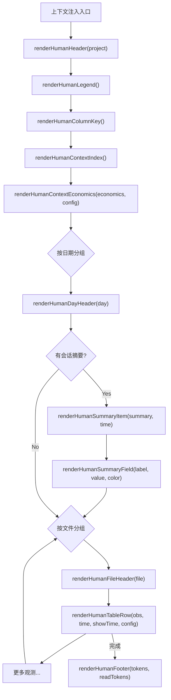

# HumanFormatter.ts 需求说明

> 源文件：src/services/context/formatters/HumanFormatter.ts ｜ 类型：源码 ｜ 行数：189 ｜ 所属模块：context（上下文格式化） ｜ 分析日期：2026-07-23

## 1. 文件定位总述

HumanFormatter 是 claude-mem 上下文注入系统的"人类可读"格式化器，负责将观测记录（Observation）、会话摘要（Summary）、先前消息（PriorMessages）以及 Token 经济学信息渲染为带 ANSI 颜色的终端友好文本。它是 SessionStart hook 注入上下文给 Claude 时的呈现层组件，将结构化数据转化为分段落、分日期、带图标和时间戳的索引视图。模块不包含任何业务逻辑或数据查询，纯粹负责"如何展示"，通过 `ContextConfig` 控制哪些字段可见（如 Token 数、时间等）。

## 2. 功能需求

| 编号 | 需求描述（系统应当…） | 触发条件 / 输入 | 处理规则与输出 | 证据 |
|------|----------------------|----------------|---------------|------|
| FR-hf-01 | 系统应当渲染上下文头部，包含项目名和当前日期时间 | 调用 `renderHumanHeader(project)` | 输出格式：`[<project>] recent context, <YYYY-MM-DD> <h:mmXM> <TZ>`；日期使用 `en-CA` 格式，时间使用 12 小时制并去空格小写（如 `3:30pm`）；附加时区缩写 | `src/services/context/formatters/HumanFormatter.ts:24-31` |
| FR-hf-02 | 系统应当渲染图例行，列出所有活跃模式下的观测类型及其图标 | 调用 `renderHumanLegend()` | 从 `ModeManager.getActiveMode()` 获取当前模式的 `observation_types`，拼接每个类型的 emoji + id；固定前缀 `session-request` | `src/services/context/formatters/HumanFormatter.ts:33-41` |
| FR-hf-03 | 系统应当渲染列说明行，解释 Read 和 Work 列的含义 | 调用 `renderHumanColumnKey()` | 输出 "Column Key" 标题和两行说明：Read 列为读取观测所需的 Token 数，Work 列为产生该记录所投入的 Token 数 | `src/services/context/formatters/HumanFormatter.ts:43-50` |
| FR-hf-04 | 系统应当渲染上下文索引说明，告知 Claude 如何获取更详细信息 | 调用 `renderHumanContextIndex()` | 提示三种操作方式：按 ID 获取观测、使用 mem-search 搜索、信任索引而非重新读代码 | `src/services/context/formatters/HumanFormatter.ts:52-62` |
| FR-hf-05 | 系统应当渲染 Token 经济学摘要，包含加载量、工作投资量和节省量 | 调用 `renderHumanContextEconomics(economics, config)` | 显示观测总数和读取 Token 总量；显示工作投资 Token 总量；当 `showSavingsAmount` 或 `showSavingsPercent` 启用且有工作投资时，显示节省量和百分比 | `src/services/context/formatters/HumanFormatter.ts:64-88` |
| FR-hf-06 | 系统应当渲染日期分组标题 | 调用 `renderHumanDayHeader(day)` | 输出青色加粗的日期字符串 | `src/services/context/formatters/HumanFormatter.ts:90-95` |
| FR-hf-07 | 系统应当渲染文件分组标题 | 调用 `renderHumanFileHeader(file)` | 输出灰色的文件路径 | `src/services/context/formatters/HumanFormatter.ts:97-101` |
| FR-hf-08 | 系统应当渲染单行观测记录（表格行） | 调用 `renderHumanTableRow(obs, time, showTime, config)` | 格式：`#<id> <time> <icon> <title> (<~Nt>) (<emoji Nt>)`；时间和 Token 列根据 config 开关控制显示；时间与上一行相同则用空格占位；Token 数格式化为千分位 | `src/services/context/formatters/HumanFormatter.ts:103-118` |
| FR-hf-09 | 系统应当渲染完整观测记录（多行，用于详情视图） | 调用 `renderHumanFullObservation(obs, time, showTime, detailField, config)` | 标题行加粗，可选显示 detailField 内容行和 Token 信息行；与行模式相同的条件控制逻辑 | `src/services/context/formatters/HumanFormatter.ts:120-146` |
| FR-hf-10 | 系统应当渲染会话摘要条目 | 调用 `renderHumanSummaryItem(summary, formattedTime)` | 格式：`#S<id> <request or 'Session started'> (<time>)`，黄色显示 | `src/services/context/formatters/HumanFormatter.ts:148-157` |
| FR-hf-11 | 系统应当渲染先前助手消息段落 | 调用 `renderHumanPreviouslySection(priorMessages)` | 仅当 `assistantMessage` 存在时输出；格式为 `Previously` 标题 + 灰色 `A: <message>` | `src/services/context/formatters/HumanFormatter.ts:164-176` |
| FR-hf-12 | 系统应当渲染页脚，总结上下文价值 | 调用 `renderHumanFooter(totalDiscoveryTokens, totalReadTokens)` | 格式化为 `<N>k tokens of past research` 和 `just <N>t` 的访问成本提示 | `src/services/context/formatters/HumanFormatter.ts:178-184` |
| FR-hf-13 | 系统应当渲染空状态消息 | 调用 `renderHumanEmptyState(project)` | 当项目无历史会话时输出提示；包含头部信息 + 空状态文本 | `src/services/context/formatters/HumanFormatter.ts:186-188` |

## 3. 业务规则与约束

1. **颜色方案**：所有输出使用 ANSI 颜色转义码，定义在 `colors` 对象中（来自 `../types.js`），包含 `bright`、`cyan`、`gray`、`dim`、`green`、`yellow`、`magenta`、`reset` 等属性。
2. **时间格式一致性**：日期使用 `en-CA`（YYYY-MM-DD），时间使用 `en-US` 12 小时制并手动去空格小写，时区取自 `toLocaleTimeString` 的 `timeZoneName: 'short'`。`src/services/context/formatters/HumanFormatter.ts:12-22`
3. **Token 显示可配置**：通过 `ContextConfig` 的 `showReadTokens`、`showWorkTokens`、`showSavingsAmount`、`showSavingsPercent` 字段控制哪些 Token 相关信息可见。
4. **类型图标委托**：观测类型图标由 `ModeManager.getInstance().getTypeIcon(obs.type)` 决定，HumanFormatter 自身不维护图标映射。`src/services/context/formatters/HumanFormatter.ts:110`
5. **Token 显示格式化委托**：观测的 Token 计算和格式化由 `formatObservationTokenDisplay`（来自 `../TokenCalculator.js`）完成，HumanFormatter 仅负责拼接输出。`src/services/context/formatters/HumanFormatter.ts:111`

## 4. 对外暴露

| 名称 | 类型 | 签名 | 说明 |
|------|------|------|------|
| `renderHumanHeader` | function | `(project: string) => string[]` | 渲染上下文头部 |
| `renderHumanLegend` | function | `() => string[]` | 渲染图例行 |
| `renderHumanColumnKey` | function | `() => string[]` | 渲染列说明 |
| `renderHumanContextIndex` | function | `() => string[]` | 渲染索引操作提示 |
| `renderHumanContextEconomics` | function | `(economics: TokenEconomics, config: ContextConfig) => string[]` | 渲染 Token 经济学摘要 |
| `renderHumanDayHeader` | function | `(day: string) => string[]` | 渲染日期标题 |
| `renderHumanFileHeader` | function | `(file: string) => string[]` | 渲染文件标题 |
| `renderHumanTableRow` | function | `(obs, time, showTime, config) => string` | 渲染单行观测 |
| `renderHumanFullObservation` | function | `(obs, time, showTime, detailField, config) => string[]` | 渲染完整观测 |
| `renderHumanSummaryItem` | function | `(summary, formattedTime) => string[]` | 渲染摘要条目 |
| `renderHumanSummaryField` | function | `(label, value, color) => string[]` | 渲染摘要字段 |
| `renderHumanPreviouslySection` | function | `(priorMessages: PriorMessages) => string[]` | 渲染先前消息 |
| `renderHumanFooter` | function | `(totalDiscoveryTokens, totalReadTokens) => string[]` | 渲染页脚 |
| `renderHumanEmptyState` | function | `(project: string) => string` | 渲染空状态 |

共 14 个导出函数，全部为纯展示函数。

## 5. 依赖关系

- **上游依赖**：`ContextConfig`、`Observation`、`TokenEconomics`、`PriorMessages` 类型（来自 `../types.js`）
- **上游依赖**：`colors` 常量（来自 `../types.js`）
- **上游依赖**：`ModeManager`（获取当前模式和类型图标）
- **上游依赖**：`formatObservationTokenDisplay`（来自 `../TokenCalculator.js`）

## 6. 数据结构

不适用——本文件为纯格式化工具，无自定义数据结构。

## 7. 复杂逻辑图示

上图展示了上下文注入时各格式化函数的调用顺序，反映了 Claude 在 SessionStart 时接收到的完整上下文文本结构。

## 8. 逆向备注

1. **`renderHumanSummaryField` 过滤空值**：当 `value` 为空时返回空数组（`[]`），而不是空行，确保不会产生多余空白行。`src/services/context/formatters/HumanFormatter.ts:159-162`
2. **`renderHumanPreviouslySection` 降级处理**：仅渲染 `assistantMessage`，不渲染用户消息。推断：先前用户消息已通过其他机制（如 current prompt）传递给 Claude。`src/services/context/formatters/HumanFormatter.ts:164-176`
3. **时间占位策略**：`renderHumanTableRow` 中，当 `showTime=false` 时，用空格字符串填充（与时间列等宽），保持列对齐。`src/services/context/formatters/HumanFormatter.ts:113`
4. **页脚 Token 单位混用**：工作 Token 用 `k`（千）单位显示，读取 Token 用原始数字 + `t` 后缀。`src/services/context/formatters/HumanFormatter.ts:179`
