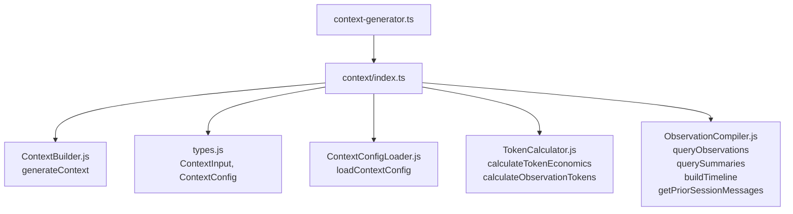

# context/index.ts 需求说明

> 源文件：src/services/context/index.ts ｜ 类型：源码（桶文件） ｜ 行数：13 ｜ 所属模块：context ｜ 分析日期：2026-07-23

## 1. 文件定位总述

本文件是上下文生成子模块的桶导出文件，统一导出上下文构建的核心函数、类型定义、配置加载器、Token 计算器和观察数据编译器。它将上下文生成的完整能力集封装在单一入口中，供上层 services 通过 context-generator.ts 间接导入。

## 2. 功能需求

| 编号 | 需求描述（系统应当…） | 触发条件 / 输入 | 处理规则与输出 | 证据 |
|------|----------------------|----------------|---------------|------|
| FR-CtxIdx-01 | 系统应当导出 generateContext 函数（核心上下文构建入口） | 外部模块导入 | 重导出自 ContextBuilder.js | `src/services/context/index.ts:2` |
| FR-CtxIdx-02 | 系统应当导出 ContextInput 和 ContextConfig 类型 | 外部模块导入 | 重导出自 types.js | `src/services/context/index.ts:3` |
| FR-CtxIdx-03 | 系统应当导出 loadContextConfig 配置加载函数 | 外部模块导入 | 重导出自 ContextConfigLoader.js | `src/services/context/index.ts:5` |
| FR-CtxIdx-04 | 系统应当导出 Token 经济学计算函数 calculateTokenEconomics 和 calculateObservationTokens | 外部模块导入 | 重导出自 TokenCalculator.js | `src/services/context/index.ts:6` |
| FR-CtxIdx-05 | 系统应当导出观察数据编译函数：queryObservations、querySummaries、buildTimeline、getPriorSessionMessages | 外部模块导入 | 重导出自 ObservationCompiler.js | `src/services/context/index.ts:8-12` |

## 3. 业务规则与约束

无。本文件是纯桶导出。

## 4. 对外暴露

| 类别 | 名称 | 类型 | 来源 |
|------|------|------|------|
| 导出 | generateContext | 函数 | `./ContextBuilder.js` |
| 重导出 | ContextInput, ContextConfig | 类型 | `./types.js` |
| 导出 | loadContextConfig | 函数 | `./ContextConfigLoader.js` |
| 导出 | calculateTokenEconomics, calculateObservationTokens | 函数 | `./TokenCalculator.js` |
| 导出 | queryObservations | 函数 | `./ObservationCompiler.js` |
| 导出 | querySummaries | 函数 | `./ObservationCompiler.js` |
| 导出 | buildTimeline | 函数 | `./ObservationCompiler.js` |
| 导出 | getPriorSessionMessages | 函数 | `./ObservationCompiler.js` |

## 5. 依赖关系

- **上游**：`./ContextBuilder.js`、`./types.js`、`./ContextConfigLoader.js`、`./TokenCalculator.js`、`./ObservationCompiler.js`
- **下游**：`../context-generator.ts`（再导出到 services 根层），以及 Worker 的 session-init 处理逻辑

## 6. 数据结构

不适用（具体类型定义见各子模块）。

## 7. 复杂逻辑图示

上图展示了 context 模块的内部组件关系及对外入口。context-generator.ts 作为 services 根层的再导出层，最终引用本文件。

## 8. 逆向备注

推断：模块拆分为 Builder、ConfigLoader、TokenCalculator、ObservationCompiler 四个组件，分别负责上下文组装、配置管理、Token 预算计算和数据查询，体现了单一职责原则。
