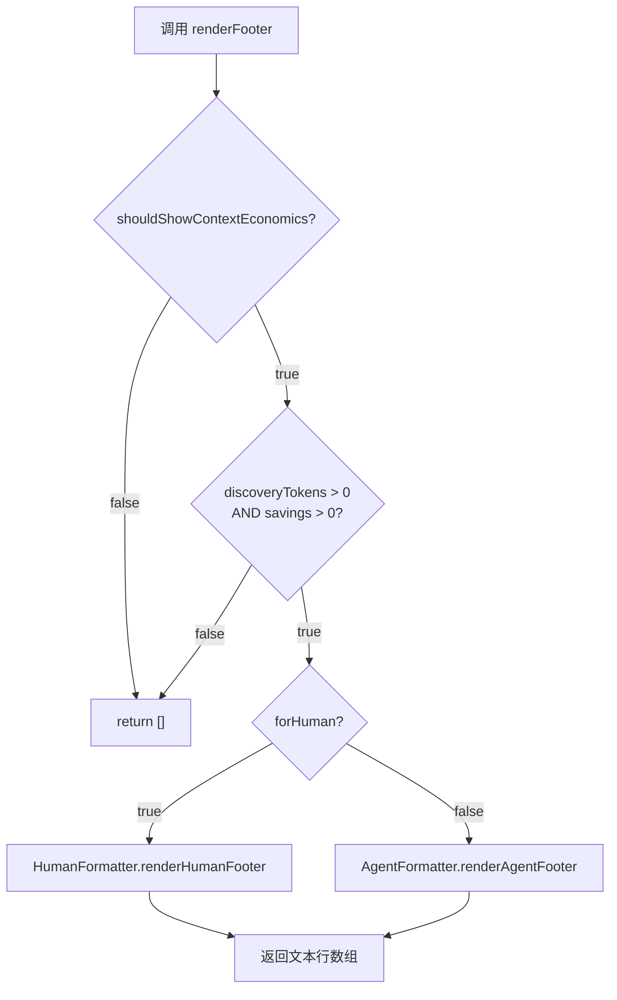

# FooterRenderer.ts 需求说明

> 源文件：src/services/context/sections/FooterRenderer.ts ｜ 类型：源码 ｜ 行数：31 ｜ 所属模块：context ｜ 分析日期：2026-07-23

## 1. 文件定位总述

本文件是上下文注入流程的页脚渲染段，负责将 Token 经济学信息（发现 token 数、读取 token 数、节省量）和"先前消息"内容渲染为文本行数组，注入到最终输出上下文的尾部。根据输出目标受众（`forHuman`）分流到人类可读格式或 Agent 压缩格式两个独立的格式化器。页脚仅在满足 Token 经济学显示条件且存在实际节省时才输出内容，否则返回空数组。

## 2. 功能需求

| 编号 | 需求描述（系统应当…） | 触发条件 / 输入 | 处理规则与输出 | 证据 |
|------|----------------------|----------------|---------------|------|
| FR-FR-01 | 系统应当支持将"先前消息"内容渲染为上下文页脚文本行 | 调用 `renderPreviouslySection(priorMessages, forHuman)` | `forHuman=true` 委托 `HumanFormatter`；否则委托 `AgentFormatter` | `src/services/context/sections/FooterRenderer.ts:7-15` |
| FR-FR-02 | 系统应当在满足经济学显示条件且存在 token 节省时，渲染 Token 经济学信息为页脚行 | 调用 `renderFooter(economics, config, forHuman)`，且三个门控条件全满足 | `forHuman=true` 委托 `HumanFormatter.renderHumanFooter`；否则委托 `AgentFormatter.renderAgentFooter` | `src/services/context/sections/FooterRenderer.ts:17-30` |
| FR-FR-03 | 系统应当在经济学条件不满足时返回空数组 | 配置不允许显示或指标非正值 | 直接 `return []` | `src/services/context/sections/FooterRenderer.ts:22-24` |

## 3. 业务规则与约束

| 编号 | 规则描述 | 证据 |
|------|---------|------|
| BR-FR-01 | 页脚渲染的"先前消息"与"Token 经济学"是两个独立渲染入口，互不影响 | `src/services/context/sections/FooterRenderer.ts:7` 与 `:17` |
| BR-FR-02 | Token 经济学页脚有三个前置门控条件：配置允许显示、`totalDiscoveryTokens > 0`、`savings > 0` | `src/services/context/sections/FooterRenderer.ts:22` |

## 4. 对外暴露

| 导出项 | 类型 | 用途 |
|--------|------|------|
| `renderPreviouslySection` | 函数 | 渲染"先前消息"上下文段 |
| `renderFooter` | 函数 | 渲染 Token 经济学页脚段 |

## 5. 依赖关系

- **上游依赖**：`../types.js`（`ContextConfig`, `TokenEconomics`, `PriorMessages`）、`../TokenCalculator.js`（`shouldShowContextEconomics`）、`../formatters/AgentFormatter.js`、`../formatters/HumanFormatter.js`
- **下游消费者**：推断被上下文组装器调用，用于拼接最终输出

## 6. 数据结构

不适用（纯渲染函数）。

## 7. 复杂逻辑图示

图示说明：`renderFooter` 经两层门控后按受众分流至对应格式化器。

## 8. 逆向备注

- 本文件命名 `FooterRenderer` 但同时包含 `renderPreviouslySection`，该函数语义上不属于"页脚"，推断为历史遗留放置位置。
