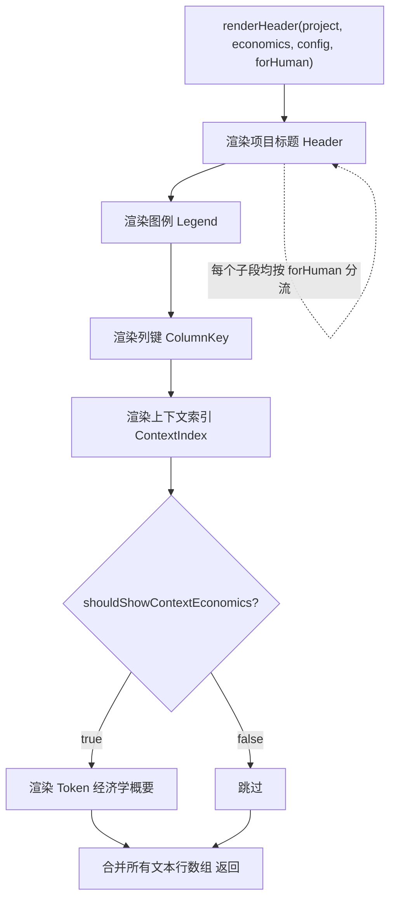

# HeaderRenderer.ts 需求说明

> 源文件：src/services/context/sections/HeaderRenderer.ts ｜ 类型：源码 ｜ 行数：49 ｜ 所属模块：context ｜ 分析日期：2026-07-23

## 1. 文件定位总述

本文件是上下文注入流程的头部渲染段，负责将项目标识、图例说明、列键说明、上下文索引和 Token 经济学概要等信息渲染为文本行数组，注入到最终输出上下文的顶部。它根据输出目标受众（`forHuman`）将五个子段依次分流到人类可读格式或 Agent 压缩格式的对应渲染函数。Token 经济学子段仅在配置允许时渲染，其余四个子段始终输出。

## 2. 功能需求

| 编号 | 需求描述（系统应当…） | 触发条件 / 输入 | 处理规则与输出 | 证据 |
|------|----------------------|----------------|---------------|------|
| FR-HR-01 | 系统应当渲染项目标题头（Header） | 调用 `renderHeader(project, economics, config, forHuman)` | 始终输出：先渲染项目标题，再渲染图例、列键、上下文索引，最后条件渲染经济学概要 | `src/services/context/sections/HeaderRenderer.ts:7-48` |
| FR-HR-02 | 系统应当渲染图例说明（Legend），标识各段内容的含义 | renderHeader 内部步骤 2 | `forHuman` 委托 `HumanFormatter.renderHumanLegend`，否则委托 `AgentFormatter.renderAgentLegend` | `src/services/context/sections/HeaderRenderer.ts:21-25` |
| FR-HR-03 | 系统应当渲染列键说明（ColumnKey），标识输出格式中的列含义 | renderHeader 内部步骤 3 | 同上分流模式 | `src/services/context/sections/HeaderRenderer.ts:27-31` |
| FR-HR-04 | 系统应当渲染上下文索引（ContextIndex），标识注入内容的来源范围 | renderHeader 内部步骤 4 | 同上分流模式 | `src/services/context/sections/HeaderRenderer.ts:33-37` |
| FR-HR-05 | 系统应当在配置允许时渲染 Token 经济学概要 | `shouldShowContextEconomics(config)` 为 true | renderHeader 内部步骤 5，同上分流模式 | `src/services/context/sections/HeaderRenderer.ts:39-45` |

## 3. 业务规则与约束

| 编号 | 规则描述 | 证据 |
|------|---------|------|
| BR-HR-01 | 头部渲染固定包含四个必选子段（Header、Legend、ColumnKey、ContextIndex）和一个条件子段（ContextEconomics），顺序固定 | `src/services/context/sections/HeaderRenderer.ts:13-45` |
| BR-HR-02 | 所有子段均通过 `forHuman` 布尔值在 Human/Agent 两个格式化器间分流，无混合渲染 | `src/services/context/sections/HeaderRenderer.ts:15-46` |

## 4. 对外暴露

| 导出项 | 类型 | 用途 |
|--------|------|------|
| `renderHeader` | 函数 | 渲染上下文头部（标题+图例+列键+索引+经济学概要） |

## 5. 依赖关系

- **上游依赖**：`../types.js`（`ContextConfig`, `TokenEconomics`）、`../TokenCalculator.js`（`shouldShowContextEconomics`）、`../formatters/AgentFormatter.js`、`../formatters/HumanFormatter.js`
- **下游消费者**：推断被上下文组装器调用，用于拼接最终输出的头部

## 6. 数据结构

不适用（纯渲染函数）。

## 7. 复杂逻辑图示

图示说明：五个子段依次渲染，前四个始终输出，第五个条件输出；每个子段内部按受众分流。

## 8. 逆向备注

- 每个子段使用独立的 if/else 分流（共 5 组 if/else），代码结构重复。推断这是为了保持子段独立性，便于单独调整某个子段的渲染逻辑。
