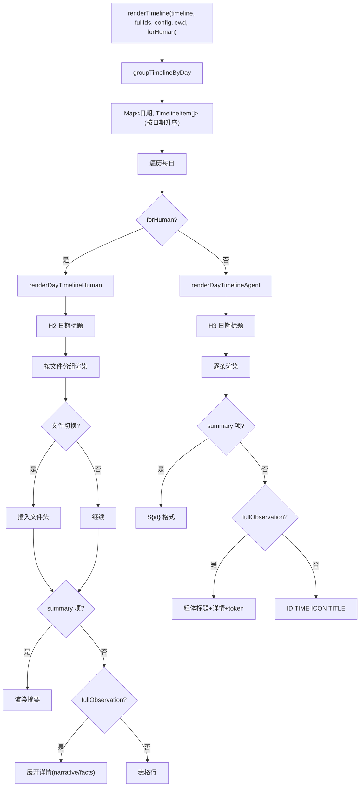

# TimelineRenderer.ts 需求说明

> 源文件：src/services/context/sections/TimelineRenderer.ts ｜ 类型：源码 ｜ 行数：157 ｜ 所属模块：context/sections ｜ 分析日期：2026-07-23

## 1. 文件定位总述

TimelineRenderer 是上下文注入管道中时间线渲染的核心组件，负责将观察记录和会话摘要按日期分组后渲染为 Markdown 格式的工作时间线。它支持两种渲染模式：Agent 模式（面向 AI，紧凑表格行）和 Human 模式（面向人类，按文件分组、含完整时间显示）。该组件是 ContextBuilder 生成注入上下文的关键环节，决定过去工作记忆在 Claude 会话中的展示形式。

## 2. 功能需求

| 编号 | 需求描述（系统应当…） | 触发条件 / 输入 | 处理规则与输出 | 证据 |
|------|----------------------|----------------|---------------|------|
| FR-GROUP-01 | 系统应当将时间线项目按日期分组 | 调用 `groupTimelineByDay(timeline)` | 按 observation 的 created_at 或 summary 的 displayTime 提取日期，相同日期的项目归入同一组；返回按日期升序排列的 Map | `TimelineRenderer.ts:12-31` |
| FR-RENDER-TL-01 | 系统应当渲染完整时间线 | 调用 `renderTimeline(timeline, fullIds, config, cwd, forHuman)` | 按日期分组后逐日调用 renderDayTimeline，拼接所有日的输出 | `TimelineRenderer.ts:142-157` |
| FR-RENDER-DAY-01 | 系统应当根据目标受众渲染每日时间线 | 调用 `renderDayTimeline(day, items, fullIds, config, cwd, forHuman)` | forHuman=true 使用 Human 渲染器，否则使用 Agent 渲染器 | `TimelineRenderer.ts:128-140` |
| FR-AGENT-01 | 系统应当在 Agent 模式下渲染紧凑时间线 | forHuman=false | 每日 H3 标题 → 逐条渲染：summary 项用 S{id} 格式，观察记录用 `ID TIME ICON TITLE` 表格行格式；fullObservation 展开为粗体标题+详情+token 信息 | `TimelineRenderer.ts:40-76` |
| FR-AGENT-FULL-01 | Agent 模式下 fullObservation 应展开详情 | obs.id 在 fullObservationIds 中 | 根据 config.fullObservationField 选择展示 narrative 或 facts；附 token 信息 | `TimelineRenderer.ts:64-68` |
| FR-HUMAN-01 | 系统应当在 Human 模式下按文件分组渲染时间线 | forHuman=true | 每日 H2 标题 → 按文件切换插入文件头 → 逐条渲染：summary 项正常展示，观察记录含完整时间；fullObservation 展开详情 | `TimelineRenderer.ts:78-126` |
| FR-HUMAN-FILE-01 | Human 模式下应当按文件切换插入分隔 | 当前观察的文件与上一条不同 | 调用 renderHumanFileHeader 插入文件标题行，更新 currentFile 追踪 | `TimelineRenderer.ts:109-113` |
| FR-DETAIL-01 | 系统应当根据配置选择 fullObservation 的详情字段 | fullObservation 展开 | config.fullObservationField === 'narrative' 时展示 narrative，否则展示 facts（JSON 数组解析为换行文本） | `TimelineRenderer.ts:33-38` |

## 3. 业务规则与约束

- **日期分组**：observation 使用 `created_at` 字段，summary 使用 `displayTime` 字段 (`TimelineRenderer.ts:16`)
- **排序规则**：日期升序排列（从最早到最新） (`TimelineRenderer.ts:24-28`)
- **时间压缩（Agent 模式）**：同一分钟内的多条记录，后续条目时间显示为空字符串 (`TimelineRenderer.ts:60-62`)
- **时间显示（Human 模式）**：所有记录始终显示完整时间 (`TimelineRenderer.ts:104-105`)
- **文件提取优先级**：优先从 files_modified 提取文件名，回退到 files_read (`TimelineRenderer.ts:102`)
- **fullObservation 数量控制**：由 ContextBuilder 中的 `getFullObservationIds` 决定哪些观察记录展开，本组件仅消费该 Set

## 4. 对外暴露

| 导出函数 | 签名 | 说明 |
|---------|------|------|
| `groupTimelineByDay` | `(timeline): Map<string, TimelineItem[]>` | 按日期分组 |
| `renderDayTimeline` | `(day, items, fullIds, config, cwd, forHuman): string[]` | 渲染单日时间线 |
| `renderTimeline` | `(timeline, fullIds, config, cwd, forHuman): string[]` | 渲染完整时间线 |

## 5. 依赖关系

- **上游调用**：ContextBuilder（`buildContextOutput` 中的 `renderTimeline` 调用）
- **格式化器依赖**：`AgentFormatter`（Agent 模式渲染）、`HumanFormatter`（Human 模式渲染）
- **工具依赖**：`formatTime`、`formatDate`、`formatDateTime`、`extractFirstFile`、`parseJsonArray`（来自共享格式化模块）
- **类型依赖**：`TimelineItem`、`Observation`、`ContextConfig`、`SummaryTimelineItem`

## 6. 数据结构

消费 `TimelineItem`（联合类型，包含 observation 和 summary 两种数据项），由上游 ObservationCompiler 构建。

## 7. 复杂逻辑图示

## 8. 逆向备注

- `renderDayTimelineAgent` 和 `renderDayTimelineHuman` 为模块内 private 函数，通过 `renderDayTimeline` 的 `forHuman` 参数分发，保持了单一入口点的清晰性 (`TimelineRenderer.ts:128-140`)。
- Agent 模式下 fullObservation 的详情字段选择（narrative vs facts）通过 `getDetailField` 函数实现，这个配置点允许用户控制上下文注入时展示哪种级别的细节 (`TimelineRenderer.ts:33-38`)。
- Human 模式在每个文件组结束后会追加一个空行（`output.push('')`），Agent 模式不会——这是面向不同受众的可读性差异 (`TimelineRenderer.ts:123`)。
