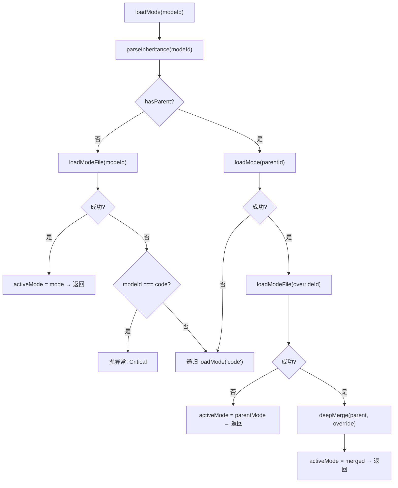

# ModeManager.ts 需求说明

> 源文件：src/services/domain/ModeManager.ts ｜ 类型：源码 ｜ 行数：199 ｜ 所属模块：domain ｜ 分析日期：2026-07-23

## 1. 文件定位总述

ModeManager.ts 是观察模式（observation mode）的单例管理器，负责加载和管理不同工作模式下的观察类型定义和概念分类。每种模式以 JSON 文件定义，包含该模式下系统应识别的 observation 类型（如 bugfix、feature 等）及其概念（concept）体系。该类支持单级继承（parent--override 语法），允许基于基础模式创建变体模式，并通过深度合并策略组合配置。它是 worker AI 处理观察分类时的核心配置来源。

## 2. 功能需求

| 编号 | 需求描述（系统应当…） | 触发条件 / 输入 | 处理规则与输出 | 证据 |
|------|----------------------|----------------|---------------|------|
| FR-mm-01 | 系统应当作为单例提供模式管理 | 首次调用 `getInstance()` | 懒创建唯一实例，后续调用返回同一实例 | `ModeManager.ts:8-31` |
| FR-mm-02 | 系统应当从 JSON 文件加载模式配置 | 调用 `loadMode(modeId)` | 读取 `modes/<modeId>.json` 文件，解析为 ModeConfig；设置 activeMode | `ModeManager.ts:93-163` |
| FR-mm-03 | 系统应当支持单级继承模式 | modeId 包含 `--` 分隔符 | 解析为 parentId + overrideId；先加载父模式，再加载覆盖文件，深度合并为最终配置 | `ModeManager.ts:33-55, 118-163` |
| FR-mm-04 | 系统应当在模式文件缺失时降级到 code 模式 | loadMode 指定的文件不存在 | 若请求的就是 code 且不存在则抛异常；否则递归降级到 code 模式 | `ModeManager.ts:106-115` |
| FR-mm-05 | 系统应当获取当前活跃模式的观察类型列表 | 调用 `getObservationTypes()` | 返回 activeMode.observation_types 数组 | `ModeManager.ts:172-174` |
| FR-mm-06 | 系统应当获取当前活跃模式的概念列表 | 调用 `getObservationConcepts()` | 返回 activeMode.observation_concepts 数组 | `ModeManager.ts:176-178` |
| FR-mm-07 | 系统应当根据类型 ID 获取图标 | 调用 `getTypeIcon(typeId)` 或 `getWorkEmoji(typeId)` | 在 observation_types 中查找匹配 typeId，返回 emoji 或默认值 | `ModeManager.ts:180-188` |
| FR-mm-08 | 系统应当验证类型 ID 是否在当前模式中合法 | 调用 `validateType(typeId)` | 检查 typeId 是否存在于 observation_types 列表中 | `ModeManager.ts:190-192` |
| FR-mm-09 | 系统应当获取类型的可读标签 | 调用 `getTypeLabel(typeId)` | 查找 type.label，未找到返回 typeId 本身 | `ModeManager.ts:194-197` |

## 3. 业务规则与约束

- **单例模式**：构造函数为 private，仅通过 `getInstance()` 获取实例。`src/services/domain/ModeManager.ts:13, 26-31`
- **模式目录查找顺序**：1) `CLAUDE_MEM_MODES_DIR` 环境变量 → 2) `<packageRoot>/modes` → 3) `<packageRoot>/../plugin/modes`（开发路径）。`src/services/domain/ModeManager.ts:16-23`
- **继承限制**：仅支持一层继承（`parent--override`），两级以上（含三个 `--`）抛异常。`src/services/domain/ModeManager.ts:38-55`
- **深度合并策略**：浅层字段直接覆盖，嵌套对象递归合并；非对象类型的 override 直接替换基础值。`src/services/domain/ModeManager.ts:65-80`
- **降级安全**：任何层级缺失（父模式或覆盖文件）都降级到 code 模式；code 模式本身缺失则抛 Critical 异常。`src/services/domain/ModeManager.ts:106-114`
- **图标默认值**：getTypeIcon 和 getWorkEmoji 默认返回 `'📝'`。`src/services/domain/ModeManager.ts:183, 188`

## 4. 对外暴露

| 名称 | 类型 | 说明 |
|------|------|------|
| `ModeManager` | class | 单例模式管理器 |
| `getInstance()` | static method | 获取单例实例 |
| `loadMode(modeId)` | method | 加载模式（支持继承），返回 ModeConfig |
| `getActiveMode()` | method | 获取当前活跃模式 |
| `getObservationTypes()` | method | 获取当前模式的观察类型列表 |
| `getObservationConcepts()` | method | 获取当前模式的概念列表 |
| `getTypeIcon(typeId)` | method | 获取类型图标 emoji |
| `getWorkEmoji(typeId)` | method | 获取工作图标 emoji |
| `validateType(typeId)` | method | 验证类型合法性 |
| `getTypeLabel(typeId)` | method | 获取类型可读标签 |

## 5. 依赖关系

- **内部依赖**：`./types.js`（ModeConfig, ObservationType, ObservationConcept）、`../../utils/logger.js`、`../../shared/paths.js`（getPackageRoot）
- **被依赖**：Worker 的 AI 观察分类逻辑、UI 展示层

## 6. 数据结构

**ModeConfig 推断结构**（根据使用方式推断，定义在 `./types.js` 中）：

| 字段 | 类型 | 说明 |
|------|------|------|
| name | string | 模式名称 |
| observation_types | ObservationType[] | 观察类型定义列表 |
| observation_concepts | ObservationConcept[] | 概念分类列表 |

**ObservationType 推断结构**：

| 字段 | 类型 | 说明 |
|------|------|------|
| id | string | 类型标识符（如 bugfix, feature） |
| label | string | 可读标签 |
| emoji | string | 图标 emoji |
| work_emoji | string | 工作图标 emoji |

## 7. 复杂逻辑图示

模式加载流程：解析继承关系 → 加载父模式 → 加载覆盖配置 → 深度合并。任何层级失败都降级到 code 模式。

## 8. 逆向备注

- 构造函数中搜索 `modes` 目录的三种路径是为了兼容生产环境（`plugin/modes`）和开发环境（`src/../plugin/modes`）。`ModeManager.ts:16-23`
- `deepMerge` 不处理数组类型，数组会被直接替换而非合并，推断配置中的数组类型（如 observation_types）不需要增量合并。
- `activeMode` 是可变状态，`loadMode` 每次调用都会覆盖它，意味着同一进程中后续调用会替换当前活跃模式。
