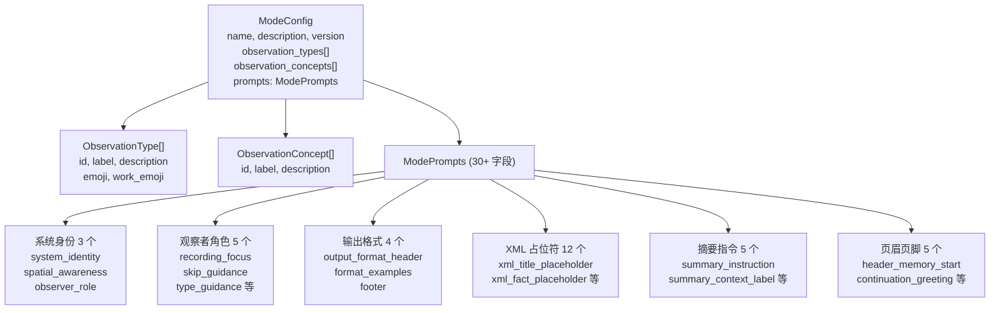

# domain/types.ts 需求说明

> 源文件：src/services/domain/types.ts ｜ 类型：源码 ｜ 行数：64 ｜ 所属模块：domain ｜ 分析日期：2026-07-23

## 1. 文件定位总述

本文件定义了 claude-mem 领域模型的核心类型体系，涵盖观测类型定义、概念定义、模式提示词（ModePrompts）和完整模式配置（ModeConfig）。`ModeConfig` 是整个领域模型的聚合根，描述了系统在特定观测模式下的完整行为规范：支持哪些观测类型和概念、使用什么提示词模板指导 AI 输出格式。`ModePrompts` 包含数十个提示词占位符，覆盖系统身份、观察者角色、输出格式、XML 占位符和摘要指令等全部提示环节。

## 2. 功能需求

本文件为纯类型定义文件，无运行时逻辑。核心能力是为领域模型提供完整的模式配置类型契约。

## 3. 业务规则与约束

| 编号 | 规则描述 | 证据 |
|------|---------|------|
| BR-DT-01 | `ObservationType` 包含 6 个字段：id、label、description、emoji、work_emoji，后两者用于人类可读和 Agent 压缩两种展示场景 | `src/services/domain/types.ts:2-8` |
| BR-DT-02 | `ObservationConcept` 包含 3 个字段：id、label、description，无 emoji | `src/services/domain/types.ts:10-14` |
| BR-DT-03 | `ModePrompts` 包含 30+ 个提示词字段，分为：系统身份（3 个）、观察者角色（5 个）、输出格式（4 个）、XML 占位符（12 个）、摘要指令（5 个）、页眉页脚（5 个）等类别 | `src/services/domain/types.ts:16-54` |
| BR-DT-04 | `ModeConfig.version` 为字符串类型，用于版本追踪和兼容性检查 | `src/services/domain/types.ts:59` |
| BR-DT-05 | `ModeConfig` 包含 `observation_types` 和 `observation_concepts` 两个数组，定义当前模式支持的分类维度 | `src/services/domain/types.ts:60-61` |

## 4. 对外暴露

| 导出项 | 类型 | 用途 |
|--------|------|------|
| `ObservationType` | 接口 | 观测类型定义（id、标签、描述、emoji） |
| `ObservationConcept` | 接口 | 观测概念定义（id、标签、描述） |
| `ModePrompts` | 接口 | 模式提示词模板集合（30+ 字段） |
| `ModeConfig` | 接口 | 完整模式配置（名称、版本、类型、概念、提示词） |

## 5. 依赖关系

- **上游依赖**：无
- **下游消费者**：推断被 `ModeManager`、上下文渲染器、AI 提示词组装器等核心模块引用

## 6. 数据结构

图示说明：`ModeConfig` 是聚合根，包含类型/概念定义和完整的提示词模板集。

## 7. 复杂逻辑图示

不适用（纯类型定义文件）。

## 8. 逆向备注

- `ObservationType` 包含 `emoji` 和 `work_emoji` 两个字段，推断分别用于人类可读展示（终端 UI）和 Agent 压缩展示（节省 token），例如人类看到 "[决策] 🎯" 而 Agent 看到简短标记。
- `ModePrompts` 的 12 个 XML 占位符分为观测类（title/subtitle/fact/narrative/concept/file）和摘要类（request/investigated/learned/completed/next_steps/notes），对应 AI 输出的两种结构化格式。
- 模式的 `version` 为字符串而非数字，推断支持语义化版本（如 "1.2.0"）。
