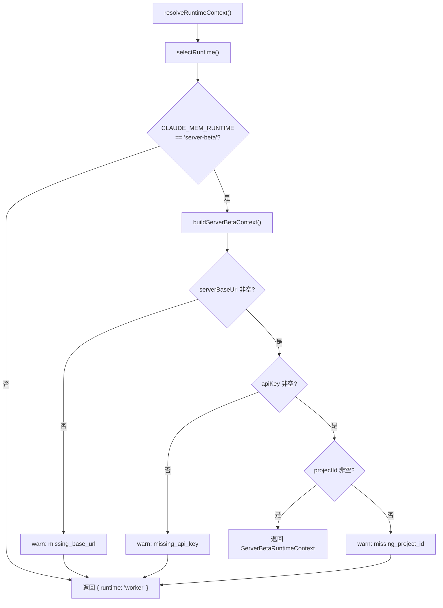

# runtime-selector.ts 需求说明

> 源文件：src/services/hooks/runtime-selector.ts | 类型：源码 | 行数：84 | 所属模块：hooks | 分析日期：2026-07-23

## 1. 文件定位总述

runtime-selector 是 Hook 子系统的运行时选择器，负责根据配置决定 Hook 应该调用 Server-Beta 远程端点还是本地 Worker。它读取 `~/.claude-mem/settings.json` 中的 `CLAUDE_MEM_RUNTIME` 设置，在 `server-beta` 和 `worker` 两种运行时之间切换。本文件刻意不导入 Worker 代码，确保 Server-Beta 模式下即使没有本地 Worker 安装也能工作。

## 2. 功能需求

| 编号 | 需求描述（系统应当…） | 触发条件 / 输入 | 处理规则与输出 | 证据 |
|------|----------------------|----------------|---------------|------|
| FR-RuntimeSelect-01 | 系统应当根据配置判断当前运行时 | 调用 `selectRuntime()` | 读取 `CLAUDE_MEM_RUNTIME` 设置，值为 'server-beta' 时返回 'server-beta'，其他值（包括未设置）返回 'worker' | `src/services/hooks/runtime-selector.ts:32-37` |
| FR-RuntimeSelect-02 | 系统应当构建 Server-Beta 运行时上下文 | 调用 `buildServerBetaContext()` | 读取 serverBaseUrl、apiKey、projectId 三个必要配置，任一为空则返回 null 并记录 warn 日志；全部有效则返回包含 ServerBetaClient 的上下文对象 | `src/services/hooks/runtime-selector.ts:39-68` |
| FR-RuntimeSelect-03 | 系统应当解析最终的运行时上下文 | 调用 `resolveRuntimeContext()` | 先调用 `selectRuntime()` 判断；若非 server-beta 返回 worker 上下文；若是 server-beta 则调用 `buildServerBetaContext()`，构建失败则降级为 worker | `src/services/hooks/runtime-selector.ts:70-79` |
| FR-RuntimeSelect-04 | 系统应当提供 Server-Beta 降级的日志工具 | 调用 `logServerBetaFallback(reason, details?)` | 记录 `[server-beta-fallback] reason=xxx` 格式的 warn 日志 | `src/services/hooks/runtime-selector.ts:81-83` |

## 3. 业务规则与约束

- **Worker 为默认运行时**：`CLAUDE_MEM_RUNTIME` 未设置或非 'server-beta' 时，一律使用 worker。`src/services/hooks/runtime-selector.ts:34`
- **三要素缺失检测**：Server-Beta 模式需要 `serverBaseUrl`、`apiKey`、`projectId` 三个配置全部非空，否则降级到 worker 并记录缺失原因。`src/services/hooks/runtime-selector.ts:45-56`
- **隔离导入**：本文件不导入任何 Worker 代码，只导入 hook-settings 和 ServerBetaClient。确保 Server-Beta 模式可在无本地 Worker 的环境下运行。`src/services/hooks/runtime-selector.ts:9-11`
- **大小写容错**：`CLAUDE_MEM_RUNTIME` 值经过 `trim().toLowerCase()` 处理，允许 'Server-Beta' 等大小写变体。`src/services/hooks/runtime-selector.ts:34`

## 4. 对外暴露

| 名称 | 类型 | 说明 |
|------|------|------|
| `selectRuntime()` | 函数 | 判断当前运行时（'worker'/'server-beta'） |
| `buildServerBetaContext()` | 函数 | 构建 Server-Beta 上下文（可能返回 null） |
| `resolveRuntimeContext()` | 函数 | 解析最终运行时上下文（含降级逻辑） |
| `logServerBetaFallback(reason, details?)` | 函数 | 记录降级日志 |
| `SelectedRuntime` | 类型别名 | 'worker' | 'server-beta' |
| `RuntimeContext` | 联合类型 | ServerBetaRuntimeContext | WorkerRuntimeContext |

## 5. 依赖关系

- **hook-settings.ts**（`../../shared/hook-settings.js`）：`loadFromFileOnce` 读取配置
- **ServerBetaClient**（`./server-beta-client.js`）：Server-Beta HTTP 客户端
- **logger**（`../../utils/logger.js`）：结构化日志

## 6. 数据结构

**ServerBetaRuntimeContext**（Server-Beta 上下文）：
```typescript
{
  runtime: 'server-beta';
  client: ServerBetaClient;
  projectId: string;
  serverBaseUrl: string;
}
```

**WorkerRuntimeContext**（Worker 上下文）：
```typescript
{
  runtime: 'worker';
}
```

## 7. 复杂逻辑图示



运行时解析采用"判断模式 -> 三要素验证"的链式守卫，任何一环不满足都降级到 worker。

## 8. 逆向备注

- 无逆向备注。
