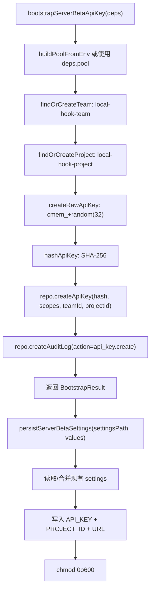

# server-beta-bootstrap.ts 需求说明

> 源文件：src/services/hooks/server-beta-bootstrap.ts ｜ 类型：源码 ｜ 行数：210 ｜ 所属模块：hooks ｜ 分析日期：2026-07-23

## 1. 文件定位总述

server-beta-bootstrap.ts 是 server-beta 运行时的本地 API 密钥引导模块。当运维人员选择 server-beta 运行模式或执行 `claude-mem server keys rotate` 命令时，该模块负责连接本地 Postgres 数据库，自动创建 `local-hook-team` 团队和 `local-hook-project` 项目作为租户边界，生成 `cmem_` 前缀的 API 密钥，将其哈希后存入 `api_keys` 表，并将明文密钥持久化到 `settings.json`（权限 0o600）。该模块是 server-beta 模式下 hook 认证的基础设施。

## 2. 功能需求

| 编号 | 需求描述（系统应当…） | 触发条件 / 输入 | 处理规则与输出 | 证据 |
|------|----------------------|----------------|---------------|------|
| FR-sbb-01 | 系统应当引导生成 server-beta API 密钥 | 调用 `bootstrapServerBetaApiKey(deps?)` | 连接 Postgres → findOrCreateTeam → findOrCreateProject → 生成 rawKey → SHA-256 哈希 → 插入 api_keys → 写审计日志 → 返回结果 | `server-beta-bootstrap.ts:56-99` |
| FR-sbb-02 | 系统应当支持轮换 API 密钥 | 调用 `rotateServerBetaApiKey(options?)` | 如提供 previousApiKeyId 则先撤销旧密钥（SET revoked_at）→ 再执行 bootstrap 生成新密钥 | `server-beta-bootstrap.ts:106-122` |
| FR-sbb-03 | 系统应当将密钥和项目 ID 持久化到 settings.json | 调用 `persistServerBetaSettings(settingsPath, values)` | 读取现有 settings（兼容嵌套 env 格式）→ 写入 `CLAUDE_MEM_SERVER_BETA_API_KEY`、`CLAUDE_MEM_SERVER_BETA_PROJECT_ID`、可选 `CLAUDE_MEM_SERVER_BETA_URL` → chmod 0o600 | `server-beta-bootstrap.ts:124-161` |
| FR-sbb-04 | 系统应当创建固定名称的本地 hook 团队和项目 | bootstrap 过程中 | 团队名 `local-hook-team`，项目名 `local-hook-project`；已存在则复用 | `server-beta-bootstrap.ts:32-34, 171-199` |
| FR-sbb-05 | 系统应当为 API 密钥设置固定权限范围 | 创建 API 密钥时 | scopes: `events:write`, `sessions:write`, `observations:read`, `jobs:read` | `server-beta-bootstrap.ts:36-41` |
| FR-sbb-06 | 系统应当记录审计日志 | API 密钥创建成功后 | 创建 audit_log 记录，action 为 `api_key.create`，resource 指向新密钥 ID | `server-beta-bootstrap.ts:77-86` |
| FR-sbb-07 | 系统应当生成 cmem_ 前缀的 API 密钥 | 调用 `createRawApiKey()` | 格式：`cmem_<32字节 base64url>` | `server-beta-bootstrap.ts:163-165` |
| FR-sbb-08 | 系统应当使用 SHA-256 哈希 API 密钥 | 调用 `hashApiKey(rawKey)` | 返回 64 位十六进制字符串 | `server-beta-bootstrap.ts:167-169` |

## 3. 业务规则与约束

- **密钥格式**：`cmem_` 前缀 + 32 字节随机数的 base64url 编码，提供 256 位熵。`server-beta-bootstrap.ts:163-165`
- **哈希算法**：SHA-256，明文密钥永不入库，仅存储哈希值。`server-beta-bootstrap.ts:167-169`
- **权限范围**：4 个固定 scope，覆盖 hook 所需的事件写入、会话写入、观察读取和任务读取。`server-beta-bootstrap.ts:36-41`
- **文件权限**：settings.json 写入后设为 0o600，非 POSIX 文件系统失败时静默忽略。`server-beta-bootstrap.ts:157-160`
- **连接池生命周期**：deps.pool 由外部提供时不关闭；内部创建的池在 finally 中关闭。`server-beta-bootstrap.ts:59, 94-98`
- **settings 格式兼容**：支持旧版嵌套 `{env: {...}}` 格式和现代扁平格式，自动检测并展开。`server-beta-bootstrap.ts:143-145`
- **密钥撤销**：rotate 时通过 `SET revoked_at = now()` 软删除旧密钥，而非物理删除。`server-beta-bootstrap.ts:111-114`
- **环境变量要求**：`CLAUDE_MEM_SERVER_DATABASE_URL` 必须设置，否则 `buildPoolFromEnv` 抛异常。`server-beta-bootstrap.ts:201-209`

## 4. 对外暴露

| 名称 | 类型 | 说明 |
|------|------|------|
| `HOOK_API_KEY_SCOPES` | readonly string[] | 固定的 4 个 API 密钥权限 |
| `BootstrapResult` | interface | 引导结果：rawKey, apiKeyId, teamId, projectId |
| `BootstrapDependencies` | interface | 依赖注入：pool?, closePool? |
| `RotateOptions` | interface | 轮换选项：previousApiKeyId?, pool? |
| `bootstrapServerBetaApiKey(deps?)` | async function | 引导生成 API 密钥 |
| `rotateServerBetaApiKey(options?)` | async function | 轮换 API 密钥 |
| `persistServerBetaSettings(settingsPath, values)` | function | 持久化设置到 settings.json |
| `createRawApiKey()` | function | 生成原始 API 密钥 |
| `hashApiKey(rawKey)` | function | SHA-256 哈希密钥 |

## 5. 依赖关系

- **内部依赖**：`crypto`、`fs`、`path`、`../../storage/postgres/pool.js`、`../../storage/postgres/config.js`、`../../storage/postgres/auth.js`、`../../storage/postgres/projects.js`、`../../storage/postgres/teams.js`
- **被依赖**：CLI `server keys` 命令、server-beta 安装流程

## 6. 数据结构

**BootstrapResult 接口**：`src/services/hooks/server-beta-bootstrap.ts:43-48`

| 字段 | 类型 | 说明 |
|------|------|------|
| rawKey | string | 明文 API 密钥（仅此一次返回） |
| apiKeyId | string | 数据库中的 api_key ID |
| teamId | string | 关联的团队 ID |
| projectId | string | 关联的项目 ID |

## 7. 复杂逻辑图示

API 密钥引导流程：确保租户存在→生成密钥→哈希入库→审计日志→持久化明文到安全文件。

## 8. 逆向备注

- 文件头注释中强调"The plaintext key is NEVER written into the generated bundle and never logged"，说明安全审查重点关注了密钥泄露风险。`server-beta-bootstrap.ts:21`
- `findOrCreateTeam` 和 `findOrCreateProject` 使用 `pool.query` 直接查表，再通过 Repository 创建，推断是避免依赖 Repository 的 find 方法在引导阶段可能缺失的问题。
- `buildPoolFromEnv` 的 `requireDatabaseUrl: true` 意味着引导模块在 server-beta 模式外无法使用。`server-beta-bootstrap.ts:202`
