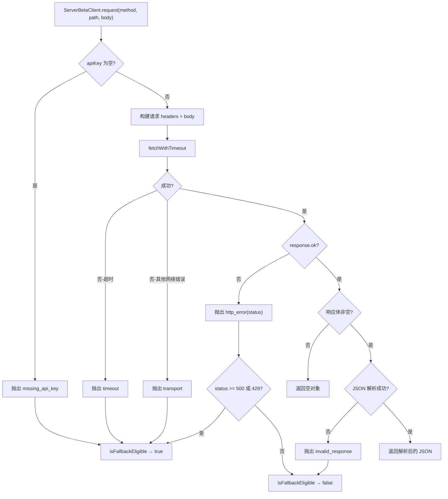

# server-beta-client.ts 需求说明

> 源文件：src/services/hooks/server-beta-client.ts ｜ 类型：源码 ｜ 行数：401 ｜ 所属模块：hooks ｜ 分析日期：2026-07-23

## 1. 文件定位总述

本文件是 server-beta 运行时的 HTTP 客户端，为 hook 子命令提供直连 server-beta `/v1/*` REST 端点的能力。其设计核心约束是不得导入或传递依赖 worker 运行时——使 hooks 即使在 worker 未运行时也能通过 server-beta 后端完成会话管理、事件记录、观察插入、全文搜索和上下文注入。所有传输级失败均包装为带分类的 `ServerBetaClientError`，调用方可据此决定是否回退到 worker 路径。

## 2. 功能需求

| 编号 | 需求描述（系统应当…） | 触发条件 / 输入 | 处理规则与输出 | 证据 |
|------|----------------------|----------------|---------------|------|
| FR-SBC-01 | 系统应当提供 `startSession` 方法向 server-beta 创建会话。 | 传入 `ServerBetaStartSessionRequest`。 | POST 到 `/v1/sessions/start`，构建含 projectId 及可选字段的请求体，返回 session 对象。 | `src/services/hooks/server-beta-client.ts:205-208` |
| FR-SBC-02 | 系统应当提供 `recordEvent` 方法向 server-beta 记录事件，支持控制是否触发 generation job。 | 传入 `ServerBetaRecordEventRequest`。 | `generate=false` 时 POST 到 `/v1/events?generate=false`，否则 POST 到 `/v1/events`。 | `src/services/hooks/server-beta-client.ts:210-214` |
| FR-SBC-03 | 系统应当提供 `endSession` 方法结束 server-beta 会话。 | 传入含 `sessionId` 的请求。 | sessionId 为空时抛出 `invalid_response` 错误；否则 POST 到 `/v1/sessions/{sessionId}/end`。 | `src/services/hooks/server-beta-client.ts:216-225` |
| FR-SBC-04 | 系统应当提供 `addObservation` 方法直接插入观察记录（MCP observation_add 通道）。 | 传入 `ServerBetaAddObservationRequest`。 | POST 到 `/v1/memories`，调用与 REST 相同的 Postgres 写入路径，不触发 generation job。 | `src/services/hooks/server-beta-client.ts:231-239` |
| FR-SBC-05 | 系统应当提供 `searchObservations` 方法执行全文搜索（MCP observation_search 通道）。 | 传入 `ServerBetaSearchObservationsRequest`。 | POST 到 `/v1/search`，返回匹配的 observations 数组。 | `src/services/hooks/server-beta-client.ts:243-251` |
| FR-SBC-06 | 系统应当提供 `contextObservations` 方法获取含预拼接上下文字符串的观察结果（MCP observation_context 通道）。 | 传入 `ServerBetaContextObservationsRequest`。 | POST 到 `/v1/context`，返回 observations 数组和 `context` 字符串。 | `src/services/hooks/server-beta-client.ts:255-263` |
| FR-SBC-07 | 系统应当提供 `getJobStatus` 方法查询 generation job 状态。 | 传入 `jobId`。 | jobId 为空时抛出 `invalid_response` 错误；否则 GET `/v1/jobs/{jobId}`。 | `src/services/hooks/server-beta-client.ts:268-276` |
| FR-SBC-08 | 系统应当在 API key 未配置时抛出 `missing_api_key` 类型错误。 | 构造请求时 `apiKey` 为空或纯空白。 | 抛出 `ServerBetaClientError`，kind 为 `'missing_api_key'`。 | `src/services/hooks/server-beta-client.ts:330-335` |
| FR-SBC-09 | 系统应当区分传输失败（timeout/transport）和 HTTP 错误（status code），并提供是否可回退到 worker 路径的判断。 | 请求失败时。 | `ServerBetaClientError` 的 `isFallbackEligible()`：timeout、transport、missing_api_key、5xx、429 返回 true；其他 4xx 返回 false。 | `src/services/hooks/server-beta-client.ts:42-53` |
| FR-SBC-10 | 系统应当对所有请求附加 Bearer token 认证头和 JSON Content-Type。 | 每次请求。 | headers 包含 `Authorization: Bearer <apiKey>` 和 `Content-Type: application/json`。 | `src/services/hooks/server-beta-client.ts:339-344` |

## 3. 业务规则与约束

- **BR-SBC-01** 默认请求超时取自 `HOOK_TIMEOUTS.API_REQUEST` 配置值。`src/services/hooks/server-beta-client.ts:17`
- **BR-SBC-02** 构造函数自动去除 `serverBaseUrl` 的末尾斜杠。`src/services/hooks/server-beta-client.ts:199-203`
- **BR-SBC-03** 响应体为空时返回空对象 `{}` 而非报错。`src/services/hooks/server-beta-client.ts:372-376`
- **BR-SBC-04** 响应体非 JSON 时抛出 `invalid_response` 类型错误。`src/services/hooks/server-beta-client.ts:377-385`
- **BR-SBC-05** URL 路径参数（sessionId、jobId）均做 `encodeURIComponent` 编码。`src/services/hooks/server-beta-client.ts:221, 274`
- **BR-SBC-06** 超时检测依赖正则 `/timed out|timeout/i` 匹配错误消息。`src/services/hooks/server-beta-client.ts:354`
- **BR-SBC-07** 错误响应体截断到 200 字符以避免日志过大。`src/services/hooks/server-beta-client.ts:366`

## 4. 对外暴露

| 暴露项 | 类型 | 说明 |
|--------|------|------|
| `ServerBetaClient` | class | HTTP 客户端主体 |
| `ServerBetaClient.startSession(input)` | async method | 创建会话 |
| `ServerBetaClient.recordEvent(input)` | async method | 记录事件 |
| `ServerBetaClient.endSession(input)` | async method | 结束会话 |
| `ServerBetaClient.addObservation(input)` | async method | 直接插入观察 |
| `ServerBetaClient.searchObservations(input)` | async method | 全文搜索观察 |
| `ServerBetaClient.contextObservations(input)` | async method | 获取上下文注入内容 |
| `ServerBetaClient.getJobStatus(jobId)` | async method | 查询 job 状态 |
| `ServerBetaClientError` | class（extends Error） | 类型化错误，含 kind、status、cause |
| `isServerBetaClientError(error)` | type guard | 判断是否为 ServerBetaClientError |
| 多个 Request/Response 接口 | interface | startSession、recordEvent、endSession、addObservation、searchObservations、contextObservations、jobStatus 的请求/响应类型 |
| `ServerBetaClientConfig` | interface | 配置：serverBaseUrl、apiKey、timeoutMs |

## 5. 依赖关系

| 依赖方 | 被依赖方 | 关系 |
|--------|---------|------|
| server-beta-client.ts | `shared/worker-utils.ts` (`fetchWithTimeout`) | 带超时的 fetch 封装 |
| server-beta-client.ts | `shared/hook-constants.ts` (`HOOK_TIMEOUTS`, `getTimeout`) | 超时配置 |
| server-beta-client.ts | 无 worker 运行时依赖 | 设计约束：独立于 worker |

## 6. 数据结构

**ServerBetaClientErrorKind**（`src/services/hooks/server-beta-client.ts:19-24`）

错误分类枚举：`missing_api_key`、`transport`、`timeout`、`http_error`、`invalid_response`。

**ServerBetaClientConfig**（`src/services/hooks/server-beta-client.ts:56-60`）

| 字段 | 类型 | 说明 |
|------|------|------|
| serverBaseUrl | string | server-beta 基础 URL |
| apiKey | string | API 密钥 |
| timeoutMs | number（可选） | 请求超时毫秒数 |

**ServerBetaRecordEventRequest.sourceType** 枚举值：`hook`、`worker`、`provider`、`server`、`api`。`src/services/hooks/server-beta-client.ts:88`

## 7. 复杂逻辑图示

上图展示了 `request` 方法的完整错误处理链：从 API key 检查、网络请求、到 HTTP 状态码和 JSON 解析，每个失败节点都映射到对应的 `ServerBetaClientErrorKind`。`isFallbackEligible` 决策基于错误 kind 和 HTTP 状态码。

## 8. 逆向备注

- 注释明确标注"Phase 7"和"Phase 8"，表明该文件在分阶段开发中的两个阶段分别添加了会话/事件 API 和 MCP 相关 API（addObservation、searchObservations、contextObservations、getJobStatus）。
- 注释强调 `addObservation` 调用 `/v1/memories` 是"不触发 generation job 的规范写入路径"，作为 MCP 工具中的反模式防护。
- 推断：此客户端为 server-beta SaaS 后端设计（带 API key 认证和 teamId 作用域），与本地 worker 的直接 DB 访问形成双通道架构。
