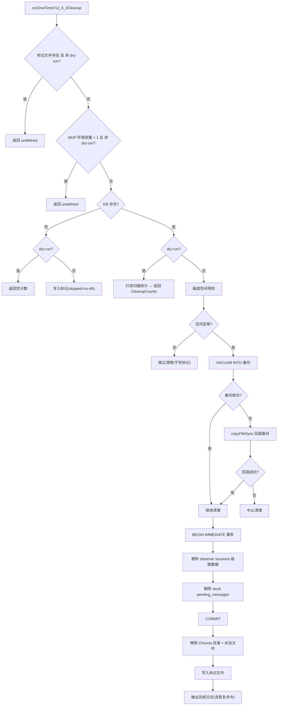

# CleanupV12_4_3.ts 需求说明

> 源文件：src/services/infrastructure/CleanupV12_4_3.ts ｜ 类型：源码 ｜ 行数：307 ｜ 所属模块：infrastructure ｜ 分析日期：2026-07-23

## 1. 文件定位总述

本文件实现 v12.4.3 版本的一次性数据清理任务，用于清除系统中因 observer 模式产生的污染数据和卡住的 pending_messages。该清理在应用启动时自动检测并执行（幂等，通过标记文件保证只运行一次），包含 DB 备份（先尝试 VACUUM INTO，回退到 copyFileSync）、observer sessions 级联删除、stuck pending_messages 清除、以及 Chroma 向量库全量擦除。支持 dry-run 只读扫描模式和通过环境变量跳过。

## 2. 功能需求

| 编号 | 需求描述（系统应当…） | 触发条件 / 输入 | 处理规则与输出 | 证据 |
|------|----------------------|----------------|---------------|------|
| FR-CLN-01 | 系统应当通过标记文件（`.cleanup-v12.4.3-applied`）确保清理仅执行一次。 | 调用 `runOneTimeV12_4_3Cleanup`（非 dry-run）。 | 标记文件存在时跳过清理并直接返回 `undefined`。 | `src/services/infrastructure/CleanupV12_4_3.ts:34-36` |
| FR-CLN-02 | 系统应当支持通过环境变量 `CLAUDE_MEM_SKIP_CLEANUP_V12_4_3=1` 跳过清理且不写入标记文件。 | 环境变量值为 `'1'` 且非 dry-run。 | 输出 WARN 日志并返回，不写入标记文件（下次启动仍可执行）。 | `src/services/infrastructure/CleanupV12_4_3.ts:39-42` |
| FR-CLN-03 | 系统应当在 dry-run 模式下仅做只读扫描统计受影响行数，不做任何写入。 | `options.dryRun = true`。 | 以 readonly 模式打开 DB，统计 observer sessions 数、级联行数、stuck pending_messages 数后返回 `CleanupCounts`。 | `src/services/infrastructure/CleanupV12_4_3.ts:57-65` |
| FR-CLN-04 | 系统应当在执行清理前对数据库创建备份（优先 VACUUM INTO，回退到 copyFileSync 含 WAL/SHM）。 | 非 dry-run 且 DB 存在。 | 备份路径为 `backups/claude-mem-pre-12.4.3-<timestamp>.db`；VACUUM INTO 失败则回退到文件拷贝（含 -wal/-shm 副文件）；两者均失败则中止清理。 | `src/services/infrastructure/CleanupV12_4_3.ts:161-185` |
| FR-CLN-05 | 系统应当在清理前检查磁盘可用空间是否满足备份需求（DB 大小 × 1.2 + 100MB）。 | 非 dry-run 且 DB 存在。 | 通过 `statfsSync` 获取可用空间；空间不足时跳过清理（不写标记文件，下次可重试）。对 Bun 1.3.14 及更早版本的 statfs 返回非可信值做容错处理。 | `src/services/infrastructure/CleanupV12_4_3.ts:111-152` |
| FR-CLN-06 | 系统应当删除所有 `project = OBSERVER_SESSIONS_PROJECT` 的 sdk_sessions 及其级联关联数据（user_prompts、observations、session_summaries）。 | 执行清理阶段。 | 在 `BEGIN IMMEDIATE` 事务中执行 DELETE；记录删除的 sessions 数和级联行数。 | `src/services/infrastructure/CleanupV12_4_3.ts:224-246` |
| FR-CLN-07 | 系统应当删除所有 status='processing' 且同一 session_db_id 下累计 >= 10 条的 stuck pending_messages。 | 执行清理阶段。 | 在 `BEGIN IMMEDIATE` 事务中执行 DELETE；阈值为常量 `STUCK_PENDING_THRESHOLD = 10`。 | `src/services/infrastructure/CleanupV12_4_3.ts:248-280` |
| FR-CLN-08 | 系统应当在数据清理后擦除 Chroma 向量目录和同步状态文件。 | 数据清理完成后。 | 删除 `<dataDir>/chroma/` 整个目录和 `<dataDir>/chroma-sync-state.json` 文件。擦除失败仍写入标记文件（不重试清理）。 | `src/services/infrastructure/CleanupV12_4_3.ts:282-298` |
| FR-CLN-09 | 系统应当在清理成功后写入标记文件（JSON 格式，含时间戳、备份路径、Chroma 擦除状态和各项计数）。 | 数据清理和 Chroma 擦除完成。 | 标记文件路径为 `<dataDir>/.cleanup-v12.4.3-applied`，包含 `appliedAt`、`backupPath`、`chromaWiped`、`chromaWipeError`（可选）、`counts`、`skipped`（可选）。 | `src/services/infrastructure/CleanupV12_4_3.ts:208-214` |

## 3. 业务规则与约束

- **BR-CLN-01** 清理幂等性通过文件系统标记实现，无分布式锁——单用户单进程场景适用。`src/services/infrastructure/CleanupV12_4_3.ts:8`
- **BR-CLN-02** 磁盘空间预检计算公式：`required = ceil(dbSize × 1.2) + 100 × 1024 × 1024`。`src/services/infrastructure/CleanupV12_4_3.ts:111-112`
- **BR-CLN-03** Bun <= 1.3.14 在 darwin-x64 上 `statfsSync` 返回对齐错误的 struct（bsize=0），代码对此做非可信值容错。`src/services/infrastructure/CleanupV12_4_3.ts:130-141`
- **BR-CLN-04** 清理失败时标记文件不写入，确保下次启动可重试。`src/services/infrastructure/CleanupV12_4_3.ts:73`
- **BR-CLN-05** Chroma 擦除失败不阻塞标记写入——向量库会在后续 backfill 中重建。`src/services/infrastructure/CleanupV12_4_3.ts:205`
- **BR-CLN-06** 无 DB 时（dry-run 模式）直接写入标记文件并记 `skipped: 'no-db'`。`src/services/infrastructure/CleanupV12_4_3.ts:46-53`
- **BR-CLN-07** 数据库操作使用 `PRAGMA foreign_keys = ON` 开启外键约束。`src/services/infrastructure/CleanupV12_4_3.ts:189`

## 4. 对外暴露

| 暴露项 | 类型 | 说明 |
|--------|------|------|
| `runOneTimeV12_4_3Cleanup(dataDirectory?, options?)` | function → CleanupCounts \| undefined | 唯一公开入口，返回清理计数（dry-run）或 undefined（已执行/跳过） |

## 5. 依赖关系

| 依赖方 | 被依赖方 | 关系 |
|--------|---------|------|
| CleanupV12_4_3.ts | `shared/paths.ts` (`DATA_DIR`, `OBSERVER_SESSIONS_PROJECT`) | 数据目录和 observer 项目常量 |
| CleanupV12_4_3.ts | `utils/logger.ts` | 日志输出 |
| CleanupV12_4_3.ts | `bun:sqlite` (`Database`) | 数据库操作 |

## 6. 数据结构

**CleanupCounts**（`src/services/infrastructure/CleanupV12_4_3.ts:11-15`）

| 字段 | 类型 | 说明 |
|------|------|------|
| observerSessions | number | 被删除的 observer sdk_sessions 数 |
| observerCascadeRows | number | 被级联删除的关联行总数（user_prompts + observations + session_summaries） |
| stuckPendingMessages | number | 被删除的 stuck pending_messages 数 |

**MarkerPayload**（`src/services/infrastructure/CleanupV12_4_3.ts:17-24`）

| 字段 | 类型 | 说明 |
|------|------|------|
| appliedAt | string | ISO 时间戳 |
| backupPath | string \| null | 备份文件路径 |
| chromaWiped | boolean | Chroma 是否成功擦除 |
| chromaWipeError | string（可选） | Chroma 擦除失败原因 |
| counts | CleanupCounts | 清理计数 |
| skipped | string（可选） | 跳过原因 |

## 7. 复杂逻辑图示

上图展示了清理的完整决策链：从幂等检查、环境变量跳过、磁盘预检、双策略备份到数据清理和 Chroma 擦除。每个失败路径要么中止要么跳过，确保数据安全。

## 8. 逆向备注

- 推断：`OBSERVER_SESSIONS_PROJECT` 是一个特殊的虚拟项目标识，用于标记由 observer 模式（非直接用户交互）产生的会话。这些会话被视为污染数据需清除。
- 推断：Chroma 擦除后依赖后续 backfill 重建向量索引，而非增量更新。这意味着清理后的首次搜索可能短暂不可用或性能下降。
- 注释中引用了 Bun issue #31133 和 PR #31139，说明此文件包含对已知 Bun 运行时 bug 的适配代码。
