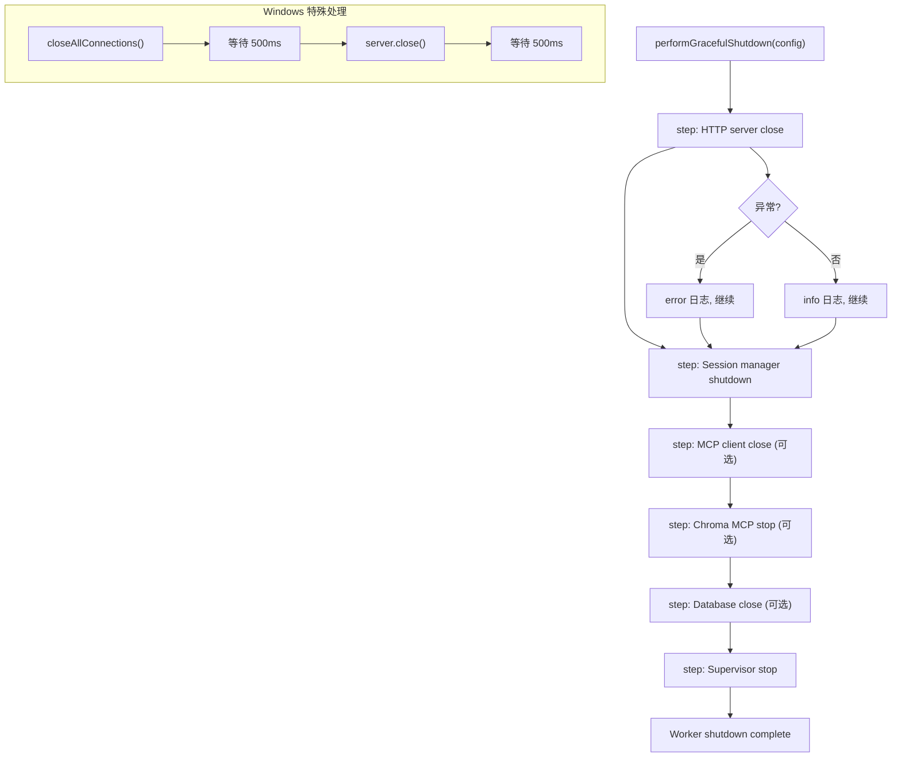

# GracefulShutdown.ts 需求说明

> 源文件：src/services/infrastructure/GracefulShutdown.ts | 类型：源码 | 行数：86 | 所属模块：infrastructure | 分析日期：2026-07-23

## 1. 文件定位总述

GracefulShutdown 是 Worker 进程优雅关闭的编排器，按照固定顺序依次关闭 HTTP 服务器、SessionManager、MCP 客户端、Chroma MCP 进程、数据库和 Supervisor。每个关闭步骤被隔离（X-004 修复），单步失败不会中断后续关闭流程，确保所有子进程和服务都能被清理。特别处理了 Windows 平台端口释放的延迟问题。

## 2. 功能需求

| 编号 | 需求描述（系统应当…） | 触发条件 / 输入 | 处理规则与输出 | 证据 |
|------|----------------------|----------------|---------------|------|
| FR-GracefulShutdown-01 | 系统应当按固定顺序执行优雅关闭 | 调用 `performGracefulShutdown(config)` | 依次执行：HTTP 服务器关闭 -> SessionManager shutdown -> MCP 客户端关闭 -> Chroma MCP 停止 -> 数据库关闭 -> Supervisor 停止。每步记录日志 | `src/services/infrastructure/GracefulShutdown.ts:30-68` |
| FR-GracefulShutdown-02 | 系统应当隔离每个关闭步骤，单步失败不阻断后续步骤 | 任一关闭步骤抛出异常 | catch 异常并记录 error 日志，继续执行下一步 | `src/services/infrastructure/GracefulShutdown.ts:37-44` |
| FR-GracefulShutdown-03 | 系统应当在 Windows 平台上关闭 HTTP 服务器后等待端口释放 | `process.platform === 'win32'` | 在 `closeAllConnections()` 后等待 500ms，在 `server.close()` 后再等待 500ms，确保 Windows 端口绑定被完全释放 | `src/services/infrastructure/GracefulShutdown.ts:73-84` |
| FR-GracefulShutdown-04 | 系统应当支持可选的关闭组件 | config 中部分组件为 undefined | 仅对非 undefined 的组件执行关闭（server、mcpClient、chromaMcpManager、dbManager 均为可选） | `src/services/infrastructure/GracefulShutdown.ts:47,53,57,61` |

## 3. 业务规则与约束

- **关闭顺序固定**：HTTP -> Session -> MCP Client -> Chroma -> DB -> Supervisor。这个顺序确保依赖关系正确（如先关闭接受连接的 HTTP 服务器，再清理会话状态）。`src/services/infrastructure/GracefulShutdown.ts:47-65`
- **Supervisor 最后关闭**：Supervisor 作为最终步骤关闭，确保其他所有服务都已停止。`src/services/infrastructure/GracefulShutdown.ts:65`
- **Windows 端口释放**：Windows 上 `closeAllConnections()` 后端口不会立即释放，需要额外等待。`src/services/infrastructure/GracefulShutdown.ts:73-84`
- **X-004 隔离修复**：注释说明此前一个步骤的异常会跳过 ChromaMcpManager.stop()，导致 uvx/python chroma 子进程树孤立。隔离后每步独立执行。`src/services/infrastructure/GracefulShutdown.ts:33-35`

## 4. 对外暴露

| 名称 | 类型 | 说明 |
|------|------|------|
| `performGracefulShutdown(config)` | async 函数 | 执行优雅关闭流程 |
| `ShutdownableService` | 接口 | 可关闭的服务（shutdownAll 方法） |
| `CloseableClient` | 接口 | 可关闭的客户端（close 方法） |
| `CloseableDatabase` | 接口 | 可关闭的数据库（close 方法） |
| `StoppableService` | 接口 | 可停止的服务（stop 方法） |
| `GracefulShutdownConfig` | 接口 | 关闭配置（所有组件均可选） |

## 5. 依赖关系

- **http**（Node.js 内置模块）：HTTP Server 类型
- **logger**（`../../utils/logger.js`）：结构化日志
- **getSupervisor**（`../../supervisor/index.js`）：获取 Supervisor 实例

## 6. 数据结构

**GracefulShutdownConfig**（输入结构）：
```typescript
{
  server: http.Server | null;
  sessionManager: ShutdownableService;
  mcpClient?: CloseableClient;
  dbManager?: CloseableDatabase;
  chromaMcpManager?: StoppableService;
}
```

## 7. 复杂逻辑图示



关闭流程以步骤函数（step）隔离每个关闭操作，失败仅记录日志不影响后续步骤。Windows 平台在 HTTP 服务器关闭时插入额外等待。

## 8. 逆向备注

- `closeAllConnections()` 是 Node.js 18+ 的 API。推断：（项目要求 Node.js 18 或更高版本，这与 Bun 运行时的兼容性一致）。
