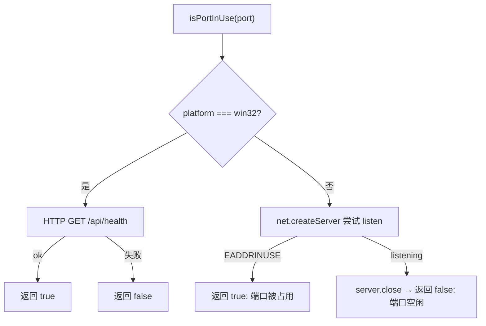

# HealthMonitor.ts 需求说明

> 源文件：src/services/infrastructure/HealthMonitor.ts ｜ 类型：源码 ｜ 行数：160 ｜ 所属模块：infrastructure ｜ 分析日期：2026-07-23

## 1. 文件定位总述

HealthMonitor.ts 是 worker 进程的基础设施层模块，负责 worker 服务的健康检测与就绪检查。它提供端口占用探测（区分 Windows/macOS 平台）、HTTP 健康端点轮询、优雅关闭、版本一致性校验等能力，是 worker-spawner 启动流程中判断"worker 是否可用"的核心依赖。该模块同时承担插件版本与运行中 worker 版本的比对，用于检测版本不匹配导致的潜在问题。

## 2. 功能需求

| 编号 | 需求描述（系统应当…） | 触发条件 / 输入 | 处理规则与输出 | 证据 |
|------|----------------------|----------------|---------------|------|
| FR-hm-01 | 系统应当检测指定端口是否被占用 | 调用 `isPortInUse(port)` | Windows：发 HTTP GET 到 `/api/health`，成功即占用；非 Windows：尝试 `net.createServer` 监听该端口，`EADDRINUSE` 即占用 | `HealthMonitor.ts:24-54` |
| FR-hm-02 | 系统应当轮询等待 worker 健康端点可用 | 调用 `waitForHealth(port, timeoutMs)` | 每 500ms 向 `/api/health` 发 GET，直到返回 OK 或超时，返回布尔值 | `HealthMonitor.ts:56-81` |
| FR-hm-03 | 系统应当轮询等待 worker 就绪端点可用 | 调用 `waitForReadiness(port, timeoutMs)` | 每 500ms 向 `/api/readiness` 发 GET，直到返回 OK 或超时，返回布尔值 | `HealthMonitor.ts:83-85` |
| FR-hm-04 | 系统应当轮询等待端口释放 | 调用 `waitForPortFree(port, timeoutMs)` | 每 500ms 检测端口占用，直到空闲或超时，返回布尔值 | `HealthMonitor.ts:87-94` |
| FR-hm-05 | 系统应当通过 HTTP 请求优雅关闭 worker | 调用 `httpShutdown(port)` | 向 `/api/admin/shutdown` 发 POST，失败或连接拒绝时返回 false | `HealthMonitor.ts:96-112` |
| FR-hm-06 | 系统应当读取已安装插件的版本号 | 调用 `getInstalledPluginVersion()` | 从 `MARKETPLACE_ROOT/package.json` 读取 `version` 字段；文件不存在/忙时返回 `'unknown'` | `HealthMonitor.ts:114-130` |
| FR-hm-07 | 系统应当查询运行中 worker 的版本号 | 调用 `getRunningWorkerVersion(port)` | 向 `/api/version` 发 GET，解析响应 JSON 中的 `version` 字段 | `HealthMonitor.ts:132-142` |
| FR-hm-08 | 系统应当比对插件版本与 worker 版本是否一致 | 调用 `checkVersionMatch(port)` | 任一版本不可用时默认匹配（返回 `matches: true`）；否则比较两个版本字符串是否相等 | `HealthMonitor.ts:150-159` |

## 3. 业务规则与约束

- **轮询间隔**：所有轮询操作统一使用 500ms 间隔。`src/services/infrastructure/HealthMonitor.ts:74`
- **健康与就绪区分**：健康（`/api/health`）和就绪（`/api/readiness`）是两个不同端点，调用方可分别等待。`src/services/infrastructure/HealthMonitor.ts:79-85`
- **Windows 平台差异**：Windows 下 `isPortInUse` 不使用 net.createServer 而是通过 HTTP 健康检查判断。`src/services/infrastructure/HealthMonitor.ts:25-37`
- **优雅关闭容错**：ECONNREFUSED 时视为 worker 已停止，返回 false 而非抛异常。`src/services/infrastructure/HealthMonitor.ts:105-108`
- **版本比对宽松策略**：任一版本缺失时默认认为匹配，避免版本校验阻塞正常启动流程。`src/services/infrastructure/HealthMonitor.ts:154-155`

## 4. 对外暴露

| 名称 | 类型 | 说明 |
|------|------|------|
| `isPortInUse(port)` | async function | 检测端口是否被占用 |
| `waitForHealth(port, timeoutMs?)` | async function | 等待健康端点 OK，默认 30s 超时 |
| `waitForReadiness(port, timeoutMs?)` | async function | 等待就绪端点 OK，默认 30s 超时 |
| `waitForPortFree(port, timeoutMs?)` | async function | 等待端口释放，默认 10s 超时 |
| `httpShutdown(port)` | async function | HTTP 优雅关闭 |
| `getInstalledPluginVersion()` | function | 读取已安装插件版本 |
| `getRunningWorkerVersion(port)` | async function | 读取运行中 worker 版本 |
| `checkVersionMatch(port)` | async function | 比对版本一致性，返回 `VersionCheckResult` |
| `VersionCheckResult` | interface | 匹配结果：matches, pluginVersion, workerVersion |

## 5. 依赖关系

- **内部依赖**：`../../shared/paths.js`（`MARKETPLACE_ROOT`）、`../../shared/worker-utils.js`（`getWorkerHost`）、`../../utils/logger.js`
- **被依赖**：`worker-spawner.ts`（启动流程中的健康检查与端口检测）

## 6. 数据结构

**VersionCheckResult 接口**：`src/services/infrastructure/HealthMonitor.ts:144-148`

| 字段 | 类型 | 说明 |
|------|------|------|
| matches | boolean | 插件版本与 worker 版本是否一致 |
| pluginVersion | string | 已安装插件版本号，不可用时为 `'unknown'` |
| workerVersion | string \| null | 运行中 worker 版本号，查询失败时为 null |

## 7. 复杂逻辑图示

端口检测流程根据平台分流，Windows 通过 HTTP 健康检查判断，其他平台通过 net.createServer 的 listen 错误码判断。

## 8. 逆向备注

- `httpRequestToWorker` 使用原生 `fetch`（Node.js 18+），非 `node-fetch`。
- Windows 平台的端口检测逻辑不使用 net 模块，可能因为 Windows 下 net.createServer 行为不同。
