# ProcessManager.ts 需求说明

> 源文件：src/services/infrastructure/ProcessManager.ts ｜ 类型：源码 ｜ 行数：518 ｜ 所属模块：infrastructure ｜ 分析日期：2026-07-23

## 1. 文件定位总述

ProcessManager 是 Claude-Mem 的基础设施层模块，提供进程生命周期管理、运行时解析、PID 文件管理和一次性数据迁移四类能力。它处于 Worker 进程启动/关闭链路的核心位置：负责发现 Bun 运行时路径以启动 Worker daemon、通过 PID 文件实现单实例互斥、在 Windows 平台上枚举子进程、执行 Chroma 数据迁移（pre-v10.3 升级清理）和 cwd-based 项目重映射（v3 数据修正）。该模块为上层 Hook 层和 CLI 入口提供底层操作系统交互能力。

## 2. 功能需求

| 编号 | 需求描述（系统应当…） | 触发条件 / 输入 | 处理规则与输出 | 证据 |
|------|----------------------|----------------|---------------|------|
| FR-RUNTIME-01 | 系统应当在首次调用时解析 Bun 运行时路径，后续调用使用缓存结果 | 调用 `resolveWorkerRuntimePath()` | 检查当前进程 `execPath` 是否为 Bun；若不是，按优先级搜索环境变量、常见安装路径、系统 PATH | `ProcessManager.ts:64-76` |
| FR-RUNTIME-02 | 系统应当在搜索 Bun 路径时覆盖多平台常见安装位置 | 运行时解析时 | Windows：`BUN`/`BUN_PATH` 环境变量、`~/.bun/bin/bun.exe`、`LOCALAPPDATA/bun/bun.exe`；Unix：环境变量、`~/.bun/bin/bun`、`/usr/local/bin/bun`、`/opt/homebrew/bin/bun`、`/home/linuxbrew/.linuxbrew/bin/bun`、`/usr/bin/bun`、`/snap/bin/bun` | `ProcessManager.ts:91-110` |
| FR-RUNTIME-03 | 系统应当在带自定义选项调用时绕过缓存，无自定义选项时使用缓存 | 调用 `resolveWorkerRuntimePath(options)` | 选项对象为空时启用缓存，非空时每次重新解析 | `ProcessManager.ts:65-76` |
| FR-RUNTIME-04 | 系统应当在环境变量和文件系统搜索均失败时，通过系统 PATH 命令（`which`/`where`）查找 Bun | 所有候选路径均不匹配时 | 调用 `lookupBinaryInPath('bun', platform)` | `ProcessManager.ts:125-126` |
| FR-PID-01 | 系统应当支持写入 PID 文件，包含 pid、pgid、startToken 等进程信息 | Worker daemon 启动时 | 在 `~/.claude-mem/worker.pid` 写入 JSON 格式的 PidInfo | `ProcessManager.ts:135-140` |
| FR-PID-02 | 系统应当支持读取 PID 文件，解析失败时返回 null 并记录 warn 日志 | 需要检查已有 Worker 进程时 | 读取并解析 `worker.pid` 文件 | `ProcessManager.ts:142-155` |
| FR-PID-03 | 系统应当支持删除 PID 文件 | Worker 退出时 | 调用 `unlinkSync` 删除，失败仅记录 warn | `ProcessManager.ts:157-169` |
| FR-PID-04 | 系统应当支持检测 PID 文件是否为最近写入（默认阈值 15 秒） | 判断 Worker 是否刚启动 | 比较文件 `mtime` 与当前时间的差值是否小于阈值 | `ProcessManager.ts:491-503` |
| FR-PID-05 | 系统应当支持更新 PID 文件的时间戳（touch 操作） | Worker 心跳/活跃时 | 使用 `utimesSync` 更新文件访问和修改时间为当前时间，失败静默忽略 | `ProcessManager.ts:505-513` |
| FR-PID-06 | 系统应当支持清理过期的 PID 文件（委托给 Supervisor 的 `validateWorkerPidFile`） | Worker 启动前检查 | 调用 `validateWorkerPidFile({ logAlive: false })`，静默检查存活进程 | `ProcessManager.ts:515-517` |
| FR-DAEMON-01 | 系统应当以守护进程模式启动 Worker，支持 Unix（setsid/detach）和 Windows（PowerShell Hidden）两种平台策略 | 调用 `spawnDaemon(scriptPath, port, extraEnv)` | 先断言 Supervisor 允许 spawn；通过 `resolveWorkerRuntimePath()` 获取 Bun 路径；设置 `CLAUDE_MEM_WORKER_PORT` 环境变量；平台分流执行 | `ProcessManager.ts:405-469` |
| FR-DAEMON-02 | 系统应当在 Unix 平台优先使用 `setsid` 创建新会话以脱离终端，setsid 不存在时直接 detached 启动 | Unix 平台启动 daemon | 检测 `/usr/bin/setsid` 是否存在，存在则通过 setsid 包装启动命令 | `ProcessManager.ts:449-456` |
| FR-DAEMON-03 | 系统应当在 daemon 启动时通过 Supervisor 的 `assertCanSpawn` 断言可以创建新进程 | 调用 `spawnDaemon()` | 若不允许 spawn 则抛异常 | `ProcessManager.ts:410` |
| FR-PROC-01 | 系统应当支持检测进程是否存活（通过 `kill(pid, 0)` 信号探测） | 调用 `isProcessAlive(pid)` | pid=0 直接返回 true；非整数或负数返回 false；EPERM（无权限）视为存活 | `ProcessManager.ts:471-489` |
| FR-PROC-02 | 系统应当在 Windows 平台上枚举指定父进程的子进程 PID 列表 | 调用 `getChildProcesses(parentPid)` | 仅在 Windows 执行；通过 PowerShell `Get-CimInstance Win32_Process` 查询；非 Windows 返回空数组 | `ProcessManager.ts:176-203` |
| FR-TIMEOUT-01 | 系统应当在 Windows 平台上对基础超时时间施加 2.0 倍乘数 | 计算 hook 超时 | `process.platform === 'win32'` 时返回 `baseMs * 2.0` | `ProcessManager.ts:171-174` |
| FR-ETIME-01 | 系统应当支持解析 `etime` 格式的进程运行时间字符串为分钟数 | 需要将 etime 转为数值时 | 支持三种格式：`D-HH:MM:SS`（天数）、`HH:MM:SS`（小时）、`MM:SS`（分钟），无法解析返回 -1 | `ProcessManager.ts:205-231` |
| FR-MIGRATE-01 | 系统应当在首次启动时执行一次性 Chroma 数据迁移：删除整个 chroma 目录并写入标记文件 | 数据目录中不存在 `.chroma-cleaned-v10.3` 标记时 | 删除 `~/.claude-mem/chroma/` 目录，创建标记文件记录迁移时间 | `ProcessManager.ts:235-255` |
| FR-MIGRATE-02 | 系统应当在首次启动时执行一次性 cwd-based 项目重映射：根据 pending_messages 中记录的 cwd 信息重新分类并更新 sdk_sessions/observations/session_summaries 的 project 字段 | 数据目录中不存在 `.cwd-remap-applied-v3` 标记时 | 备份 DB → 查询 pending_messages 中的 cwd → 通过 git classify → 批量更新三张表的 project 字段 → 写入标记文件；失败不写标记（下次重试） | `ProcessManager.ts:293-403` |
| FR-REMIP-01 | 系统应当在 cwd 重映射中按 git 仓库特征将 cwd 分类为主仓库（main）或工作树（worktree） | cwd 重映射流程中 | 比较 `git rev-parse --absolute-git-dir` 与 `--git-common-dir`：相等则为主仓库，不等则为 worktree | `ProcessManager.ts:273-291` |
| FR-REMIP-02 | 系统应当在 cwd 重映射前备份数据库文件，备份文件名含时间戳 | 执行重映射 SQL 前 | `copyFileSync(dbPath, ${dbPath}.bak-cwd-remap-${Date.now()})` | `ProcessManager.ts:339-341` |

## 3. 业务规则与约束

- **Bun 运行时必需**：Worker daemon 依赖 Bun 运行时（因使用 `bun:sqlite`），Bun 未找到时 daemon 启动失败并输出安装指引（`ProcessManager.ts:421-424`）。
- **运行时路径缓存**：首次解析结果被缓存到模块级变量 `cachedWorkerRuntimePath`，仅当无自定义选项时生效（`ProcessManager.ts:62-76`）。
- **PID 文件位置**：`~/.claude-mem/worker.pid`（由 `paths.workerPid()` 返回）（`ProcessManager.ts:18`）。
- **数据目录**：`~/.claude-mem/`（由 `paths.dataDir()` 返回）（`ProcessManager.ts:17`）。
- **Windows 超时倍数**：固定 2.0 倍（`ProcessManager.ts:172`），推断：Windows 平台 I/O 和进程启动较慢。
- **Chroma 迁移标记文件名**：`.chroma-cleaned-v10.3`（`ProcessManager.ts:233`），推断对应 v10.3 版本升级。
- **cwd 重映射标记文件名**：`.cwd-remap-applied-v3`（`ProcessManager.ts:257`），推断此为第三次版本的 cwd 重映射。
- **守护进程环境隔离**：daemon 启动时通过 `sanitizeEnv` 清洗环境变量（`ProcessManager.ts:412`），并通过 Supervisor `assertCanSpawn` 控制并发（`ProcessManager.ts:410`）。
- **cwd 重映射失败不写标记**：SQL 执行失败时标记文件不会被创建，下次启动将重试（`ProcessManager.ts:316-320`）。
- **`isProcessAlive(pid=0)` 返回 true**：推断 pid=0 代表当前进程自身（`ProcessManager.ts:472`）。

## 4. 对外暴露

| 导出项 | 类型 | 说明 |
|--------|------|------|
| `resolveWorkerRuntimePath(options?)` | `(RuntimeResolverOptions?) => string \| null` | 解析 Bun 运行时路径（带缓存） |
| `captureProcessStartToken` | re-export from `process-registry.ts` | 捕获进程启动令牌 |
| `verifyPidFileOwnership` | re-export from `process-registry.ts` | 验证 PID 文件归属 |
| `PidInfo` | type re-export | PID 文件信息类型 |
| `writePidFile(info)` | `(PidInfo) => void` | 写入 PID 文件 |
| `readPidFile()` | `() => PidInfo \| null` | 读取 PID 文件 |
| `removePidFile()` | `() => void` | 删除 PID 文件 |
| `getPlatformTimeout(baseMs)` | `(number) => number` | 获取平台调整后的超时时间 |
| `getChildProcesses(parentPid)` | `(number) => Promise<number[]>` | Windows 子进程枚举 |
| `parseElapsedTime(etime)` | `(string) => number` | 解析 etime 格式为分钟数 |
| `runOneTimeChromaMigration(dataDirectory?)` | `(string?) => void` | 一次性 Chroma 数据迁移 |
| `runOneTimeCwdRemap(dataDirectory?)` | `(string?) => void` | 一次性 cwd 项目重映射 |
| `spawnDaemon(scriptPath, port, extraEnv?)` | `(string, number, Record?) => number \| undefined` | 以守护进程模式启动 Worker |
| `isProcessAlive(pid)` | `(number) => boolean` | 进程存活检测 |
| `isPidFileRecent(thresholdMs?)` | `(number?) => boolean` | PID 文件新鲜度检测 |
| `touchPidFile()` | `() => void` | 更新 PID 文件时间戳 |
| `cleanStalePidFile()` | `() => ValidateWorkerPidStatus` | 清理过期 PID 文件 |

## 5. 依赖关系

**内部依赖**：
- `shared/spawn.ts` — `spawnHidden` 隐藏进程启动（`ProcessManager.ts:6`）
- `utils/logger.ts` — 日志记录（`ProcessManager.ts:8`）
- `shared/hook-constants.ts` — `HOOK_TIMEOUTS`（`ProcessManager.ts:9`）
- `supervisor/env-sanitizer.ts` — `sanitizeEnv` 环境清洗（`ProcessManager.ts:10`）
- `supervisor/index.ts` — `getSupervisor`, `validateWorkerPidFile`（`ProcessManager.ts:11`）
- `shared/paths.ts` — `paths` 路径常量（`ProcessManager.ts:12`）
- `utils/project-name.ts` — `getProjectContext`（`ProcessManager.ts:13`）
- `supervisor/process-registry.ts` — `captureProcessStartToken`, `verifyPidFileOwnership`, `PidInfo`（`ProcessManager.ts:128-133`）

**外部依赖**：
- Node.js `child_process`（`exec`, `execSync`, `spawnSync`）、`fs`（文件操作全套）、`os`（`homedir`）、`path`、`util`（`promisify`）
- `bun:sqlite` — cwd 重映射中的直接 SQLite 操作（`ProcessManager.ts:324`），通过 `require` 动态导入

**运行时依赖**：
- Bun 运行时（daemon 模式必需）
- `setsid`（Unix 平台可选）
- PowerShell（Windows 平台子进程枚举必需）

## 6. 数据结构

### RuntimeResolverOptions（`ProcessManager.ts:20-27`）

| 字段 | 类型 | 默认值 | 说明 |
|------|------|--------|------|
| platform | NodeJS.Platform | process.platform | 目标平台 |
| execPath | string | process.execPath | 当前进程可执行路径 |
| env | NodeJS.ProcessEnv | process.env | 环境变量 |
| homeDirectory | string | homedir() | 用户主目录 |
| pathExists | function | existsSync | 路径存在检查函数 |
| lookupInPath | function | lookupBinaryInPath | PATH 查找函数 |

### CwdClassification（`ProcessManager.ts:259-262`）

联合类型，cwd 重映射中的分类结果：

| kind | 含义 | 附加字段 |
|------|------|----------|
| `main` | 主仓库 | project: string |
| `worktree` | 工作树 | project: string |
| `skip` | 跳过（非 git 目录） | 无 |

### 一次性迁移标记文件

| 标记文件名 | 迁移内容 | 证据 |
|-----------|----------|------|
| `.chroma-cleaned-v10.3` | 删除 chroma 数据目录 | `ProcessManager.ts:233` |
| `.cwd-remap-applied-v3` | cwd-based 项目重映射 | `ProcessManager.ts:257` |

## 7. 复杂逻辑图示

```mermaid
flowchart TB
    subgraph "Bun 运行时解析"
        A["resolveWorkerRuntimePath()"] --> B{"options 为空且已有缓存?"}
        B -- 是 --> C["返回缓存值"]
        B -- 否 --> D["当前进程 execPath 是 Bun?"]
        D -- 是 --> E["返回 execPath"]
        D -- 否 --> F["遍历候选路径列表"]
        F --> G{"路径匹配 Bun 且文件存在?"}
        G -- 是 --> H["返回该路径"]
        G -- 否 --> I["lookupBinaryInPath('bun')"]
        I --> J{"PATH 中找到?"}
        J -- 是 --> K["返回 PATH 结果"]
        J -- 否 --> L["返回 null (Bun 未安装)"]
        H --> M["缓存结果"]
        K --> M
    end

    subgraph "cwd 重映射流程"
        N["runOneTimeCwdRemap()"] --> O{"标记文件存在?"}
        O -- 是 --> P["跳过"]
        O -- 否 --> Q{"DB 文件存在?"}
        Q -- 否 --> R["写标记文件, 跳过"]
        Q -- 是 --> S["备份 DB"]
        S --> T["查询 pending_messages 中的 cwd"]
        T --> U["对每个 cwd 执行 git classify"]
        U --> V{"project 需要更新?"}
        V -- 否 --> W["无需更新, 写标记"]
        V -- 是 --> X["事务内批量更新三张表"]
        X --> Y["写标记文件"]
    end

    subgraph "守护进程启动"
        Z["spawnDaemon(scriptPath, port)"] --> AA["Supervisor.assertCanSpawn()"]
        AA --> BB["sanitizeEnv + 设置端口"]
        BB --> CC["resolveWorkerRuntimePath()"]
        CC --> D2{"Bun 找到?"}
        D2 -- 否 --> DD["返回 undefined"]
        D2 -- 是 --> EE{"Windows?"}
        EE -- 是 --> FF["PowerShell Start-Process Hidden"]
        EE -- 否 --> GG{"setsid 存在?"}
        GG -- 是 --> HH["setsid 包装启动"]
        GG -- 否 --> II["detached 直接启动"]
        FF --> JJ["child.unref(), 返回 pid"]
        HH --> JJ
        II --> JJ
    end
```

ProcessManager 的三条核心链路：Bun 运行时多层级搜索与缓存、cwd 重映射的数据修正事务、跨平台守护进程启动策略。

## 8. 逆向备注

- `spawnDaemon` 在 Windows 上返回固定值 0 而非实际 PID（`ProcessManager.ts:437`），推断 Windows 通过 PowerShell 启动后无法直接获取子进程 PID，0 仅表示"已启动"。
- `resolveWorkerRuntimePath` 在缓存路径 `cachedWorkerRuntimePath` 为 `undefined`（非 `null`）时仍会执行解析（`ProcessManager.ts:66`），推断缓存语义为"已解析过"，null 代表"已解析但未找到"，undefined 代表"未解析过"。
- cwd 重映射中直接使用 `require('bun:sqlite')`（`ProcessManager.ts:324`）而非 ES import，推断该迁移逻辑在运行时动态加载以确保只在需要时才引入 Bun 专有模块。
- `parseElapsedTime` 对 `MM:SS` 格式返回的分钟数未包含秒数的小数部分（`ProcessManager.ts:225-228`），推断此函数精度到分钟级别即可满足业务需求。
- `touchPidFile` 失败时静默忽略（`ProcessManager.ts:511`），推断 touch 操作仅用于心跳辅助判断，不影响核心逻辑正确性。
- `getPlatformTimeout` 的乘数 2.0 硬编码在函数内部（`ProcessManager.ts:172`），未暴露为配置项，推断此值经实践验证为合适的 Windows 平台补偿因子。
