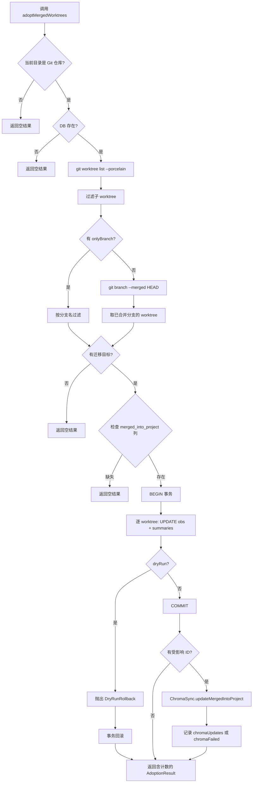

# WorktreeAdoption.ts 需求说明

> 源文件：src/services/infrastructure/WorktreeAdoption.ts ｜ 类型：源码 ｜ 行数：393 ｜ 所属模块：infrastructure ｜ 分析日期：2026-07-23

## 1. 文件定位总述

本文件是 Git Worktree 观察数据迁移的核心服务，负责将已合并分支对应的 worktree 产生的观察记录（observations）和会话摘要（session_summaries）重新归属到父仓库项目下，并同步更新 Chroma 向量库中的 `merged_into_project` 字段。该服务在 SessionStart 阶段被调用，确保开发者在 worktree 中积累的记忆不会因分支合并而丢失。上游依赖 Git 命令获取 worktree 列表与合并状态，下游写入 SQLite 和 Chroma。

## 2. 功能需求

| 编号 | 需求描述（系统应当…） | 触发条件 / 输入 | 处理规则与输出 | 证据 |
|------|----------------------|----------------|---------------|------|
| FR-WT-01 | 系统应当自动检测当前工作目录是否为 Git 仓库，并解析其主仓库路径。 | 调用 `adoptMergedWorktrees`，传入可选 `repoPath` 或使用 `process.cwd()`。 | 通过 `git rev-parse --git-common-dir` 获取 common-dir，推导主仓库根路径；若不是 Git 仓库则跳过并返回空结果。 | `src/services/infrastructure/WorktreeAdoption.ts:68-80` |
| FR-WT-02 | 系统应当在数据库不存在或缺少 `merged_into_project` 列时跳过迁移，不中断流程。 | 检测 DB 路径不存在、或 `PRAGMA table_info` 显示列缺失。 | 返回空 `AdoptionResult`，通过 `logger.debug` 记录跳过原因。 | `src/services/infrastructure/WorktreeAdoption.ts:151-153, 204-211` |
| FR-WT-03 | 系统应当列出所有子 worktree，并筛选出已合并到 HEAD 的分支对应的 worktree 作为迁移目标。 | 成功获取主仓库路径和 DB。 | 解析 `git worktree list --porcelain` 获取 worktree 列表；通过 `git branch --merged HEAD` 获取已合并分支集合；取交集。 | `src/services/infrastructure/WorktreeAdoption.ts:82-117, 164-170` |
| FR-WT-04 | 系统应当支持通过 `onlyBranch` 参数仅迁移指定分支的 worktree，绕过合并检测。 | 调用时传入 `onlyBranch`。 | 直接按分支名过滤子 worktree 列表，不执行 `git branch --merged` 查询。 | `src/services/infrastructure/WorktreeAdoption.ts:165-166` |
| FR-WT-05 | 系统应当在 SQLite 事务中批量更新 observations 和 session_summaries 的 `merged_into_project` 字段为父项目标识。 | 存在待迁移的已合并 worktree。 | 以 `BEGIN` 事务包裹逐 worktree 的 UPDATE 操作：将 `merged_into_project IS NULL` 的记录设置为父项目。单个 worktree 迁移失败时 catch 并记录错误，继续处理后续 worktree。 | `src/services/infrastructure/WorktreeAdoption.ts:239-256` |
| FR-WT-06 | 系统应当在 dry-run 模式下仅计算受影响行数，然后回滚事务使数据库不变。 | `dryRun=true`。 | 在事务末尾抛出 `DryRunRollback` 异常触发回滚；`AdoptionResult` 中仍保留计数和受影响分支列表。 | `src/services/infrastructure/WorktreeAdoption.ts:32-37, 253-254, 260-262` |
| FR-WT-07 | 系统应当在非 dry-run 模式下、SQLite 更新成功后，将受影响记录的 Chroma 向量 `merged_into_project` 字段同步更新。 | 事务成功提交且 `adoptedSqliteIds.length > 0`。 | 创建 `ChromaSync` 实例，调用 `updateMergedIntoProject`；Chroma 更新失败不影响 SQLite 结果，错误记入 `result.chromaFailed`。 | `src/services/infrastructure/WorktreeAdoption.ts:275-298` |
| FR-WT-08 | 系统应当对所有已知仓库自动执行 worktree 迁移。 | 调用 `adoptMergedWorktreesForAllKnownRepos`。 | 从 `pending_messages` 表中提取所有不重复的 `cwd` 值，解析各自主仓库路径，逐一调用 `adoptMergedWorktrees`。单个仓库失败不中断其余。 | `src/services/infrastructure/WorktreeAdoption.ts:323-392` |
| FR-WT-09 | 系统应当在存在迁移操作（观察数、摘要数、Chroma 更新数或错误数大于零）时输出 INFO 级别日志汇总。 | 迁移完成后。 | 日志包含 parentProject、dryRun 状态、扫描 worktree 数、合并分支列表、各项计数和错误数。 | `src/services/infrastructure/WorktreeAdoption.ts:301-318` |

## 3. 业务规则与约束

- **BR-WT-01** Git 操作超时上限为 15 秒（`GIT_TIMEOUT_MS = 15000`）。`src/services/infrastructure/WorktreeAdoption.ts:30`
- **BR-WT-02** 慢 Git 操作（耗时超过 1 秒）需输出 DEBUG 级别警告日志。`src/services/infrastructure/WorktreeAdoption.ts:47-49`
- **BR-WT-03** 主仓库路径解析依赖 `--git-common-dir` 的返回值：若以 `/.git` 结尾则取父目录，否则移除末尾 `.git`。`src/services/infrastructure/WorktreeAdoption.ts:76-78`
- **BR-WT-04** 仅更新 `merged_into_project IS NULL` 或等于父项目的记录，避免重复迁移。`src/services/infrastructure/WorktreeAdoption.ts:214-216`
- **BR-WT-05** 数据库使用 `bun:sqlite`（Bun 原生 SQLite 绑定），仅在此处使用 `require` 动态导入。`src/services/infrastructure/WorktreeAdoption.ts:184`
- **BR-WT-06** Chroma 更新失败不回滚 SQLite 事务——SQLite 已提交的变更不可逆。`src/services/infrastructure/WorktreeAdoption.ts:282`

## 4. 对外暴露

| 暴露项 | 类型 | 说明 |
|--------|------|------|
| `adoptMergedWorktrees(opts)` | async function | 单仓库 worktree 迁移入口，返回 `AdoptionResult` |
| `adoptMergedWorktreesForAllKnownRepos(opts)` | async function | 遍历已知仓库批量迁移，返回 `AdoptionResult[]` |
| `AdoptionResult` | interface | 迁移结果结构：repoPath、parentProject、计数、dryRun 标志、错误列表 |

## 5. 依赖关系

| 依赖方 | 被依赖方 | 关系 |
|--------|---------|------|
| WorktreeAdoption.ts | `utils/logger.ts` | 日志输出 |
| WorktreeAdoption.ts | `utils/project-name.ts` (`getProjectContext`) | 项目标识解析 |
| WorktreeAdoption.ts | `sync/ChromaSync.ts` | 向量库更新 |
| WorktreeAdoption.ts | `shared/paths.ts` (`paths.dataDir`) | 默认数据目录 |
| WorktreeAdoption.ts | `bun:sqlite` | 数据库操作（运行时 require） |

## 6. 数据结构

**AdoptionResult**（`src/services/infrastructure/WorktreeAdoption.ts:12-23`）

| 字段 | 类型 | 说明 |
|------|------|------|
| repoPath | string | 主仓库路径（解析失败时为 startCwd） |
| parentProject | string | 父项目标识 |
| scannedWorktrees | number | 扫描的子 worktree 总数 |
| mergedBranches | string[] | 已合并的分支名列表 |
| adoptedObservations | number | 迁移的 observations 行数 |
| adoptedSummaries | number | 迁移的 session_summaries 行数 |
| chromaUpdates | number | Chroma 成功更新的记录数 |
| chromaFailed | number | Chroma 更新失败的记录数 |
| dryRun | boolean | 是否为演练模式 |
| errors | Array<{worktree, error}> | 逐 worktree 错误详情 |

## 7. 复杂逻辑图示

上图展示了单仓库迁移的主流程：从 Git 仓库检测到 DB 列检查，再到事务批量更新和 Chroma 同步。dryRun 分支在事务末尾回滚，其余路径正常提交。

## 8. 逆向备注

- 推断：`adoptMergedWorktreesForAllKnownRepos` 以 `pending_messages.cwd` 作为已知仓库来源，表明系统认为所有活跃会话的 cwd 即为已知仓库集。该策略在仓库被删除但数据仍存在时可能产生无效路径。
- 推断：Chroma 更新采用"先 SQLite 后 Chroma"策略，若 Chroma 失败则无法自动恢复——需手动触发 backfill 或下次迁移覆盖。
