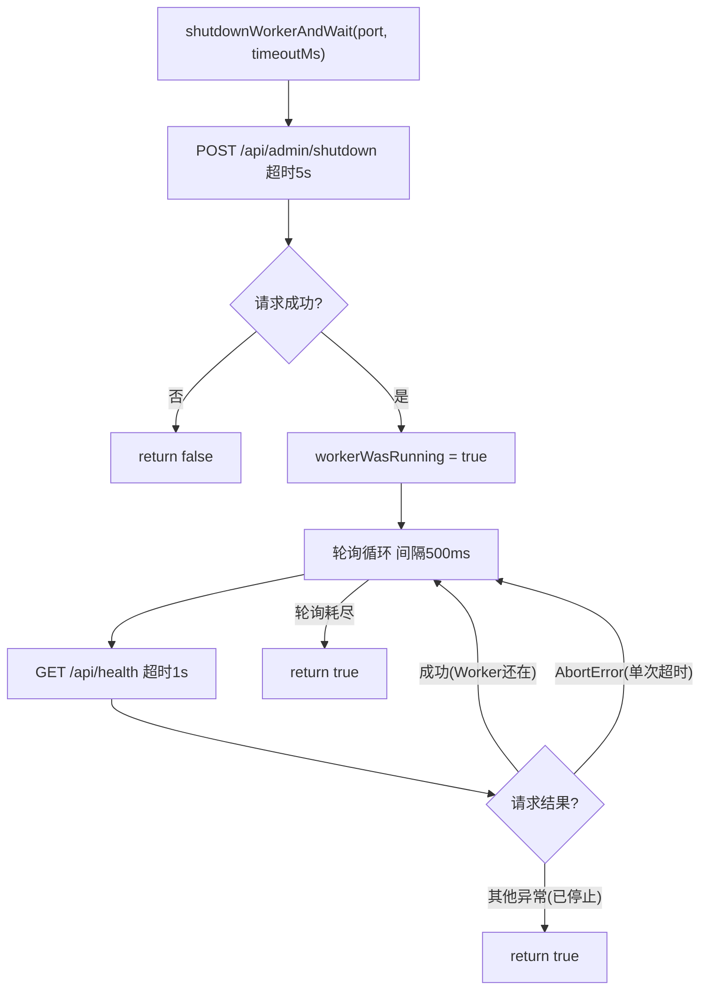

# shutdown-helper.ts 需求说明

> 源文件：src/services/install/shutdown-helper.ts ｜ 类型：源码 ｜ 行数：39 ｜ 所属模块：install ｜ 分析日期：2026-07-23

## 1. 文件定位总述

本文件提供 Worker 进程的安全关闭能力，用于安装/卸载/更新流程中优雅停止正在运行的 Worker。它通过向 Worker 的 shutdown 端点发送 POST 请求触发关闭，然后轮询 health 端点直到确认进程已退出或超时。整个操作受超时保护，确保调用方不会无限等待。返回值告知调用方 Worker 是否原本在运行。

## 2. 功能需求

| 编号 | 需求描述（系统应当…） | 触发条件 / 输入 | 处理规则与输出 | 证据 |
|------|----------------------|----------------|---------------|------|
| FR-SH-01 | 系统应当向指定端口的 Worker 发送关闭请求 | 调用 `shutdownWorkerAndWait(port, timeoutMs)` | 向 `http://127.0.0.1:{port}/api/admin/shutdown` 发送 POST，超时 5s | `src/services/install/shutdown-helper.ts:6-18` |
| FR-SH-02 | 系统应当在关闭请求成功后轮询 health 端点确认进程已停止 | shutdown POST 成功返回后 | 以 500ms 间隔轮询 `/api/health`，最多 `ceil(timeoutMs/500)` 次 | `src/services/install/shutdown-helper.ts:23-35` |
| FR-SH-03 | 系统应当在 Worker 原本不在运行时快速返回 | shutdown 请求失败（连接被拒等） | 立即返回 `{ workerWasRunning: false }` | `src/services/install/shutdown-helper.ts:19-21` |
| FR-SH-04 | 系统应当在 health 端点不可达时确认 Worker 已停止 | 轮询中抛出非 AbortError 异常 | 返回 `{ workerWasRunning: true }` | `src/services/install/shutdown-helper.ts:31-34` |
| FR-SH-05 | 系统应当容忍 health 轮询单次超时（AbortError），继续下一轮 | 请求超时抛 `AbortError` | `continue` 跳过当前轮次 | `src/services/install/shutdown-helper.ts:32` |
| FR-SH-06 | 系统应当在整个操作超时后返回当前状态 | 轮询次数耗尽 | 返回 `{ workerWasRunning: true }` | `src/services/install/shutdown-helper.ts:37` |

## 3. 业务规则与约束

| 编号 | 规则描述 | 证据 |
|------|---------|------|
| BR-SH-01 | shutdown 请求超时固定 5000ms，不随 `timeoutMs` 变化 | `src/services/install/shutdown-helper.ts:16` |
| BR-SH-02 | health 轮询单次超时固定 1000ms | `src/services/install/shutdown-helper.ts:29` |
| BR-SH-03 | 默认总超时 10000ms（10s），可覆盖 | `src/services/install/shutdown-helper.ts:8` |
| BR-SH-04 | 仅向 `127.0.0.1` 发请求，不跨网络 | `src/services/install/shutdown-helper.ts:10` |

## 4. 对外暴露

| 导出项 | 类型 | 用途 |
|--------|------|------|
| `ShutdownResult` | 接口 | 返回值，含 `workerWasRunning` 布尔字段 |
| `shutdownWorkerAndWait` | 异步函数 | 安全关闭指定端口 Worker 并等待停止 |

## 5. 依赖关系

- **上游依赖**：无（仅使用原生 `fetch` 和 `AbortSignal`）
- **下游消费者**：推断被安装/卸载/更新脚本引用

## 6. 数据结构

```typescript
interface ShutdownResult {
  workerWasRunning: boolean;
}
```

## 7. 复杂逻辑图示



图示说明：先发 shutdown 命令，成功后轮询确认停止；单次超时不视为停止。

## 8. 逆向备注

- `AbortError` 视为"单次超时"而非"已停止"，因为 `AbortSignal.timeout` 超时时也抛 `AbortError`，需区分"请求超时"和"连接拒绝"。
- `timeoutMs` 仅控制轮询总时长，shutdown POST 有独立 5s 超时。
