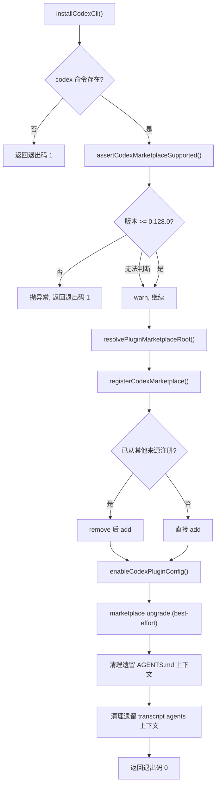

# CodexCliInstaller.ts 需求说明

> 源文件：src/services/integrations/CodexCliInstaller.ts ｜ 类型：源码 ｜ 行数：442 ｜ 所属模块：integrations ｜ 分析日期：2026-07-23

## 1. 文件定位总述

CodexCliInstaller 是 Claude-Mem 针对 OpenAI Codex CLI 的集成安装器，负责将 claude-mem 作为 Codex 插件市场（marketplace）注册到用户环境中。该模块处于 CLI 入口与 Codex CLI 之间的适配层，核心职责包括：定位本地 marketplace 根目录、注册/移除插件市场、写入/修改 Codex 的 TOML 配置文件、执行版本兼容性检查，以及清理遗留的 AGENTS.md 上下文注入。它同时暴露了三个通用 TOML 操作工具函数供其他模块复用。

## 2. 功能需求

| 编号 | 需求描述（系统应当…） | 触发条件 / 输入 | 处理规则与输出 | 证据 |
|------|----------------------|----------------|---------------|------|
| FR-INSTALL-01 | 系统应当在执行安装时，先检测 Codex CLI 是否在系统 PATH 中可用 | 调用 `installCodexCli()` | 若 `codex` 命令不存在，输出错误信息并返回退出码 1 | `CodexCliInstaller.ts:346-350` |
| FR-INSTALL-02 | 系统应当在安装前校验 Codex CLI 版本不低于最低要求版本（0.128.0） | Codex CLI 存在后 | 执行 `codex --version` 解析 semver，若低于阈值则抛异常终止安装；若无法获取版本则仅 warn 并继续 | `CodexCliInstaller.ts:217-242` |
| FR-INSTALL-03 | 系统应当自动定位本地 Codex marketplace 根目录，按优先级依次检查：显式传入参数、环境变量 `CLAUDE_PLUGIN_ROOT`/`PLUGIN_ROOT`、当前工作目录、脚本所在目录的祖先链 | 调用 `resolvePluginMarketplaceRoot()` | 找到包含 `.agents/plugins/marketplace.json` 和 5 个必需文件的目录即确认为 marketplace 根；全部候选均不满足时抛异常 | `CodexCliInstaller.ts:63-81` |
| FR-INSTALL-04 | 系统应当验证 marketplace 根目录包含全部必需文件（共 5 项），缺失时抛出包含文件列表的错误 | 定位到 marketplace 根目录后 | 对 `REQUIRED_MARKETPLACE_FILES` 列表中的每条路径执行 `existsSync` 检查 | `CodexCliInstaller.ts:50-61` |
| FR-INSTALL-05 | 系统应当将 marketplace 注册到 Codex CLI，若已从其他来源注册则自动替换 | 调用 `registerCodexMarketplace()` | 先尝试 `codex plugin marketplace add`，若报"已从不同来源注册"则先 remove 再 add | `CodexCliInstaller.ts:122-135` |
| FR-INSTALL-06 | 系统应当在 Codex 配置中启用插件并禁用遗留插件标识 | 注册成功后 | 修改 `~/.codex/config.toml`：设置 `[features] hooks = true`；禁用 `claude-mem@thedotmack`（遗留 ID）；启用 `claude-mem@claude-mem-local`（当前 ID） | `CodexCliInstaller.ts:176-203` |
| FR-INSTALL-07 | 系统应当在安装后尝试升级 marketplace 缓存，失败不阻断安装流程 | 注册和配置完成后 | 调用 `codex plugin marketplace upgrade`，失败仅 warn | `CodexCliInstaller.ts:359-363` |
| FR-INSTALL-08 | 系统应当在安装时清理遗留的 AGENTS.md 上下文注入（文件级标记标签和 transcript 配置中的上下文项） | 安装流程末尾 | 移除 `~/.codex/AGENTS.md` 中 `<claude-mem-context>` 标签包裹的内容；从 transcripts 配置 JSON 中删除 codex 类型 watch 的 agents 模式上下文 | `CodexCliInstaller.ts:244-341, 364-369` |
| FR-UNINSTALL-01 | 系统应当在卸载时禁用 Codex 插件配置、移除 marketplace 注册，并清理所有遗留上下文 | 调用 `uninstallCodexCli()` | 依次执行：禁用插件 TOML 配置、`codex plugin marketplace remove`、清理 AGENTS.md 上下文、清理 transcript 配置上下文；任一步骤失败标记为部分失败（返回退出码 1）但不阻断其他步骤 | `CodexCliInstaller.ts:392-441` |
| FR-TOML-01 | 系统应当提供通用的 TOML 表内布尔值设置能力，支持在指定 header 下方新增或修改键值行 | 调用 `setTomlBooleanInTable()` | 定位 header 行，在其 section 范围内查找或插入 `${key} = ${true|false}` 行 | `CodexCliInstaller.ts:137-165` |
| FR-TOML-02 | 系统应当提供基于 TOML 结构设置插件启用状态和特性启用状态的快捷函数 | 调用 `setTomlPluginEnabled()` 或 `setTomlFeatureEnabled()` | `setTomlPluginEnabled` 使用 `[plugins."${pluginId}"]` header；`setTomlFeatureEnabled` 使用 `[features]` header | `CodexCliInstaller.ts:167-174` |
| FR-VERSION-01 | 系统应当支持 semver 字符串解析和比较，用于 Codex CLI 版本校验 | 版本校验流程中 | 解析 `X.Y.Z` 格式，按 major→minor→patch 顺序逐级比较 | `CodexCliInstaller.ts:205-215` |

## 3. 业务规则与约束

- **最低版本门槛**：Codex CLI 版本必须 >= 0.128.0 才支持 marketplace 功能，低于此版本时安装直接失败（`CodexCliInstaller.ts:16, 240-241`）。
- **Marketplace 名称固定**：使用 `claude-mem-local` 作为 marketplace 名称标识（`CodexCliInstaller.ts:13-14`）。
- **遗留插件 ID 兼容**：在启用当前插件 ID 的同时，必须禁用 `claude-mem@thedotmack` 遗留 ID（`CodexCliInstaller.ts:15, 185-187`）。
- **TOML 配置路径固定**：`~/.codex/config.toml`（`CodexCliInstaller.ts:12`）。
- **AGENTS.md 路径固定**：`~/.codex/AGENTS.md`（`CodexCliInstaller.ts:10`）。
- **Transcript 配置路径**：由 `paths.transcriptsConfig()` 返回（`CodexCliInstaller.ts:11`）。
- **命令执行方式**：使用 `spawnSync` 同步调用 `codex` CLI，超时或错误均抛异常（`CodexCliInstaller.ts:83-102`）。
- **"尽力而为"策略**：marketplace 升级操作失败不阻断整体安装流程（`CodexCliInstaller.ts:104-114`）。
- **平台兼容**：命令存在性检测在 Windows 使用 `where`，其他平台使用 `which`（`CodexCliInstaller.ts:27-30`）。

## 4. 对外暴露

| 导出项 | 类型 | 说明 |
|--------|------|------|
| `installCodexCli(marketplaceRootOverride?)` | `async (string?) => Promise<number>` | 主安装入口，返回退出码 0/1 |
| `uninstallCodexCli()` | `() => number` | 卸载入口，返回退出码 0/1 |
| `setTomlBooleanInTable(content, header, key, enabled)` | `(string, string, string, boolean) => string` | 通用 TOML 布尔值设置 |
| `setTomlPluginEnabled(content, pluginId, enabled)` | `(string, string, boolean) => string` | 插件启用状态设置 |
| `setTomlFeatureEnabled(content, featureName, enabled)` | `(string, string, boolean) => string` | 特性启用状态设置 |

## 5. 依赖关系

**内部依赖**：
- `src/utils/logger.ts` — 日志记录（`CodexCliInstaller.ts:6`）
- `src/shared/paths.ts` — 路径常量 `paths`（`CodexCliInstaller.ts:7`）

**外部依赖**：
- Node.js `child_process`（`execFileSync`, `spawnSync`）、`fs`（`existsSync`, `mkdirSync`, `readFileSync`, `writeFileSync`）、`os`（`homedir`）、`path`、`url`（`fileURLToPath`）

**运行时依赖**：
- Codex CLI 可执行文件（`codex`）必须在系统 PATH 中

## 6. 数据结构

### 必需 marketplace 文件列表

```
REQUIRED_MARKETPLACE_FILES（CodexCliInstaller.ts:17-23）
├── .agents/plugins/marketplace.json
├── plugin/.codex-plugin/plugin.json
├── plugin/.mcp.json
├── plugin/hooks/codex-hooks.json
└── plugin/skills/mem-search/SKILL.md
```

### 遗留 Codex transcript agents 上下文判定条件（`isLegacyCodexAgentsContext`，CodexCliInstaller.ts:299-312）

- `context.mode === 'agents'`
- `context.updateOn` 为包含 `session_start` 和 `session_end` 的双元素数组
- `context.path` 为 `undefined` 或解析后等于 `~/.codex/AGENTS.md`

## 7. 复杂逻辑图示



安装流程的核心分支：版本校验通过后定位 marketplace 根目录、注册、配置、清理遗留资源。

## 8. 逆向备注

- `setTomlBooleanInTable` 中对 key 进行了正则转义（`CodexCliInstaller.ts:152`），暗示 key 可能包含特殊字符，但实际调用处 key 均为纯字母（`enabled`），推断此转义是为通用性预留。
- `readAndStripContextTags` 为通用标签剥离函数，但目前仅用于 `<claude-mem-context>`（`CodexCliInstaller.ts:260-279`），推断该函数设计时考虑了复用场景。
- `cleanupLegacyCodexAgentsMdContext` 和 `cleanupLegacyCodexTranscriptAgentsContext` 使用别名导出（`CodexCliInstaller.ts:281, 341`），推断原本命名不同，后通过别名保持向后兼容。
- 遗留 transcript 上下文清理中，`delete watch.context`（`CodexCliInstaller.ts:325`）直接删除了整个 context 字段而非仅移除 legacy 属性，推断意味着清理后该 watch 将失去所有上下文配置。
- `REQUIRED_MARKETPLACE_FILES` 中包含 `plugin/hooks/codex-hooks.json`（`CodexCliInstaller.ts:21`），但安装流程并未单独处理 hooks 文件，推断 hooks 随 marketplace 升级自动生效。
