# CursorHooksInstaller.ts 需求说明

> 源文件：src/services/integrations/CursorHooksInstaller.ts ｜ 类型：源码 ｜ 行数：604 ｜ 所属模块：integrations ｜ 分析日期：2026-07-23

## 1. 文件定位总述

CursorHooksInstaller 是 Claude-Mem 针对 Cursor IDE 的集成安装器，负责将 claude-mem 的 hooks 和 MCP 服务器配置注入到 Cursor 的三层安装目标（project/user/enterprise）中。该模块处于 CLI 入口（`claude-mem cursor` 子命令）与 Cursor IDE 配置目录之间的适配层，核心职责包括：生成 `hooks.json` 配置文件（通过统一 CLI 模式调用 `worker-service.cjs`）、配置 MCP 服务器、管理项目注册表（用于自动上下文更新）、生成初始上下文文件、以及提供安装状态检测和 Claude CLI 探测功能。它是与 CodexCliInstaller 平行的 IDE 集成模块，但面向 Cursor 的 hooks 体系和配置规范。

## 2. 功能需求

| 编号 | 需求描述（系统应当…） | 触发条件 / 输入 | 处理规则与输出 | 证据 |
|------|----------------------|----------------|---------------|------|
| FR-DETECT-01 | 系统应当检测当前运行平台，返回 `'windows'` 或 `'unix'` | 需要确定平台类型时 | `process.platform === 'win32'` 返回 `'windows'`，否则返回 `'unix'` | `CursorHooksInstaller.ts:24-26` |
| FR-DETECT-02 | 系统应当根据平台返回对应的脚本扩展名 | 需要确定脚本类型时 | Windows 返回 `.ps1`，Unix 返回 `.sh` | `CursorHooksInstaller.ts:28-30` |
| FR-DETECT-03 | 系统应当探测 Claude CLI 是否在系统 PATH 中可用，或插件目录是否已存在 | 调用 `detectClaudeCode()` | 先尝试 `which/where claude`；失败后检查 `~/.claude/plugins` 目录是否存在 | `CursorHooksInstaller.ts:531-551` |
| FR-REG-01 | 系统应当维护一个项目注册表（JSON 文件），记录已注册项目名称、工作区路径和安装时间 | 安装/卸载时 | 读写 `~/.claude-mem/cursor-projects.json` 文件 | `CursorHooksInstaller.ts:32-38` |
| FR-REG-02 | 系统应当支持注册项目到注册表 | 调用 `registerCursorProject(projectName, workspacePath)` | 在注册表中添加条目：`{ workspacePath, installedAt }` | `CursorHooksInstaller.ts:40-48` |
| FR-REG-03 | 系统应当支持从注册表中移除项目 | 调用 `unregisterCursorProject(projectName)` | 从注册表 JSON 中删除对应键 | `CursorHooksInstaller.ts:50-57` |
| FR-CTX-01 | 系统应当支持为已注册项目自动更新上下文文件内容 | 调用 `updateCursorContextForProject(projectName)` | 通过注册表查找项目对应的工作区路径，向 Worker 请求上下文内容，写入 `.cursor/rules/claude-mem-context.mdc` | `CursorHooksInstaller.ts:59-98` |
| FR-CTX-02 | 系统应当在上下文更新时支持通过项目名反向查找工作区（遍历注册表中所有项目的 allProjects） | 直接按 projectName 在注册表中找不到条目时 | 调用 `getProjectContext` 获取 allProjects 列表进行匹配 | `CursorHooksInstaller.ts:64-73` |
| FR-FIND-01 | 系统应当定位 MCP 服务器脚本路径，依次在 marketplace 目录和当前工作目录中搜索 | 调用 `findMcpServerPath()` | 搜索 `plugin/scripts/mcp-server.cjs`，返回第一个找到的路径或 null | `CursorHooksInstaller.ts:100-112` |
| FR-FIND-02 | 系统应当定位 Worker 服务脚本路径，搜索策略与 MCP 服务器一致 | 调用 `findWorkerServicePath()` | 搜索 `plugin/scripts/worker-service.cjs` | `CursorHooksInstaller.ts:114-126` |
| FR-FIND-03 | 系统应当定位 Bun 运行时路径，依次搜索常见安装位置，全部未找到则回退为字符串 `'bun'` | 安装 hooks 时 | 搜索路径列表：`~/.bun/bin/bun`、`/usr/local/bin/bun`、`/usr/bin/bun`，以及 Windows 特有路径 | `CursorHooksInstaller.ts:128-146` |
| FR-TARGET-01 | 系统应当根据安装目标类型（project/user/enterprise）返回对应的 Cursor 配置目录路径 | 调用 `getTargetDir(target)` | project → `<cwd>/.cursor`；user → `~/.cursor`；enterprise → 按平台返回系统级路径 | `CursorHooksInstaller.ts:148-166` |
| FR-MCP-01 | 系统应当将 claude-mem MCP 服务器配置写入目标目录的 `mcp.json` 文件 | 调用 `configureCursorMcp(target)` | 读取现有 mcp.json（若存在），设置 `mcpServers.claude-mem` 为 `{ command: 'node', args: [mcpServerPath] }` | `CursorHooksInstaller.ts:168-219` |
| FR-MCP-02 | 系统应当在 mcp.json 文件损坏（JSON 解析失败）时创建全新配置而非中断安装 | 读取现有 mcp.json 失败时 | 捕获解析异常，记录 error 日志，使用空配置 `{ mcpServers: {} }` | `CursorHooksInstaller.ts:195-202` |
| FR-HOOKS-01 | 系统应当在目标目录生成 Cursor hooks.json 配置，包含 5 个生命周期钩子 | 调用 `installCursorHooks(target)` | 钩子列表：`beforeSubmitPrompt`（session-init + context）、`afterMCPExecution`（observation）、`afterShellExecution`（observation）、`afterFileEdit`（file-edit）、`stop`（summarize） | `CursorHooksInstaller.ts:221-286, 252-272` |
| FR-HOOKS-02 | 系统应当使用统一 CLI 模式生成 hook 命令：`bun worker-service.cjs hook cursor <command>` | 生成 hooks.json 时 | 所有 hook 的 command 字段统一使用此格式 | `CursorHooksInstaller.ts:246-248` |
| FR-HOOKS-03 | 系统应当在 project 级安装时额外创建上下文文件目录、生成初始上下文内容（或占位符）、注册项目到自动更新列表 | 安装目标为 project | 在 `.cursor/rules/` 下创建 `claude-mem-context.mdc`；若 Worker 在线则从 Worker 拉取真实上下文，否则写入占位符 | `CursorHooksInstaller.ts:300-302, 321-360` |
| FR-HOOKS-04 | 系统应当在生成初始上下文时先检查 Worker 健康状态，Worker 不在线则降级为占位符文件 | project 级安装时 | 请求 `/api/readiness` 确认 Worker 可用，不可用时 catch 后使用占位符 | `CursorHooksInstaller.ts:362-379` |
| FR-UNINSTALL-01 | 系统应当在卸载时删除 hooks.json 文件和所有遗留脚本文件（bash + PowerShell 共 12 个） | 调用 `uninstallCursorHooks(target)` | 删除 `.cursor/hooks.json` 和 `.cursor/hooks/` 下的 6 个 .sh + 6 个 .ps1 脚本 | `CursorHooksInstaller.ts:381-444, 393-398` |
| FR-UNINSTALL-02 | 系统应当在 project 级卸载时额外删除上下文文件并从注册表中移除项目 | 卸载目标为 project | 删除 `.cursor/rules/claude-mem-context.mdc`，调用 `unregisterCursorProject` | `CursorHooksInstaller.ts:430-440` |
| FR-STATUS-01 | 系统应当检测所有安装层级（Project/User/Enterprise）的 hooks 安装状态和运行模式 | 调用 `checkCursorHooksStatus()` | 检查 hooks.json 是否存在、判断模式（Unified CLI vs Legacy Shell Scripts vs Unknown）、检查上下文文件状态 | `CursorHooksInstaller.ts:446-529` |
| FR-STATUS-02 | 系统应当在状态检测中区分 Unified CLI 模式和 Legacy Shell Scripts 模式 | 解析 hooks.json 时 | 通过检查第一个 beforeSubmitPrompt 命令是否包含 `worker-service.cjs` 和 `hook cursor` 来判断 | `CursorHooksInstaller.ts:484-506` |
| FR-CMD-01 | 系统应当作为 `claude-mem cursor` 子命令的处理器，路由到 install/uninstall/status/setup 子命令 | 调用 `handleCursorCommand(subcommand, args)` | 根据 subcommand 分发调用，未识别时输出帮助信息 | `CursorHooksInstaller.ts:553-603` |

## 3. 业务规则与约束

- **安装目标三层级**：project（当前项目）、user（用户全局）、enterprise（系统级），各级的配置目录路径由 `getTargetDir` 确定（`CursorHooksInstaller.ts:148-166`）。
- **统一 CLI 模式**：所有 hook 命令统一为 `bun worker-service.cjs hook cursor <command>` 格式（`CursorHooksInstaller.ts:246-248`），推断此为从独立脚本模式迁移后的统一入口。
- **MCP 配置键名固定**：`claude-mem`（`CursorHooksInstaller.ts:205`），MCP 服务器使用 `node` 命令启动（`CursorHooksInstaller.ts:206`）。
- **上下文文件路径固定**：`<targetDir>/rules/claude-mem-context.mdc`（`CursorHooksInstaller.ts:343-353`），使用 Cursor 的 MDC 规则格式，`alwaysApply: true`。
- **注册表文件路径固定**：`~/.claude-mem/cursor-projects.json`（`CursorHooksInstaller.ts:22`）。
- **遗留脚本清理**：卸载时删除 12 个遗留脚本文件（`CursorHooksInstaller.ts:393-398`），推断这些是旧版独立脚本安装方式残留的文件。
- **Enterprise 安装可能需要特权**：安装失败时提示用户可能需要 sudo/admin 权限（`CursorHooksInstaller.ts:282-283`）。
- **Bun 路径回退**：所有候选路径均不存在时回退为字符串 `'bun'`（`CursorHooksInstaller.ts:145`），推断依赖 PATH 环境变量作为最终兜底。
- **占位符上下文内容**：Worker 不可用时写入固定占位文本，提示用户完成首次会话后上下文将自动填充（`CursorHooksInstaller.ts:343-353`）。

## 4. 对外暴露

| 导出项 | 类型 | 说明 |
|--------|------|------|
| `detectPlatform()` | `() => Platform` | 平台检测 |
| `getScriptExtension()` | `() => string` | 脚本扩展名 |
| `readCursorRegistry()` | `() => CursorProjectRegistry` | 读取项目注册表 |
| `writeCursorRegistry(registry)` | `(CursorProjectRegistry) => void` | 写入项目注册表 |
| `registerCursorProject(projectName, workspacePath)` | `(string, string) => void` | 注册项目 |
| `unregisterCursorProject(projectName)` | `(string) => void` | 注销项目 |
| `updateCursorContextForProject(projectName)` | `(string) => Promise<void>` | 更新项目上下文 |
| `findMcpServerPath()` | `() => string \| null` | 定位 MCP 服务器脚本 |
| `findWorkerServicePath()` | `() => string \| null` | 定位 Worker 服务脚本 |
| `findBunPath()` | `() => string` | 定位 Bun 运行时 |
| `getTargetDir(target)` | `(CursorInstallTarget) => string \| null` | 获取安装目标目录 |
| `configureCursorMcp(target)` | `(CursorInstallTarget) => number` | 配置 MCP 服务器 |
| `installCursorHooks(target)` | `(CursorInstallTarget) => Promise<number>` | 安装 hooks |
| `uninstallCursorHooks(target)` | `(CursorInstallTarget) => number` | 卸载 hooks |
| `checkCursorHooksStatus()` | `() => number` | 检查安装状态 |
| `detectClaudeCode()` | `() => Promise<boolean>` | 探测 Claude CLI |
| `handleCursorCommand(subcommand, args)` | `(string, string[]) => Promise<number>` | CLI 子命令路由 |

## 5. 依赖关系

**内部依赖**：
- `utils/logger.ts` — 日志记录（`CursorHooksInstaller.ts:7`）
- `utils/project-name.ts` — `getProjectContext`（`CursorHooksInstaller.ts:8`）
- `shared/worker-utils.ts` — `getWorkerPort`, `workerHttpRequest`（`CursorHooksInstaller.ts:9`）
- `shared/query-utils.ts` — `buildContextInjectPath`（`CursorHooksInstaller.ts:10`）
- `shared/paths.ts` — `DATA_DIR`, `MARKETPLACE_ROOT`, `CLAUDE_CONFIG_DIR`（`CursorHooksInstaller.ts:11`）
- `utils/cursor-utils.ts` — `readCursorRegistry`, `writeCursorRegistry`, `writeContextFile`, `CursorProjectRegistry`（`CursorHooksInstaller.ts:13-17`）
- `integrations/types.ts` — `CursorInstallTarget`, `CursorHooksJson`, `CursorMcpConfig`, `Platform`（`CursorHooksInstaller.ts:18`）

**外部依赖**：
- Node.js `child_process`（`exec`）、`fs`（`existsSync`, `readFileSync`, `writeFileSync`, `unlinkSync`, `mkdirSync`）、`os`（`homedir`）、`path`、`util`（`promisify`）

**运行时依赖**：
- Worker 进程（上下文生成和健康检查需要）
- Bun 运行时（hooks.json 中的命令执行依赖）

## 6. 数据结构

### CursorInstallTarget（来自 types.ts）

联合类型：`'project' | 'user' | 'enterprise'`

### 安装目标目录映射

| target | macOS | Linux | Windows |
|--------|-------|-------|---------|
| project | `<cwd>/.cursor` | `<cwd>/.cursor` | `<cwd>/.cursor` |
| user | `~/.cursor` | `~/.cursor` | `~/.cursor` |
| enterprise | `/Library/Application Support/Cursor` | `/etc/cursor` | `%ProgramData%\Cursor` |

### CursorHooksJson 结构（`CursorHooksInstaller.ts:252-272`）

```json
{
  "version": 1,
  "hooks": {
    "beforeSubmitPrompt": [
      { "command": "bun worker-service.cjs hook cursor session-init" },
      { "command": "bun worker-service.cjs hook cursor context" }
    ],
    "afterMCPExecution": [
      { "command": "bun worker-service.cjs hook cursor observation" }
    ],
    "afterShellExecution": [
      { "command": "bun worker-service.cjs hook cursor observation" }
    ],
    "afterFileEdit": [
      { "command": "bun worker-service.cjs hook cursor file-edit" }
    ],
    "stop": [
      { "command": "bun worker-service.cjs hook cursor summarize" }
    ]
  }
}
```

### 占位符上下文文件内容（`CursorHooksInstaller.ts:343-353`）

MDC 格式，`alwaysApply: true`，包含 frontmatter 和提示文本。

### 项目注册表（CursorProjectRegistry）

JSON 对象，键为项目名，值为 `{ workspacePath: string, installedAt: string }`。

## 7. 复杂逻辑图示

```mermaid
flowchart TB
    subgraph "安装流程"
        A["installCursorHooks(target)"] --> B["getTargetDir(target)"]
        B --> C{"目标目录有效?"}
        C -- 否 --> D["返回退出码 1"]
        C -- 是 --> E["findWorkerServicePath()"]
        E --> F{"脚本找到?"}
        F -- 否 --> G["返回退出码 1"]
        F -- 是 --> H["findBunPath()"]
        H --> I["构建 5 个 hook 命令"]
        I --> J["写入 hooks.json"]
        J --> K{"target === project?"}
        K -- 是 --> L["setupProjectContext()"]
        K -- 否 --> M["安装完成"]
        L --> N["创建 rules 目录"]
        N --> O{"Worker 在线?"}
        O -- 是 --> P["从 Worker 拉取上下文"]
        O -- 否 --> Q["写入占位符文件"]
        P --> R["registerCursorProject()"]
        Q --> R
        R --> M
    end

    subgraph "上下文自动更新"
        S["updateCursorContextForProject(name)"] --> T{"注册表中直接找到?"}
        T -- 是 --> U["获取 workspacePath"]
        T -- 否 --> V["遍历注册表匹配 allProjects"]
        V --> W{"找到匹配?"}
        W -- 否 --> X["返回, 不更新"]
        W -- 是 --> U
        U --> Y["workerHttpRequest(contextInjectPath)"]
        Y --> Z{"响应有效?"}
        Z -- 是 --> AA["writeContextFile()"]
        Z -- 否 --> X
    end

    subgraph "状态检测"
        BB["checkCursorHooksStatus()"] --> CC["遍历 Project/User/Enterprise"]
        CC --> DD{"hooks.json 存在?"}
        DD -- 是 --> EE["解析 hooks.json"]
        EE --> FF{"命令含 worker-service.cjs?"}
        FF -- 是 --> GG["输出: Unified CLI 模式"]
        FF -- 否 --> HH{"存在遗留脚本?"}
        HH -- 是 --> II["输出: Legacy Shell Scripts 模式"]
        HH -- 否 --> JJ["输出: Unknown 配置"]
        DD -- 否 --> KK["输出: Not installed"]
    end
```



CursorHooksInstaller 的三条核心流程：安装（含上下文初始化）、自动上下文更新（含项目名反向查找）、安装状态检测（含模式识别）。

## 8. 逆向备注

- `detectClaudeCode` 使用 `which claude || where claude` 组合命令（`CursorHooksInstaller.ts:533`），推断该命令在 bash/zsh 中通过 `||` 实现跨平台兼容，`which` 失败后自动尝试 `where`。
- MCP 配置使用 `node` 命令而非 `bun` 启动（`CursorHooksInstaller.ts:206`），而 hooks 使用 `bun` 启动，推断 MCP 服务器脚本是纯 Node.js 兼容的 CommonJS，不依赖 Bun 运行时。
- 卸载时删除的遗留脚本列表（6 个 .sh + 6 个 .ps1）在当前安装流程中不再生成（`CursorHooksInstaller.ts:393-398`），推断这些脚本来自旧版安装方式的残留，当前版本仅生成 `hooks.json` 统一入口。
- `updateCursorContextForProject` 中遍历所有注册项目调用 `getProjectContext` 获取 `allProjects`（`CursorHooksInstaller.ts:65-72`），推断单次上下文更新可能因项目名与注册表键名不匹配（如 monorepo 子项目名 vs 仓库名）而需要反向查找。
- `handleCursorCommand` 中 `setup` 子命令仅输出提示信息（`CursorHooksInstaller.ts:569-571`），推断实际 setup 逻辑由 CLI 入口层的另一个处理器承担。
- `findBunPath` 在所有候选路径均不存在时返回字符串 `'bun'` 而非 null（`CursorHooksInstaller.ts:145`），推断这是有意设计——让操作系统在 PATH 中自行解析，而非在此阶段失败。
